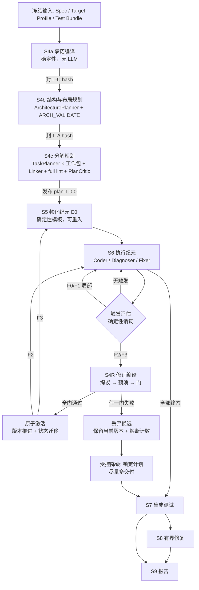

# NePA 流水线设计：S4～S9 规划、物化、执行与修订

## 0\. 阅读指南

### 0\.1 本文档的使用方式

本文档是 `system_design.md` 的**受权威子文档**，详细规定 S4～S9 六个阶段的流程设计、计划修订机制与修复阶梯。它与主文档共同构成 NePA 的现行设计基线。

权威性与优先级：

- `system_design.md` 仍是唯一主设计文档（Single Source of Truth）。本文档只在其授权范围内展开细节，**禁止**引入与主文档冲突的约束；
- 二者对同一事项表述不一致时以主文档为准，并按 `11.3` 的决策流程消除不一致，而不是在实现中自行取舍；
- 本文档与主文档的任何修改都走同一条变更流程：先裁决、再同步修订文档与 Schema、最后写入各自的修订历史；
- 主文档 `6.4`～`6.9` 保留阶段级摘要、入口/出口、receipt 与门编号，细节以本文档为准。

对实现者的硬性要求（与 `0.1` 同口径）：

- 本文档中的所有 `禁止`/`必须` 条款是实现约束，**不得**以"更简单""更快"为理由绕过；
- 遇到本文档未覆盖的情形，按 `11.3` 走裁决，**禁止**在代码中静默扩展语义；
- 本文档给出的阈值凡标注"先测后冻"的，一律不得凭直觉写入生产默认值。

### 0\.2 规范用语

同 `0.2`：**必须/禁止/应当/可以** 分别对应 MUST / MUST NOT / SHOULD / MAY。

### 0\.3 引用约定

- 形如 `4.7`、`6.4.5`、`5.2.4` 的裸章节号一律指 `system_design.md`；
- 本文档自身章节一律写作"本文 §n"；
- 三层冻结层名为 `L\-C`/`L\-A`/`L\-P`（Layer）；修复阶梯级名为 `F0`～`F5`（Fix）。二者与 `4.2` 的四层运行时 `L1`～`L4`、`10.3` 的测试分层 `L0`～`L3` 是**不同命名空间**，禁止混用。

### 0\.4 本文档解决的问题

S4 发布的计划在 S6 执行中可能被证伪。若把"修订计划"实现为整体替换计划版本，则已实现代码的有效性绑定在计划版本上，任一修订都使全部代码失效，成本不可接受。本文档的设计使**代码存续与任务身份存续解耦**：绝大多数修订不使任何代码失效，少数结构性修订的失效范围可机械计算并在激活前进入预算门。

## 1\. 设计总纲

### 1\.1 四条核心主张

| # | 主张 | 直接后果 |
| --- | --- | --- |
| 1 | 把"计划"拆成**承诺层 / 结构层 / 分解层**三个独立冻结的地层 | 绝大多数修订只动最便宜的一层 |
| 2 | 给计划节点**稳定语义身份**，修订以**封闭补丁算子集**表达 | 新旧版本可逐节点对齐，失效范围可机械计算 |
| 3 | 代码存续由**文件实现台账 \+ 义务摘要**决定，不由计划版本决定 | 分解层修订的代码保全率恒为 1\.0 |
| 4 | **不是所有错误都应该在 run 内修**：架构改轴（F4）与合约重协商（F5）永久留在 run 外 | 成本爆炸的唯一入口被结构性封死 |

一句话：**代码存续与任务身份存续是两件事。**

### 1\.2 与 NePA 约束的对齐

`3.4` 的四条关键差异直接约束本设计：

| 差异 | 对本设计的约束 |
| --- | --- |
| 无人在场 | 触发条件必须是**机器可判谓词**，不能是 Agent 自述"计划不对" |
| 完成率可操纵 | 修订**禁止**缩小义务集；必须有覆盖单调性不变量 \+ 哈希链账本 |
| 完成判定必须机器可判 | 修订后的验收仍走同一 lint/构建/测试真值，不新增评审型硬门 |
| 单 run 无外部纠偏 | 必须有振荡熔断与受控降级出口，不能无界重试 |

`3.3` 的通则同样适用：**任何新增硬门必须下推到能判定它的最便宜一级真值**，而不是新增一层评审。本文档的全部触发谓词与修订门据此按真值级别标注。

## 2\. 三层冻结

把 Plan 拆成三个**独立冻结、独立版本、修订代价递增**的地层。这是整个设计的地基。

| 层 | 名称 | 内容 | 冻结时机 | 可否 run 内修订 | 修订代价 |
| --- | --- | --- | --- | --- | --- |
| **L\-C** | 承诺层 Commitment | 冻结输入三项引用；规范性 REQ 全集及其 MUST/MUST NOT 分级；测试契约（nodeid/gate/req 映射）；构建变体集合；全局预算上限 | S4a 结束 | **禁止** | — |
| **L\-A** | 结构层 Architecture | 模块与职责、internal contract（owner / ready\_gate / provider / consumer / interface\_files）、**文件布局声明与模块级 `owns_files`**、工作包骨架与包级 REQ 责任 | S4b 结束 | 受限允许（F3） | 高：需重物化 \+ 纪元切换 |
| **L\-P** | 分解层 Plan | 任务切分、instructions、任务级 `deliverable_files` 划分、任务 DAG、任务级 REQ 责任细化、验收绑定 | S4c 结束 | 允许（F2） | 低：不失效任何代码 |

三条不变量把"允许修订"与"完成率不可操纵"同时保住。

**INV\-1 承诺不可变。** `L\-C` 的 canonical hash 在 run 内恒定。任何修订都**禁止**增删规范性 REQ、改变 MUST/MUST NOT 分级、改变测试契约或放宽构建变体。这是 `3.4`"完成率不可操纵"的机器实现。

**INV\-2 覆盖单调性。** 对任意两个相邻计划版本 $P_i \to P_{i+1}$：

```text
∀ req ∈ L-C.normative_requirements:
    has_primary_owner(req, P_i+1) == true
    supporting_set(req, P_i+1) ⊇ ∅            # 允许增减 supporting
    ¬∃ req: owner(req, P_i) ≠ null ∧ owner(req, P_i+1) == null
```

即：**责任可以搬家，不可以消失。** 允许把 REQ 从 T\-a 移到 T\-b（这是重规划的正常内容），**禁止**让任何规范性 REQ 失去 primary owner。这条把"重规划"与"卸责"在机器层面区分开。

**INV\-3 义务不放宽。** 任务的 `acceptance.build_variant_ids` 只能增不能减；`acceptance.tests`（M2 起）只能增不能减。任何减少验收义务的补丁一律拒绝，不进入门检查。

### 2\.1 为什么恰好是三层

- 承诺层与结构层必须分开：**目标不变而结构可错**是最常见的现实情形，把二者绑在一起意味着结构一错就得重开合约；
- 结构层与分解层必须分开：**结构对而切分错**是第二常见情形（任务太大、边界画偏），这一类占绝大多数，且完全不影响文件内容归属，因此可以做到零代码失效；
- 再往下细分（例如把 instructions 单独成层）没有收益：instructions 变化不进入任何失效闭包，本来就不需要版本。

### 2\.2 与 Plan v4 字段的对应关系

Plan v4（`5.2`）的字段不重新发明，只按层归属并分别哈希：

```text
L-C  = { input_refs, coverage.tests(契约面), 规范性 REQ 集合与分级,
         build_variant 全集, config_snapshot 中的预算与层开关 }
L-A  = { architecture.decisions/assumptions/contracts/modules/layout,
         work_packages(除任务派生字段), 模块与包级 allowed_files }
L-P  = { tasks[], 任务级 depends_on, 任务级责任细化, acceptance 绑定 }
```

`coverage` 与 `delivery_blueprint_sha256` 仍是**派生物**，由 Linker 与 Delivery Compiler 从三层确定性重算，不属于任何一层的自由内容（与 `5.2.3`、`6.4.1` 一致）。

## 3\. 稳定身份与失效闭包

### 3\.1 双身份：位置 id 与语义 uid

保留 `T-###` 作为**位置 id**（拓扑序、可读、进 commit message），另引入**语义 uid** 作为跨版本身份锚：

```text
task_uid = sha256_16(work_package_id ‖ local_task_id)      # 由 TaskPlanner 的局部语义 id 派生
```

- `T-###` 每次 Link 后可以变（`6.4.5` 步 4 的确定性拓扑分配不变）；
- `task_uid` 只要工作包 id 与局部语义 id 不变就不变；
- 补丁算子（本文 §6.2）显式声明每个算子对 uid 的影响：`split_task` 产出 `uid_a`/`uid_b` 并记 `derived_from`，`merge_tasks` 记 `merged_from[]`。**身份变化由算子记录，禁止事后推断。**

`task_uid` 只用于状态迁移与账本审计，**禁止**进入 Coder/Fixer 上下文，也**禁止**参与 Blueprint 语义投影（避免 `6.4.1` 的哈希循环）。

### 3\.2 输入摘要：失效的唯一判据

对每个任务节点计算两个摘要，语义严格分开：

```text
obligation_digest(task) = sha256(canonical{
    sorted(requirement_responsibilities),          # 我必须实现哪些 REQ、什么角色
    sorted(deliverable_files),                     # 我拥有哪些文件
    sorted(provides_contracts), sorted(consumes_contracts),
    sorted(interface_signature_digest(c) for c in consumes_contracts),   # 我依赖的接口长什么样
    sorted(acceptance.build_variant_ids), sorted(acceptance.tests),
})

guidance_digest(task) = sha256(canonical{ title, goal, instructions, kind, context_refs })
```

`interface_signature_digest(c)` 取 contract 的 **interface\_files 中导出符号签名集合**的 canonical 哈希，**不含实现体**。因此 provider 改实现不失效 consumer，provider 改签名才失效 consumer。

**失效规则**（对 `status=done` 的任务，在版本迁移时判定）：

| 条件 | 结论 | 成本 |
| --- | --- | --- |
| `obligation_digest` 不变 | `INHERIT`：状态、commit、证据全部继承 | 0 |
| 仅 `guidance_digest` 变 | `INHERIT`：guidance 只对未完成任务有意义 | 0 |
| 仅 owner 变（文件内容归属不变，`deliverable_files` 集合等价重划） | `REVALIDATE`：重跑构建门，不调 LLM | 一次构建 |
| `consumes` 的接口签名变 / 新增 REQ 责任 | `AMEND`：保留现有文件内容为起点，调 Fixer 做增量修改 | 一次 Fixer |
| `deliverable_files` 新增文件 / obligation 大幅重构（下述判据） | `REGENERATE`：调 Coder 重写 | 全额 |

`AMEND` 与 `REGENERATE` 的分界用机器判据，**禁止**用模型判断：

```text
REGENERATE  iff  |new_files ∖ old_files| > 0
             ∨  jaccard(old_responsibilities, new_responsibilities) < 0.5
             ∨  该任务在旧版本从未达到 done
otherwise AMEND
```

**失效是闭包，但闭包沿接口签名传播、且到 `INHERIT` 即止。** provider 的签名不变时，闭包在第一跳终止。

### 3\.3 文件实现台账

新增一份跨版本存活的工件 `plan/file_ledger.json`，它**不以任务为键，以文件为键**：

```json
{
  "schema_version": "1.0",
  "files": [{
    "path": "src/codec/fixed_header.c",
    "class": "s6_owned",
    "created_in_epoch": "E0",
    "content_sha256": "<64 hex>",
    "last_commit_sha": "<40 hex>",
    "verified_by": {"build_variant_ids": ["release", "san"], "evidence_ref": {"path": "...", "sha256": "..."}},
    "owner_history": [
      {"plan_version": "1.0.0", "task_uid": "a1b2c3d4e5f60718", "task_id": "T-007"},
      {"plan_version": "1.0.1", "task_uid": "a1b2c3d4e5f60718", "task_id": "T-009"}
    ],
    "state": "realized"
  }]
}
```

`state ∈ {slot_only, realized, quarantined}`。台账把"这段代码已被验证过"这一事实**从任务 id 上解耦**：任务可以改名、拆分、合并、易主，文件的验证事实照旧。

对应地，Plan State 的职责收窄为纯执行账本（attempts / status / notes / 当前版本绑定），**不再**是代码有效性的唯一来源。`9.1.4` 的 `task_completion_rate` 因此按本文 §9.1 重新锚定。

### 3\.4 保全率：修订的价格标签

版本迁移时，控制器对上一版本所有 `realized` 文件做四分类，得到可直接进预算门的量：

```text
preservation_rate = (|INHERIT| + |REVALIDATE|) / |realized_files(P_i)|
rework_cost_estimate = |AMEND| × c_fixer + |REGENERATE| × c_coder + |REVALIDATE| × c_build
```

两者都是**确定性可算的**，在候选激活之前就能算出。于是"修订会不会把成本打爆"从事后事实变成事前门（本文 §6.3 的 `RG-3`）。

对 `L\-P` 层补丁（F2）可以证明 `preservation_rate ≡ 1.0`：分解层补丁不改变 `module.owns_files`、不改变 contract 接口签名、不改变承诺层，因此每个文件的内容归属与义务摘要中的接口部分均不变，最坏落到 `REVALIDATE`。**这是"计划被证伪不必使全部代码失效"的形式化答案**：把大多数修订压到 F2，保全率是构造性的 1\.0。

### 3\.5 孤儿代码：隔离，不删除

若某文件在新版本的 Blueprint 中不再有槽位（只在 F3 发生），处置为：

1. `git mv` 到 `workspace/_orphan/<epoch>/<原路径>`，`state=quarantined`，不进入构建图；
2. 台账保留其完整 `owner_history` 与验证证据；
3. 后续修订可以**重新采纳**（`re_adopt` 算子）；
4. **禁止**任何角色删除 `realized` 文件。只有确定性控制器可以隔离，且必须落账本。

理由：删除是唯一不可逆的动作，隔离的成本是几 KB 磁盘，误删的成本是一次重写。

## 4\. 版本、纪元与工件布局

### 4\.1 版本号：C\.A\.P 三元组

```text
plan_version = "<C>.<A>.<P>"        例：1.0.0 → 1.0.1 → 1.1.0
```

| 位 | 含义 | 递增条件 | 副作用 |
| --- | --- | --- | --- |
| C | 承诺层代 | run 内恒为 1 | 变化即换 run |
| A | 结构层代 | F3 修订激活 | **切换执行纪元**，触发增量重物化 \+ 新检查点 |
| P | 分解层代 | F2 修订激活 | 不切纪元，不重物化，不动工作区 |

**纪元边界只由 A 位定义。** 分解层补丁完全不触碰工作区，为其开纪元只是徒增检查点与账目。修订序号用 `Rev-n` 指代第 n 次修订；**禁止**使用 `R0/R1` 记法（已用于 `6.4.8.2.1` 的恢复期 prompt 版本）或 `R-n` 记法（已用于 `11.1` 风险登记 id）。

### 4\.2 工件布局

```text
plan/
├── versions/
│   ├── plan-1.0.0.json          # 每个版本一份，写入后不可变
│   ├── plan-1.0.1.json
│   └── plan-1.1.0.json
├── active_plan.json             # 原子指针：{version, path, sha256, revision_seq, epoch}
├── file_ledger.json             # 本文 §3.3，跨版本存活
├── revision_ledger.json         # 哈希链修订账本，本文 §4.3
├── plan_state.json              # 纯执行账本；带 plan_version 绑定
├── _s4/                         # 初始编译草稿
├── _s4r/rev_NNN/                # 每次修订的候选与预演现场
├── artifact_manifest.json       # 由最新一次物化重写，带 epoch
└── contract_map.json
```

**不可变性口径**（对 `5.2` 的修订）：

- **每个版本文件**发布后逐字节不可变；
- `active_plan.json` 是唯一可推进的指针，其推进必须原子、必须单调（`revision_seq` 严格加一）、必须同时写 `revision_ledger`；
- `run.json.stages.s4.output_refs` 继续锚定 **1\.0\.0**（初始密封），另加 `output_refs.active_plan` 由修订控制器原子更新。

"不可变"因此从"单个文件不可变"升级为"**版本链只能追加**"，审计强度不降低：任何回溯篡改都会打断哈希链。

### 4\.3 修订账本：哈希链

```json
{
  "schema_version": "1.0",
  "entries": [{
    "revision_seq": 1,
    "prev_entry_sha256": "<64 hex>",
    "from_version": "1.0.0",
    "to_version": "1.0.1",
    "level": "F2",
    "trigger": {"code": "TR-4_GRANULARITY_OVERFLOW", "evidence_refs": [{"path": "...", "sha256": "..."}]},
    "trigger_signature": "<64 hex>",
    "patch_ops": [{"op": "split_task", "target_uid": "...", "into": ["...", "..."]}],
    "migration": {"inherit": 11, "revalidate": 2, "amend": 0, "regenerate": 1},
    "preservation_rate": 0.929,
    "gates": {"RG-1": "pass", "RG-2": "pass", "RG-3": "pass", "RG-4": "pass", "RG-5": "pass"},
    "epoch_after": "E0",
    "activated_at_commit": "<40 hex>",
    "cost_usd": 0.41
  }]
}
```

账本是本文 §9 全部修订指标的唯一数据源，也是 S9 报告读取"本次 run 改了几次计划、改对了没有"的入口。F1 修复租约同样以 `level="F1"` 落账。

### 4\.4 执行纪元

```text
E0  = 初始物化检查点 → 首次 S6 执行
E1  = 第一次 F3 激活后的重物化检查点 → 继续 S6 执行
```

纪元的唯一实质内容是：**一次增量重物化 \+ 一个检查点提交**。它不清空任何状态、不重置任何预算、不重新初始化 Plan State。纪元号只用于账本、`artifact_manifest` 与 `_orphan/` 路径分区。

## 5\. 阶段流程

### 5\.0 总览



S4 内部状态机在 `6.4.2` 基础上把 `PREPARE`/`DELIVERY_CONSTRAINTS` 归入 S4a、`ARCHITECT`/`ARCH_VALIDATE` 归入 S4b、其余归入 S4c；状态名与 `flat` 消融路径不变。**S4 全程不写 workspace**（`6.4.1` 末段的强制不变量保持）。

### 5\.1 S4a 承诺编译（确定性）

| 项 | 内容 |
| --- | --- |
| 目的 | 把"本次 run 的义务"编译为独立冻结的承诺层，使后续任何修订都有不可动的参照物 |
| 角色 | 无 LLM，纯确定性 |
| 输入 | 三项冻结输入 \+ config snapshot |
| 输出 | `L\-C` canonical 对象及其 hash，写入 `_s4/commitment.json` |

主流程沿用 `6.4.3` 的 PREPARE（重验哈希、`spec_lint`、引用图、build variant 索引、Delivery Constraints、token preflight），额外产出显式承诺对象：规范性 REQ 全集与分级、测试契约投影（nodeid/gate/req\_ids；M1 下 acceptance 为空但保留静态映射）、构建变体全集、预算上限。

这一步是**零成本的重新分包**而非新增工作：现行 S4 已算出全部内容，只是没有单独哈希。单独哈希的收益是 INV\-1 从文档纪律变成机器不变量。

### 5\.2 S4b 结构与布局规划

沿用 `6.4.4` 的 ArchitecturePlanner 调用形态与 `ARCH_VALIDATE` 全部既有子门（`arch_01`～`arch_10`），出口新增两项：

1. 单独计算并封存 `L\-A` canonical hash，写 `_s4/architecture.sealed.json`；
2. **文件布局由 ArchitecturePlanner 自由规划**（本文 §5.2.1～§5.2.4），不再由 Delivery Compiler 固定给出。

架构定点修复额度不变（≤ 1，M1\-4a3 冻结值）。

新增出口检查**结构层可修订性预检**：每个 internal contract 的 `interface_files` 必须与其 provider 工作包一一对应且不跨模块，否则 F3 修订的失效闭包不可计算。这是 `5.2.1` 既有约束的显式门化。

#### 5\.2.1 职责划分：什么自由、什么机械

布局自由化只放开"文件与模块怎么切"，**不放开符号命名与资源上限**。

| 事项 | 归属 | 依据 |
| --- | --- | --- |
| 文件路径、目录结构、文件数量、模块切分、每模块 `owns_files` | **S4b 自由规划** | 本文 §5.2.2 |
| 逐报文文件的展开规则与占位符 | **S4b 自由规划**（占位符取值域受限） | 本文 §5.2.2 |
| 导出符号命名（`5.6.5.2` 六条模式：`symbol_prefix`/`encode_fn`/`decode_fn`/`message_struct`/`error_enum`/`type_id`） | **机械派生，禁止自由** | `5.6.5.2` |
| 四项资源上限默认值 | **机械派生，禁止自由** | `5.6.5.2` |
| 三段构建图形状（deliverable → build artifact → link source set） | **强制形状，内容自由** | `6.4.1` |
| `s5_frozen` / `s6_owned` 二分与"每个 `s6_owned` 文件恰有一个 task owner" | **强制不变量** | `5.2.2`、`6.4.1` |
| 语言、交付角色 | 来自 Target Profile 两字段，**不可自由** | `5.6.5.1` |

理由：导出符号是覆盖矩阵、契约签名摘要与协议中立审计的共同锚点，放开它会同时破坏 `interface_signature_digest` 的稳定性与 D1\.11 的"逐步重算"能力；而放开文件路径不影响上述任何一项。

#### 5\.2.2 布局声明：ArchitectureDraft 的新增输出

ArchitecturePlanner 在既有输出（模块职责、internal contract、设计决定、责任分配、工作包骨架）之外**必须**输出一份完整布局声明 `architecture.layout`。S5 的确定性地位依赖于"声明完整"，因此每个文件条目都必须自带 S5 渲染所需的全部信息：

```text
architecture.layout = {
  "roots": {"include": "include/<dir>", "source": "src", "app": "apps", "build": "."},
  "files": [{
    "slot_id": "<稳定局部 id，模块内唯一>",
    "path": "include/<dir>/<name>.h",        # 或含占位符的 path_pattern
    "path_pattern": null,                    # 与 path 互斥；仅逐报文文件使用
    "expand_over": null,                     # path_pattern 的展开域，取值见下
    "class": "s5_frozen | s6_owned",
    "render_rule": "header | source_stub | build_file | doc | mechanical",
    "owner_module": "<module_id>",
    "contract_id": "<internal_contract_id | null>",   # render_rule=header 时必填
    "build_role": "link_source | entry_point | none",
    "purpose": "<通用职责说明，禁止协议专有词>"
  }],
  "build_graph": {
    "artifacts": [{"artifact_id": "...", "output_path": "...", "entry_file_slot": "...", "link_source_slots": ["..."]}]
  }
}
```

字段约束：

- `path` 与 `path_pattern` 二者恰有一个非空。`path_pattern` 的占位符取值域**只允许** `{message_id}` 与 `{type_id}`，且必须来自 Spec 派生标识符集合；`expand_over` 只允许 `messages` 或 `types`。**禁止**引入新占位符或按协议名选择展开域；
- `render_rule=header` 的文件必须绑定一个 `contract_id`，S5 由该 contract 的导出符号集合与机械命名派生值渲染声明，因此 S5 无需推理；
- `render_rule=mechanical` 的文件其输入域必须落在系统内置机械契约白名单内（`6.4.1` 既有约束）；
- `render_rule=source_stub` 的文件必须为 `class=s6_owned`；`render_rule ∈ {header, build_file, doc, mechanical}` 的文件必须为 `class=s5_frozen`。内部接口头可以是 `s6_owned`（`6.4.1` 既有例外），此时其 `render_rule` 必须为 `source_stub` 并由 owner 任务填充实现声明之外的内容；
- 每个 `class=s6_owned` 文件必须能被恰好一个任务在 S4c 中认领为 owner，否则 `S4-G4` 失败。

`layout.files[]` 到 Blueprint `file_rules[]` 的 `kind`/`producer` 必须按下表唯一派生。`contract_id 非空` 表示该字段为一个已通过引用校验的 internal contract id；`contract_id=null` 表示字段为 JSON null：

| `render_rule` | `class` | `contract_id` | `build_role` | `kind` | `producer` |
| --- | --- | --- | --- | --- | --- |
| `header` | `s5_frozen` | 非空 | `none` | `header` | `layout_template` |
| `source_stub` | `s6_owned` | 非空 | `none` | `header` | `s6_task` |
| `source_stub` | `s6_owned` | `null` | `link_source` | `source` | `s6_task` |
| `source_stub` | `s6_owned` | `null` | `entry_point` | `app` | `s6_task` |
| `build_file` | `s5_frozen` | `null` | `none` | `build` | `layout_template` |
| `doc` | `s5_frozen` | `null` | `none` | `documentation` | `layout_template` |
| `mechanical` | `s5_frozen` | 非空 | `none` | `header` | `mechanical_spec` |
| `mechanical` | `s5_frozen` | `null` | `link_source` | `source` | `mechanical_spec` |

表外组合一律非法并由 Blueprint 编译受控失败，明确包括 `mechanical + entry_point`、`header` 未绑定 contract、`build_file`/`doc` 绑定 contract 或参与链接、`source_stub` 同时绑定 contract 并参与链接、`s6_owned` 由 `layout_template`/`mechanical_spec` 生产，以及 `s5_frozen` 由 `s6_task` 生产。Delivery Compiler **禁止**按路径、文件后缀、模块名或协议身份补充猜测。

**所有导出符号必须在 contract 中显式声明**（名称按 `5.6.5.2` 六条模式机械派生，签名由 ArchitecturePlanner 声明）。S5 只渲染已声明内容，**禁止**推断任何未声明符号。

#### 5\.2.3 布局约定：确定性输入

"通用网络工程经验"以**协议无关、可哈希、可版本化的确定性输入**注入，**禁止**写进任何提示词（`6.4.8.2` 既有约束：禁止把文件名、接口名写入 prompt）。

| 项 | 规定 |
| --- | --- |
| 资产位置 | 仓库内 `nepa/assets/layout_conventions/<language>-<delivery_form>-v<N>.json`，随代码版本化 |
| 选取方式 | `layout_convention_id = "<language>-<delivery_form>-v<N>"`，由 Target Profile 的两个字段机械派生；Target Profile 仍只有两个字段（`5.6.5.1` 不变） |
| 完整性绑定 | 其 canonical hash 由 `compile_delivery_constraints` 写入 Delivery Constraints，并随 config snapshot 进 `run.json`；S5 重算时逐值核对 |
| 内容分类 | 分 `advisory`（建议性，进 ArchitecturePlanner 输入作为参考）与 `hard`（硬约束，进 `ARCH_VALIDATE` 作为门条件）两段，二者在文件中显式分开 |
| 协议中立 | 约定文件**禁止**出现任何具体协议的报文名、字段名、常量或按协议名分支；只允许通用职责词汇与层次规则。协议中立静态扫描覆盖该资产 |

`advisory` 段的内容范围（应用层协议实现的通用经验，不构成硬门）：

- 建议的职责槽位词汇表：报文编解码、会话/状态机、传输与事件循环、共享类型、入口、构建文件、说明文档；
- 建议的分层方向：`types ← codec ← session ← net ← entry`，即编解码不依赖传输、会话不依赖具体传输细节；
- 建议的目录惯例：对外可见声明集中在 `include/` 下单一目录，实现置于 `src/` 下按职责分子目录，可执行入口置于 `apps/`；
- 建议的粒度：单文件职责单一，逐报文内容优先按报文展开而非集中于单文件。

`hard` 段的内容范围（进门检查）：

- 允许的路径根集合与保留名黑名单；
- 分层方向约束：模块依赖必须与声明的层次序一致，**禁止**出现反向依赖或环；
- 交付角色形状：`delivery_form=server` 时构建图必须恰有一个 `entry_point` 与一个可执行 artifact；
- 三段构建图必须闭合。

#### 5\.2.4 新增 ARCH\_VALIDATE 子门

自由布局把布局校验从"逐值比对固定表"改为**结构性与闭合性校验**，并把这项裁决完整放在架构层：五个新增子门属于 `S4-G2` 的 `ARCH_VALIDATE`，与既有 `arch_01`～`arch_10`（编号与语义不变）并列。`S4-G1` 不重复裁决布局本身，只校验 Blueprint 对已通过的 `layout` 的忠实转写（本文 §5.2.5）。新增五个：

| 子门 | 条件 | 真值级别 |
| --- | --- | --- |
| `arch_11 LAYOUT_SAFETY` | 全部路径为相对路径、无 `..`、无绝对路径、无符号链接语义、落在 `hard` 段允许的路径根内、不命中保留名黑名单；`path`/`path_pattern` 展开后全局唯一无碰撞 | 1 级 |
| `arch_12 LAYOUT_CLASS` | `class` 与 `render_rule` 的组合合法（本文 §5.2.2）；`s5_frozen` 文件不被任何任务列为 `deliverable_files`；每个 `s6_owned` 文件恰有一个 owner 模块 | 1 级 |
| `arch_13 BUILD_GRAPH` | 三段引用全部存在且集合闭合；每个 `link_source` 槽恰进入一个 artifact；artifact 输出路径唯一；`delivery_form` 要求的 `entry_point` 数量精确匹配；构建图无环 | 3 级 |
| `arch_14 LAYERING` | 模块间依赖方向与 `hard` 段声明的层次序一致，无反向边、无环；contract 的 provider/consumer 方向与之一致 | 1 级 |
| `arch_15 PATH_NEUTRALITY` | 路径与 `purpose` 中的每个 token 必须属于通用职责白名单 ∪ Spec 派生标识符集合；`path_pattern` 的占位符与 `expand_over` 合法；**禁止**出现未由冻结输入派生的协议专有词 | 2 级 |

`arch_15` 是自由布局引入的必要防线：模型自由命名文件时可能复现记忆中的某协议工程惯例，从而使协议事实绕过冻结输入进入生成物。该门与 `10.2` D1\.11 的命名来源审计共用同一白名单实现。

该白名单的归属需明确，避免与 §5.2.3 的资产分段混淆：**通用职责白名单是版本受控的校验器侧共享实现**（与 D1\.11 命名来源审计同一份），**不是**布局约定资产 `advisory` 段的内容——`advisory` 段的职责槽位词汇表只作为 ArchitecturePlanner 的参考输入，不构成门判据；`hard` 段也不复制该白名单。白名单随 validator 一同属于 lineage 控制面（`6.4.8.1`），修改其内容即须新建 lineage，旧批次不得混合比较。`arch_15` 的判定域是每个 `path`/`path_pattern` 分段与每条 `purpose` 文本切出的 token，二者用同一白名单 ∪ 同一 Spec 派生标识符集合判定。

上述五个子门的判据以本节为准：主文档 `6.4.4` 只保留门编号与摘要，两处表述曾在 `arch_13`（`app` 槽 vs `link_source` 槽）与 `arch_15`（黑名单 vs 白名单）不一致，已按 `11.3` 裁决统一采用本节口径并同步主文档。

任一新增子门失败按既有规则计入 `ARCH_VALIDATE` 失败，允许一次定点架构修复。

#### 5\.2.5 Delivery Compiler 的职责调整

`6.4.1` 的两个纯函数签名与"S4/S5 复用同一实现"的约束不变，职责边界调整为：

```text
compile_delivery_constraints(spec, target_profile) -> DeliveryConstraints
    # 输出：语言/角色解析结果、机械命名派生值与六条模式、四项资源上限、
    #       构建变体集合、layout_convention_id 及其 hash、advisory/hard 两段、
    #       机械契约白名单与模板根。
    # 不再输出固定 file_rules[] 表。

compile_delivery_blueprint(constraints, architecture, work_packages, tasks) -> DeliveryBlueprint
    # 消费 architecture.layout 的文件声明与构建图，展开 path_pattern，
    # 解析精确文件、创建者、唯一 task owner、build artifact/link source set
    # 与 internal contract 映射期望，再计算 canonical hash。
```

两函数仍禁止读取时间、随机数、网络、workspace 或环境探测，禁止按协议名称写行为分支；相同 canonical 输入必须逐字节得到相同 canonical 输出。Blueprint 的 semantic projection 仍是 `constraints + architecture + work_packages + tasks`。

### 5\.3 S4c 分解规划与初始发布

沿用 `6.4.4` 后半、`6.4.5`、`6.4.6`、`6.4.7`：逐工作包 TaskPlanner 展开 → 确定性 Linker → full lint（`S4-G0`～`S4-G6`）→ PlanCritic → seal。`S4-G1` 的条件按本文 §5.2.5 改为校验 Blueprint 对 `layout` 的忠实转写——`file_rules[]` 与 `layout.files[]` 双向一一对应、构建图引用与 `build_graph` 逐项一致——布局本身的合法性已在 `S4-G2` 由 `arch_11`～`arch_15` 裁决，此处不重复。其余门条件不变。

变化三处：

1. 发布路径为 `plan/versions/plan-1.0.0.json` \+ 原子写 `active_plan.json`，`revision_seq=0`；
2. 同时初始化 `file_ledger.json`（此时全部文件 `state=slot_only`）与空 `revision_ledger.json`；
3. Linker 额外为每个任务计算并写入 `task_uid`、`obligation_digest`、`guidance_digest`（三者均为派生字段，**禁止**进入 Blueprint 语义投影，避免哈希循环）。

`6.4.7` 的 seal receipt 语义不变：`stages.s4=done + output_refs` 仍是 Plan 的完整性锚点与下游消费的逻辑 commit point，另加 `output_refs.active_plan`。

### 5\.4 S5 物化纪元

现行 `6.5` 规定 S5 只有一个首提交。新语义：

| 项 | 内容 |
| --- | --- |
| 目的 | 按当前 active plan 的 Blueprint 使工作区达到期望结构状态 |
| 触发 | 初始（E0）；或 F3 修订激活后（E1、E2…） |
| 角色 | 无 LLM，纯确定性模板 |
| 输出 | 物化检查点提交、重写的 `artifact_manifest.json` / `contract_map.json`、更新的 `file_ledger` |

入口门不变（`6.5` 步 1～3）：核对 receipt 与 Plan hash、用同一纯函数重算 Delivery Constraints/Blueprint 并逐项一致、stage full lint 0 error 后才允许第一个 workspace 副作用；漂移以 `DELIVERY_BLUEPRINT_DRIFT` 受控失败，不进入 LLM 修复。

物化算法（幂等，按 Blueprint 差异驱动）：

```text
diff = blueprint(P_new) ⊖ blueprint(P_active_prev)     # 首次时 prev = ∅

for slot in diff:
    case 新增 s5_frozen 槽      → 生成；ledger: slot_only → realized(created_by=s5)
    case 变更 s5_frozen 槽      → 确定性重生成（内容由模板+输入唯一决定）；标记其 consumer 任务 REVALIDATE/AMEND
    case 移除 s5_frozen 槽      → 隔离到 _orphan/<epoch>/
    case 新增 s6_owned 槽       → 生成可构建存根；ledger: slot_only
    case 已 realized 的 s6_owned → 不触碰（内容属于 S6）
    case 移除 s6_owned 槽       → realized 则隔离，slot_only 则直接删槽

物化后：跑默认构建 → 检查点提交（trailer: NePA-Epoch, NePA-Plan-Version）
```

关键约束：

- S5 **永不**修改任何 `state=realized` 的 `s6_owned` 文件。`6.5`"S5 是 scaffold 唯一生产阶段"改述为"**S5 是 `s5_frozen` 的唯一生产者，且是 `s6_owned` 存根的唯一创建者**"；
- S5 只按本文 §5.2.2 的 `render_rule` 渲染已声明内容：`header` 由绑定 contract 的导出符号与机械命名派生值渲染，`source_stub` 生成返回"未实现"错误枚举常量的可构建空实现，`build_file` 只消费 Blueprint 已展开的三段构建图，`mechanical` 只消费对应机械契约白名单中的输入域。**禁止**从文件后缀或文件名反推链接关系、owner 或 contract；
- **E0 验收**：默认构建零警告零错误（`6.5` 既有强度不变）\+ 通过本文 §5.5 的启动 smoke 检查；
- **E1 及后续纪元验收**：结构性验收（Blueprint 与树逐项一致、manifest/map 一致、构建图闭合）\+ 默认构建。若构建因某任务的旧实现与新接口不兼容而失败，**不在 S5 修**：把该任务标记为 `AMEND` 后由 S6 处理，本次检查点允许带已登记的已知不兼容，且该不兼容集合必须与迁移分类结果逐项一致——出现分类未覆盖的失败仍判 S5 失败；
- `git init` 只在 E0 发生；后续纪元只做普通提交，**禁止**制造第二个首提交；
- 幂等性要求：同一 Blueprint 重复物化必须产生零变更。

resume 语义沿用 `6.5` 的三条 reconciliation 规则，判定基线由"首提交"改为"当前纪元的物化检查点"。失败分层不变：输入/Plan/Blueprint 漂移是受控 `failed`（退出码 20）；模板无法生成合法脚手架、违反内部不变量或确定性工具崩溃属 `internal_error`（退出码 1）。

### 5\.5 启动 smoke 检查（M1 的第二条执行真值）

M1 的目标是"S4～S6 的产出项目能直接构建**并能被运行起来**"（`2.3`）。仅有构建真值不能判定后者，因此定义一条确定性启动检查。

**它不是 Test Bundle 测试。** smoke 检查是**构建变体级确定性检查**，`5.3` 的测试资产、runner、oracle、adapter 一概不参与，任务的 `acceptance.tests` 仍为空（`6.4.5` 步 7 与 M2\-0 的边界不变），因此不与 M2\-0 的公开测试边界冲突，也不需要 M2\-0 先裁决。

启动契约（全部机械可判，无协议知识）：

| 项 | 规定 |
| --- | --- |
| 目标 | Blueprint 构建图中 `delivery_form` 对应的可执行 artifact 的 `output_path`；**禁止**按文件名猜测 |
| 调用形态 | 无参数启动，工作目录为 workspace 根，环境变量只含沙箱默认集 |
| 观察窗口 | 启动后驻留 `smoke_dwell_seconds`（默认 2 s，先测后冻） |
| 终止方式 | 窗口结束发 SIGTERM；`smoke_term_grace_seconds`（默认 5 s）内未退出则 SIGKILL 并判失败 |
| 通过条件 | 进程成功启动；驻留窗口内未自行退出；收到 SIGTERM 后在宽限期内退出；退出码 ∈ {0, 128\+SIGTERM}；`SAN=1` 变体下无 sanitizer 报告；stderr 无 sanitizer 摘要行 |
| 判失败 | 启动即退出（含非零退出与信号崩溃）、驻留窗口内崩溃、宽限期内未响应 SIGTERM、出现 sanitizer 报告 |

运行位置与真值归属：

- **S5 出口**（E0）：对存根工程执行一次，判定脚手架本身可运行。此时全部实现为存根，因此存根**必须**满足"可启动且可干净退出"；
- **S6 出口**：全部任务达终态后、写 S6 receipt 之前执行一次，作为 M1 的出口真值；
- smoke 结果写入对应阶段 receipt 的 `smoke_result`，并进入 `9.1` 指标与 S9 报告。

对存根实现的规范（`7.3` 的补充）：

- 未实现的功能路径**必须**返回机械派生错误枚举中的"未实现"常量，**禁止**使用 `abort()`、`assert(false)`、`exit(非零)` 或空指针解引用表达"未实现"；
- 入口存根**必须**完成最小可观察启动（初始化、进入等待循环）并对 SIGTERM 干净退出，**禁止**立即返回；
- M1 **不要求**入口存根实现任何协议语义。监听端口、接受连接、解析报文均不属于 M1 验收内容。

`smoke_dwell_seconds` 与 `smoke_term_grace_seconds` 按 `4.7` 口径先测后冻，**禁止**用调大窗口掩盖启动缺陷。

### 5\.6 S6 执行纪元

admission（fresh / resume 两条持久事实驱动的路径）、`execution_state_lint`、单任务循环主体（Coder 首次、Fixer 后续、Diagnoser 只诊断、attempts 先持久化、白名单校验、"证据→提交→state"三段序）、上下文包组装规则与输出契约全部沿用 `6.6`。变化在**任务选择与出口**：

```text
while 存在可执行任务:
    task = 拓扑序中第一个 status=pending 且依赖已满足的任务
    执行 6.6.1 单任务循环（含 F0 重试、F1 修复租约）
    若任务达到 done      → 更新 file_ledger（realized + 验证证据）
    若任务耗尽 attempts  → status=blocked；进入触发评估
    每个任务终态后        → 运行确定性触发评估（本文 §6.1）
        无触发            → 继续
        命中 F2/F3        → 挂起执行，进入 S4R（本文 §6.2～§6.4）
        命中 F4/F5        → 受控降级（本文 §7.3），不在 run 内修
全部终态后：执行本文 §5.5 的 smoke 检查 → 最终 execution_state_lint → 封存 receipt
```

Plan State 的状态机（`5.2.4` 规定 `done/blocked` 为终态）需要两个受控扩展：

| 新迁移事件 | 合法迁移 | 只能由谁触发 | 关键约束 |
| --- | --- | --- | --- |
| `revalidation_passed` | `done → done`（换绑新 commit/证据） | 版本迁移控制器 | 仅当分类为 `REVALIDATE` 且构建门重跑通过；attempts 不变 |
| `reopened_by_revision` | `done → pending` / `blocked → pending` | 版本迁移控制器 | 仅当分类为 `AMEND`/`REGENERATE`；必须携带 `revision_seq` 与分类证据；attempts 按本文 §6.5 处理 |
| `amended_under_lease` | `done → done`（换绑新 commit/证据） | F1 租约控制器 | 仅当租约条件成立且双方构建门均重跑通过；owner 不变 |

**只有版本迁移控制器与 F1 租约控制器**能发这三个事件，且必须在同一次原子更新中写入 `revision_ledger`。Coder/Fixer/Diagnoser 一律无权。这保证 `5.2.4` 的终态语义只被可审计的路径打开。

`6.6.1` 末段"若执行发现问题来自正式宏计划而非代码，立即以 `PLAN_INVALID_AT_EXECUTION` 结束 S6"改为：进入本文 §6.1 的确定性触发评估；仅当命中 F4/F5、或熔断器触发、或触发评估无命中而任务仍不可推进时，才以 `PLAN_INVALID_AT_EXECUTION` 受控结束。Agent 在 `notes`/`micro_plan` 中声明"计划不合理"仍**不构成**触发（本文 §6.1.1）。

### 5\.7 S7 集成与一致性测试

沿用 `6.7` 全部内容，无语义修改。与本文档相关的三点：

- 工件完整性 gate 中的"Plan SHA\-256 与 S4 seal/Plan State 一致"改为**与 `active_plan.json` 指向的版本一致**，并额外核对 `revision_ledger` 哈希链完整、`active_plan` 与账本末条目一致；
- S7 只在 S6 全部任务达终态后进入，因此其基线是最后一个纪元的检查点加各任务提交；
- 本节执行框架与测试资产仍在 M2 实现，M2\-0 裁决完成前不得启动 S7。

### 5\.8 S8 有界修复循环

沿用 `6.8` 全部内容，无语义修改。与本文档相关的两点：

- S8 **禁止**发起计划修订（Q\-5 默认口径）。S8 已有独立的有界修复协议与收敛判据，叠加修订会使两套预算耦合；运行时发现结构性计划缺陷仍按 `PLAN_INVALID_AT_EXECUTION` 记录并受控结束；
- `s5_frozen` 永不可改这一条在多纪元下仍成立：判定依据是当前纪元 Blueprint 的文件分类。

### 5\.9 S9 报告与证据打包

沿用 `6.9` 全部内容，新增三项汇总来源：

1. `revision_ledger.json`：修订次数、逐级分布、门拒绝分布、保全率、有效性（本文 §9.2）；
2. `file_ledger.json`：文件级验证事实，用于报告"哪些代码在修订中被保全"；
3. 各阶段 receipt 的 `smoke_result`。

`artifact_availability` 需要覆盖上述工件：账本缺失时对应指标为 `null + reason`，**禁止**把缺失解释为 0 次修订。交叉自检新增：`active_plan` 指针必须与账本末条目一致，账本哈希链必须完整，已激活版本必须满足 INV\-1/2/3。

## 6\. 修订触发条件与修订流水线

### 6\.1 触发登记表

**总原则**：触发条件必须是**确定性谓词 \+ 可重算证据**，且必须在**局部修复额度耗尽之后**才评估。后者是关键的排序纪律——它保证结构性修订只在"局部修复已被证明无效"时发生，而不是在模型第一次遇到困难时发生。

| id | 名称 | 检测源（真值级别） | 谓词 | 最低级 | 防误报护栏 | M1 可用 |
| --- | --- | --- | --- | --- | --- | --- |
| **TR-1** | 接口不足 | 构建输出（4 级） | 链接期 undefined reference 指向的符号，不属于任何 `s5_frozen` 接口文件导出集，且该任务的 `consumes_contracts` 已完整 | F3 | 必须已耗尽该任务全部 attempts；且符号被 ≥ 2 个任务需要，或 Diagnoser 给出该符号可由本任务 context slice 中某条 REQ 直接推出的结构化理由 | 是 |
| **TR-2** | 就绪死锁 | Plan State 图可达性（1 级） | ∃ contract：其唯一 provider 任务为 `blocked`，且其 consumer 闭包覆盖剩余未完成 primary 任务的 ≥ θ₂ 比例 | F2 | 纯图计算，无误报可能；θ₂ 进配置 | 是 |
| **TR-3** | 所有权冲突 | 白名单拒绝计数（2 级） | 同一 `(task_uid, path)` 的越界写入拒绝次数 ≥ 2，且该 path 属于同工作包内的另一任务 | F1→F2 | 先尝试 F1 修复租约；租约不适用（path 跨工作包）才升 F2 | 是 |
| **TR-4** | 粒度溢出 | `finish_reason` / 输出预算（2 级） | 同一任务出现截断 `finish_reason` ≥ 2 次，或 full lint 的输出预算投影超限 | F2 | 截断是机器事实；对应 O\-8 的已登记风险 | 是 |
| **TR-5** | 责任闭包不可行 | Diagnoser 结构化输出 \+ 图检查（混合） | Diagnoser 声明的必需文件集 ⊄ (`deliverable_files` ∪ 已就绪 `consumes` 接口)，且该文件集属于**其他模块** | F3 | 需连续 2 次独立诊断给出同一模块指向（迟滞）；单次不触发 | 是（只记录，见下） |
| **TR-6** | 阻塞面积超阈 | Plan State 计数（1 级） | `(blocked + blocked_by_dependency) / \|tasks\| ≥ θ₆` | F2 | 纯计数；每次只允许触发一次修订（签名去重） | 是 |
| **TR-7** | 未规划产物需求 | 构建诊断（4 级） | 构建因缺少 Blueprint 中不存在的必需输入（如某内部接口头）而失败 | F3 | 缺失项必须能由布局声明的合法形态容纳（本文 §5.2.2）且通过 `arch_11`～`arch_15`；否则升 F4 | 是 |
| **TR-8** | 契约签名漂移 | 确定性符号比对（1 级） | provider 任务已提交的 `interface_files` 导出符号集 ≠ contract 声明期望 | **提交门** | 优先在 provider 提交时**拒绝**（最便宜级），仅当拒绝后该任务耗尽额度才升 F3 | 是 |
| **TR-9** | 测试契约不可达 | 测试结果 \+ 覆盖矩阵（5 级） | 某 MUST 的全部关联测试在其 primary/supporting 闭包全部 `done` 后仍失败，且 Diagnoser 归因为结构缺陷而非实现缺陷 | F3 | 需 S8 至少一轮定点修复已失败（避免把实现 bug 当结构 bug） | **否**（M2 起） |

补充规定：

- **启动 smoke 失败不构成结构性触发。** 它是可执行性缺陷，按 F0/F1 处理；连续失败最终表现为任务 `blocked`，再由 TR\-1/TR\-6/TR\-7 的机器谓词决定是否升级；
- **TR\-5 在 M1/M2 只记录、不自动触发**（Q\-3 默认口径）：它是唯一带模型判断的触发源，其误报率未被测量，先积累样本再决定是否启用；
- **θ 值必须先测后冻**：θ₂（建议起点 0\.3）、θ₆（建议起点 0\.25）、租约上限 κ 与 ρ\_min 的默认值**禁止**凭直觉设定，须由完整链实测确定后冻结，且**禁止**用调整 θ 来掩盖 prompt 缺陷。

#### 6\.1.1 明确不是触发条件的情形

| 情形 | 为什么不是 | 正确处置 |
| --- | --- | --- |
| Agent 在 `notes`/`micro_plan` 中声明"计划不合理" | 无机器证据；且这是 `6.6.3` 已禁止的 Plan amendment 通道 | 记录为**证据候选**，本身不构成触发；仅当同时命中 TR\-1/5/7 的机器谓词才生效 |
| 单次构建失败 | 这是 F0/F1 的正常输入 | 走单任务修复循环 |
| 单次 smoke 失败 | 这是 F0/F1 的正常输入 | 走单任务修复循环 |
| 单次测试失败（M2 起） | 这是 S8 的正常输入 | 走 S8 有界修复 |
| Coder 想改别的文件 | 越界写入 | 白名单拒绝；累计到 TR\-3 才升级 |
| 成本接近上限 | 预算问题不是结构问题 | 走 `4.7` 受控出口；**禁止**以"重规划省钱"为由触发修订 |
| PlanCritic 事后想重审已发布计划 | 会形成无界评审循环，且评审型硬门违反 `9.1.2` | PlanCritic 只在初始发布与修订候选的 delta 上运行 |

### 6\.2 补丁算子集（封闭）

修订**不是**重新生成计划，而是提交一组算子。算子集封闭，且按级分权：

| 算子 | 语义 | 允许级 | 对 uid 的影响 |
| --- | --- | --- | --- |
| `split_task` | 一任务拆为 n 个，文件与责任在其间重新划分（并集不变） | F2 | 产出新 uid，记 `derived_from` |
| `merge_tasks` | 同工作包内 n 任务合并（须满足 ≤ 4 文件） | F2 | 产出新 uid，记 `merged_from[]` |
| `move_responsibility` | 把某 REQ 责任从任务 a 移到同工作包任务 b | F2 | uid 不变 |
| `move_file_owner` | 同工作包内文件 owner 改判 | F2 | uid 不变，触发 `REVALIDATE` |
| `rewrite_instructions` | 只改 `instructions`/`goal`/`context_refs` | F2 | uid 不变，只动 `guidance_digest` |
| `insert_task` | 在工作包内新增任务，文件只能取自该包 `allowed_files` | F2 | 新 uid |
| `reorder_dependency` | 增加可由 contract 证明的包内依赖边 | F2 | uid 不变 |
| `re_adopt` | 从 `_orphan/` 重新采纳文件到某任务 | F2 | uid 不变 |
| `add_contract` | 新增 internal contract（含 owner/provider/interface\_files/ready\_gate） | F3 | 影响 consumer 的 `obligation_digest` |
| `extend_contract` | 扩充已有 contract 的接口符号集（**只增不减**） | F3 | 同上 |
| `add_file_slot` | 在模块 `owns_files` 中新增布局槽位（须通过 `arch_11`～`arch_15`） | F3 | 触发重物化 |
| `add_work_package` | 新增工作包（含责任与文件划分） | F3 | 新 uid 集合 |
| `move_file_across_wp` | 文件在同模块的工作包之间改判 | F3 | 触发 `REVALIDATE` |

**禁止存在的算子**：`delete_requirement`、`remove_contract`、`shrink_acceptance`、`delete_realized_file`、`replace_plan`、`rename_file_slot`。前三条由 INV\-1/2/3 排除；`delete_realized_file` 由本文 §3.5 排除；`replace_plan` 由"修订必须是补丁"排除；`rename_file_slot` 被排除是因为改名等价于"删一个槽 \+ 加一个槽"，会使已实现文件失去槽位而被隔离，收益为负——确需改名时走 `add_file_slot` \+ 迁移分类，代价显式可见。

**PlanReviser 禁止返回整份 Plan**（与 `6.4.6` 对 PlanCritic 的既有约束同型）。

#### 6\.2.1 角色与调用形态

新增**一个** LLM 角色（不是每级一个，以控制 prompt 面积）：

| 角色 | 档位 | 输入（新鲜上下文，无历史） | 输出 |
| --- | --- | --- | --- |
| `PlanReviser` 计划修订员 | T1 | 触发码与其机器证据（构建/lint/图计算摘录）；**当前版本的相关切片**（命中节点及其 contract 邻域，非全量）；本级允许算子集；承诺层义务清单（只读）；剩余预算 | `{level, patch_ops[], rationale, expected_effect}` |

复用现有 `PlanCritic` 做修订候选审查，输入只含 **delta 及其闭包**（不重审全图）。`ArchitecturePlanner`/`TaskPlanner` 在修订路径中**禁止**被调用——这避免"重新展开等于重新规划"的退化。

`PlanReviser` 与 S4 各角色一样受 `6.4` 协议中立硬约束与 P1 测试可见性边界约束（只可见 Test Manifest 元数据）。它是新 prompt，因此必须按 `6.4.8` 同型的有界开发协议开发（`10.2` 工作项），**禁止**在未校准前进入生产默认。

### 6\.3 修订门（`RG-1`～`RG-5`）

候选在 `_s4r/rev_NNN/` 中预演，**全程不写 workspace**（与 `6.4.1` 的 S4 不变量同构）。五道门按成本升序：

| 门 | 条件 | 真值级别 |
| --- | --- | --- |
| `RG-1 TRIGGER` | 触发谓词在当前状态下**仍然成立**；证据文件内容哈希有效；`trigger_signature` 未在账本中出现过 | 1 级 |
| `RG-2 INVARIANT` | INV\-1/2/3 全部成立；算子集 ⊆ 本级允许；补丁应用后 Linker \+ **full lint 0 error**（`S4-G0`～`S4-G6` 全套）；F3 另需 `arch_11`～`arch_15` 通过；Blueprint 可编译 | 3 级 |
| `RG-3 BUDGET` | `preservation_rate ≥ ρ_min`（F2 要求 `= 1.0`；F3 起点建议 `≥ 0.85`，先测后冻）；`rework_cost_estimate ≤ 剩余预算 × 0.5`；本级修订次数未超额 | 1 级 |
| `RG-4 CRITIC` | PlanCritic 对 delta 闭包无 blocker/major | 6 级 |
| `RG-5 REHEARSAL` | F3 才需：Blueprint 差异物化预演（在临时目录，不动 workspace），确认新增/变更槽位可确定性生成且幂等 | 3 级 |

任一门失败 ⇒ 丢弃候选，`active_plan` 不变，计入熔断计数（本文 §7.4）。**回滚是零成本的**，因为候选从未接触 workspace。

### 6\.4 原子激活

全门通过后，按固定跨介质顺序推进（与 `6.6.1` 的"证据→提交→state"同型）：

```text
1. 原子写 plan/versions/plan-<新版本>.json（fsync 文件与目录）
2. 计算迁移映射（本文 §3.2 四分类），原子写 plan_state 的迁移结果与 file_ledger 的 owner_history
3. 原子追加 revision_ledger（含 prev_entry_sha256 哈希链）
4. 原子改名推进 active_plan.json（revision_seq += 1）
5. 若 level == F3：进入 S5 物化纪元 → 检查点提交
6. 回到 S6，从新版本的拓扑序继续
```

崩溃恢复：以 `active_plan.json` 为唯一权威。若 `versions/` 中存在比指针更新的版本文件但账本无对应条目 ⇒ 该候选未激活，隔离即可；若账本有条目而指针未推进 ⇒ 校验版本文件哈希后前向补记（与 `4.8` 的 commit\-before\-state 前向补记同型）。

### 6\.5 attempts 与预算的迁移规则

这是**防止用修订刷新预算**的关键条款：

1. **任务级 attempts**：`INHERIT`/`REVALIDATE` 保持不变；`AMEND` 保留原 attempts（只发一次 Fixer）；`REGENERATE` 允许重置为 0，但受第 2 条约束；
2. **run 级全局上限**：新增 `s6_total_attempts_cap`（建议起点 = 初始任务数 × (t2\_limit\+1) × 1\.5，先测后冻）。任何 `REGENERATE` 重置都**禁止**突破该全局上限。修订因此最多重新分配预算，**不能创造预算**；
3. **修订自身成本**计入全局成本预算与 `planning.*` 成本分解，不单开口袋；
4. `blocked` 任务在修订中被 reopened 时，其原 attempts 记录**必须保留在账本**（供本文 §9 计算真实失败率），不因重开而消失。

## 7\. 修复阶梯：F0～F5

每级有明确作用域、机制、预算与验收真值。级名 `F` 取 Fix。

| 级 | 名称 | 作用域（爆炸半径） | 机制 | 预算 | 验收真值 | 是否动计划 |
| --- | --- | --- | --- | --- | --- | --- |
| **F0** | 任务内重试 | 单任务 `deliverable_files` | Coder（首次）→ Diagnoser → Fixer；同 `6.6.1` | 3×T2 \+ 1×T1 | 构建门 | 否 |
| **F1** | 修复租约 | 任务 \+ 其 contract 邻域中**已 done** 的兄弟任务文件 | 控制器授予有界写租约，Fixer 在扩大后的白名单内修 | 每 run ≤ κ 次（起点建议 3，先测后冻），每次 ≤ 2 个外部文件 | 双方任务的构建门均重跑通过 | 否 |
| **F2** | 分解层修订 | 单个或少数工作包内的任务切分 | `PlanReviser` 产出 F2 算子 → RG 门 → 激活；P 位递增 | ≤ 3 次 / run | full lint \+ 迁移后构建门 | 是（`L\-P`） |
| **F3** | 结构层修订 | 契约/布局槽位/工作包，含增量重物化 | F3 算子 → RG 门（含 RG\-5）→ 激活 → S5 物化纪元；A 位递增 | ≤ 1 次 / run（M2 起可评估放宽到 2） | full lint \+ 物化构建 \+ 受影响任务重验收 | 是（`L\-A`） |
| **F4** | 架构改轴 | 模块分解本身错误 | **run 内不做**：受控降级 \+ 完整现场留存 | 0 | — | — |
| **F5** | 合约重协商 | 目标/测试契约本身错误 | **run 内不做**：外部证伪回路 | 0 | — | — |

### 7\.1 单调升级纪律

三条规则，缺一不可：

1. **自下而上**：任一级的额度未耗尽，**禁止**升级到上一级。这对应 `3.3`"真值取最快可得的那个"——先用构建真值试三次，再考虑动模型级的重规划；
2. **不回退**：升级到 F2 之后，**禁止**因为 F2 失败而返回 F0 再刷一遍额度（否则总预算不可界定）；
3. **同一诊断只升一次**：`trigger_signature`（触发码 \+ 命中节点 uid 集合 \+ 证据签名的规整哈希）在账本中出现过，即**禁止**再次以同一签名触发修订。这是 `6.4.6`"相同 issue signature 再次出现即判不收敛"的直接沿用。

### 7\.2 F1 修复租约

现实中大量失败形如：任务 B 的实现正确，但它依赖的任务 A 留下一处小缺陷（少一个字段初始化、错一个字节序转换）。当前设计下 A 已是 `done` 终态、其文件不在 B 的白名单内，于是 B 只能耗尽 attempts 后 `blocked`，随后触发结构性修订——**用最贵的手段修最便宜的错**。

租约的授予条件（全部确定性可判）：

```text
grant_lease(task_b, path) iff
    owner(path) = task_a ∧ state(task_a) = done                    # 只租已完成任务的文件
  ∧ path ∈ same_work_package(task_b) ∨ ∃contract: a→b 直接 provider # 邻域限制
  ∧ ¬is_interface_symbol_change(proposed_change)                   # 不得改契约签名（那是 F3）
  ∧ lease_count(run) < κ
```

记账与验收：

- 修改后**必须**重跑 A 与 B 双方的构建门；A 的状态由 `done` 迁移到 `done`（换绑新 commit 与新证据，事件 `amended_under_lease`）；
- 租约必须落 `revision_ledger`（`level="F1"` 条目），因此可审计、可计数、可在本文 §9 中报告；
- 租约**不改变**文件所有权：`owner_history` 不变，只在证据中记录 amender。因此 `5.2.2`"每个 `s6_owned` 文件恰有一个 task owner"不变量保持成立。

代价与权衡：租约弱化了文件互斥的**写时序**假设（`4.9` E1 任务并行的前提之一）。缓解方式是租约串行执行——v1 本来就不并行，因此当下无实际损失，但启用 `4.9` 的并行扩展前必须重新评估。

### 7\.3 受控降级交付（F4/F5 的唯一出口）

命中 F4/F5 时**禁止**重开计划，处置为：

1. 立即锁定 `active_plan`（`revision_locked=true`），此后禁止任何修订；
2. 把受影响子图（触发点及其 consumer 闭包）标为 `blocked`/`blocked_by_dependency`；
3. **继续执行所有独立分支**（`6.6.1` 已有的"blocked 只阻塞下游、无关分支继续"规则），尽量多交付；
4. 全部任务终态后正常进入 S7/S9，`outcome=degraded`，报告中显式记录 F4/F5 触发码、现场证据与"若要修复需要改哪一层"的机器结论。

这一条是成本上界的保证：**run 内成本被 F0～F3 的额度之和硬性封顶**，F4/F5 不消耗任何 run 内预算，而是转化为外部证伪回路的一条高信息量失败记录。

### 7\.4 振荡熔断

| 熔断器 | 条件 | 动作 |
| --- | --- | --- |
| 签名重复 | 同一 `trigger_signature` 二次出现 | 拒绝修订，直接受控降级 |
| 门连续失败 | 同一级修订连续 2 次 RG 门失败 | 关闭该级，只允许更低级修复 |
| 无效修订 | 某次修订激活后，`blocked + blocked_by_dependency` 计数在下一次触发评估时**未严格减少** | 标记该修订 `ineffective`；**不回滚工作区**（代码可能仍有价值），但锁定计划并降级 |
| 级预算耗尽 | F2 ≥ 3 或 F3 ≥ 1 | 锁定计划，继续 best\-effort 执行 |

"未严格减少即停"与 `4.7` 的 S7/S8 收敛判据（失败测试数必须严格递减）是同一条防振荡原则，只是换了度量。此处**不回滚工作区**：与 S8 不同，修订带来的代码变更是增量实现而非替换性修补，回滚会丢掉真实进展。

## 8\. 攻击面与防御矩阵

无人在场系统开放"改自己的计划"，等价于允许被评估者改自己的答卷范围。逐条列出可预见的操纵路径与对应结构性防御。

| 操纵路径 | 具体形态 | 结构性防御 | 防御的真值级别 |
| --- | --- | --- | --- |
| 卸责 | 修订中让某个难 REQ 失去 primary owner | INV\-2 覆盖单调性（`RG-2`） | 1 级（确定性集合比较） |
| 降低义务 | 减少 `build_variant_ids`、缩小 `acceptance.tests` | INV\-3（`RG-2`） | 1 级 |
| 造无消费者契约 | 新增无人消费的 contract 以绕过 readiness 检查 | full lint 的 contract provider/consumer 闭包检查（既有 `S4-G4`） | 3 级 |
| 拆分刷分 | 把一个难任务拆成十个小任务抬高完成率 | `task_completion_rate@r0`（uid 谱系分母）\+ `revision.count_by_level` 上限 | 1 级 |
| 洗掉阻塞记录 | 修订重开 blocked 任务使其从计数中消失 | 分母取 uid 谱系并集；原 attempts 保留在账本（本文 §6.5 第 4 条） | 1 级 |
| 刷新预算 | 反复 `REGENERATE` 以重置 attempts | `s6_total_attempts_cap` 全局硬顶（本文 §6.5 第 2 条） | 1 级 |
| 删证据 | 删除失败任务留下的代码与证据以掩盖失败 | 禁止删除 `realized` 文件；隔离必须落账本；账本哈希链 | 1 级 |
| 回溯改账 | 事后修改早期版本文件或账本条目 | 版本文件不可变 \+ `prev_entry_sha256` 哈希链 \+ `run.json` 独立锚点 | 1 级 |
| 布局注入协议先验 | 自由命名文件时复现记忆中的某协议工程惯例，使协议事实绕过冻结输入 | `arch_15 PATH_NEUTRALITY` \+ 协议中立静态扫描 \+ 非 MQTT fixture 审计 | 2 级 |
| 自审自批 | 用同一模型既提修订又批修订 | `PlanCritic` 绑定与生产者不同型号（既有 `4.6` 规则 3） | 6 级 |
| 无界重试 | 反复提修订直到某次侥幸过门 | 签名去重 \+ 级预算 \+ 门连续失败熔断（本文 §7.4） | 1 级 |

矩阵中 10/11 条防御落在 1～3 级真值（确定性计算），只有"自审自批"依赖模型层。这符合 `3.3` 的通则：**新硬门必须下推到能判定它的最便宜一级**，而不是新增一层评审。

**未被消除的残余风险**：TR\-5 依赖 Diagnoser 的结构化输出，是唯一带模型判断的触发源。已用"连续 2 次独立诊断指向同一模块"做迟滞，但其误报率**未被测量**，因此按本文 §6.1 在 M1/M2 只记录不触发。

## 9\. 指标

### 9\.1 重新锚定的既有指标

允许计划在 run 内变化会破坏若干现有指标的分母语义。这是本设计**最重的代价**，必须显式处理。

| 指标 | 现行定义 | 问题 | 新锚点 |
| --- | --- | --- | --- |
| `task_completion_rate` | `\|done\| / \|plan.tasks\|` | 分母随修订变化；拆任务会同时抬高分子分母，合并任务会抬高比率 | **双报**：`task_completion_rate@final`（以终版任务集为分母）与 `task_completion_rate@r0`（以初版任务集为分母，用 uid 谱系映射）。里程碑验收用后者 |
| `first_pass_rate` | `\|attempts=1 且 done\| / \|done\|` | 修订后 `REGENERATE` 重置 attempts 会伪造首过 | 只统计**在其被创建的版本下**首次尝试即 done 的任务；`REGENERATE` 后的首次尝试单列为 `first_pass_rate_after_revision`，不并入主指标 |
| `blocked_rate` / `incomplete_rate` | 按终态 Plan State 计数 | 被修订重开的 blocked 任务会从计数中消失 | 分母改为**任务 uid 谱系的并集**（含被重开与被合并的历史节点），保证"曾经阻塞"不可被修订抹去 |
| `req_pass_rate`（M2 起） | 覆盖矩阵 × 终态测试 | 承诺层不可变 ⇒ **不受影响** | 不变。这正是把 REQ 集合放进 `L\-C` 的收益：**里程碑首要指标天然免疫计划修订** |
| `outcome` 三值 | `9.1.2` | 需要补修订相关的 failed 条件 | 新增 `failed` 条件：修订账本哈希链断裂、`active_plan` 指针与账本不一致、检出违反 INV\-1/2/3 的已激活版本 |

`task_completion_rate@r0` 的 uid 谱系折算规则必须在实现前定死，**禁止**事后选择有利口径：`split_task` 的子节点全部 done 才计原节点 done；`merge_tasks` 的合并节点 done 时，按被合并节点的 `deliverable_files` 数量加权分摊到各原节点。

### 9\.2 新增修订指标

全部由 `revision_ledger` \+ `file_ledger` 确定性聚合，进 `report.json` 的 `revision.*`：

| 键 | 定义 |
| --- | --- |
| `revision.count_by_level` | F1/F2/F3 各级实际激活次数 |
| `revision.rejected_by_gate` | 按 `RG-1`～`RG-5` 分解的候选拒绝次数 |
| `revision.preservation_rate_mean` | 各次修订保全率的均值与最小值 |
| `revision.rework_cost_usd` | 因修订产生的 `AMEND`/`REGENERATE` 实际成本 |
| `revision.effectiveness` | (修订前 blocked 计数 − 修订后 blocked 计数) / 该次修订总成本（USD） |
| `revision.ineffective_count` | 被熔断器判定 `ineffective` 的次数 |
| `revision.trigger_histogram` | 各 `TR-*` 触发码的命中次数 |
| `lease.count` / `lease.success_rate` | F1 租约使用次数与双方构建门通过率 |
| `smoke.pass` | S5 出口与 S6 出口的启动 smoke 结果（布尔，分阶段报告） |

`revision.effectiveness` 是判断这套机制**是否值得存在**的核心量：若它长期接近 0 或为负，说明修订只是把成本挪了位置，应按 `11.3` 裁决关闭。

### 9\.3 效度威胁与消融

新增两条效度威胁，编号续 `9.4` 已有的 V\-1～V\-7，登记形式相同：

| id | 威胁 | 对策 |
| --- | --- | --- |
| V\-8 | **修订成为刷分手段**：通过拆分任务抬高完成率、通过重开任务洗掉阻塞记录 | INV\-1/2/3；uid 谱系分母；`@r0` 双报；账本哈希链 |
| V\-9 | **指标不可比**：允许修订的 run 与冻结计划的 run 的 `task_completion_rate` 不同分母 | 跨臂比较**只用** `req_pass_rate_must` 与 `cost_per_req_passed`（承诺层锚定，免疫修订）；分解层指标只在臂内比较 |

**消融实验 A\-REV（计划修订策略）**：本设计是否成立的直接检验，配置为实验臂，其余全部冻结：

| 臂 | 配置 |
| --- | --- |
| A0 | 冻结计划：F0 only |
| A1 | \+ F1 修复租约 |
| A2 | \+ F2 分解层修订 |
| A3 | \+ F3 结构层修订 |

主因变量 `req_pass_rate_must` 与 `cost_per_req_passed`（M2 起可测）；M1 期间只能用 `build_ok`、`smoke.pass`、`blocked_rate`（uid 谱系分母）与 `cost`。按 `9.2` 的 N ≥ 5 与"小 N 禁报显著性"执行。

## 10\. 实施分期

M1 的目标是"产出项目可直接构建并可运行起来"（`2.3`），因此 F3 在 M1 即启用，但**M1 的 DoD 不以 F2/F3 实际被触发为条件**——目标形态下大概率不需要修改架构，机制存在但可能零次激活。

| 阶段 | 开放内容 | 前置条件 |
| --- | --- | --- |
| M1 阶段一 | 三层冻结、`file_ledger`/`revision_ledger`/`active_plan` 基础设施、自由布局规划与 `arch_11`～`arch_15`、启动 smoke 检查、F0、F1 | S4→S5→S6 薄穿刺已跑通 |
| M1 阶段二 | S5 可重入物化（含幂等测试）、迁移分类与状态机扩展、`@r0` 双报口径 | 阶段一完成 |
| M1 阶段三 | `PlanReviser` 有界开发与校准、F2、F3、RG\-1～RG\-5、熔断器 | 阶段二完成；`PlanReviser` prompt 按 `6.4.8` 同型协议完成有界开发 |
| M2 | TR\-9；F3 额度可评估放宽；TR\-5 自动触发的决策 | `req_pass_rate_must` 可测；A\-REV 消融数据可用 |
| 永不 | F4 / F5 | — |

阶段内在逻辑：**先把不影响指标的部分做完（基础设施 \+ F1），再开放影响指标的部分（F2/F3），且后者上线时 `@r0` 双报口径必须已经就位**，否则 M1 数字不可解释。

三条硬性纪律：

1. `PlanReviser` 未完成校准前，F2/F3 的生产默认额度为 0（机制存在但不启用），**禁止**以"先跑起来看看"为由提前启用；
2. S5 可重入物化必须先通过幂等测试（同一 Blueprint 重复物化零变更）才允许 F3 激活；
3. 自由布局规划与既有 M1\-4a 校准线的关系：本文 §5.2 修改了 ArchitectureDraft Schema 与 `ARCH_VALIDATE`，二者均在 `6.4.8.1` 的 `lineage_id` 内，因此**必须新建 lineage**，旧批次数据只能作为可追溯历史证据，**禁止**混入新 lineage 的分母或候选集合。

## 11\. 开放问题

| id | 问题 | 现行口径 | 复审时机 |
| --- | --- | --- | --- |
| PQ\-1 | κ、θ₂、θ₆、ρ\_min、`s6_total_attempts_cap`、`smoke_dwell_seconds`、`smoke_term_grace_seconds` 的取值 | 全部先测后冻，**禁止**凭直觉设定；由完整链实测确定 | M1 联调后 |
| PQ\-2 | TR\-5 是否启用自动触发 | 只记录不触发，先积累误报率样本 | M2 后 |
| PQ\-3 | `PlanReviser` 是否需要独立校准批次 | 需要，按 `6.4.8` 同型的有界协议；可复用 M1\-4a1 的 lineage 基础设施 | F2 实现前 |
| PQ\-4 | 修订能否发生在 S8 | 不能。S8 已有独立的有界修复协议与收敛判据，叠加修订会使两套预算耦合 | M2 后按需 |
| PQ\-5 | F3 额度是否从 1 放宽到 2 | 保持 1；放宽须有 A\-REV 消融数据支持 | M2 |
| PQ\-6 | 布局约定 `advisory` 段的内容是否需要按语言分版本演进 | 按 `<language>-<delivery_form>-v<N>` 版本化，新增版本不改旧版本 | M6a 跨协议探针后 |

## 12\. 风险登记（本文档增补）

`11.1` 是全局唯一的风险登记表。本文档机制引入的风险中，已有七条并入该表：R\-13（修订机制复杂度反噬）、R\-14（修订被当成万能出口）、R\-15（`PlanReviser` 未标定即上线）、R\-16（自由布局质量不可判）、R\-17（S5 重入不幂等）、R\-18（布局约定资产变成隐性协议知识载体）、R\-19（双口径指标被简化上报）。本节只登记 `11.1` 未覆盖的四条，沿用同一 id 空间续编 R\-20 起。

| id | 风险 | 等级 | 缓解 | 触发信号 |
| --- | --- | --- | --- | --- |
| R\-20 | **修订振荡**：反复修订而 blocked 面积不降，预算被修订本身吃掉 | 中 | 签名去重、级预算、`ineffective` 熔断（本文 §7.4） | `revision.effectiveness ≤ 0`，或 `revision.rejected_by_gate` 高于激活次数 |
| R\-21 | **身份迁移错绑**：uid 迁移把 A 的完成证据错绑到 B，产生虚假 done | 高 | 迁移映射由算子显式声明而非事后推断；`REVALIDATE` 必须重跑构建门；`execution_state_lint` 扩展到跨版本对账 | 迁移后构建门失败率显著高于迁移前 |
| R\-22 | **指标可解释性下降**：M1 数字因分解层可变而难以对外陈述 | 中 | `@r0` 双报；F2/F3 上线前 `@r0` 口径必须就位（本文 §10）；论文中显式限定口径 | 同配置方差增大（同 R\-6 信号） |
| R\-23 | **自由布局注入模型先验**：ArchitecturePlanner 自由命名文件时复现记忆中的某协议工程惯例 | 高 | `arch_15 PATH_NEUTRALITY`；协议中立静态扫描覆盖布局约定资产；非 MQTT fixture 命名来源审计 | 非 MQTT fixture 运行中出现 MQTT 名称/路径残留，或路径 token 不可由冻结输入解释 |

## 13\. 附录：设计依据

本节记录取舍理由，不构成规范性约束。规范性内容全部在本文 §1～§12。

### 13\.1 原方案为什么必然贵

若把修订实现为"整体替换计划版本"，成本来自三处结构性绑定：

| 机制 | 现行依据 | 在整体替换下的后果 |
| --- | --- | --- |
| `T-###` 由 Linker 按稳定拓扑序分配 | `5.2.2`、`6.4.5` 步 4 | DAG 任一变化都重编号；新旧版本的 `T-007` 无语义关系，完成状态无法迁移 |
| Plan State 的 task id 集合必须与 Plan 完全相等，初值全 `pending` | `5.2.4` | 新计划 ⇒ 新 State ⇒ 全部任务回到未开始，已花费 token 全部沉没 |
| `done/blocked` 在 S6 内是终态 | `5.2.4` | 没有合法路径表达"这段代码仍然有效，只是换了 owner" |
| 工作区有效性 = Blueprint canonical hash 与 seal 一致 | `6.5` 步 2、`6.6` admission | 结构层任何改动都使整个工作区判为 `DELIVERY_BLUEPRINT_DRIFT`，而不是只判定受影响文件 |
| S5 是 scaffold 唯一生产阶段且只有一个首提交 | `6.5` | 没有"再物化一次"的合法形态 |
| 覆盖索引由 Linker 从责任分配确定性重算 | `5.2.3` | 责任分配一动，覆盖矩阵整体重算，缺少"哪些 REQ 的实现证据仍然有效"的中间语义 |

结论：成本不来自"允许修订"，而来自**系统缺少表达局部失效的词汇**，于是任何修订只能退化为全量重做。

### 13\.2 外部经验的转写口径

按 `3.1`/`3.4` 的规则：不以"顶级智能体这样做"论证 NePA 应这样做，而是先抽出机制，再过差异表。

| 观察到的行为 | 它在那个环境里为什么成立 | 抽出的机制 | 是否采纳 |
| --- | --- | --- | --- |
| 待办清单是可原地增删的活文档 | 人在场，一次错误的代价是一次对话往返 | 计划是可丢弃的脚手架 | **不采纳**（`3.4` 无人在场 \+ 完成率可操纵） |
| 计划模式一次批准后，执行中的战术调整不再回头请示 | 人批准的是"要达成什么"，不是"分几步" | 承诺与分解分离 | 采纳 → 本文 §2 |
| 调整表现为编辑某几步，而不是重写整张清单 | 重写会丢掉已完成步骤的上下文 | 补丁语义 \+ 节点身份稳定 | 采纳 → 本文 §3.1、§6.2 |
| 每次改动后立即跑最便宜的检查 | 反馈越快，错误越便宜 | 与 `3.3` 真值阶梯同构 | 采纳 → 本文 §6.3、§7.1 |
| 已写下的文件不会因为清单变了而被删 | 文件是工作产物，清单只是索引 | 产物存续独立于计划存续 | 采纳 → 本文 §3.3 |

更硬的依据来自一批**确定性、无人在场**系统对同一问题的既有解法：

| 系统 | 它解决的同一问题 | 借用的部分 |
| --- | --- | --- |
| Bazel / Nix | 依赖图变化后，哪些已完成产物仍然有效 | **输入摘要决定失效**，而非版本号相等（本文 §3.2） |
| 数据库 schema migration | 结构变更不能靠删库重建 | **迁移映射**是一等工件，且可预演（本文 §6.4） |
| Terraform plan/apply | 变更必须先出计划、再原子应用 | **预演—门—提交**三段式（本文 §6.3、§6.4） |
| Kubernetes reconcile | 期望状态与实际状态的差异驱动动作 | 期望（Plan）与实际（文件台账）**分开存储**（本文 §3.3） |
| Erlang/OTP 监督树 | 故障应在最小范围重启 | **分级修复阶梯**（本文 §7） |

### 13\.3 不采纳的替代方案

| 方案 | 不采纳的理由 |
| --- | --- |
| 整体替换计划版本 | 本文 §13.1；根本问题是缺少局部失效的表达能力 |
| 每次修订新建 workspace，把旧代码当参考 | 丢失 git 谱系与所有权证据；等于把失效闭包退化为全集 |
| 每任务开分支、修订时三路合并 | `3.3` 的蜂群反面教训；合并冲突解决需要人 |
| 让 Agent 自由增删任务清单 | `3.4` 无人在场 \+ 完成率可操纵 |
| 纯反应式（无计划，逐步决定下一步） | 放弃 A9 分层规划这一研究问题本身；且失去覆盖矩阵的静态可判性 |
| 用 rubric judge 决定是否重规划 | `9.1.2` 要求 outcome 机器可判；评审型硬门违反既有定位 |
| 提高预算上限以容纳整体重做 | 掩盖问题而非解决；且 `4.7` 明确禁止用预算调整掩盖系统性缺陷 |
| 每次修订都开新执行纪元 | 分解层补丁不触碰工作区，为其开纪元只增加检查点与账目开销（本文 §4.1） |
| 为每个修复级各设一个 LLM 角色 | prompt 面积与校准成本线性增长；单一 `PlanReviser` 已能按级限制算子集（本文 §6.2.1） |
| 布局完全自由（含符号命名） | 破坏 `interface_signature_digest` 稳定性与命名来源审计，使 D1\.11 不可判（本文 §5.2.1） |
| 布局经验写进 ArchitecturePlanner prompt | 违反 `6.4.8.2`（禁止把文件名/接口名写入 prompt）；且 prompt 内容不可哈希核对（本文 §5.2.3） |
| M1 用 Test Bundle 判定"可运行" | 与 M2\-0 的公开测试边界冲突，且把 M1 验收挂在未裁决的资产上（本文 §5.5） |

### 13\.4 建议的先决动作

按"在为结构性改动写实现之前，先用最小样本给它一次被推翻的机会"的纪律，建议在实现 F2/F3 之前先做一次离线统计（不需要写生产代码，只对既有 trace 与失败现场分类）：

> 在真实失败样本中，失败根因落在 F0/F1/F2/F3/F4 各级的分布是什么？

判据：若 ≥ 70% 的失败根因落在 F0/F1，则 F2/F3 的期望收益不足以支撑其实现与效度成本，应按 `11.3` 重新裁决是否只保留 F1。该动作登记为 `10.2` 的 M1 工作项。

## 14\. 修订历史

| 版本 | 日期 | 摘要 |
| --- | --- | --- |
| 1\.0\.0 | 2026\-08\-25 | 首版。从方案讨论稿整理为权威子文档：三层冻结 `L\-C`/`L\-A`/`L\-P`、稳定身份与失效闭包、C\.A\.P 版本与执行纪元、S4a/S4b/S4c 分期、S5 可重入物化、S6 触发评估、修订流水线与 `RG-1`～`RG-5`、修复阶梯 F0～F5、攻击面矩阵、指标重锚定。相对讨论稿的实质变更：修复阶梯由 `L0`～`L5` 改名为 `F0`～`F5`（避免与 `4.2` 四层运行时及 `10.3` 测试分层冲突）；S5 固定文件布局改为由 S4b 自由规划并新增 `arch_11`～`arch_15`（本文 §5.2）；新增启动 smoke 检查作为 M1 第二条执行真值（本文 §5.5）；F3 在 M1 即启用（本文 §10）；本文新增的效度威胁编号为 V\-8/V\-9（`9.4` 已占用 V\-7），与主文档保持全局唯一。风险登记同理：讨论稿中的 R\-13～R\-19 有七条已并入主文档 `11.1`（含语义合并），本文 §12 只保留 `11.1` 未覆盖的四条并续编为 R\-20～R\-23。本文所有内容已同步进主文档 4\.0\.0 版。 |
| 1\.1.0 | 2026\-08\-26 | 按 `11.3` 裁决，`arch_13`/`arch_15` 的主/子文档表述冲突一律采用本文 §5.2.4 口径，主文档 `6.4.4` 同步为门编号与摘要（主文档 5\.3.0）。§5.2.4 补充两点归属说明，不改变任何门判据本身：其一，`arch_15` 的通用职责白名单是版本受控的校验器侧共享实现（与主文档 D1.11 命名来源审计同一份、属 lineage 控制面），**不**属于 §5.2.3 布局约定资产的 `advisory` 或 `hard` 段，`advisory` 的职责槽位词汇表仅为 ArchitecturePlanner 参考输入；其二，明确 `arch_15` 的判定域为 `path`/`path_pattern` 分段与 `purpose` 文本 token，二者共用同一白名单与同一 Spec 派生标识符集合。§5.2.2 的字段约束、五个子门的编号与真值级别、`§5.2.3` 的资产分段规则均不变 | 负责人 |
| 1\.2.0 | 2026\-09\-04 | 裁决 M1\-4b2 的 `layout.files[] → file_rules[]` 转写：新增由 `render_rule`、`class`、`contract_id` 是否非空及 `build_role` 唯一决定 `kind`/`producer` 的八行完整派生表，表外组合一律受控失败，并明确禁止按路径、后缀、模块名或协议身份猜测 | 负责人 |
