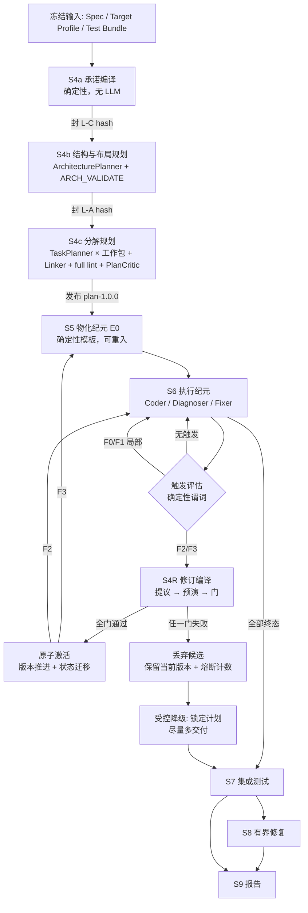

# NePA 流水线设计：S4～S9 规划、物化、执行与修订

> 文档状态：Active\
> 设计版本：2.0.2\
> 最后更新：2026\-09\-06

## 0\. 阅读指南

### 0\.1 本文档的使用方式

本文档是 `system_design.md` 的**受权威子文档**，详细规定 S4～S9 六个阶段的流程设计、计划修订机制与修复阶梯。它与主文档共同构成 NePA 的现行设计基线。

权威性与优先级：

- `system_design.md` 仍是唯一主设计文档（Single Source of Truth）。本文档只在其授权范围内展开细节，**禁止**引入与主文档冲突的约束；
- 二者对同一事项表述不一致时以主文档为准，并按 `11.3` 的决策流程消除不一致，而不是在实现中自行取舍；
- 本文档与主文档的任何修改都走同一条变更流程：先裁决、再同步修订文档与 Schema、最后写入各自的修订历史；
- 主文档 `6.4`～`6.9` 保留阶段级摘要、入口/出口、receipt 与门编号，细节以本文档为准。

对实现者的硬性要求（与 `0.1` 同口径）：

- 本文档中的所有 `禁止`/`必须` 条款是实现约束，**不得**以"更简单""更快"为理由绕过；
- 遇到本文档未覆盖的情形，按 `11.3` 走裁决，**禁止**在代码中静默扩展语义；
- 本文档给出的阈值凡标注"先测后冻"的，一律不得凭直觉写入生产默认值。

### 0\.2 规范用语

同 `0.2`：**必须/禁止/应当/可以** 分别对应 MUST / MUST NOT / SHOULD / MAY。

### 0\.3 引用约定

- 形如 `4.7`、`6.4.5`、`5.2.4` 的裸章节号一律指 `system_design.md`；
- 本文档自身章节一律写作"本文 §n"；
- 三层冻结层名为 `L\-C`/`L\-A`/`L\-P`（Layer）；修复阶梯级名为 `F0`～`F5`（Fix）。二者与 `4.2` 的四层运行时 `L1`～`L4`、`10.3` 的测试分层 `L0`～`L3` 是**不同命名空间**，禁止混用。

### 0\.4 本文档解决的问题

S4 发布的计划在 S6 执行中可能被证伪。若把"修订计划"实现为整体替换计划版本，则已实现代码的有效性绑定在计划版本上，任一修订都使全部代码失效，成本不可接受。本文档的设计使**代码存续与任务身份存续解耦**：绝大多数修订不使任何代码失效，少数结构性修订的失效范围可机械计算并在激活前进入预算门。

## 1\. 设计总纲

### 1\.1 四条核心主张

| # | 主张 | 直接后果 |
| --- | --- | --- |
| 1 | 把"计划"拆成**承诺层 / 结构层 / 分解层**三个独立冻结的地层 | 绝大多数修订只动最便宜的一层 |
| 2 | 给计划节点**稳定语义身份**，修订以**封闭补丁算子集**表达 | 新旧版本可逐节点对齐，失效范围可机械计算 |
| 3 | 代码存续由**文件实现台账 \+ 义务摘要**决定，不由计划版本决定 | 分解层激活不重生成源文件；是否仍满足新义务须逐文件计算 |
| 4 | **不是所有错误都应该在 run 内修**：架构改轴（F4）与合约重协商（F5）永久留在 run 外 | 成本爆炸的唯一入口被结构性封死 |

一句话：**代码存续与任务身份存续是两件事。**

### 1\.2 与 NePA 约束的对齐

`3.4` 的四条关键差异直接约束本设计：

| 差异 | 对本设计的约束 |
| --- | --- |
| 无人在场 | 触发条件必须是**机器可判谓词**，不能是 Agent 自述"计划不对" |
| 完成率可操纵 | 修订**禁止**缩小义务集；必须有覆盖单调性不变量 \+ 哈希链账本 |
| 完成判定必须机器可判 | 修订后的验收仍走同一 lint/构建/测试真值，不以模型评审代替执行验收；RG-4 仅是候选计划的发布门 |
| 单 run 无外部纠偏 | 必须有振荡熔断与受控降级出口，不能无界重试 |

门先使用能完成判定的确定性检查。本文的“真值级别”只表示证据来源：1=集合/图/状态，2=输出与路径检查，3=编译资产静态检查或物化预演，4=构建，5=独立测试，6=模型评审；编号不是成本全序，也不引用主文档 §3.3 中不存在的阶梯。模型输出只是候选或诊断，不是实现成功证据。

## 2\. 三层冻结

把 Plan 拆成三个**独立冻结、独立版本、修订代价递增**的地层。这是整个设计的地基。

| 层 | 名称 | 内容 | 冻结时机 | 可否 run 内修订 | 修订代价 |
| --- | --- | --- | --- | --- | --- |
| **L\-C** | 承诺层 Commitment | 冻结输入三项引用；规范性 REQ 全集及其 MUST/MUST NOT 分级；测试契约（nodeid/gate/req 映射）；构建变体集合；全局预算上限 | S4a 结束 | **禁止** | — |
| **L\-A** | 结构层 Architecture | 模块与职责、internal contract（owner / ready\_gate / provider / consumer / interface\_files）、**文件布局声明与模块级 `owns_files`**、工作包骨架与包级 REQ 责任 | S4b 结束 | 受限允许（F3） | 高：需重物化 \+ 纪元切换 |
| **L\-P** | 分解层 Plan | 任务切分、instructions、任务级 `deliverable_files` 划分、任务 DAG、任务级 REQ 责任细化、验收绑定 | S4c 结束 | 允许（F2） | 低：保留源文件，按新义务重验或增量修复 |

三条不变量把"允许修订"与"完成率不可操纵"同时保住。

**INV\-1 承诺不可变。** `L\-C` 的 canonical hash 在 run 内恒定。任何修订都**禁止**增删规范性 REQ、改变 MUST/MUST NOT 分级、改变测试契约或放宽构建变体。这是 `3.4`"完成率不可操纵"的机器实现。

**INV\-2 覆盖单调性。** 对任意两个相邻计划版本 $P_i \to P_{i+1}$：

```text
∀ req ∈ L-C.normative_requirements:
    has_primary_owner(req, P_i+1) == true
    supporting_set(req, P_i+1) ⊇ ∅            # 允许增减 supporting
    ¬∃ req: owner(req, P_i) ≠ null ∧ owner(req, P_i+1) == null
```

即：**责任可以搬家，不可以消失。** 允许把 REQ 从 T\-a 移到 T\-b（这是重规划的正常内容），**禁止**让任何规范性 REQ 失去 primary owner。这条把"重规划"与"卸责"在机器层面区分开。

**INV\-3 义务不放宽。** 对同 uid 任务，原验收义务必须保留；split/merge/move 必须显式给出旧义务到新 owner/验收节点的映射。构建变体绑定到承接对应文件的任务，测试按冻结 nodeid 及其完整 REQ 闭包重新由 Linker 定位最早合法 gate；原测试不得消失、禁用或推迟到闭包不满足的任务。split 的后继义务并集覆盖前驱，merge 的新节点覆盖所有前驱，允许因 readiness 改变迁移 gate，不允许放宽测试本身。映射与覆盖检查先于激活，不按标题或相似度推断。

### 2\.1 为什么恰好是三层

- 承诺层与结构层必须分开：**目标不变而结构可错**是最常见的现实情形，把二者绑在一起意味着结构一错就得重开合约；
- 结构层与分解层必须分开：**结构对而切分错**是第二常见情形（任务太大、边界画偏），这一类占绝大多数，且完全不影响文件内容归属，因此无需因任务改名而重写代码；新增义务仍须验证；
- 再往下细分（例如把 instructions 单独成层）没有收益：instructions 变化不进入代码失效闭包，但仍须通过 F2 发布不可变的新计划版本。

### 2\.2 与 Plan v5 字段的对应关系

Plan v5（`5.2`）的字段不重新发明，只按层归属并分别哈希：

```text
L-C  = { input_refs, coverage.tests(契约面), 规范性 REQ 集合与分级,
         build_variant 全集, config_snapshot 中的预算与层开关 }
L-A  = { architecture.decisions/assumptions/contracts/modules/layout,
         work_packages(除任务派生字段), 模块与包级 allowed_files }
L-P  = { tasks[], 任务级 depends_on, 任务级责任细化, acceptance 绑定 }
```

`coverage` 与 `delivery_blueprint_sha256` 仍是**派生物**，由 Linker 与 Delivery Compiler 从三层确定性重算，不属于任何一层的自由内容（与 `5.2.3`、`6.4.1` 一致）。

## 3\. 稳定身份与失效闭包

### 3\.1 双身份与义务血缘

保留拓扑位置 id `T-###`，跨版本身份为 `task_uid = sha256(canonical_json([work_package_id, local_task_id])).hexdigest()[:16]`。canonical 编码沿用主文档第 5 章；截取 16 个小写十六进制字符，Plan 内碰撞直接拒绝。正式 Plan 必须保留 `local_task_id`，不得从 `_s4` 草稿补回正式事实。

F2/F3 重新 Link 可以改变位置 id。split/merge 生成新局部 id，并分别写 `derived_from` / `merged_from[]`；move 保持 uid，另记录旧义务与文件到新 owner 的映射。局部 id 在同 run 同工作包内不得被无血缘的新任务复用。uid、义务摘要与指导摘要仅用于编译、迁移、审计，不进入 Coder/Fixer 上下文或 Blueprint 语义投影。

### 3\.2 分类：先对齐血缘，再判断执行与文件

```text
obligation_digest(task) = sha256(canonical{
  sorted(requirement_responsibilities), sorted(deliverable_files),
  sorted(provides_contracts), sorted(consumes_contracts),
  sorted((id, interface_signature_digest(c)) for c in provides ∪ consumes),
  sorted(acceptance.build_variant_ids), sorted(acceptance.tests)
})
guidance_digest(task) = sha256(canonical{title, goal, instructions, kind, context_refs})
```

contract 的 `exports[]`、函数实现槽位和可渲染声明契约由 `5.2.1` 定义。接口签名摘要仍对按 `(interface_file, symbol, signature)` 排序后的三元组数组计算 canonical SHA-256，声明文本按字节比较；实现位置、文件义务变化另由迁移映射和 Blueprint 差异检查。因此 provider 实现变化不自动传播，provider 或 consumer 依赖的声明变化必须进入受影响闭包。

分类器先展开算子的显式血缘，把新任务对应到旧任务、旧文件及旧验收义务；然后按下表顺序选择唯一任务分类。未完成任务无成功证明，INHERIT 只能保留其未完成状态，不能 INHERIT 或 REVALIDATE 为 done。

| 优先级 | 机器条件 | 任务分类与执行 |
| --- | --- | --- |
| 1 | 同 uid、义务摘要相同；旧 done 时必须有有效完成证据；guidance 可改变 | `INHERIT`：继承原状态/额度；仅原 done 继承 commit/evidence，并通过迁移证明绑定新计划 |
| 2 | 新义务均由显式前驱的有效完成证明覆盖；只改变位置、文件分区、owner 或验收归属 | `REVALIDATE`：零 LLM，按新验收重跑，通过前保持 pending/revalidate；新 uid 也可走此分支 |
| 3 | 不满足前两项，全部目标文件已有 realized 内容，且血缘对齐后的责任 Jaccard ≥ 0.5 | `AMEND`：保留内容，每次迁移一次 Fixer；提供或消费接口签名变化均落入本项或下一项 |
| 4 | 有无 realized 起点的新目标文件，或责任 Jaccard < 0.5 | `REGENERATE`：Coder 起始的有界执行；不是删除旧文件 |

Jaccard 对 `(req_id,role)` 集合计算；双方空集取 1。比较对象是映射到该后继的前驱义务并集，不是随意取一个父任务。义务未变化的未完成任务，无论指导变或不变，保持原执行模式、attempts 与当前状态；不得通过 rewrite_instructions 刷新额度。blocked_by_dependency 在依赖图修订后解除阻塞，恢复原未执行模式和 0 次普通 attempts。

文件分类独立于任务分类：旧 realized 文件内容、接口与对应义务均保持且证明可继承为 INHERIT；仅验证归属/验收绑定变化为 REVALIDATE；所属任务要执行 AMEND、或 REGENERATE 但该文件仍有保留内容时为 AMEND（完整文件输出契约可能重写它）；无可用起点或槽位退役为 REGENERATE。同一文件命中多条取成本较高者；新增文件单列，不混入旧文件分母。失效沿声明变化传播，遇到声明及消费义务均未变化的节点终止；不以“新 uid”本身判全部文件重写。

分类结果必须输出逐任务旧/新 id、uid、血缘/义务映射、classification、reason、旧 attempts、来源 evidence refs，以及逐文件 path、旧/新 owner、分类与原因。INHERIT 不改写旧 evidence 的 plan hash；新 State 通过已激活 migration proof 证明旧验证仍覆盖当前义务。REVALIDATE/AMEND/REGENERATE 只有实际验收通过才能发布新的完成事实。

### 3\.3 文件实现台账

`plan/file_ledger.json` 使用 `schema_version="2.0"` 和唯一集合键 `files`。每项以当前活动路径为键，携带 `class ∈ {s5_frozen,s6_owned}` 与 `state ∈ {slot_only,realized,quarantined}`：

- slot_only：path/class/state，表示 S5 存根，不宣称任务实现完成；
- realized：另带 `created_in_epoch`、`content_sha256`、`last_commit_sha`、`verified_by`（build variants 与带哈希 evidence ref）；s6_owned 必带非空 `owner_history[{plan_version,task_uid,task_id}]`；s5_frozen 不带 task owner，带 `created_by_stage="s5"` 与 epoch receipt ref；
- quarantined：保留上次 realized 字段，增加 `quarantined_in_epoch/quarantine_path`，不进入活动构建图。

owner_history 仅在 owner 或任务位置/版本绑定变更时追加；F1 不改 owner，只更新内容与验证证据。`verified_by` 表示某个 tree/版本上的历史验证，不因文件保留自动成为新版本验证。S5 E1+ 带不兼容检查点中的新增/变化机械文件保持 slot_only，旧版本的机械内容及验证仍可从旧 epoch checkpoint/receipt 读取，待联合验收通过才成为 realized；禁止把失败构建写成 verified_by。

### 3\.4 保全率与返工预算

```text
preservation_rate = (旧 realized 文件中 INHERIT 数 + REVALIDATE 数) / 旧 realized 文件数
```

旧 realized 为空取 1；退役/隔离的文件仍进入旧分母，新增文件不进入分母。F2 只保证激活不重生成源文件，不保证新任务义务无需修改代码，故不再要求 F2 保全率恒为 1。

`rework_cost_estimate_usd` 按迁移后的执行单元计算：每个 AMEND 一次 Fixer、每个 REGENERATE 一次 Coder 加其剩余 Fixer 最大额度、每个 REVALIDATE 的构建，以及修复组最大验证次数；新增文件归属的任务必须计入，同任务多文件不重复乘调用次数。模型单价及输入/输出 token 上界来自冻结配置和上下文/输出预算，构建资源单价采用显式试验配置（不计费用时明确为 0）。它是预算估算而非真实收费或成功保证，实际费用按关联调用的 telemetry 追加记账。RG-3 同时检查剩余调用额度、成本预算与保全率，不能以低估算绕过全局硬顶。

### 3\.5 槽位退役、隔离与重新采纳

退役只由 F3 `retire_file_slot` 完成：候选整体必须仍覆盖原 REQ、验收和已发布接口；更新布局引用、构建图、owner 与实现槽位，禁止留下悬空符号。realized 文件由控制器 `git mv` 到 `_orphan/<epoch>/<原路径>`，保留历史证据；slot_only 可删除。`re_adopt` 也是 F3，必须显式给出 quarantine_path、目标槽及 owner，恢复槽位并移动内容，重跑新义务验收后方可重新 realized。

改路径使用同一 F3 补丁中的退役、新增槽和显式文件迁移映射；不把旧 path 的完成证明直接当新 path 的证明。不提供隐式 rename 或文件删除算子。工作树双向一致性检查的“活动源码树”排除 `.git`、声明的构建输出和台账已登记的 `_orphan`，但这些例外必须逐项有来源。

## 4\. 版本、纪元与工件布局

### 4\.1 C.A.P 与纪元

初始 `1.0.0/E0`；F2 只增加 P，F3 增加 A 并把 P 归零；C 在 run 内恒为 1。纪元按 A 位划分，是结构层代不变的区间，允许多个 F2 计划版本。F2 激活不重生成源文件、不建物化提交，但会生成新的元数据绑定；重验可产生绑定新证据的空树变更提交。F3 开始新纪元并进入 S5。`Rev-n` 只表示第 n 次成功版本激活，不复用风险编号或历史 prompt 命名。

### 4\.2 工件与独立锚点

```text
plan/
├── versions/plan-<C.A.P>.json             # 不可变计划
├── active_plan.json                     # version/path/sha256/revision_seq/epoch
├── plan_state.json                      # 活动执行快照
├── file_ledger.json
├── s6_revision_ledger.json               # S6 封存的不可变事件前缀
├── revision_ledger.json                  # 类型化事件哈希链
├── bindings/<C.A.P>/                     # 不可变版本绑定（F2 也生成）
│   ├── artifact_manifest.json
│   ├── contract_map.json
│   └── receipt.json                     # 绑定 plan、两工件与 epoch receipt
├── epochs/E<n>/receipt.json              # 不可变物化事实、checkpoint 与构建结果
├── artifact_manifest.json               # 当前 binding 的确定性副本，非独立真值
├── contract_map.json                    # 同上
├── _s4/
└── _s4r/candidate_<event_seq>/           # 候选、activation WAL、组修复现场
```

公共字段与 Schema 版本归主文档 `5.4/5.6.7`。初始 seal 仍锚定 1.0.0；`run.stages.s4.output_refs.active_plan` 只由激活控制器更新。S5 epoch receipt 不随 F2 回写；版本 binding receipt 引用同一 epoch receipt 及新 manifest/map。S6/S7/S9 读取当前 binding 并核对其来源，禁止要求旧 S5 receipt 的 manifest hash 等于 F2 后的当前副本。多纪元历史通过不可变 epoch/binding receipts 留存，账本保存其引用，不回写旧事件。

### 4\.3 类型化修订账本

`revision_ledger` v2 的每条 entry 都有连续 `event_seq`、`event_type`、`prev_entry_sha256` 与 `payload`。首条前驱固定 64 个 0，后续指向前条完整 canonical 字节 SHA-256；禁止回写、删除或缺号。

事件身份、boundary_key 去重和派生 revision_locked 按 5.6.7。事件类型为 `trigger_evaluated/candidate_rejected/revision_activated/epoch_materialized/lease_started/lease_finished/verification_committed/revision_evaluated`。payload 的公共契约见 `5.6.7`。只有 revision_activated 增加 `revision_seq`，其 from/to version、迁移结果、绑定 refs 和活动指针一致；F1、拒绝及事后评价不推进计划。候选 id 使用评估事件序号，拒绝候选不会占用版本号。

活动指针与**最近一条 revision_activated**比较；不存在激活事件时，必须等于初始 seal 的 1.0.0、revision_seq=0、E0，即使已有触发或租约事件。版本提交点仍是活动指针推进：预写但未提交的 activation entry 只能由 WAL 恢复处理，禁止下游在 reconciliation 前读取。事后 checkpoint、租约结果、实际成本和有效性以新事件及 refs 记录，不补写 activation payload。

### 4\.4 纪元级状态与执行视图

S5 的实例键是 epoch；`done` 只对同一实例终态，F3 可以创建新的 pending 实例，禁止直接把旧 done 改成 running。`run.stages.s5` 是当前实例投影，历史完成事实由 epoch receipt 留存。同一已完成实例重复执行是零变更操作。S6 在所有激活/物化/重验完成后才封存阶段 receipt，F3 前不得先把 S6 标 done。

初始 S4 seal 的 file ledger 为 slot_only、revision ledger 为空；Plan State 仍在 S6 admission 首次创建。F2/F3 只允许在 S6 任务边界、无在途 attempt/租约/修复组时开始，不重置 run 总预算。

## 5\. 阶段流程

### 5\.0 总览



S4 内部状态机在 `6.4.2` 基础上把 `PREPARE`/`DELIVERY_CONSTRAINTS` 归入 S4a、`ARCHITECT`/`ARCH_VALIDATE` 归入 S4b、其余归入 S4c；状态名与 `flat` 消融路径不变。**S4 全程不写 workspace**（`6.4.1` 末段的强制不变量保持）。

### 5\.1 S4a 承诺编译（确定性）

| 项 | 内容 |
| --- | --- |
| 目的 | 把"本次 run 的义务"编译为独立冻结的承诺层，使后续任何修订都有不可动的参照物 |
| 角色 | 无 LLM，纯确定性 |
| 输入 | 三项冻结输入 \+ config snapshot |
| 输出 | `L\-C` canonical 对象及其 hash，写入 `_s4/commitment.json` |

主流程沿用 `6.4.3` 的 PREPARE（重验哈希、`spec_lint`、引用图、build variant 索引、Delivery Constraints、token preflight），额外产出显式承诺对象：规范性 REQ 全集与分级、测试契约投影（nodeid/gate/req\_ids；M1 下 acceptance 为空但保留静态映射）、构建变体全集、预算上限。

这一步是**零成本的重新分包**而非新增工作：现行 S4 已算出全部内容，只是没有单独哈希。单独哈希的收益是 INV\-1 从文档纪律变成机器不变量。

### 5\.2 S4b 结构与布局规划

沿用 `6.4.4` 的 ArchitecturePlanner 调用形态与既有子门编号，保留已交付的架构输入与校验契约，新增声明可渲染预检由 S5 按主文档 5.2.1 承担；出口包括两项：

1. 单独计算并封存 `L\-A` canonical hash，写 `_s4/architecture.sealed.json`；
2. **文件布局由 ArchitecturePlanner 自由规划**（本文 §5.2.1～§5.2.4），不再由 Delivery Compiler 固定给出。

生产架构定点修复额度按主文档 4.7；M1-4a2 的至多两次语义 patch 是独立实验协议，不冒充生产额度已完成实测冻结。

新增出口检查**结构层可修订性预检**：task-ready contract 的实现文件必须属于唯一 provider 工作包，声明头按 5.2.1 的 frozen/owned 分类验证；ready_gate=s5 无 provider task，不适用此项。不得把声明就绪当实现就绪。

#### 5\.2.1 职责划分：什么自由、什么机械

布局自由化只放开"文件与模块怎么切"，**不放开符号命名与资源上限**。

| 事项 | 归属 | 依据 |
| --- | --- | --- |
| 文件路径、目录结构、文件数量、模块切分、每模块 `owns_files` | **S4b 自由规划** | 本文 §5.2.2 |
| 逐报文文件的展开规则与占位符 | **S4b 自由规划**（占位符取值域受限） | 本文 §5.2.2 |
| 机械符号命名（六模式：`message_struct`/`encode_fn`/`decode_fn`/`type_alias`/`error_enum`/`packet_type_enum`） | **机械派生，禁止自由** | `5.6.5.2` |
| 架构内部 ABI 符号 | 规划 symbol_id，按统一前缀/规范化规则派生，禁止协议先验 | `5.6.5.2` |
| 四项资源上限默认值 | **机械派生，禁止自由** | `5.6.5.2` |
| 三段构建图形状（deliverable → build artifact → link source set） | **强制形状，内容自由** | `6.4.1` |
| `s5_frozen` / `s6_owned` 二分与"每个 `s6_owned` 文件恰有一个 task owner" | **强制不变量** | `5.2.2`、`6.4.1` |
| 语言、交付角色 | 来自 Target Profile 两字段，**不可自由** | `5.6.5.1` |

理由：导出符号是覆盖矩阵、契约签名摘要与协议中立审计的共同锚点，放开它会同时破坏 `interface_signature_digest` 的稳定性与 D1\.11 的"逐步重算"能力；而放开文件路径不影响上述任何一项。

#### 5\.2.2 布局声明：ArchitectureDraft 的新增输出

ArchitecturePlanner 在既有输出（模块职责、internal contract、设计决定、责任分配、工作包骨架）之外**必须**输出一份完整布局声明 `architecture.layout`。S5 的确定性地位依赖于"声明完整"，因此每个文件条目都必须自带 S5 渲染所需的全部信息：

```text
architecture.layout = {
  "roots": {"include": "include/<dir>", "source": "src", "app": "apps", "build": "."},
  "files": [{
    "slot_id": "<稳定 id，整个 layout 内唯一>",
    "path": "include/<dir>/<name>.h",        # 或含占位符的 path_pattern
    "path_pattern": null,                    # 与 path 互斥；逐报文或逐类型文件使用
    "expand_over": null,                     # path_pattern 的展开域，取值见下
    "class": "s5_frozen | s6_owned",
    "render_rule": "header | source_stub | build_file | doc | mechanical",
    "owner_module": "<module_id>",
    "contract_id": "<internal_contract_id | null>",   # render_rule=header 时必填
    "build_role": "link_source | entry_point | none",
    "purpose": "<通用职责说明，禁止协议专有词>"
  }],
  "build_graph": {
    "artifacts": [{"artifact_id": "...", "output_path": "...", "entry_file_slot": "...", "link_source_slots": ["..."]}]
  }
}
```

字段约束：

- `path` 与 `path_pattern` 二者恰有一个非空。`path_pattern` 的占位符取值域**只允许** `{message_id}` 与 `{type_id}`，且必须来自 Spec 派生标识符集合；`expand_over` 只允许 `messages` 或 `types`。**禁止**引入新占位符或按协议名选择展开域；
- `render_rule=header` 的文件必须绑定一个 `contract_id`，S5 由该 contract 的导出符号集合与机械命名派生值渲染声明，因此 S5 无需推理；
- `render_rule=mechanical` 的文件其输入域必须落在系统内置机械契约白名单内（`6.4.1` 既有约束）；
- `render_rule=source_stub` 的文件必须为 `class=s6_owned`；`render_rule ∈ {header, build_file, doc, mechanical}` 的文件必须为 `class=s5_frozen`。内部接口头可以是 `s6_owned`（`6.4.1` 既有例外），此时其 `render_rule` 必须为 `source_stub` 并由 owner 任务填充实现声明之外的内容；
- 每个 `class=s6_owned` 文件必须能被恰好一个任务在 S4c 中认领为 owner，否则 `S4-G4` 失败。

`layout.files[]` 到 Blueprint `file_rules[]` 的 `kind`/`producer` 必须按下表唯一派生。`contract_id 非空` 表示该字段为一个已通过引用校验的 internal contract id；`contract_id=null` 表示字段为 JSON null：

| `render_rule` | `class` | `contract_id` | `build_role` | `kind` | `producer` |
| --- | --- | --- | --- | --- | --- |
| `header` | `s5_frozen` | 非空 | `none` | `header` | `layout_template` |
| `source_stub` | `s6_owned` | 非空 | `none` | `header` | `s6_task` |
| `source_stub` | `s6_owned` | `null` | `link_source` | `source` | `s6_task` |
| `source_stub` | `s6_owned` | `null` | `entry_point` | `app` | `s6_task` |
| `build_file` | `s5_frozen` | `null` | `none` | `build` | `layout_template` |
| `doc` | `s5_frozen` | `null` | `none` | `documentation` | `layout_template` |
| `mechanical` | `s5_frozen` | 非空 | `none` | `header` | `mechanical_spec` |
| `mechanical` | `s5_frozen` | `null` | `link_source` | `source` | `mechanical_spec` |

表外组合一律非法并由 Blueprint 编译受控失败，明确包括 `mechanical + entry_point`、`header` 未绑定 contract、`build_file`/`doc` 绑定 contract 或参与链接、`source_stub` 同时绑定 contract 并参与链接、`s6_owned` 由 `layout_template`/`mechanical_spec` 生产，以及 `s5_frozen` 由 `s6_task` 生产。Delivery Compiler **禁止**按路径、文件后缀、模块名或协议身份补充猜测。

**所有导出符号必须在 contract 中显式声明**。机械符号按 `5.6.5.2` 六模式及枚举成员规则派生，架构内部 ABI 按已声明的通用职责标识命名；函数到实现槽、声明到头文件的绑定及可渲染类型规则见 `5.2.1`。M1-5 从既有输入确定性派生主文档 `5.2.1` 的 S5 渲染视图，不增加已交付架构提示词的必填输出；不能猜测未声明符号或歧义实现位置。

#### 5\.2.3 布局约定：确定性输入

布局约定以协议无关、可版本化资产注入。6.4.8.2 禁止的是 MQTT 专有文件名/接口名、成功架构和模型分支，不禁止通用工程说明或协议无关抽象示例；约定资产中的 hard 条款不得靠 prompt 文本代替机械校验。

| 项 | 规定 |
| --- | --- |
| 资产位置 | 仓库内 `nepa/assets/layout_conventions/<language>-<delivery_form>-v<N>.json`，随代码版本化 |
| 选取方式 | `layout_convention_id = "<language>-<delivery_form>-v<N>"`，由 Target Profile 的两个字段机械派生；Target Profile 仍只有两个字段（`5.6.5.1` 不变） |
| 完整性绑定 | 其 canonical hash 由 `compile_delivery_constraints` 写入 Delivery Constraints，并随 config snapshot 进 `run.json`；S5 重算时逐值核对 |
| 内容分类 | 分 `advisory`（建议性，进 ArchitecturePlanner 输入作为参考）与 `hard`（硬约束，进 `ARCH_VALIDATE` 作为门条件）两段，二者在文件中显式分开 |
| 协议中立 | 约定文件**禁止**出现任何具体协议的报文名、字段名、常量或按协议名分支；只允许通用职责词汇与层次规则。协议中立静态扫描覆盖该资产 |

`advisory` 段的内容范围（应用层协议实现的通用经验，不构成硬门）：

- 建议的职责槽位词汇表：报文编解码、会话/状态机、传输与事件循环、共享类型、入口、构建文件、说明文档；
- 建议的分层方向：`types ← codec ← session ← net ← entry`，即编解码不依赖传输、会话不依赖具体传输细节；
- 建议的目录惯例：对外可见声明集中在 `include/` 下单一目录，实现置于 `src/` 下按职责分子目录，可执行入口置于 `apps/`；
- 建议的粒度：单文件职责单一，逐报文内容优先按报文展开而非集中于单文件。

`hard` 段的内容范围（进门检查）：

- 允许的路径根集合与保留名黑名单；
- 分层方向约束：模块依赖必须与声明的层次序一致，**禁止**出现反向依赖或环；
- 交付角色形状：`delivery_form=server` 时构建图必须恰有一个 `entry_point` 与一个可执行 artifact；
- 三段构建图必须闭合。

#### 5\.2.4 新增 ARCH\_VALIDATE 子门

自由布局把布局校验从"逐值比对固定表"改为**结构性与闭合性校验**，并把这项裁决完整放在架构层：五个布局子门属于 `S4-G2` 的 `ARCH_VALIDATE`，与 `arch_01`～`arch_10` 并列；原门编号及已交付 contract/owner 子门保持不变；主文档 5.2.1 的新增声明/实现绑定预检归 M1-5，不作为回改 S4 或重开架构实验的理由。`S4-G1` 不重复裁决布局本身，只校验 Blueprint 对已通过的 `layout` 的忠实转写（本文 §5.2.5）。新增五个：

| 子门 | 条件 | 真值级别 |
| --- | --- | --- |
| `arch_11 LAYOUT_SAFETY` | 全部路径为相对路径、无 `..`、无绝对路径、无符号链接语义、落在 `hard` 段允许的路径根内、不命中保留名黑名单；slot_id 在整个 layout 唯一；`path`/`path_pattern` 展开后全局唯一无碰撞 | 1 级 |
| `arch_12 LAYOUT_CLASS` | `class` 与 `render_rule` 的组合合法（本文 §5.2.2）；`s5_frozen` 文件不被任何任务列为 `deliverable_files`；每个 `s6_owned` 文件恰有一个 owner 模块 | 1 级 |
| `arch_13 BUILD_GRAPH` | 三段引用全部存在且集合闭合；每个 `link_source` 槽恰进入一个 artifact；artifact 输出路径唯一；`delivery_form` 要求的 `entry_point` 数量精确匹配；构建图无环 | 3 级 |
| `arch_14 LAYERING` | 模块间依赖方向与 `hard` 段声明的层次序一致，无反向边、无环；contract 的 provider/consumer 方向与之一致 | 1 级 |
| `arch_15 PATH_NEUTRALITY` | 路径与 `purpose` 中的每个 token 必须属于通用职责白名单 ∪ Spec 派生标识符集合；`path_pattern` 的占位符与 `expand_over` 合法；**禁止**出现未由冻结输入派生的协议专有词 | 2 级 |

`arch_15` 是自由布局引入的必要防线：模型自由命名文件时可能复现记忆中的某协议工程惯例，从而使协议事实绕过冻结输入进入生成物。该门与 `10.2` D1\.11 的命名来源审计共用同一白名单实现。

该白名单的归属需明确，避免与 §5.2.3 的资产分段混淆：**通用职责白名单是版本受控的校验器侧共享实现**（与 D1\.11 命名来源审计同一份），**不是**布局约定资产 `advisory` 段的内容——`advisory` 段的职责槽位词汇表只作为 ArchitecturePlanner 的参考输入，不构成门判据；`hard` 段也不复制该白名单。白名单随 validator 一同属于 lineage 控制面（`6.4.8.1`），另行获准实验若修改其内容，必须使用不同 lineage，旧批次不得混合比较；本次保留现有 validator 与最新架构 bundle，不启动新 lineage 或实验（主文档 10.2.1）。`arch_15` 的判定域是每个 `path`/`path_pattern` 分段与每条 `purpose` 文本切出的 token，二者用同一白名单 ∪ 同一 Spec 派生标识符集合判定。

上述五个子门的判据以本节为准：主文档 `6.4.4` 只保留门编号与摘要，两处表述曾在 `arch_13`（`app` 槽 vs `link_source` 槽）与 `arch_15`（黑名单 vs 白名单）不一致，已按 `11.3` 裁决统一采用本节口径并同步主文档。

任一新增子门失败按既有规则计入 `ARCH_VALIDATE` 失败，允许一次定点架构修复。

#### 5\.2.5 Delivery Compiler 的职责调整

`6.4.1` 的两个纯函数签名与"S4/S5 复用同一实现"的约束不变，职责边界调整为：

```text
compile_delivery_constraints(spec, target_profile) -> DeliveryConstraints
    # 输出：语言/角色解析结果、机械命名派生值与六条模式、四项资源上限、
    #       构建变体集合、layout_convention_id 及其 hash、advisory/hard 两段、
    #       机械契约白名单与模板根。
    # 不再输出固定 file_rules[] 表。

compile_delivery_blueprint(constraints, architecture, work_packages, tasks) -> DeliveryBlueprint
    # 消费 architecture.layout 的文件声明与构建图，展开 path_pattern，
    # 解析精确文件、创建者、唯一 task owner、build artifact/link source set
    # 与 internal contract 映射期望，再计算 canonical hash。
```

两函数仍禁止读取时间、随机数、网络、workspace 或环境探测，禁止按协议名称写行为分支；相同 canonical 输入必须逐字节得到相同 canonical 输出。Blueprint 的 semantic projection 仍是 `constraints + architecture + work_packages + tasks`。

### 5\.3 S4c 分解规划与初始发布

沿用 `6.4.4` 后半、`6.4.5`、`6.4.6`、`6.4.7`：逐工作包 TaskPlanner 展开 → 确定性 Linker → full lint（`S4-G0`～`S4-G6`）→ PlanCritic → seal。`S4-G1` 的条件按本文 §5.2.5 改为校验 Blueprint 对 `layout` 的忠实转写——`file_rules[]` 与 `layout.files[]` 双向一一对应、构建图引用与 `build_graph` 逐项一致——布局本身的合法性已在 `S4-G2` 由 `arch_11`～`arch_15` 裁决，此处不重复。其余门条件不变。

变化三处：

1. 发布路径为 `plan/versions/plan-1.0.0.json` \+ 原子写 `active_plan.json`，`revision_seq=0`；
2. 同时初始化 `file_ledger.json`（此时全部文件 `state=slot_only`）与空 `revision_ledger.json`；
3. Linker 额外为每个任务计算并写入 `task_uid`、`obligation_digest`、`guidance_digest`（三者均为派生字段，**禁止**进入 Blueprint 语义投影，避免哈希循环）。

`6.4.7` 的 seal receipt 语义不变：`stages.s4=done + output_refs` 仍是 Plan 的完整性锚点与下游消费的逻辑 commit point，另加 `output_refs.active_plan`。

### 5\.4 S5 物化纪元

S5 无 LLM，只消费活动 Plan、冻结输入及同一 Delivery Compiler 的重算 Blueprint。输入/receipt/basic lint → Blueprint 一致性 → full lint 是首个 workspace 副作用之前的硬门。生成模板不得按协议名、文件后缀或自由文本推断依赖。

物化差异使用前一纪元的结构 Blueprint：新增/变化的 s5_frozen 确定性渲染；新增 s6_owned 创建存根；已有 realized s6_owned 内容保持；退役文件按本文 §3.5 隔离。F2 的 owner 变化不构成重新生成理由。函数存根按 `5.2.1` 的实现槽位及 stub 规则生成；接口头可生成声明，但不能据此把 task-ready provider 标为已就绪。

- E0：全部默认构建变体零警告零错误，启动 smoke 通过，才允许封存 checkpoint、epoch receipt 和版本 binding。
- E1+：结构、声明、构建图和 manifest/map 必须一致；仍执行全部默认构建。只允许与迁移闭包完全对应的旧实现不兼容进入 `pending_repair` checkpoint，保存失败构建 refs 和待修复组。不能机械定位到闭包的编译/链接错误，或模板本身无法构建，不能按“已知不兼容”豁免。
- 同一 Blueprint/epoch 已完成后重入零变更；后续纪元普通提交，不再次 git init。receipt 记录 `materialization_status ∈ {ready,pending_repair}`，pending_repair 不是可执行性通过证明。
- S5 不调用 Fixer；已提交物化 checkpoint 的恢复锚点是当前 epoch，恢复不得删除更早已验证文件或回到 E0。具体原子发布窗口见 `5.6.7`。

S5 完成表示本纪元物化事实已封存；S6 admission 区分 ready 与 pending_repair，后者只能先执行本文 §5.6.1 的组修复。新接口未兼容之前不能运行普通任务或发布新的 done。

### 5\.5 启动 smoke

smoke 是构建变体级确定性检查，不是 Test Bundle。M1 的 `acceptance.tests=[]`，无 runner/oracle/adapter。每个默认变体独立构建并运行其 Blueprint `build_artifacts[].path` 的可执行输出，禁止按文件名猜入口。

启动无参数，cwd 为 workspace 根，使用沙箱默认环境。启动后驻留 `smoke_dwell_seconds`，期间不得自行退出；随后 SIGTERM，在 `smoke_term_grace_seconds` 内退出，否则 SIGKILL 并失败。退出成功为 0 或 SIGTERM（原始 subprocess 返回值 -15，证据统一归一为 143）；SAN 变体不得有 sanitizer 报告。试验起点 2 s/5 s 只可写显式联调配置，正式值按 `4.7` 冻结。

执行位置：E0 的 S5 出口；S6 普通任务和 F1/联合修复的提交前；S6 最终 receipt 前。结果绑定 tree、variant、artifact、启动/终止结果与失败原因，进入对应 evidence/receipt。S5 的存根必须进入可终止等待循环；未实现功能返回派生 NOT_IMPLEMENTED 码，禁止 abort/assert/非零 exit 代替存根。

提交前 smoke 失败属于当前执行单元，可在其剩余 F0/F1 额度内修复；组内失败按组协议处理。S6 最终复核失败记录 `S6_EXIT_VALIDATION_FAILED` 并受控降级，不把终态任务凭空重开。S5 E0 smoke 失败属于模板/工具不能履约，按 internal_error 处理，无 LLM 修复。smoke 自身不是 F3 触发。

### 5\.6 S6 执行

S6 admission 先完成所有 WAL reconciliation，再校验活动 Plan、当前 binding、epoch receipt、State 与 git/evidence。无 State 且 HEAD 等于 E0 checkpoint 才做 fresh 初始化；其余必须从持久 State 恢复，不从 Plan 猜状态。

```text
完成待物化 / 待组修复 / 待重验
while 有可执行任务且全局额度允许:
    选择拓扑序第一个 pending、外部依赖已验证的任务
    按 execution_mode 执行 normal / revalidate / amend
    成功 → 证据、提交、State/ledger 发布；失败 → 回到执行基线并保留候选
    标记真正依赖失败的节点 blocked_by_dependency
    在任务边界评估触发；有合法 F2/F3 才暂停进入 S4R
无可执行任务 → 最终默认构建 + smoke + execution lint → S6 receipt
```

在普通 attempt 失败、下一次 Fixer 开始前即可评估 TR-3 并授予 F1，不能等 F0 全耗尽才申请租约；F2/F3 仍只在执行单元结束且无在途验证时激活。普通循环继续采用首次 Coder、后续 Fixer、3×T2+1×T1；AMEND 独立一次 T1 Fixer，REVALIDATE 无 LLM。状态/预算字段与事件由 `5.2.4` 定义。失败代码完整输出、其 tree/错误 refs 和诊断留在既有 attempt 现场；工作区回滚不删除这些数据。Fixer 接收最近失败候选及匹配错误，不能只收到回滚后的旧文件和新报错。上下文不可裁掉待修复文件与对应诊断；必要输入超限在调用前受控退出或按已获准的粒度触发处理，不默默漏文件。

### 5\.6.1 F3 受影响组统一验收

**组边界**由控制器确定：签名变化的 provider/consumer、迁移为 AMEND/REGENERATE/REVALIDATE 的任务，沿实际声明与构建依赖求闭包；共享受影响 build artifact 的节点归同组，重叠组合并。边界固定写入激活迁移记录，不由 Diagnoser 临时扩大。不受影响文件禁止修改；外部依赖必须已验证。组内 readiness 临时按候选依赖顺序供上下文使用，不成为正式 provider ready。

1. 以当前 epoch checkpoint 为组基线，将成员置为 pending 且带 group_id/mode。按稳定拓扑顺序逐任务调用；AMEND 至多一次 Fixer，REGENERATE 按剩余普通额度，REVALIDATE 不调用模型。候选逐个落盘，累计装配在组工作树，保存每次调用消耗后才能执行副作用。
2. 每一轮有界遍历后执行整组所有默认构建、适用 acceptance 测试（M1 为空）和 smoke。通过即停止。失败证据按路径/导出符号归属映射到成员，下一轮只调用仍有额度的对应成员；无法定位时整个组为嫌疑集合，不允许超出组或重复给 AMEND 额度。
3. 中间构建失败及候选不得形成成功 commit 或 done。全部验证通过后，以同一 tree 发布各成员 evidence 与一份联合证据，创建一个带联合证据 trailer 的 commit；由 verification WAL 一次发布成员 State、文件台账和 verification_committed 事件。新 uid 或纯 REVALIDATE 的普通 attempts 可为 0，来源必须由迁移证明，不伪造 Coder 调用。
4. 整组未通过且不能继续时，回到组基线，成员记 blocked（reason=GROUP_VALIDATION_EXHAUSTED），后继依赖阻塞；保留失败现场和额度。基线本就不可构建时，不声称恢复了可运行项目。仅继续与失败组不共享构建/运行依赖、且能通过自己完整验收的独立分支；默认全工程构建被阻断时直接受控降级。
5. 崩溃且尚无合法联合 commit：恢复组基线，重新装配 WAL 已登记候选，未完成调用仍消耗额度；有合法 commit 则只前向补记。双方树/证据不符视为工件损坏，不猜测接受。

组执行不是新 Agent 或并行框架，只是既有 S6 串行调用、验证与提交协议的必要多任务事务边界。

### 5\.7 S7 集成与一致性测试

沿用 `6.7` 的独立 runner 与 accepted round 协议。入口对齐当前 binding/epoch、S6 receipt、活动 Plan 和最近一次版本激活（空历史对齐初始 seal），不是账本最后一个任意事件。S7 测试资产必须先经 M2-0 设计和 M2-1a 独立生成验证，不能由 M1 提前造 runner。全部启用测试重跑；无法构建则记录真实构建失败，不伪造测试 pass。

### 5\.8 S8 有界修复

沿用 `6.8` 单簇修复、快验、单提交、全量回归与回滚。S8 不修改计划或 State 的任务完成事实，不返回 S6，不调用 S4R。S6 receipt 锚定的账本前缀保存在 s6_revision_ledger.json，后续诊断只追加活动账本；S6 file ledger 的验证事实不改写，最终内容由已接受 repair 后代 tree 与 terminal round 证明（5.6.7）。TR-9 及其他模型结构归因只追加诊断事件；预算内继续适用的代码修复，不能修复则保留静态合同和现场、以 degraded 结束。只有静态合同确实失效才使用 PLAN_INVALID_AT_EXECUTION/failed。s5_frozen 以当前 Blueprint 判定，不能由 S8 修改。

### 5\.9 S9 报告

主文档 `6.9/9.1` 为报告公共契约。从 revision ledger 的已接受事件、file ledger、各阶段 receipts 和关联 telemetry 确定性计算指标；Reporter 只成文。空账本是 0 次事件/激活，缺账本是 unavailable，不能混用。指针对齐最近 activation；历史证据通过迁移 proof 对齐当前义务；不要求历史 hash 等于新 Plan。planned_stop 不产生 report，但其 S6 构建、smoke 与过程指标可由 M1 指标工具读取。

## 6\. 修订触发与流水线

### 6\.1 触发登记表

自动触发必须有可重算机器事实。实现错误先用适用 F0/F1 额度；确定性证明本级无法修复（例如需要新增冻结接口）时记录不适用原因并跳级，禁止为耗完额度制造无意义调用。多触发同一边界时按最低可解决级 F2→F3、再按 TR 编号排序；F1 在任务内优先处理。每次评估的全部命中与选中项均落账。

| id | 谓词/来源 | 路由与护栏 | 可用期 |
| --- | --- | --- | --- |
| TR-1 | undefined reference 的符号不在已声明导出集，同一缺失符号被至少两个任务的构建证据需要；consumes 静态闭包已完整 | F3；单任务 Diagnoser 的 REQ 归因只记录，不自动升级 | M1 |
| TR-2 | 唯一 task-ready provider blocked，consumer 闭包占剩余未完成 primary 任务比例 ≥ θ₂ | F2；分母为 0 时不命中；图事实只是阻塞证据，不保证补丁能解决 | M1 |
| TR-3 | 同一 task uid/path 的他属 s6_owned 越界拒绝累计 ≥ 2 | 同工作包或直接 provider 邻域先 F1；不满足租约/租约耗尽且包内可改分工才 F2；其他跨包情况不按本条自动改 owner | M1 |
| TR-4 | 同任务截断 ≥ 2，或 full lint 输出预算投影超限 | F2；输出预算溢出可直接证明继续原粒度不适用 | M1 |
| TR-5 | 两次独立 Diagnoser 指向同一跨模块必需文件缺口，图检查确认超出可写/就绪集合 | record_only；不参与自动级别选择 | M1/M2 |
| TR-6 | 当前 (blocked+blocked_by_dependency)/任务数 ≥ θ₆ | F2；同一问题签名去重，计数可重算 | M1 |
| TR-7 | 构建缺少 Blueprint 外的输入，布局可容纳并通过结构门 | F3；不满足模块边界/声明规则则 F4 记录并降级 | M1 |
| TR-8 | provider 提交候选的导出声明与 contract 不一致 | 提交门拒绝，先 F0/F1 修实现；只有同时有 TR-1/7 等结构证据才 F3，额度耗尽本身不是扩接口依据 | M1 |
| TR-9 | 同 MUST 关联测试在责任闭包曾完成后仍失败，S8 至少一轮失败并被 Diagnoser 归为结构问题 | record_only；S8 不回 S6，本版本不启用自动升级 | M2 |

TR-5/TR-9 以及 TR-1 的单任务模型归因属于混合诊断，不能声称“唯一带模型判断的触发是 TR-5”。θ₂、θ₆、κ、ρ_min、总执行上限及 smoke 窗口按 `4.7` 区分显式试验值和生产冻结值。

#### 6\.1.1 非触发与去重

Agent notes、单次构建/smoke/测试失败、成本接近上限和 PlanCritic 想重审均不单独触发修订。触发签名只包含 TR code、稳定义务/血缘锚、路径/符号和规整错误类别；不包含时间、日志行号、T-### 重编号或完整证据文件哈希，防止同一问题靠换证据逃过去重；原始 evidence refs 另存并核验。

同一签名只允许一个候选通过激活。候选拒绝后同级不重试该签名；若存在尚未尝试且适用的更高级，可按 `(signature,level)` 提交一次。已激活签名再出现属于无效修订，不重复激活。记录型命中不消耗版本额度。

### 6\.2 封闭补丁算子集

| 算子 | 层级 | 效果及边界 |
| --- | --- | --- |
| split_task / merge_tasks | F2 | 同包重新划分文件/责任；新 uid、显式血缘；各任务仍非空且 ≤4 文件 |
| move_responsibility / move_file_owner | F2 | 同包责任或文件转移；保留完整分区和义务映射，不自动宣称 REVALIDATE 已通过 |
| rewrite_instructions | F2 | 只改 instructions/goal/context_refs，不刷新失败预算 |
| insert_task | F2 | 同包新增 uid，文件取自 allowed_files；同时从原 owner 移出，不能产生双 owner |
| reorder_dependency | F2 | 只增加 contract 可证明的包内边，由 Linker 重算排序 |
| add_contract / extend_contract | F3 | 新增接口或向原 exports 增加声明；原声明不得删除/改签名；同时声明实现槽和 provider/consumer |
| add_file_slot / add_work_package | F3 | 新增槽/包并同步文件及责任分区；不能新增模块或扩大承诺 |
| move_file_across_wp | F3 | 同模块跨包迁移文件/责任及其 provider 绑定；闭包整体合法 |
| retire_file_slot | F3 | 退役槽与全部引用，原义务和已发布符号必须有合法承接；realized 内容隔离不删除 |
| re_adopt | F3 | 从隔离路径恢复到显式目标槽/owner；包含槽恢复、内容移动和重验 |

F3 可包含完成结构变更所必需的 F2 算子。一个候选整体原子应用后验证，不要求每个中间算子形成可发布 Plan。禁止 delete_requirement、remove_contract、shrink_acceptance、delete_realized_file、replace_plan；不提供隐式 rename_file_slot。所有改路径的引用替换必须在同一补丁显式给出，不由分类器代改计划。

#### 6\.2.1 角色与调用

仅新增 PlanReviser（T1）：输入机器触发及证据、活动计划相关切片、只读承诺、允许算子、剩余预算；输出 `{level,patch_ops[],rationale,expected_effect}`。禁止整份 Plan、调用 ArchitecturePlanner/TaskPlanner 重新展开或读取测试实现。复用 PlanCritic 审 delta 闭包；它可阻止不合格候选发布，不裁决代码是否完成。开发校准使用主文档 M1-14 的有界协议。

### 6\.3 修订门

| 门 | 条件 |
| --- | --- |
| RG-1 TRIGGER | 当前谓词仍成立，证据可核验，当前 signature/level 未尝试，尚无该签名已激活修订 |
| RG-2 INVARIANT | INV-1/2/3、允许算子、Linker/full lint、Blueprint 和迁移映射全部通过；F3 通过受影响架构门 |
| RG-3 BUDGET | 实际文件保全率 ≥ 本级冻结 ρ_min；任务/组返工估算 ≤ 剩余成本预算×0.5；本级激活额度和全局执行额度足够 |
| RG-4 CRITIC | delta 闭包无 blocker/major；不是执行验收门 |
| RG-5 REHEARSAL | F3 必须在临时目录用现有 workspace 内容与同一 S5 模板预演；结构闭合、幂等，构建失败仅限已登记组；F2 为 not_applicable |

顺序按廉价筛选后模型评审、再物化预演固定，不声称证据级别等于费用排序。候选现场在 `_s4r`，门通过前不修改 workspace 或正式版本链。拒绝追加 candidate_rejected，active_plan 和正式版本文件不变；拒绝不是“账本无条目”，也不是成功激活。预演和模型调用已消耗的预算不会退款。

### 6\.4 原子激活及恢复

1. 所有门通过后，从相同旧 State 计算迁移快照。INHERIT 带迁移证明；重验/修复任务为 pending 加模式，绝不预写新的成功证据。
2. 在 candidate 目录写 activation WAL，记录旧/新 pointer、State、file ledger、账本前后完整 refs、候选 Plan、F2 binding 或 F3 待物化信息。持有 run 锁；每次外部调用/写入边界前重读权威状态。
3. 写不可变版本与 F2 binding（F3 仅规划 binding，待 S5 生成）、迁移 State/ledger、预备 activation entry。最后原子推进 active_plan，这是唯一逻辑提交点；随后补 Run 活动引用及当前工件副本。
4. F2 进入待重验/AMEND 队列；F3 进入新 S5 epoch，再先执行修复组。后续验证结果追加 verification_committed / revision_evaluated，不回写 activation。

恢复必须先于任何 Stage admission：指针仍旧值，无论是否已预写 activation entry，都按 WAL 恢复旧 State/file ledger/账本和副本，隔离未激活版本/binding；这些是未提交事务数据，不是删除已接受历史。指针为新值，校验全部新引用后只前向补 Run/副本并继续 S5 或验证。指针既非旧值也非新值，或所需字节不符，判工件损坏。禁止以“账本看起来已写”越过唯一提交点。主文档 `5.6.7` 给出完整恢复表。

### 6\.5 额度迁移

INHERIT/REVALIDATE 不消耗编码 attempts；AMEND 保留旧普通 attempts，每次激活后的 amendment_used 从 0 到 1，固定一次 T1 Fixer；REGENERATE 新一代普通 attempts 从 0 起，历史累计保留。新 uid 不继承虚构的首次调用；纯迁移完成允许 attempts=0 但必须有重验/血缘证明。

所有 Coder/Fixer（含 F1、AMEND、组修复）开始前先持久化占用 `s6_total_attempts_cap`；F1 是当前任务该次 Fixer 的扩大白名单，不额外创造 F0 额度。Diagnoser/PlanReviser/Schema 纠错也计入全局时间/成本预算，但不冒充代码 attempt。resume 不返还已开始调用，局部预算变化不能突破 run 硬顶。

## 7\. 修复阶梯与受控出口

| 层级 | 作用域 | 上限及验收 |
| --- | --- | --- |
| F0 | 单任务 | 普通 3×T2+1×T1；构建、适用测试、smoke |
| F1 | 当前任务 + 有限已 done 邻居文件 | run 内 ≤κ 次，每次 ≤2 外部文件；双方验收和联合提交 |
| F2 | 分解层 | run 内 ≤3 次成功激活；不物化源码，按迁移分类验收 |
| F3 | 结构层 | run 内 ≤1 次成功激活；S5 重入与组验收 |
| F4/F5 | 模块改轴 / 承诺重协商 | run 内 0 次；保存诊断并降级，必须新 run 才能改变承诺 |

### 7\.1 升级纪律

只尝试能解决当前机器证据的级别；不适用级别跳过并记录理由。级别关闭只禁止该级，F2 耗尽仍可处理合法 F3；F3 已耗尽不妨碍新的无关 F2。单调性按同一问题签名而非整个 run：不因升级失败重新给原任务 F0，合法迁移的新执行额度按本文 §6.5 显式分配。

### 7\.2 F1 修复租约

授权条件全部相与：owner 为另一已 done 任务；文件属于 s6_owned；**（同工作包或该 owner 是当前任务直接 contract provider）**；候选不改导出声明；外部文件 ≤2；κ 和当前 Fixer/global 额度尚有剩余。候选路径和签名比对在写入前完成；无法证明声明不变则拒绝，不靠模型自述。

lease_started 在调用前落账并占用 κ；双方构建、适用测试和 smoke 通过后，逐任务 evidence 与联合证据绑定相同 tree，一个 commit，再以 verification WAL 发布双方 State/ledger 和 lease_finished。原 done 任务保持普通 attempts，当前任务消耗其本次 Fixer attempt；owner_history 不因租约变化。失败恢复双方共同基线，原任务仍 done、当前任务继续剩余额度，lease_finished 记失败。中断使用同一 WAL 对账，不能只接受一方完成。

### 7\.3 降级、失败与 planned-stop

静态合同有效但不能完成实现（F4/F5 建议、无合法修订、熔断、组验收失败）记录 `EXECUTION_UNRESOLVED`，阻塞受影响子图，继续有独立可验证构建的分支；无法继续时受控进入 S9/degraded。F4/F5 是对修改层级的诊断，不表示已修改或放宽冻结承诺。

工件链断裂、已发布字节改变、已激活计划违反 INV 才是 failed；PLAN_INVALID_AT_EXECUTION 只用于已证实静态合同失效。NePA 自身模板/工具/状态不变量错误是 internal_error。全局成本、时间或 S6 总执行额度耗尽停止调用并走受控出口。成功完成 `--until s6` 且出口构建/smoke 通过才能 planned_stop；出错不能以 until 掩盖，M1 不进入尚未实现的 S7。

### 7\.4 熔断与有效性

| 条件 | 动作 |
| --- | --- |
| signature/level 已尝试 | 不重提同级；尚有适用高级可升级 |
| 同级连续两次候选门失败（不同签名） | 关闭该级，不重置其他预算 |
| 已激活签名在受影响集合完成一次有界遍历后仍成立 | 追加 revision_evaluated(ineffective=true)，锁定后续修订；保留有效代码，继续可验证独立分支 |
| F2/F3 激活额度耗尽 | 只关闭对应级；全部修订路径关闭才 revision_locked |
| 全局执行/成本/时间耗尽 | 停止相应调用，保存现场并受控退出 |

评价时点为受影响集合全部终态或已无预算继续时，而非刚重开状态或执行第一个成员之后。`resolved` 只在触发问题的同一义务/血缘锚已取得成功验收、且原问题不再成立时为 true；删除节点、分母改变、计数暂降均不是解决。无预算/无验证结果为 unresolved，实际缺失工件为 unavailable。effectiveness 采用已解决问题数/修订相关实际模型成本，零成本分母输出 null+reason，不以 blocked 数下降作唯一效果证明。

## 8\. 攻击面与防御矩阵

无人在场系统开放"改自己的计划"，等价于允许被评估者改自己的答卷范围。逐条列出可预见的操纵路径与对应结构性防御。

| 操纵路径 | 具体形态 | 结构性防御 | 防御的真值级别 |
| --- | --- | --- | --- |
| 卸责 | 修订中让某个难 REQ 失去 primary owner | INV\-2 覆盖单调性（`RG-2`） | 1 级（确定性集合比较） |
| 降低义务 | 减少 `build_variant_ids`、缩小 `acceptance.tests` | INV\-3（`RG-2`） | 1 级 |
| 造无消费者契约 | 新增无人消费的 contract 以绕过 readiness 检查 | full lint 的 contract provider/consumer 闭包检查（既有 `S4-G4`） | 3 级 |
| 拆分刷分 | 把一个难任务拆成十个小任务抬高完成率 | `task_completion_rate@r0`（uid 谱系分母）\+ `revision.count_by_level` 上限 | 1 级 |
| 洗掉阻塞记录 | 修订重开 blocked 任务使其从计数中消失 | 历史阻塞率单列，以已激活 uid 并集为分母；原 attempts 保留在账本（本文 §6.5 第 4 条） | 1 级 |
| 刷新预算 | 反复 `REGENERATE` 以重置 attempts | `s6_total_attempts_cap` 全局硬顶（本文 §6.5 第 2 条） | 1 级 |
| 删证据 | 删除失败任务留下的代码与证据以掩盖失败 | 禁止删除 `realized` 文件；隔离必须落账本；账本哈希链 | 1 级 |
| 回溯改账 | 事后修改早期版本文件或账本条目 | 版本文件不可变 \+ `prev_entry_sha256` 哈希链 \+ `run.json` 独立锚点 | 1 级 |
| 布局注入协议先验 | 自由命名文件时复现记忆中的某协议工程惯例，使协议事实绕过冻结输入 | `arch_15 PATH_NEUTRALITY` \+ 协议中立静态扫描 \+ 非 MQTT fixture 审计 | 2 级 |
| 自审自批 | 用同一模型既提修订又批修订 | `PlanCritic` 应绑定与生产者不同型号（既有 `4.6` 规则 3） | 6 级 |
| 无界重试 | 反复提修订直到某次侥幸过门 | 签名去重 \+ 级预算 \+ 门连续失败熔断（本文 §7.4） | 1 级 |

矩阵中 10/11 条防御落在 1～3 级真值（确定性计算），“自审自批”的候选审查依赖模型层。这符合 `3.3` 的通则：**新硬门必须下推到能判定它的最便宜一级**，而不是新增一层评审。

**残余风险**：模型结构归因的可靠性尚未实测，TR-5、TR-9 和 TR-1 单任务模型分支只记录；自动路由只接受本文 §6.1 的机器谓词。

## 9\. 指标

### 9\.1 指标权威与口径

公共键名、分母、缺失值和公式只由 `9.1.4` 定义。完成率双报 @final 和 @r0；@r0 以初版任务等权、按显式义务迁移追踪，不按文件数加权。split 的原义务全部验证才计完成；merge 完成且证明覆盖每个前驱时各前驱分别计 1；REGENERATE 成功后可恢复原义务完成计分。责任移出但未验证不计完成。

当前状态比例 `blocked_rate@final/incomplete_rate@final` 与历史 `ever_blocked_rate` 分开，历史分母为全部已激活 task uid 并集，不把未激活候选算进去。首过率以任务创建版本的第一次编码执行事实判断，REGENERATE 后的首次成功单列，不改写历史主指标。M1 使用 `s6_build_ok` 和分阶段 `smoke.pass`；终态 `build_ok` 只从 accepted terminal round 读取。

### 9\.2 修订指标

采用 `revision.count_by_level`（F2/F3 激活次数）、`revision.rejected_by_gate`、`revision.trigger_histogram`、`revision.migration_mix`、`revision.preservation_rate`（序列及 mean/min）、`revision.rework_cost_estimate_usd`、`revision.rework_cost_usd`、`revision.effectiveness`、`revision.ineffective_count`，以及 `lease.count/success_rate/external_files_p50/p95`。F1 是租约事件，不称“版本激活”。均按 `9.1.4` 从账本及其关联的实际调用证据重算，不使用 Agent 的 expected_effect 作为实际效果。

账本每次触发评估各 code 至多计一个命中，同 signature 重现仍可记录观察，但不会重复激活。拒绝数只计 candidate_rejected；激活数只计 revision_activated；租约数只计 lease_started，成功数来自成功 lease_finished；后补观测不改变激活数。缺数据用 availability envelope，空但合法账本的计数是 0。

### 9\.3 效度与消融

V-8：修订造成刷分风险，以冻结义务、显式血缘和 @r0 验收控制。V-9：分解任务分母变化造成不可比，M2 跨臂首要比较 `req_pass_rate_must/cost_per_req_passed`；M1 比较 `s6_build_ok/smoke.pass/cost`，任务过程指标保留口径说明。

A-REV 四臂：A0=F0；A1=F0+F1；A2=再加 F2；A3=再加 F3。其余输入/config 与参数冻结，四臂各 N≥5，小样本不报显著性。M1 不强求真实 run 触发修订，注入只能证明机制，不计入自然根因比例。M2 按 `10.3` 评估收益，但本版 TR-5/TR-9 仍只记录；自动启用须另行设计裁决，不能仅改配置越过 S8 阶段边界。

## 10\. 实施分期

唯一任务清单由主文档 `10.2.2` 维护，按编号串行执行：已交付 M1-4d → M1-5 E0 → M1-6 F0 → M1-7 F1/指标 → M1-8 多纪元 → M1-9 联合验证 → M1-10 触发/算子 → M1-11 修订门/激活 → M1-12 熔断/降级 → M1-13 根因研究 → M1-14 PlanReviser 校准 → M1-15 综合验收。每项使用已交付产物和本项冻结 fixture 独立验收，CLI/CI 随项交付，不依赖后项工具或实验。子文档不维护另一套编号或并行顺序。

M1 保留完整 F2/F3；未校准时生产额度为 0，合成 fixtures 可用显式试验参数验证。启用 F3 前必须通过 D1.12 重入与组修复验证。M1 的成功不要求实际触发 F2/F3。保留 M1-4d 及此前步骤、最新已选 ArchitecturePlanner initial/repair bundle 与既有交接证据；不重新选优、不重开架构 lineage、不追加架构实验。新增契约随主文档 10.2.1 的后续消费者实现；只有具体反例证实原则性阻断才处理最小修正，不把文档差异当作已证实的代码漏洞。需要改变架构提示词或其输入/校验契约时先报告用户，禁止自行重做实验。未来 PlanReviser 校准属于独立角色任务，不是 M1-5 的前置条件。

## 11\. 开放问题

| id | 问题 | 现行口径 | 复审时机 |
| --- | --- | --- | --- |
| PQ-1 | κ、θ₂、θ₆、分级 ρ_min、s6_total_attempts_cap 和 smoke 时间取值 | 联调显式试验值；真实样本形成生产冻结值；不得提高阈值掩盖缺陷 | M1-13 / M1-15 前 |
| PQ-2 | TR-5 自动触发 | 只记录；不得用模型归因直接推进计划 | M2 A-REV 后另行裁决 |
| PQ-3 | PlanReviser 校准 | M1-14 独立有界批次，复用实验基础设施而不混 ArchitecturePlanner 样本 | F2/F3 生产启用前 |
| PQ-4 | S8 是否可修订 | 本版禁止，TR-9 只记录；改变需要另行设计返回路径与预算 | M2 后按需 |
| PQ-5 | F3 额度放宽 | 生产上限仍为 1；试验和成功机制验收不等于允许放宽 | A-REV 后 |
| PQ-6 | 布局 advisory 演进 | 按 language/delivery_form 版本化，旧版本不可改写 | M5-0 后 |

## 12\. 风险登记（本文档增补）

`11.1` 是全局唯一的风险登记表。本文档机制引入的风险中，已有七条并入该表：R\-13（修订机制复杂度反噬）、R\-14（修订被当成万能出口）、R\-15（`PlanReviser` 未标定即上线）、R\-16（自由布局质量不可判）、R\-17（S5 重入不幂等）、R\-18（布局约定资产变成隐性协议知识载体）、R\-19（双口径指标被简化上报）。本节只登记 `11.1` 未覆盖的四条，沿用同一 id 空间续编 R\-20 起。

| id | 风险 | 等级 | 缓解 | 触发信号 |
| --- | --- | --- | --- | --- |
| R\-20 | **修订振荡**：反复修订而原触发问题未解决，预算被修订本身吃掉 | 中 | 签名去重、级预算、`ineffective` 熔断（本文 §7.4） | `revision.effectiveness ≤ 0`，或 `revision.rejected_by_gate` 高于激活次数 |
| R\-21 | **身份迁移错绑**：uid 迁移把 A 的完成证据错绑到 B，产生虚假 done | 高 | 迁移映射由算子显式声明而非事后推断；`REVALIDATE` 必须重跑构建门；`execution_state_lint` 扩展到跨版本对账 | 迁移后构建门失败率显著高于迁移前 |
| R\-22 | **指标可解释性下降**：M1 数字因分解层可变而难以对外陈述 | 中 | `@r0` 双报；F2/F3 上线前 `@r0` 口径必须就位（本文 §10）；论文中显式限定口径 | 同配置方差增大（同 R\-6 信号） |
| R\-23 | **自由布局注入模型先验**：ArchitecturePlanner 自由命名文件时复现记忆中的某协议工程惯例 | 高 | `arch_15 PATH_NEUTRALITY`；协议中立静态扫描覆盖布局约定资产；非 MQTT fixture 命名来源审计 | 非 MQTT fixture 运行中出现 MQTT 名称/路径残留，或路径 token 不可由冻结输入解释 |

## 13\. 附录：设计依据

本节记录取舍理由，不构成规范性约束。规范性内容全部在本文 §1～§12。

### 13\.1 历史方案的成本问题

以下条款仅描述被替代的历史方案，不是现行约束，也不声称当前代码采用它。

若把修订实现为"整体替换计划版本"，成本来自三处结构性绑定：

| 机制 | 现行依据 | 在整体替换下的后果 |
| --- | --- | --- |
| `T-###` 由 Linker 按稳定拓扑序分配 | `5.2.2`、`6.4.5` 步 4 | DAG 任一变化都重编号；新旧版本的 `T-007` 无语义关系，完成状态无法迁移 |
| Plan State 的 task id 集合必须与 Plan 完全相等，初值全 `pending` | `5.2.4` | 新计划 ⇒ 新 State ⇒ 全部任务回到未开始，已花费 token 全部沉没 |
| `done/blocked` 在 S6 内是终态 | `5.2.4` | 没有合法路径表达"这段代码仍然有效，只是换了 owner" |
| 工作区有效性 = Blueprint canonical hash 与 seal 一致 | `6.5` 步 2、`6.6` admission | 结构层任何改动都使整个工作区判为 `DELIVERY_BLUEPRINT_DRIFT`，而不是只判定受影响文件 |
| S5 是 scaffold 唯一生产阶段且只有一个首提交 | `6.5` | 没有"再物化一次"的合法形态 |
| 覆盖索引由 Linker 从责任分配确定性重算 | `5.2.3` | 责任分配一动，覆盖矩阵整体重算，缺少"哪些 REQ 的实现证据仍然有效"的中间语义 |

结论：成本不来自"允许修订"，而来自**系统缺少表达局部失效的词汇**，于是任何修订只能退化为全量重做。

### 13\.2 外部经验的转写口径

按 `3.1`/`3.4` 的规则：不以"顶级智能体这样做"论证 NePA 应这样做，而是先抽出机制，再过差异表。

| 观察到的行为 | 它在那个环境里为什么成立 | 抽出的机制 | 是否采纳 |
| --- | --- | --- | --- |
| 待办清单是可原地增删的活文档 | 人在场，一次错误的代价是一次对话往返 | 计划是可丢弃的脚手架 | **不采纳**（`3.4` 无人在场 \+ 完成率可操纵） |
| 计划模式一次批准后，执行中的战术调整不再回头请示 | 人批准的是"要达成什么"，不是"分几步" | 承诺与分解分离 | 采纳 → 本文 §2 |
| 调整表现为编辑某几步，而不是重写整张清单 | 重写会丢掉已完成步骤的上下文 | 补丁语义 \+ 节点身份稳定 | 采纳 → 本文 §3.1、§6.2 |
| 每次改动后立即跑最便宜的检查 | 反馈越快，错误越便宜 | 采用本文 §1.2 的证据来源分类 | 采纳 → 本文 §6.3、§7.1 |
| 已写下的文件不会因为清单变了而被删 | 文件是工作产物，清单只是索引 | 产物存续独立于计划存续 | 采纳 → 本文 §3.3 |

更硬的依据来自一批**确定性、无人在场**系统对同一问题的既有解法：

| 系统 | 它解决的同一问题 | 借用的部分 |
| --- | --- | --- |
| Bazel / Nix | 依赖图变化后，哪些已完成产物仍然有效 | **输入摘要决定失效**，而非版本号相等（本文 §3.2） |
| 数据库 schema migration | 结构变更不能靠删库重建 | **迁移映射**是一等工件，且可预演（本文 §6.4） |
| Terraform plan/apply | 变更必须先出计划、再原子应用 | **预演—门—提交**三段式（本文 §6.3、§6.4） |
| Kubernetes reconcile | 期望状态与实际状态的差异驱动动作 | 期望（Plan）与实际（文件台账）**分开存储**（本文 §3.3） |
| Erlang/OTP 监督树 | 故障应在最小范围重启 | **分级修复阶梯**（本文 §7） |

### 13\.3 不采纳的替代方案

| 方案 | 不采纳的理由 |
| --- | --- |
| 整体替换计划版本 | 本文 §13.1；根本问题是缺少局部失效的表达能力 |
| 每次修订新建 workspace，把旧代码当参考 | 丢失 git 谱系与所有权证据；等于把失效闭包退化为全集 |
| 每任务开分支、修订时三路合并 | `3.3` 的蜂群反面教训；合并冲突解决需要人 |
| 让 Agent 自由增删任务清单 | `3.4` 无人在场 \+ 完成率可操纵 |
| 纯反应式（无计划，逐步决定下一步） | 放弃 A9 分层规划这一研究问题本身；且失去覆盖矩阵的静态可判性 |
| 用 rubric judge 决定是否重规划 | `9.1.2` 要求 outcome 机器可判；模型评审不能替代执行验收；候选 RG-4 的有限发布检查仍保留 |
| 提高预算上限以容纳整体重做 | 掩盖问题而非解决；且 `4.7` 明确禁止用预算调整掩盖系统性缺陷 |
| 每次修订都开新执行纪元 | F2 激活只更新元数据、不重生成源码，为其开物化纪元没有必要（本文 §4.1） |
| 为每个修复级各设一个 LLM 角色 | prompt 面积与校准成本线性增长；单一 `PlanReviser` 已能按级限制算子集（本文 §6.2.1） |
| 布局完全自由（含符号命名） | 破坏 `interface_signature_digest` 稳定性与命名来源审计，使 D1\.11 不可判（本文 §5.2.1） |
| 布局经验写进 ArchitecturePlanner prompt | 违反 `6.4.8.2`（禁止把 MQTT 专有文件名/接口名写入 prompt；允许协议无关工程说明与抽象示例）；且 prompt 内容不可哈希核对（本文 §5.2.3） |
| M1 用 Test Bundle 判定"可运行" | 与 M2\-0 的公开测试边界冲突，且把 M1 验收挂在未裁决的资产上（本文 §5.5） |

### 13\.4 实现与生产启用的区别

M1-13 在 F0/F1 实际失败样本上记录各级根因分布、样本量和判定依据，不使用未经验证的“70% 即否决机制”阈值。F2/F3 机制实现与合成测试可先进行；真实收益、阈值和 PlanReviser 质量决定生产启用参数。样本不足必须标为证据不足，不能用合成数据补成自然发生率，也不能据此宣称达到生产启用门。

## 14\. 修订历史

| 版本 | 日期 | 摘要 | 裁决 |
| --- | --- | --- | --- |
| 1\.0\.0 | 2026\-08\-25 | 首版。从方案讨论稿整理为权威子文档：三层冻结 `L\-C`/`L\-A`/`L\-P`、稳定身份与失效闭包、C\.A\.P 版本与执行纪元、S4a/S4b/S4c 分期、S5 可重入物化、S6 触发评估、修订流水线与 `RG-1`～`RG-5`、修复阶梯 F0～F5、攻击面矩阵、指标重锚定。相对讨论稿的实质变更：修复阶梯由 `L0`～`L5` 改名为 `F0`～`F5`（避免与 `4.2` 四层运行时及 `10.3` 测试分层冲突）；S5 固定文件布局改为由 S4b 自由规划并新增 `arch_11`～`arch_15`（本文 §5.2）；新增启动 smoke 检查作为 M1 第二条执行真值（本文 §5.5）；F3 在 M1 即启用（本文 §10）；本文新增的效度威胁编号为 V\-8/V\-9（`9.4` 已占用 V\-7），与主文档保持全局唯一。风险登记同理：讨论稿中的 R\-13～R\-19 有七条已并入主文档 `11.1`（含语义合并），本文 §12 只保留 `11.1` 未覆盖的四条并续编为 R\-20～R\-23。本文所有内容已同步进主文档 4\.0\.0 版。| 负责人 |
| 1\.1.0 | 2026\-08\-26 | 按 `11.3` 裁决，`arch_13`/`arch_15` 的主/子文档表述冲突一律采用本文 §5.2.4 口径，主文档 `6.4.4` 同步为门编号与摘要（主文档 5\.3.0）。§5.2.4 补充两点归属说明，不改变任何门判据本身：其一，`arch_15` 的通用职责白名单是版本受控的校验器侧共享实现（与主文档 D1.11 命名来源审计同一份、属 lineage 控制面），**不**属于 §5.2.3 布局约定资产的 `advisory` 或 `hard` 段，`advisory` 的职责槽位词汇表仅为 ArchitecturePlanner 参考输入；其二，明确 `arch_15` 的判定域为 `path`/`path_pattern` 分段与 `purpose` 文本 token，二者共用同一白名单与同一 Spec 派生标识符集合。§5.2.2 的字段约束、五个子门的编号与真值级别、`§5.2.3` 的资产分段规则均不变 | 负责人 |
| 1\.2.0 | 2026\-09\-04 | 裁决 M1\-4b2 的 `layout.files[] → file_rules[]` 转写：新增由 `render_rule`、`class`、`contract_id` 是否非空及 `build_role` 唯一决定 `kind`/`producer` 的八行完整派生表，表外组合一律受控失败，并明确禁止按路径、后缀、模块名或协议身份猜测 | 负责人 |
| 1\.3.0 | 2026\-09\-04 | 为 M1\-4d 冻结可实现的修订基础设施契约：明确 task uid 编码与截断、contract `exports[]` 和接口签名摘要、逐任务/逐文件迁移证据、`file_ledger.files` 三态字段、零 realized 文件保全率、修订账本创世链值与 activation commit 语义，以及 WAL 驱动的跨文件激活恢复；不改变 M1\-4e 的触发、补丁与 RG 门职责 | 负责人 |
| 2.0.0 | 2026-09-06 | 按已批准同步计划闭合身份/证据、类型化事件、F2 绑定、纪元与联合修复、触发/预算/出口及双口径指标；主文档统一公共契约与任务顺序，保留历史审查记录 | 负责人批准的实施计划 |
| 2.0.1 | 2026-09-06 | 同步主文档 8.0.1：保留 M1-4d 及此前基线和最新架构提示词，直接开始 M1-5a；物化预检归 S5，取消自动重开架构 lineage 与前置基线返工 | 用户明确要求 |
| 2.0.2 | 2026-09-06 | 同步主文档 8.0.2 的串行编号与验收归属；M1-5～15 顺序推进，CLI/CI 随项，架构探针归 M5-0 | 用户明确要求 |
