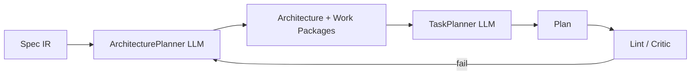
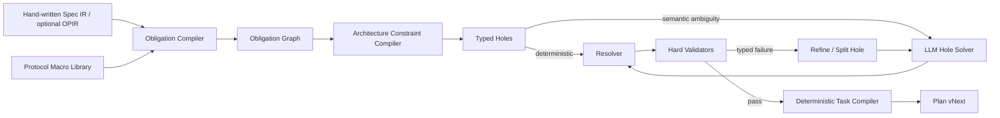
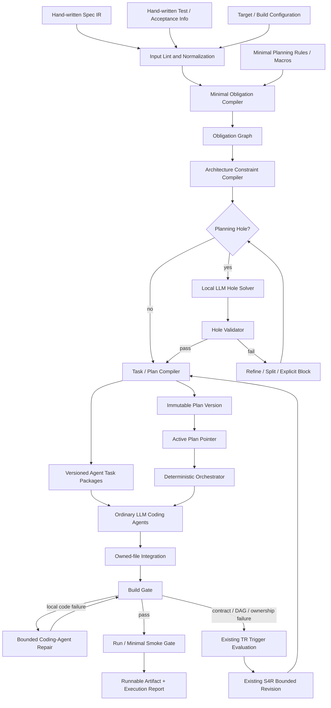

# NePA 重构设计方案：面向代码智能体执行的协议规划编译架构

## 执行摘要与核心判断

结合当前 NePA 主设计文档与 S4～S9 子设计，NePA 已经具备很多值得保留的“系统工程骨架”：确定性 Orchestrator、阶段间工件通信、Spec IR 作为协议事实源、计划版本链、三层冻结、任务级证据、独立测试、受控修复、可恢复执行等。尤其是“LLM 不决定流程走向”“所有协议事实必须经 Spec IR”“执行结果只认机器验证”等原则是正确的，不建议推翻。fileciteturn0file1 fileciteturn0file0

但当前设计中真正造成“必须使用最强规划模型”的瓶颈也非常明确：**S4 虽然在输出之后有大量确定性 lint、Linker 和修订机制，但架构结构、工作包划分、任务分解本身仍主要要求 ArchitecturePlanner / TaskPlanner 从较大的开放搜索空间中一次性“想出来”**。也就是说，现在是：

> LLM 负责搜索一个正确计划 → 机器负责判断这个计划是否合法。

而要降低对 Fable/GPT-6 级“超强规划模型”的依赖，应该反过来变成：

> **机器构造绝大部分合法规划空间与骨架 → LLM 只解决机器无法确定的局部语义绑定 → 机器继续编译、搜索和验证。**

这不是要让几 B 参数模型做 NePA，而是把 DeepSeek、Qwen、Claude 等不同水平的强模型从“全局规划器”降级成**有约束的语义决策器**。这样模型能力差异主要体现为“需要多少次局部细化/候选尝试”，而不是“这个模型到底能不能完成整个任务”。

这里必须明确区分**规划层**与**执行层**。上述“LLM 只解决局部问题”的约束只针对全局规划的产生过程；它不意味着规划完成后还要把全部任务继续机械展开成源代码。NePA 编译并发布的全局计划，主要服务对象仍然是普通 LLM 代码智能体：代码智能体领取边界清晰的任务包，在当前计划版本的接口、依赖、obligation 和验收条件内完成具体实现、构建与局部修复。确定性代码生成可以作为成熟模板上的可选优化，但不是 NePA 的必要执行范式。

这里的“发布”也不等于“从此不可修订”。**不可变的应是每一个已经发布的 Plan Version，而不是运行期间永远不变的 Active Plan。** 执行证据证明局部代码实现失败时，由代码智能体在任务内迭代；证据证明任务分解、契约或架构假设失效时，NePA 通过受约束的修订生成新版本并原子切换。旧版本、失败证据和修订理由保留在追加式版本链中。

当前开发阶段只设一个硬里程碑：

> **以手工编写的 Spec IR、手工测试/验收信息和目标工程配置为输入，经 NePA 产生全局计划与智能体任务包，再由普通代码智能体生成实现，最终得到可编译、可启动或可执行的代码。**

这个里程碑验证的是整条控制通路是否闭合，而不是协议行为是否已经完全正确。RFC→Spec IR 自动提取、测试信息自动生成、协议一致性与测试充分性等问题本轮只保留接口位置，不展开机制设计；待该里程碑完成后再分别讨论。

这一方向有很强的已有研究依据，但其中大量单点思想已经不能再作为 NePA 的创新点：

* ADaPT 已经研究了“执行失败时按需递归分解，并依据模型能力调整任务粒度”；Parsel 已经证明复杂程序生成可以先分解为函数描述，再利用测试搜索组合；LLM+P 已经证明将约束求解交给经典规划器，可以让 LLM 不再独立承担规划正确性；RAP 则证明搜索机制可以使较弱模型在规划任务上超过更强模型的直接 CoT。citeturn22view0turn14academia49turn17view4turn17view5
* 在网络协议领域，SAGE 已经做过 RFC→逻辑形式→代码，RFCNLP 与 PROSPER 已经做过 RFC→状态机，2025 年的 AutoSpec 已经做了 RFC→协议元素→I/O Grammar→确定性测试生成，而 2026 年 AAAI 的 APG 更直接做出了完整的 RFC2Code 系统。citeturn21view0turn19academia35turn19search0turn17view0turn16view0
* 因此，“多智能体”“先规划再编码”“协议 DSL”“RFC 抽取”“FSM 抽取”“形式化中间表示”“确定性测试生成”“失败后递归分解”这些单独拿出来，都已经不足以构成 NePA 的核心科研创新。citeturn16view0turn17view0turn22view0

我认为 NePA 最值得发展的核心机制应改为下面这一组组合设计：

**第一，Evidence-backed Protocol Compilation。**  
长期完整形态可以把 RFC→Code 从“LLM 智能体流水线”重新定义成一条**协议规划编译与智能体执行流水线**；当前 M0-E2E 直接从人工 Fact Spec IR 入口开始：

```text
RFC
 ↓
Evidence Store                 原始证据
 ↓
Fact Spec IR                   RFC 明示事实
 ↓
Operational IR                 可执行语义/状态/动作
 ↓
Protocol Obligation IR         实现义务 + 外部给定的验收约束
 ↓
Protocol Planning Macros
 ↓
Architecture / Task Compiler
 ↓
Agent Task Packages
 ↓
LLM Coding Agents
 ↓
Buildable / Runnable Code
```

规划阶段的 LLM 只是这个编译器中若干“无法用确定规则完成的语义 pass”；当前计划版本发布后，普通代码智能体仍然是代码实现的主要执行者，并依据实时构建、运行和测试反馈在任务边界内持续迭代。版本字节不可变，但执行证据可以触发受控修订并原子激活新版本。

**第二，Protocol Obligation Macros，而不是普通 prompt 模板。**  
协议宏不应该只是“告诉模型 TCP/MQTT 应该怎么设计”的知识提示词，也不应该按协议名写特殊分支；它应该是一套**协议领域的规划编译规则**：

> 当 Spec/Operational IR 中出现某种协议语义形状时，必须产生哪些实现义务、接口契约、依赖、负面路径和验收绑定。

例如，“收到报文 X，在条件 C 下 MUST 回复 Y 并断开连接”不是交给模型自由规划，而是被 `request_response_close` 宏机械展开为：

```text
decode(X)
→ validate(C)
→ construct(Y)
→ send(Y)
→ transition(CLOSED)
```

当前阶段只把手工测试/验收信息绑定到这些义务；未来是否从 obligation 自动派生测试，留到 M0-E2E 完成后讨论。

**第三，Typed Planning Holes。**  
宏无法解决的部分不再退化为“让 ArchitecturePlanner 重新做整个计划”，而是形成有类型的小洞：

```text
STATE_PARTITION hole
ALIAS_RESOLUTION hole
MODULE_PARTITION hole
ACTION_BINDING hole
```

每个洞拥有固定输入、候选空间、验证器以及继续拆分规则。模型失败时缩小洞，而不是重做整个 S4。这是 NePA 将 ADaPT/Parsel 类通用分解机制协议化、编译器化的关键。citeturn22view0turn22view1

**第四，Agent-oriented Plan Execution。**  
规划编译器的产物不是“等待机械展开的伪代码”，而是可由普通代码智能体消费的全局计划和任务包。每个任务包应携带局部上下文、输入/输出契约、依赖、文件或符号所有权、相关 Spec 条目以及外部给定的验收信息。代码智能体可以在这些边界内使用正常的软件工程推理完成实现；NePA 负责跨任务约束、调度、工件传递和机器门禁，不替代代码智能体的局部实现能力。

基于截至 **2026 年 9 月 11 日**检索到的论文和公开仓库，我没有发现一个系统同时实现：

> **RFC 证据链 → 事实 IR → 可验证操作语义 → 协议领域规划宏 → obligation graph → typed planning holes → 全局计划与智能体任务包 → 普通代码智能体执行 → 可构建、可运行并可验证的代码。**

这个“组合”是目前最适合作为 NePA 核心研究贡献的方向。不过这应表述为**基于目前检索范围尚未发现直接等价工作**，而不能草率声称“世界首创”。

我的最终建议可以浓缩成一句话：

> **不要试图训练/提示一个较普通的强模型，使它像最强模型一样“更会规划”；而要让 NePA 本身成为一个协议规划编译器，使模型不再需要完成原来那个那么困难的规划问题。**

## 现有工作、NePA 当前问题与创新边界

当前 NePA 已经明确定位为“规格可形式化的网络协议生成系统”，而非通用 Codex/Claude Code 类编码智能体；长期目标也是 PDF/TXT/HTML 技术文档到客户端、服务端、代理或协议库，当前限定应用层协议。fileciteturn0file1 这个定位非常重要，因为**领域专用性恰恰是降低模型能力需求最大的机会**：通用 Coding Agent 必须搜索任意软件架构，而 NePA 可以把协议工程中的重复结构预编译进系统。

当前 S4 的问题并不是“没有约束”。实际上当前设计已经具有 ArchitecturePlanner→TaskPlanner→Linker→PlanCritic、多层 lint、Plan v5、contract DAG、文件唯一所有权、工作包责任和 Requirement coverage 等相当强的结构约束。fileciteturn0file0 问题是这些机制大部分属于**post-hoc validation**：

```text
        当前
LLM ────────────────> 完整候选计划
                        │
                        ▼
                Schema / Link / Lint
                        │
                 pass / reject / repair
```

validator 可以告诉一个普通模型“你错了”，但并没有替它减少第一次搜索时需要同时处理的变量：

```text
requirements
× messages
× modules
× files
× contracts
× task boundaries
× dependencies
× acceptance gates
× context budgets
```

这就是为什么同一个 prompt 在真正强的模型上可能一次成型，而另一个仍然很强的模型会在某个全局约束上不断犯错。

### 相关研究与仓库调查

下面的表格重点列出与 NePA 最接近、同时会影响“创新性声明”的已有工作。

| 工作 | 已经解决的问题 | 与 NePA 的重合程度 | 对创新声明的影响 |
|---|---|---|---|
| [APG / RFC2Code, AAAI 2026](https://ojs.aaai.org/index.php/AAAI/article/view/37048)；[代码仓库](https://github.com/Assassin187/APG) | RFC Analyst 抽取 Implementation Guidebook，Protocol Coder 生成 C/C++，Reviewer 验证；支持 ICMP、IGMP、NTP、TCP | **极高** | “端到端 RFC→Code”“协议领域知识辅助代码生成”“中间 guidebook”均不能再作为 NePA 的主要创新。APG 报告无状态协议约 95% 编译/行为正确率以及 TCP 90% interoperability。citeturn16view0turn16view1 |
| [SAGE](https://arxiv.org/abs/2010.04801) | CCG + 网络领域词汇将 RFC 转为逻辑形式，再编译成代码；同时发现歧义 | 高 | “协议领域语法/逻辑形式→代码”已有明确先例；NePA 宏不能只是换一种 DSL。citeturn21view0 |
| [RFCNLP](https://arxiv.org/abs/2202.09470) | 技术语言表示→protocol-independent information language→规则映射为 FSM | 高 | “LLM/NLP + 符号规则的混合 RFC→状态机”不是新点。citeturn19academia35 |
| [PROSPER, HotNets 2023](https://doi.org/10.1145/3626111.3628205) | GPT-3.5 + RFC 图示和文本进行状态/转换抽取 | 高 | “利用 RFC 图表/文本做 LLM FSM 抽取”“多模态 RFC artifact grounding”已有研究。citeturn19search0 |
| [AutoSpec 2025](https://arxiv.org/abs/2511.17977)；[artifact](https://github.com/liukuangxiangzi/autofan) | RFC→协议元素→I/O grammar→grammar fuzzer；规格可追踪并用于确定性测试 | **极高** | “RFC→形式化 IR→自动测试”不能作为独立创新；但它没有解决 NePA 的实现规划编译问题。其五协议实验报告客户端报文恢复 92.8%、服务端 80.2%，平均 message acceptance 81.5%。citeturn17view0 |
| [Protocol Testing with I/O Grammars](https://arxiv.org/abs/2509.20308) | 一个协议形式化文法同时承担生成器、mock、oracle，并包含消息、状态和交互 | 高 | “统一协议语法、状态和测试 oracle”本身不是新点。citeturn15academia47 |
| [RFCScope, ASE 2025](https://conf.researchr.org/details/ase-2025/ase-2025-papers/166/RFCScope-Detecting-Logical-Ambiguities-in-Internet-Protocol-Specifications)；[仓库](https://github.com/HIPREL-Group/RFCScope) | RFC 跨文档上下文、逻辑歧义和欠规范检测；发现 31 项新问题，8 项获作者确认、3 项成为 verified errata | 高 | “LLM critic 检查 RFC 逻辑歧义”已有工作；可直接作为 NePA S3 思路来源，而非创新主体。citeturn22view7turn18search1 |
| [SPEC2CODE, ASE 2025](https://doi.org/10.1109/ase63991.2025.00174) | RFC Specification Requirement 与现有实现的函数级映射和一致性检查 | 中高 | REQ→function traceability 已被研究；NePA 可以进一步做到“生成前 obligation→task/function ownership”，但不能单纯宣称需求到代码追踪是新点。citeturn18search13turn22view5 |
| [ADaPT](https://arxiv.org/abs/2311.05772) | 任务失败时按需递归分解，使分解深度适应任务和 executor LLM 能力 | 高 | “弱一些模型失败就继续拆任务”是已有通用技术，不能单独作为 NePA 创新。citeturn22view0 |
| [Parsel](https://arxiv.org/abs/2212.10561)；[仓库](https://github.com/ezelikman/parsel) | 将复杂程序分解成层次化函数描述，分别生成候选，再通过测试搜索组合 | 高 | “把大程序合成为较小程序再验证组合”已有先例。citeturn14academia49 |
| [LLM+P](https://arxiv.org/abs/2304.11477) | LLM 将自然语言翻译为 PDDL，经典规划器搜索正确/最优计划 | 高 | “让符号规划器承担全局约束搜索”不是新思想；NePA 必须体现**网络协议领域特化的规划语言/编译规则**。citeturn17view4 |
| [RAP](https://arxiv.org/abs/2305.14992) | MCTS 搜索 reasoning tree；LLaMA-33B+RAP 在一个计划任务中超过 GPT-4+CoT | 中 | 很直接地支持“机制能够补偿模型能力差距”，但 NePA 不应直接照搬 LLM-as-world-model，应把 reward/world model 换成真实的协议 validator。citeturn17view5 |
| [XGrammar](https://arxiv.org/abs/2411.15100) / Outlines | CFG/JSON 等 constrained decoding，保证输出结构属于指定语言 | 中 | Schema/grammar constrained output 非创新；但它非常适合 NePA 的所有 LLM IR 输出。citeturn22view4turn12academia15 |
| [Kaitai Struct](https://kaitai.io/)；[EverParse](https://github.com/project-everest/everparse)；[P](https://www.microsoft.com/en-us/research/publication/p-safe-asynchronous-event-driven-programming-2/) | 声明式 wire format→parser；形式规格→经证明 parser；状态机 DSL→可执行代码/系统化验证 | 高 | “协议 DSL→代码生成”“状态机→代码”“报文字段 DSL→parser”全部已有成熟先例。NePA 宏必须是**规划层**而不是重新发明 parser DSL。citeturn20view6turn14search6turn20view7 |

另外，早在 2018 年，就已有工作直接从 RFC 文本自动学习协议字段/属性规则并用于 grammar-based fuzzing，说明“RFC 中可提取可复用的协议结构知识”这一基本命题并不新。citeturn20view0

### 因此，哪些东西不应该再被包装成 NePA 创新

从上述文献看，以下说法建议从未来论文“核心贡献”中排除：

| 候选说法 | 结论 |
|---|---|
| 使用 LLM 从 RFC 提取结构化规范 | 已有大量工作 |
| 用一个中间 IR 再生成协议代码 | SAGE/APG 已有 |
| 自动提取 FSM | RFCNLP/PROSPER/FlowFSM 等已有 |
| 使用网络领域知识辅助 LLM | SAGE/APG 已有 |
| 将大任务递归拆成小任务 | ADaPT/Parsel 等已有 |
| verifier 失败后让 LLM 修复 | 大量 LLM+verification 工作已有；例如 VeCoGen。citeturn22view3 |
| JSON Schema / CFG 限制 LLM 输出 | XGrammar/Outlines 等已有 |
| 形式规格生成协议测试 | AutoSpec/I/O Grammar 已有 |
| 声明协议格式然后生成 parser | Kaitai/EverParse 已有 |

相反，**我认为可以继续验证并发展为 NePA 特有贡献的组合**有三个。

第一是 **Protocol Obligation Compiler**：它不是直接编译 wire DSL，而是把 RFC grounded protocol semantics 编译成一个“哪些实现义务必须存在、依赖什么、谁负责、怎样验证”的 planning graph。

第二是 **Protocol Planning Macro + Typed Hole 的能力归一化规划机制**：不是依赖模型自己完成 DAG 设计，而是确定性展开绝大多数协议结构；不同模型只需要解决剩余 hole，能力不足就进一步细化 hole。

第三是 **Agent-oriented Plan Execution**：规划编译器产生的是可被普通代码智能体执行的全局计划与任务包，而不是必须继续机械展开的代码模板；NePA 约束跨任务结构，代码智能体保留任务内的正常实现能力。

截至本次检索，我没有找到直接等价于这三个机制组合的 RFC2Code 系统；APG 是目前最接近 NePA 最终产品目标的工作，但其 Implementation Guidebook、协议类别 prompt 和模块化 Coder 仍高度依赖 LLM 直接完成设计/生成，并没有展示一个“宏规则→obligation graph→typed holes→constraint compiler”的规划编译层。citeturn16view1

## 当前阶段的输入边界与暂缓议题

当前里程碑不从 RFC 原文开始，而把**手工编写并经人工确认的输入工件**视为流水线入口。这里的“可信”只表示 NePA 在本阶段不负责重新抽取或审查它们，不表示这些工件已经完整覆盖协议，也不表示最终实现一定满足协议。

| 输入工件 | 当前来源 | 在端到端通路中的作用 | 本阶段要求 |
|---|---|---|---|
| Spec IR | 手工编写 | 提供消息、字段、约束、需求及实现范围 | Schema/引用可通过输入 lint |
| Test/Acceptance 信息 | 手工编写 | 为任务提供验收条件、已有测试入口、fixture 或 smoke 命令 | 能被任务包引用；已有命令可被统一调用 |
| Target/Build 配置 | 手工编写 | 固定语言、工具链、构建命令、运行入口与产物位置 | 构建和启动结果可被机器判定 |
| 工程骨架与运行环境 | 预置或由早期任务创建 | 为代码智能体提供可编辑工作区 | 能由 Orchestrator 初始化和复用 |

当前阶段的输入输出契约是：

```text
Hand-written Spec IR
        +
Hand-written Test / Acceptance Info
        +
Target / Build Configuration
        ↓
Input Lint
        ↓
Obligation Normalization
        ↓
Planning Compiler
  ├─ deterministic planning rules
  └─ local typed-hole solving when needed
        ↓
Active Immutable Plan Version + Versioned Agent Task Packages
        ↓
Ordinary LLM Coding Agents
        ↓
Build Gate
        ↓
Runnable Artifact / Minimal Smoke Result
```

“可编译”指目标构建命令成功并产生预期产物；“可执行”指产物能够启动、退出或完成预先声明的最小 smoke 行为。二者都只是工程通路门禁，**不是协议一致性证明**。手工测试信息若已包含可执行测试，可以在流水线中调用，但本阶段不要求这些测试完整，也不把全部协议测试通过设为里程碑前提。

为避免同时改变过多变量，以下问题在本轮只保留接口，不展开内部机制：

- RFC/PDF/HTML 到 Spec IR 的自动提取、证据锚定与覆盖率审查；
- Fact Spec IR、OPIR 的自动综合与语义校验；
- Test IR 或 Test Bundle 的自动生成、reference validation 与 mutation adequacy；
- 完整协议行为、互操作性、安全性与一致性测试；
- 多协议泛化、宏复用率和模型能力差异实验。

这些能力未来可以接入同一入口和验收接口，但不得成为当前端到端里程碑的前置依赖。当前首先要证明：**给定人工准备好的规划输入和验收信息，NePA 能否稳定组织代码智能体，把计划实际执行成一个能构建、能运行的工程。**


## 让不同强模型完成高难规划的机制重构

这里是整个报告最重要的部分。

NePA 不应该继续围绕：

```text
如何让 Qwen / DeepSeek 更好地完成 ArchitecturePlanner prompt？
```

优化。

更好的问题是：

```text
S4 中哪些决策真的需要 LLM？
哪些可以通过网络协议的结构先验机械产生？
哪些可以转成约束求解？
哪些可以拆成局部 hole？
```

我建议将当前 S4 从“生成式规划”重构为**Protocol Planning Compiler**。

### 从“生成后验证”改为“编译骨架后填空”（Generate-and-Validate → Compile-and-Fill）

当前：



新设计：



LLM 的输出不再是：

```json
{
  "architecture": {...},
  "work_packages": [...],
  "tasks": [...]
}
```

而可能只是：

```json
{
  "hole_id": "HOLE-state-partition-003",
  "selected_candidate": "candidate_b",
  "bindings": {
    "transition_group_1": "pre_session",
    "transition_group_2": "active"
  }
}
```

这是从根本上降低任务难度。

### 规划编译到任务包为止，代码实现仍由智能体执行

`Compile-and-Fill` 约束的是**全局规划如何产生**，不是要求把最终源代码也全部确定性生成。规划层和执行层应当有两类明确不同的 LLM 调用：

| 角色 | 输入范围 | 允许的决策 | 禁止越界 |
|---|---|---|---|
| Planning Hole Solver | 单个 typed hole、局部 Spec/obligation、候选集合 | 局部语义绑定、局部架构选择 | 重做全局架构、自由改写任务 DAG |
| Coding Agent | 当前计划版本下的任务包、必要上下文、接口与验收条件 | 函数设计、数据结构、局部算法、代码编辑与构建修复 | 未经计划修订改变全局职责、越权修改其他任务所有的文件或接口 |

因此，Planning Compiler 的主要产物不是源代码模板，而是代码智能体可直接消费的 `agent_task_package`：

```yaml
task_uid: TASK-codec-connect
objective: implement CONNECT decode and encode path
owned_files:
  - src/connect_codec.c
allowed_context:
  - spec:message/connect
  - spec:type/utf8_string
requires_contracts:
  - CAP-byte-reader
provides_contracts:
  - CAP-connect-codec
obligations:
  - OBL-decode-connect
  - OBL-encode-connect
acceptance:
  build_command: cmake --build build
  test_refs:
    - TEST-connect-roundtrip
```

正常的代码智能体可以在这个边界内进行完整编码推理，并不只是“填一个代码洞”。全局计划的作用是给它提供充分、稳定、可验证的局部问题，使多个代码智能体的输出可以被安全组合。换言之，NePA 要减少的是**规划模型的开放式全局搜索**，而不是取消代码智能体的实现能力。

### 义务图（Obligation Graph）：规划前先回答“必须实现什么”

以：

> protocol_level != 4 → MUST send CONNACK(0x01) → disconnect

为例，不应让 planner 决定它“应该有哪些任务”。

Obligation Compiler 先生成：

```text
OBL-decode-connect
        │
        ▼
OBL-check-protocol-level
        │
        ▼
OBL-build-reject-connack
        │
        ▼
OBL-send-connack
        │
        ▼
OBL-close-after-send
```

如果手工 acceptance manifest 已提供相应条目，则只做引用绑定：

```text
external TEST-invalid-protocol-level
          │
          ├── observes CONNACK.rc == 1
          └── observes connection closed
```

规划器接下来只需要回答：

> 这些 obligation 应该归在哪些模块/任务中？

而不再回答：

> 这个 RFC 到底应该实现哪些东西？

复杂度会大幅下降。

### 全局约束搜索不再交给模型

Plan 中以下内容都可以变成 constraint：

```text
每个 implementation obligation 恰有一个 primary owner
每个 contract 恰有一个 provider
消费者必须在 provider 之后
task deliverable files 互斥
每个 task 最大 N 个文件
每个 task 最大 obligation weight
每条 MUST/MUST NOT 有 implementation owner
每条纳入当前范围的 requirement 能绑定手工 acceptance reference
任务上下文不得超过预算
state mutation 对象必须存在唯一 ownership
同一 interface symbol 不允许多 provider
```

然后把 module/task partition 建模为约束优化：

\[
\min
  \alpha E_{cross-module}
+ \beta \max TaskComplexity
+ \gamma ContextDuplication
+ \delta NumberOfHoles
\]

subject to：

\[
Coverage=100\%,\quad
ProviderUnique,\quad
DAG,\quad
OwnershipUnique,\quad
ContextBudget
\]

这不一定非要上重型 SMT。最开始完全可以：

```text
rule-based initial placement
        ↓
deterministic graph partition
        ↓
bounded local-search
        ↓
hard lint
```

需要时再引入 CP-SAT/SMT。

LLM+P 的核心结果已经说明：让 LLM 提供形式化问题表示、让经典规划器寻找可行方案，能够明显克服模型独立规划时的可行性问题。NePA 应借鉴这个原则，但领域定义不是 PDDL，而是网络协议 obligation graph。citeturn17view4

### 类型化填空（Typed Hole）：模型真正应该做什么

建议定义一个极小的 hole 类型集合：

| Hole | 模型要解决的问题 | 典型输入 | 确定性 validator |
|---|---|---|---|
| `ENTITY_ALIAS` | 两种名称是不是同一协议实体 | 局部 RFC 证据 | 引用/冲突检查 |
| `STATE_PARTITION` | 一组 transition 应如何归并逻辑状态 | transition 子图 | graph consistency |
| `ACTION_NORMALIZATION` | 自然语言动作对应哪个 OPIR action | 单条 requirement | type/action schema |
| `MACRO_BINDING` | 多个合法宏哪个最符合语义 | facts + candidates | macro preconditions |
| `MODULE_PARTITION` | 两组 obligation 是否应共模块 | 局部 obligation graph | coupling/ownership |
| `IMPLEMENTATION_CHOICE` | 某行为该采用哪种合法实现策略 | 单个 task | build/test |
| `AMBIGUITY_DECISION` | RFC 多解释中的候选关系 | 原文证据 | 只能得到 contested/accepted，不能伪造唯一真值 |

注意这里没有：

```text
FULL_ARCHITECTURE
FULL_TASK_DAG
FULL_IMPLEMENTATION_PLAN
```

这样的 hole。

### 按模型能力自适应粒度

模型失败时不再“换旗舰模型”作为第一动作，而是：

```text
hole(scope = 12 transitions)
        │ fail
        ▼
split by message family
       / \
   5 transitions   7 transitions
                     │ fail
                     ▼
              split by normative req
                /            \
              3                4
```

其算法可写成：

```python
def solve_hole(hole, model, budget):
    deterministic = try_deterministic_resolver(hole)
    if deterministic.valid:
        return deterministic

    for candidate in model_candidates(hole, n=2):
        result = validate(candidate, hole)
        if result.ok:
            return candidate

    if can_refine(hole) and budget.refine_left:
        children = domain_specific_split(hole)
        solved = [solve_hole(c, model, budget) for c in children]
        return compose_and_validate(solved)

    return unresolved(hole)
```

ADaPT 已经证明“按失败情况和 executor 能力递归分解”这一通用策略有效，所以 NePA 的创新应放在 `domain_specific_split()`、typed hole 和 protocol validators，而不是“递归分解”本身。citeturn22view0

### 多候选（N-best）不应该变成“多智能体投票”

对于少数高影响 hole，可以一次生成 2～3 个 candidate：

```text
candidate A
candidate B
candidate C
    │
    ▼
hard constraints
    │
    ▼
domain scoring
    │
    ▼
唯一有效 / 最低 cost
```

而不是：

```text
三个 Agent 说 A
两个 Agent 说 B
→ A 赢
```

模型之间可能存在高度相关错误；机器约束才应该是最终筛选器。

RAP 和 Parsel 都说明“生成候选 + 搜索/验证组合”可以明显优于单次直接生成；NePA 的优势是 validator 不必由另一个 LLM 模拟，而可以大量使用真实 Schema、graph、compiler、test 和 protocol invariants。citeturn17view5turn14academia49

### 计划审查器（PlanCritic）的角色应该下降

当前 PlanCritic 是重要 S4 角色。新系统中建议把它从：

```text
“判断计划对不对”
```

降级为：

```text
“发现 hard validators 尚未编码的语义异常”
```

也就是说：

```text
Hard truth:
Schema
graph
ownership
macro invariant
coverage
compiler
tests

Soft anomaly:
PlanCritic
```

这样一个模型即使 Critic 水平稍弱，也不会决定系统 correctness。

### 原有 S4/S4R 中值得保留的机制

这一重构并不意味着整个现有设计无价值。建议保留：

| 当前机制 | 处理 |
|---|---|
| 确定性 Orchestrator | **保留** |
| 无状态 Agent 调用 | **保留** |
| Plan 版本不可变 | **保留；明确为不可原地修改，而不是 active plan 永远不变** |
| Plan State 与 Plan 分离 | **保留** |
| task_uid / obligation digest | **保留并增强** |
| file ledger | **保留** |
| L-C/L-A/L-P 分层冻结 | **概念保留，但冻结对象调整为 Commitment / Obligation Graph / Physical Plan** |
| F0～F5 修复思想 | **保留，但 F2/F3 应优先回退到 macro/hole，而非让模型自由改 Plan** |
| ArchitecturePlanner | **大幅缩小甚至删除** |
| TaskPlanner | **目标上应删除，变成 Task Compiler** |
| PlanCritic | **保留为软 semantic critic** |
| 固定 T1/T2/T3 能力依赖 | **改为 role capability requirements + empirical routing** |

换句话说，应该保留 NePA 已经投入很多设计精力解决的**事务性、可恢复性和验证性机制**，但可以彻底重写“计划是怎样产生出来的”。

## 协议规划宏的具体设计草案

协议规划宏是这个重构中最值得做成 NePA 专属机制的部分。

关键是先界定它**不是什么**。

它不是：

```text
MQTT 宏
HTTP 宏
SMTP 宏
```

也不是：

```text
“你是一名网络协议专家，请考虑状态机、字节序……”
```

也不是另一套 Kaitai/P/EverParse，因为这些系统已经能够从声明式数据/状态表示生成 parser 或状态机代码。citeturn20view6turn20view7turn14search6

它应该是：

> **协议语义形状 → 实现义务、依赖、契约、验收绑定与验证规则**的参数化编译模板。

因此宏按**protocol capability** 匹配，而不是 protocol name。

### 宏文件建议格式

建议使用 YAML 作为人类维护格式，编译为 canonical JSON；宏本身属于 NePA 源码资产，不由运行时 LLM 任意生成。

```yaml
macro_version: "1.0"

id: interaction.reject_then_close
kind: interaction

parameters:
  trigger_message:
    type: message_ref

  guard:
    type: predicate_ref

  response_message:
    type: message_ref

  response_assignments:
    type: field_assignment_set

match:
  all:
    - exists: "$trigger_message"
    - exists: "$response_message"
    - opir_pattern:
        sequence:
          - receive: "$trigger_message"
          - guard: "$guard"
          - send: "$response_message"
          - close_transport: true

preconditions:
  - "receiver($trigger_message) intersects target.roles"
  - "all_fields_resolved($response_assignments)"
  - "guard_is_typed($guard)"

emit:
  implementation_obligations:

    - local_id: validate-trigger
      kind: validation
      requires:
        - "decoded($trigger_message)"
      covers:
        - "$matched_requirements"
      capability: message_validation

    - local_id: build-response
      kind: response_construct
      after:
        - validate-trigger
      capability: message_encode

    - local_id: send-response
      kind: transport_send
      after:
        - build-response

    - local_id: close-after-send
      kind: lifecycle
      after:
        - send-response
      invariant:
        - "close occurs after attempted response send"

  acceptance_bindings:
    - requirements: "$matched_requirements"
      from: external_acceptance_manifest
      optional: true

architecture_hints:
  preferred_owner_capability: session_logic
  co_locate:
    - validate-trigger
    - close-after-send

verification:
  hard:
    - all_obligations_have_req_lineage
    - response_fields_exist
    - dependency_graph_acyclic
    - unique_state_mutator

fallback:
  missing_precondition: block
```

宏有五个真正重要的语义部分：

```text
match          什么协议语义形状激活它
preconditions  什么时候它合法
emit           必须产生什么 obligations
invariants     展开后必须永远成立什么
verification   系统怎样机器判定展开是否合法
```

其中自然语言只能用于人类说明，不能是宏真正的控制语义。

### 宏的中间产物不是代码，而是 Obligation IR

宏展开：

```text
Hand-written Spec IR / optional OPIR
    +
Macro
    ↓
Obligation Graph
```

例如：

```json
{
  "id": "OBL-3a24",
  "kind": "message_validation",
  "origin": {
    "macro": "interaction.reject_then_close",
    "instance": "MI-0007"
  },
  "req_ids": ["REQ-CONNECT-002"],
  "context_refs": [
    "message:connect",
    "message:connack"
  ],
  "requires": [
    "OBL-decode-connect"
  ],
  "provides": [
    "CAP-connect-validated"
  ],
  "verification": [
    "TEST-invalid-level"
  ]
}
```

之后才由 Architecture Compiler 把 obligation 放入：

```text
module
→ contract
→ file
→ task
```

这层分离非常重要：

> **协议语义决定 obligation，软件架构决定 obligation 放哪里。**

不能让宏直接写死：

```text
src/mqtt_connection.c
```

否则宏库最后只会变成另一种 protocol-specific handwritten implementation。

### 初始宏库建议

M0～M4 阶段不用贪多。我建议第一版只实现以下协议无关宏：

| Macro family | 匹配语义 | 产生的主要义务 |
|---|---|---|
| `wire.message_codec` | message + ordered fields | decode、encode、constraint validation |
| `wire.derived_length` | `derived:length_of` | 长度计算、bounds validation |
| `interaction.request_response` | receive A → send B | handler、response construction、action ordering |
| `interaction.reject_then_close` | invalid A → send B → close | validation、ordered action、lifecycle |
| `session.transition` | trigger + guard + state update | state ownership、transition handler |
| `session.first_message` | 某消息必须首先出现 | pre-session state/guard |
| `timer.timeout_transition` | timer expiry→action/state | timer lifecycle、expiration callback |
| `correlation.echo_field` | response field derived from request | data-flow contract |
| `collection.repeat` | repeated sequence/list | bounded loop/parser |
| `negotiation.parameter` | peer proposes/selects capability/value | negotiation state、legal/illegal value handling |

第一阶段针对 MQTT minimal，大概率只需要其中 4～6 个。

未来做 HTTP/SMTP/IMAP 等应用层协议时，再看真实遇到的新 capability：

```text
pipeline ordering
multiline response
command mode
authentication phase
transaction correlation
stream body
multiplexing
```

只有当至少两个协议重复出现某种规划模式时，才将其上升为通用 macro。

这样可以避免宏库退化成：

```text
if protocol == mqtt
if protocol == smtp
...
```

### 线格式规划应尽量机械化，代码生成保持可选

Wire format 的重复结构非常适合减少**规划阶段**的自由度。对于当前 Spec IR 能完整表达的：

```text
uint8 / uint16_be / uint32_be
bitfield / varint
length_prefixed_string
sequence / repeat
const / min / max
length_of / presence
```

NePA 应当能够确定性地产生 codec 所需的类型约束、读写顺序、边界检查 obligation、文件 ownership、依赖和验收条件。这样，规划模型不必重新发明 parser 的任务分解。

这不要求 NePA 必须直接生成 C99 codec。默认路径仍然可以是：

```text
Spec IR
  ↓
deterministic codec obligations
  ↓
codec agent task package
  ↓
ordinary coding agent
  ↓
source code + build result
```

当某类声明已经稳定到值得模板化时，可以增加可选的 `Mechanical Code Generator` 来产生声明、样板或 skeleton；生成结果仍作为代码智能体任务的初始工作区，并接受同一构建门禁。Kaitai Struct 和 EverParse 说明声明式格式到代码具有成熟先例，但这属于可复用的实现优化，不应被误写成 NePA 当前架构成立的必要条件。citeturn20view6turn14search0

### 状态宏不要偷偷污染 Fact Spec IR

例如 MQTT 的 requirement：

```text
第二个 CONNECT 是协议错误
```

规划宏可能生成：

```text
state = WAIT_CONNECT
state = ACTIVE
```

但这两个状态是 NePA 的实现抽象，而非 RFC 原始事实。

因此宏实例需要明确：

```json
{
  "introduced_symbols": [{
    "kind": "implementation_state",
    "name": "pre_session",
    "derived_from": [
      "REQ-CONNECT-..."
    ]
  }]
}
```

这样未来发现状态划分不好时，可以替换规划表示，而不会篡改 Spec。

### 核心是宏组合，而不是宏数量

假设某 requirement 同时匹配：

```text
session.transition
+
interaction.request_response
+
interaction.reject_then_close
```

不能简单生成三套 handler。

Compiler 应进行 obligation unification：

```text
same trigger
same guard
same state owner
    ↓
merge compatible obligations
```

基本规则建议包括：

```text
Unique Provider
    每个 capability/contract 只能有一个 primary provider。

Requirement Primary Ownership
    每条 normative requirement 恰有一个 primary implementation obligation。

State Mutation Ownership
    同一 session state 只能由一个 logical owner 修改。

Action Ordering
    RFC 显式顺序要求转换为 partial-order edge。

No Hidden Semantics
    一个宏只能使用 match 中已经绑定的 Spec IR 或可选 OPIR 信息。

Evidence Closure
    每个宏实例必须能够追溯到至少一个 requirement/evidence。

No Protocol Constants
    宏不得含 MQTT=1、HTTP=GET 等协议特定常量。
```

### 从宏到智能体执行任务的转换边界

规划宏的确定性终点应是 obligation、architecture constraint 和 agent task package，而不是强制生成源代码。建议把转换边界分成三类：

```text
规划结构完全确定
→ Deterministic Task Compiler
→ Coding Agent Task

规划结构确定、存在局部语义歧义
→ Typed Planning Hole
→ Deterministic Task Compiler
→ Coding Agent Task

任务内实现方式开放
→ 普通 Coding Agent
  但 interface / ownership / obligations / acceptance 已冻结
```

| 内容 | 规划如何确定 | 默认代码执行者 | 可选优化 |
|---|---|---|---|
| C enum/type/field | Spec/规则机械确定 | 代码智能体 | 模板生成声明 |
| endian conversion | obligation 机械确定 | 代码智能体 | 生成 helper/skeleton |
| fixed constant / length bounds | 校验义务机械确定 | 代码智能体 | 生成样板检查 |
| parser dispatch | 依赖与分支骨架可机械规划 | 代码智能体 | 生成 dispatch skeleton |
| state enum/switch | 状态 ownership 和 transition obligation 机械规划或经局部 hole 确定 | 代码智能体 | 生成 switch skeleton |
| RFC 指定的固定响应字段 | 数据约束机械进入任务包 | 代码智能体 | 生成赋值样板 |
| application callback | 局部任务内设计 | 代码智能体 | 无 |
| 跨 requirement 的复杂 semantic action | 先解决 planning hole，再封存任务边界 | 代码智能体 | 无 |

这种划分仍然体现“把领域知识融合进框架，而不是只融合进 prompt”，但领域知识首先约束的是**计划与任务契约**。是否进一步生成机械代码，应由复用收益、模板稳定性和维护成本决定，不能成为端到端通路的硬依赖。

### 宏本身如何演进

建议增加 `macro_lint`：

```text
macro schema valid
match expression type valid
所有 parameter 有绑定
所有 emitted variable 有来源
禁止 protocol name
禁止 protocol-specific constant
obligation dependency DAG
hard invariant 可执行
外部 acceptance reference 可解析
```

另外给每个宏维护 fixtures：

```text
positive fixture
negative fixture
composition fixture
```

例如 `reject_then_close` 至少在两个不同 protocol-like synthetic spec 上能展开。

这会使 protocol knowledge 成为**版本控制、可测试的软件资产**，而不是散落在 prompt 里的经验。

## 当前里程碑的端到端 NePA 架构

本阶段不以完整 RFC→Code 为入口，而先建立 Hand-written IR→Runnable Code 的最短闭环。任何不服务于这条纵向切片的自动化都不应成为前置条件。



这条架构中存在三个不同的确定性边界：

1. **Planning boundary**：Obligation Graph、全局 ownership、依赖和 task DAG 由规划编译器产生；LLM 只能解决显式 typed hole。每个发布版本不可原地改写，但 active plan 可以经受控修订指向新版本。
2. **Execution boundary**：当前计划版本发布后，普通代码智能体在任务包内部拥有正常的编码自由，并根据实时代码反馈反复实现和修复；未经计划修订不得改变全局契约和其他任务的文件。
3. **Acceptance boundary**：Orchestrator 只以输入 lint、任务产物、build 退出码、目标文件和最小运行结果判定当前里程碑是否完成。

当前失败回路只要求区分两类：

```text
任务内代码或构建失败
→ 原任务包内的 coding-agent repair

任务契约、依赖或 ownership 不可实现
→ 回退到对应 planning hole / planning rule
```

Spec 抽取错误、测试语义错误和协议一致性失败尚不进入当前闭环，因为本阶段的 Spec/Test 信息是人工输入，其质量研究被明确延期。这样可以先判断 NePA 是否已经具备最基本的工程能力：**规划能够被真实代码智能体消费，代码智能体能够根据反馈迭代，跨任务假设失效时计划能够留下证据并受控演进，多个任务最终形成可构建、可运行的产物。**

## 计划正确性、版本化修订与形式化保证边界

### 核心结论：不可变的是版本，不是计划假设

当前报告若把 Planning Compiler 编译出的计划理解为“一经发布、整个 run 永不改变的工件”，确实会重新引入原设计已经识别的问题：系统只能希望第一次规划正确，随后所有执行失败都被迫解释为代码智能体没有执行好。这不符合 NePA 作为代码生成智能体的本质，也不符合成熟代码智能体的工作方式。

OpenAI 的 ExecPlan 设计把计划明确视为会随进展、发现和决策更新的 living document，并要求记录进度、意外、决策与可观察的验证结果；该页面目前被标注为归档示例，因此这里只把它作为 Codex 早期设计取向的直接证据，而不是当前产品行为规范。[^1] Anthropic 的官方 agent skill 指南同样强调“validator → fix errors → repeat”的反馈循环，并建议根据任务脆弱程度调整自由度。[^2] 两者共同说明：**计划为执行提供方向和约束，但执行反馈仍然是新的规划证据。**

NePA 不宜照搬自由修改 Markdown 计划的做法。它需要可恢复、可审计、可比较的无人值守运行，因此更合适的定义是：

> **Plan Version 是不可变工件；Active Plan 是可演进状态。修订不覆盖旧计划，而是产生新版本、通过门禁后原子激活。**

这实际上也是原始 S4/S4R 设计中“三层冻结 + 版本链 + F0～F5 修补”的正确含义：冻结是版本级和层级化的，不是把一次规划假设永久提升为真理。当前重构应保留这一语义，只把自由的 PlanReviser 收紧为由 planning rule、typed hole 和闭集 patch operator 驱动的修订编译器。

### 三个不能混淆的“正确性”命题

“计划是否正确”至少包含三种强度完全不同的命题：

| 命题 | 当前能否保证 | 合理的证据 |
|---|---|---|
| 计划结构合法 | **可以做成机器保证** | Schema、引用闭合、DAG 无环、ownership 唯一、obligation 不丢失、预算与接口类型检查 |
| 计划相对给定 Spec IR 可行且充分 | **只能在形式化模型覆盖范围内保证** | 规划模型验证、约束求解、模型检查、可检查证书；模型外假设仍不受保证 |
| 代码项目满足真实协议意图 | **不能由计划正确性直接推出** | 编译/运行、测试、互操作、运行时观测；若要定理级保证，还需形式语义与实现精化证明 |

经典规划中的 VAL 可以验证一个具体计划是否满足给定 PDDL domain/problem，但这种结论始终是“相对于输入模型有效”，并不证明输入模型完整表达了现实需求。[^3] 同理，即使 NePA 能证明 Plan 覆盖了手工 Spec IR，也不能证明这份手工 IR 没有漏掉 RFC 要求，更不能自动推出一个普通代码智能体生成的 C/C++/Rust 项目实现正确。

编译器形式验证也展示了同一边界。CompCert 的定理保证目标程序保持源程序的可观察行为，但“源程序本身满足用户想要的规格”仍需单独建立。[^4] 分布式系统的端到端证明（如 IronFleet）必须同时定义抽象状态机、实现语义和二者之间的精化关系；这远超“证明一个任务 DAG 合法”。[^5] seL4 对其验证假设的公开说明进一步表明，强形式化结论也依赖明确列出的硬件、启动代码和环境假设。[^6]

因此，当前报告不应承诺“数学上证明计划一定正确”或“按计划生成的项目一定正确”。它应准确承诺：

1. 计划编译器保证一组明确、可检查的结构与覆盖不变量；
2. 每次修订不削弱已声明 obligation，并保留从旧版本到新版本的映射；
3. 构建、运行和测试产生反例式证据，系统把证据路由到最小失效层；
4. 更强的语义或代码证明只在未来具备形式化 Spec/OPIR 和可验证实现后端时追加。

### 先审计旧修补机制：结论是总体可用

在提出任何新修补机制之前，应先以历史文档 `pipeline_design_s4_s9.md` 为基线检查它能否承载新的规划编译器。该文档已由 System Design 9.0 取代，可从 Git 基线恢复，删除记录见 `../refactor_deletions.json`。逐项审计后，没有发现需要推翻旧修补架构的原则性冲突：**新方案改变的是初始 Plan 的产生方式，不是运行期修订所要解决的事务问题。**

| 旧机制 | 与新架构的兼容性 | 结论与处理 |
|---|---|---|
| L-C / L-A / L-P 三层冻结 | 新架构仍有承诺、架构和任务分解三个不同代价层 | **直接保留**；只补充 Obligation Graph 与 macro/hole binding 的层归属 |
| 不可变 Plan Version + active pointer | 正好解决“历史可审计”与“运行中可调整”的表面冲突 | **原样保留** |
| C.A.P 版本与 architecture epoch | Planning Compiler 仍会输出架构和 task DAG，F3 后仍需重物化 | **原样保留** |
| stable task uid、义务血缘、file ledger、失效闭包 | 新架构同样必须保留已有代码并机械计算受影响范围 | **直接保留，且比重新生成任务更重要** |
| TR-1～TR-9 机器触发 | 触发思想正确，但部分谓词依赖完整 Test Bundle、S7/S8 或旧阶段字段 | **机制保留，按里程碑启用子集**；没有证据的触发继续 record-only |
| F1 repair lease | 可处理代码智能体实际执行时的小范围邻接文件协同 | **可用但非 M0 必需**；需要联合验收时再启用 |
| F2/F3 闭集 patch operators | 与“LLM 不自由重写完整计划”完全一致 | **直接保留**；patch 仍作用于编译后的 Plan IR |
| PlanReviser 输入局部切片、输出 typed patch | 已经限制了上下文和动作空间，并未要求重新生成整份 Plan | **可用**；typed hole solver 可以作为它提出某些 patch 的内部能力，不必替换其外部契约 |
| RG-1～RG-5：触发、不变量、预算、Critic、预演 | 覆盖了候选修订发布前的主要风险 | **直接保留**；Critic 仍只是软门，不取代机器验收 |
| WAL + 原子激活 + append-only ledger | 新旧计划并存时不可缺少 | **原样保留** |
| 额度、签名去重、熔断、受控降级 | 防止修订成为无限循环或卸责出口 | **原样保留** |
| F4/F5 留在 run 外 | 防止模块改轴或承诺重协商在执行期无限扩张 | **原样保留** |

这里的“总体可用”需要分三层理解：架构上，它已经解决了本轮提出的问题；接口上，它足够具体，可以与新 Planning Compiler 对接；但生产效果尚未被证明，尤其是 TR 阈值、自然失败上的触发精确率、PlanReviser 成功率、迁移成本和 F3 重入可靠性仍需按旧文档既定的 M1-13～M1-15 校准。换言之，**旧机制应作为默认实现继续验证，而不是被判为无效；“可复用”不等于“已经具备生产启用证据”。**

因此，本轮不应创造另一套 `Evidence Classifier / Revision Compiler / Plan Certificate` 协议去与旧 S4R 并存。报告前文使用这些名称时，应把它们理解为旧机制已有职责的概念描述：failure classifier 对应 TR 触发评估，revision compiler 对应 S4R，certificate 对应现有 lint、binding receipt、迁移映射和 revision ledger 的可检查证据。若实现时需要新增字段，应扩展原有工件 Schema，不另建平行真值源。

旧机制需要的只是三项适配，而不是重设计：

1. **层映射适配**：L-C 固定人工 Spec/Test/Build 输入及其 obligation commitment；L-A 保存模块、合同、文件槽、工作包和 macro/hole 的已选架构绑定；L-P 保存任务、DAG、ownership 细分、上下文与验收引用。
2. **提案入口适配**：F2/F3 仍输出旧设计定义的闭集 patch ops；当 patch 需要重新做局部语义选择时，S4R 才重新打开对应 typed hole，而不是调用 ArchitecturePlanner/TaskPlanner 重做全局计划。
3. **里程碑适配**：M0 只使用当前能产生机器证据的触发和门。依赖协议级测试或 S7/S8 归因的 TR-5/TR-9 继续关闭，不为打通纵向链路提前发明替代触发。

### 为什么旧机制仍然需要被保留

计划修补不是对规划编译器“不够可靠”的补丁，而是处理**信息在执行后才出现**这一事实。计划依赖抽象模型；真实执行会暴露工具链限制、库 API 差异、隐藏耦合、上下文不足、任务粒度不合适和接口无法落地。规划研究长期区分从头 replanning 与尽量保留旧计划的 repair：Fox 等人把稳定性定义为保留原计划的价值，Saetti 与 Scala 又展示了可通过 compilation 把“最小偏离旧计划”变成优化目标。[^7][^8] 这与 NePA 旧机制的代码保全、局部失效闭包和成本预算目标直接一致。

旧机制的分层边界应保持如下，而不是另起一套命名：

| 层级 | 典型证据 | 允许动作 | 是否产生新 Plan Version |
|---|---|---|---|
| F0：任务内编码迭代 | 编译错误、局部单测失败、静态检查问题 | Coding Agent 在 owned files 内编辑、重试 | 否 |
| F1：局部接口协同 | 相邻任务接口的小型不匹配，且 obligation/ownership 不变 | 临时 repair lease、更新局部实现与适配器 | 通常否；若任务包契约变更则是 |
| F2：任务分解修订 | task 过大、缺少依赖、顺序错误、上下文超限 | `split_task`、`insert_task`、`rewrite_instruction`、`reorder_dependency` | 是，递增 P 层版本 |
| F3：架构修订 | 合同不可实现、文件/模块边界错误、职责需要跨 work package 移动 | `extend_contract`、`add_file_slot`、`move_responsibility`、重新打开相关 typed hole | 是，递增 A 层并重新物化受影响任务 |
| F4：架构改轴 | 现有模块轴无法承载实现，需要新增/重构模块级边界 | 保存诊断并停止受影响路径，由新 run 重做架构承诺 | 不属于 run 内修补 |
| F5：承诺重协商 | Spec/Test/Build 输入矛盾、obligation 本身错误或范围改变 | 停止当前 run，人工修订冻结输入并创建新 run | 不属于 run 内修补 |

旧设计已经没有允许自由重写完整计划的 LLM PlanReviser；它接收机器证据、活动计划切片、允许算子和剩余预算，只能输出候选 patch。因此应直接沿用旧链路：

```text
machine evidence
→ existing TR trigger evaluation
→ smallest invalidated layer
→ existing PlanReviser closed patch operators
→ reopen a typed hole only when the patch needs a local semantic choice
→ existing RG-1...RG-5 gates and impact rehearsal
→ append-only Plan Version
→ atomic active-plan switch
→ rematerialize only affected task packages
```

旧设计对触发与 patch 的限制已经满足这一要求：触发来自退出码、诊断日志、所有权冲突、依赖缺失、契约检查失败或上下文预算超限，而不能只因为某个智能体声称“计划错了”；RG-2/3/5 已检查 obligation 映射、覆盖与验收不弱化、影响闭包、预算和预演。这里的结论是**复用并验证旧实现**，不是重新定义一遍后再另行开发。

### 选择性形式化，而不是一次性证明全部系统

数学方法值得加入，但应采用“证明窄核心、检查每次产物、验证边界清晰”的路线：

| 保证等级 | 可声明内容 | M0-E2E 是否需要 |
|---|---|---|
| A0 Well-formed | IR/Plan/Task Package 符合 Schema，引用可解析 | **需要** |
| A1 Structural soundness | DAG、ownership、obligation coverage、patch 单调性满足不变量 | **需要** |
| A2 Abstract feasibility | 计划在给定抽象操作语义和资源模型下可执行 | 可选，先为接口留位 |
| A3 Engineering executability | 代码可集成、构建并完成最小运行 | **M0 的核心** |
| A4 Behavioral conformance | 通过协议级测试、互操作与错误路径验证 | M0 后讨论 |
| A5 Formal refinement | 实现被证明精化形式化协议规格 | 仅面向未来高保证后端 |

A0/A1 最适合由确定性 validator 或独立 checker 完成，而旧机制已经通过 full lint、INV-1/2/3、RG-2、binding receipt、迁移映射和 revision ledger 保存这些证据。工程上应先验证并复用这些现有工件；除非实际实现证明它们无法表达某项检查结果，否则不新增 `plan_certificate.json` 之类的平行证书。这里的“可检查证据”不宣称已经证明协议语义或源代码正确。

A2 只有在操作语义、前置/后置条件和环境模型足够形式化后才有意义；A5 更要求受控语言、验证条件生成器或实现精化框架。将这些要求提前强加给普通代码智能体，会实质上把 NePA 变成一个验证编译器项目，并阻断当前最重要的 M0-E2E。因此不建议在当前里程碑引入全计划定理证明，更不建议把“证明成功”设为代码生成前置门禁。

### M0-E2E 对旧修补机制的最小接入范围

M0 不需要重新实现原始 F0～F5，也不应把完整 F2/F3 自动修订变成 Hand-written IR→Runnable Code 的前置阻塞。应把范围分成两层：

**M0-core 必须真实运行：**

1. 复用 `PlanVersion(C, A, P)`、不可变版本存储、`active_plan`、binding/receipt 和 ledger 的既有契约；初始版本即使没有修订也按 `1.0.0/E0` 发布。
2. 复用 Coding Agent 的 F0 反馈循环：编辑 → build/check → 读取诊断 → 再编辑，并执行既有重试与总预算约束。这就是 Codex/Claude Code 式实时反馈在任务内的主要落点。
3. 失败分类输出必须能区分 implementation failure 与 plan/contract evidence；后者在 F2/F3 尚未启用时可以受控停止，但不得伪装成 Coding Agent 失败。
4. 初始计划和任何已激活修订均复用现有 full lint、INV 与 receipt 校验；不引入第二套 checker 真值。

**M0-core 后用固定 fixture 验证、但暂不生产启用：**

1. 选一个旧机制已支持的 F2 操作（优先 `split_task` 或 `rewrite_instructions`），注入可重算触发，验证候选 → RG 门 → 原子激活 → 状态迁移 → 受影响任务重验的完整路径。
2. F3 只验证旧设计的 epoch/S5 重入接口和受控退出；在真实样本与 PlanReviser 校准不足时维持生产额度 0，沿用旧文档的启用纪律。
3. TR-5/TR-9 等依赖后续协议测试或模型结构归因的触发继续 record-only。

M0 的通过条件仍然只是 Hand-written IR→Runnable Code 通路闭合。一次运行在设计上可以经历多个不可变计划版本，但 M0-core 不要求自然发生一次计划修订；“无需人工修改中间工件”也不应被误写成“系统不得修订计划”。当前真正必须验证的是：**普通代码智能体能否依据实时代码反馈完成 F0 迭代，并最终得到可构建、可运行产物；旧 F2/F3 通路则以兼容性 fixture 证明没有被新 Planning Compiler 破坏。**

### 对当前 S4 的具体替换建议

现有：

```text
S4a commitment
S4b ArchitecturePlanner
S4c TaskPlanner
Linker
PlanCritic
```

建议改成：

```text
S4a Scope / Delivery Commitment Compiler
    保留

S4b Obligation Compilation
    hand-written Spec + acceptance info + minimal planning rules
    → Obligation Graph

S4c Architecture Constraint Synthesis
    obligation placement
    module roles
    contracts
    typed holes
    candidate search

S4d Hole Resolution
    only if necessary
    model-assisted

S4e Task Compilation
    deterministic
    → tasks / DAG / coverage / acceptance

S4f Semantic Critic
    optional soft critic

Publish Immutable Plan Version

S4R Evidence-guided Revision Compiler
    deterministic failure trigger
    closed patch operator or reopened typed hole
    invariant checks + impact rehearsal
    → publish and atomically activate next Plan Version
```

其中 **TaskPlanner 作为自由生成完整任务 DAG 的规划角色最终应当消失**，但 S4R 作为受约束、证据驱动的版本修订通路必须保留。

这里删除的是开放式 TaskPlanner，不是 Coding Agent。S4 输出的任务仍将由一个或多个普通代码智能体执行；它们可以完成完整的文件编辑、实现选择、构建和局部修复。这是整个重构中必须保持清晰的系统边界。

### 模型通用层也应随之改变

当前 T1/T2/T3 是：

```text
T1 = 最强规划
T2 = 经济编码
T3 = 辅助
```

未来建议改成能力需求：

```yaml
roles:

  planning_hole_solver:
    requires:
      structured_output: true
      semantic_level: high
      candidate_selection: true
      scope_bounded: true

  module_partition_hole:
    requires:
      semantic_level: medium

  coding_task_executor:
    requires:
      code_edit: strong
      build_tool_use: true
      task_contract_following: true
```

再通过离线 probe 建立模型 profile：

```json
{
  "model": "provider/foo",
  "capabilities": {
    "state_partition": 0.73,
    "module_partition": 0.84,
    "c99_task_execution": 0.91,
    "build_repair": 0.89
  }
}
```

运行时仍可以静态绑定模型以保证实验复现，但框架不再假定：

```text
ArchitecturePlanner 必须 = 世界最强模型
```

而是：

```text
这个模型对于当前最大 hole 粒度是否合格？
```

如果不合格：

```text
先 split hole
```

再考虑模型升级。

这更符合 NePA 所需要的“模型通用”，而不是追求“弱模型也能做”。

### 当前唯一实现里程碑：Hand-written IR→Runnable Code

近期开发不再拆成“先单独做 Obligation IR、再单独做宏、再比较规划模型”等多个彼此独立的研究项目，而采用一个纵向里程碑：

> **M0-E2E：NePA 能从一组固定的手工 Spec IR、手工 Test/Acceptance 信息和构建配置出发，自动完成规划、任务派发、代码智能体执行、集成、构建和最小运行，产出可复现的执行报告。**

#### 固定输入

- 一个已人工裁剪范围的协议 Spec IR；
- 一个手工测试/验收 manifest，至少能表达 test 引用、fixture、build 命令和最小运行命令；
- 固定的目标语言、工具链与依赖；
- 一个空工程或最小工程骨架；
- 固定的 Coding Agent 配置。

#### 必须产物

| 产物 | 最低要求 |
|---|---|
| normalized input snapshot | 能重放同一次运行 |
| obligation graph | 覆盖本次手工 Spec 声明的实现范围 |
| active plan version + version history | 每个版本不可变，包含 ownership、依赖、task DAG、验收引用、parent 与修订证据 |
| versioned agent task packages | 每个任务可被普通代码智能体独立消费，并能追溯所属计划版本 |
| integrated source tree | 所有任务产物按 ownership 汇合 |
| build artifact | 目标构建命令成功产生 |
| run/smoke evidence | 可执行产物能够启动或完成最小 smoke 动作 |
| execution report | 记录任务、模型调用、修改文件、构建结果和失败回路 |

#### 通过条件

1. 从固定输入启动后，流程无需人工改写中间 Plan、任务包或源代码；系统允许依据机器证据自动生成并激活受控的新 Plan Version；
2. 至少一个真实 Coding Agent 调用根据任务包完成代码编辑，而不是由预置答案替代；
3. task DAG 能按依赖执行，产物集成不违反文件 ownership；
4. 构建命令返回成功并产生预期二进制、库或可运行目标；
5. 最小运行门禁成功，例如进程可启动、示例程序可退出，或一个 smoke fixture 可被处理；
6. 任一失败能定位到输入、规划、任务执行、集成、构建或运行阶段，并区分 F0 代码修复与 F2/F3 计划修订；
7. 每个激活的 Plan Version 均通过现有 full lint、INV 与适用 RG 门，修订不丢失 obligation 或静默削弱验收；
8. 同一输入可以重放，并保留足够证据比较两次运行。

#### 明确不作为通过条件

- RFC 自动抽取为 Spec IR；
- Spec IR 的语义正确性或规范覆盖完整性；
- Test IR/Test Bundle 自动生成；
- 全部手工协议测试通过；
- 协议行为、互操作性、安全性或错误路径完全正确；
- 多模型规划对比、第二协议泛化或宏复用率。

手工测试如果已经可执行，应由 Orchestrator 调用并记录结果；但除最小 smoke gate 外，协议级失败在 M0-E2E 中可以作为**非阻断证据**保留。这样既能证明测试信息已进入通路，又不会把尚未开始研究的协议正确性偷渡成当前里程碑。

### M0-E2E 的最短实现顺序

**第一步：冻结一个纵向样例。** 选择当前最容易手工准备的协议子集、单一角色和单一语言后端。范围宁可小到只包含一种请求/响应和一个错误路径，也不要先追求协议覆盖。

**第二步：实现输入适配与 lint。** 让手工 Spec、test/acceptance manifest、target/build 配置进入一个可版本化的 run snapshot；当前只检查 Schema、引用存在性和命令配置，不审查协议语义。

**第三步：实现最小 Planning Compiler。** 只实现打通样例所需的 obligation 类型、最小 planning rules、ownership 和 DAG 编译，同时接入旧机制的不可变 Plan Version、active pointer、full lint、INV 和 receipt。允许暂时使用少量样例适配器，但任何局部不确定性必须显式形成 hole，不能退回自由生成完整 Plan。

**第四步：实现 Coding Agent 执行适配器。** 将 Plan 编译成自包含任务包，调用普通代码智能体编辑限定文件、运行任务内检查并提交结构化结果。这里是当前里程碑区别于纯机械代码生成的关键环节。

**第五步：接通集成、构建与最小运行。** Orchestrator 合并任务产物，执行固定 build/run 命令；代码局部失败在当前任务包内进入旧 F0。任务分解、契约或 ownership 失败进入既有 TR 评估；若 F2/F3 生产额度尚未启用，则保存 typed evidence 后受控停止，而不是临时创造新修订路径。M0-core 完成后再用固定 fixture 验证一次旧 S4R 的候选、RG 门、原子激活和影响闭包。

**第六步：固化证据与重放。** 保存输入 digest、全部 Plan Version、active-plan 切换、任务包、模型配置、文件变更、修订原因、构建日志和运行结果。至此才算端到端通路完成。

在 M0-E2E 完成前，不以扩展宏库、构建 OPIR、自动抽取 Spec 或自动生成测试作为主线工作。它们只有在暴露为纵向通路的真实阻塞点时，才允许增加最小接口或占位实现。

## 当前验收重点与后续讨论顺序

M0-E2E 期间只验证一件事：固定的手工输入能否通过 NePA 的规划和智能体执行链，稳定到达可构建、可运行产物。当前记录以下工程指标即可：

| 指标 | 含义 |
|---|---|
| pipeline completion | 是否到达最终运行门禁 |
| build success | 固定构建命令是否成功 |
| runnable/smoke success | 产物是否能启动或完成最小 smoke |
| manual intervention count | 中间是否需要人工改 Plan、任务包或代码 |
| task completion rate | 代码智能体任务是否按 DAG 完成 |
| repair count by layer | 失败发生在 planning 还是 coding/build |
| plan revision locality | 每次修订重物化了多少任务与文件，是否限制在影响闭包内 |
| reproducibility | 相同输入能否保留并重放完整证据 |

这组指标不应被包装成协议实现质量指标。即使 M0-E2E 全部通过，也只能证明 NePA 的控制面和执行面已经闭合，不能证明协议行为正确，也不能证明新规划机制已经优于现有 S4。

M0-E2E 完成后，再按新的实测瓶颈开启下一轮讨论。候选顺序是：

1. 评估 Planning Compiler、typed hole 和普通代码智能体之间的边界是否合理；
2. 决定是否需要扩展 Obligation IR、宏库或引入 OPIR；
3. 单独讨论手工测试到自动 Test IR/Test Bundle 的演进；
4. 单独讨论 RFC→Spec IR 的抽取、证据和质量控制；
5. 最后进行协议正确性、多模型敏感性和跨协议泛化实验。

这些条目是后续议程，不是当前方案的并行开发清单。当前任何新增机制都应回答一个直接问题：**它是否是 Hand-written IR→Runnable Code 纵向通路的必要条件？** 如果不是，就暂缓。

### 最终推荐的 NePA 设计定位

我不建议把 NePA 定义为：

> “一个使用多智能体和大模型自动生成网络协议代码的框架。”

这个描述既太宽，也容易与 APG 等现有 RFC2Code 工作重合。APG 已经在 2026 年明确把 RFC2Code 作为端到端任务提出，并完成多个协议实验。citeturn16view0

更准确的定位是：

> **NePA 是一个面向网络协议的规划编译与智能体执行系统：它把协议规格和验收约束编译成可验证、可版本化修订的全局计划与有边界的代码任务；规划层 LLM 只解决局部 typed hole，普通 LLM 代码智能体在当前计划版本下根据实时代码反馈完成具体实现，确定性 Orchestrator 负责集成、构建、运行、证据分类和分层反馈。**

在长期完整形态中，NePA 可以再增加 evidence-grounded 的 RFC→Spec 前端和由同一 obligation 派生的测试路径；但这些能力不是当前 M0-E2E 的前置条件，也不应模糊现在首先要完成的 Hand-written IR→Runnable Code 通路。

这个定位有三个直接好处。

首先，它准确表达了 NePA 全局规划的服务对象仍然是代码智能体。规划编译器不是为了取代代码智能体，而是为了把其输入从开放式“实现整个协议”改造成边界明确、上下文受控、可组合的编码任务。

其次，它把模型通用性的目标限定在正确层次：

```text
规划模型较强
→ 用较大的 hole 完成局部决策

规划模型较弱
→ 把 hole 继续细分

代码执行阶段
→ 仍使用具备正常工程能力的 Coding Agent
```

NePA 不需要证明普通模型能机械完成所有代码，而要证明全局规划不再依赖某一个最强 ArchitecturePlanner。

最后，它给出了清晰的系统资产边界：

```text
Planning LLM：
    读取局部 Spec / obligation 上下文
    在候选空间内解决 typed planning hole
    不生成或重写完整全局 Plan

Coding Agent：
    消费当前 Plan Version 对应的 agent task package
    在 ownership 与 interface 边界内进行正常编码
    根据任务内检查和构建反馈持续修复局部代码
    不直接改变其他任务或全局架构；必要时提交结构化失败证据

NePA：
    规范化人工输入
    构造 obligation graph
    应用协议规划规则或宏
    求解全局架构约束
    编译不可原地修改的 task DAG / Plan Version
    维护 active plan、版本链和可检查的修订证据
    生成可消费且版本化的智能体任务包
    调度代码智能体并集成其产物
    执行 build / run / smoke 门禁
    将失败定位到 F0/F1/F2/F3 并执行最小修复或计划修订
    可选地产生稳定模板的机械 scaffold
```

因此，当前重构的核心不是“让所有环节都更机械”，而是建立正确的分工：**全局结构由 NePA 编译并以不可变版本发布，局部规划漏洞由受限 LLM 填补，具体代码由普通代码智能体依据实时反馈迭代，跨边界失败则触发受控的分层计划修订，结果由确定性门禁裁决。** M0-E2E 则是验证这套分工能否真正落地的第一个硬里程碑。

## 参考资料

1. [OpenAI, *Using PLANS.md for multi-hour problem solving*](https://developers.openai.com/cookbook/articles/codex_exec_plans)（归档的 Codex Cookbook 设计示例）
2. [Anthropic, *Skill authoring best practices*](https://platform.claude.com/docs/en/agents-and-tools/agent-skills/best-practices)
3. [Howey, Long & Fox, *VAL: Automatic plan validation, continuous effects and mixed initiative planning using PDDL*](https://doi.org/10.1109/ICTAI.2004.120)
4. [CompCert, *The verified compiler*](https://compcert.org/man/manual001.html)
5. [Hawblitzel et al., *IronFleet: Proving Practical Distributed Systems Correct*](https://www.microsoft.com/en-us/research/publication/ironfleet-proving-practical-distributed-systems-correct/)
6. [seL4 Foundation, *Verification assumptions*](https://sel4.systems/Verification/assumptions.html)
7. [Fox et al., *Plan Stability: Replanning versus Plan Repair*](https://cdn.aaai.org/ICAPS/2006/ICAPS06-022.pdf)
8. [Saetti & Scala, *Optimising the Stability in Plan Repair via Compilation*](https://ojs.aaai.org/index.php/ICAPS/article/view/19815)

[^1]: OpenAI, *Using PLANS.md for multi-hour problem solving*, archived Codex Cookbook article, 2025.
[^2]: Anthropic, *Skill authoring best practices*, sections on degrees of freedom and feedback loops.
[^3]: Richard Howey, Derek Long and Maria Fox, “VAL: Automatic plan validation, continuous effects and mixed initiative planning using PDDL,” ICTAI 2004.
[^4]: CompCert documentation, “The verified compiler,” on semantic preservation and the separate obligation that source programs meet their intended specification.
[^5]: Chris Hawblitzel et al., “IronFleet: Proving Practical Distributed Systems Correct,” SOSP 2015.
[^6]: seL4 Foundation, “Verification assumptions,” documenting the assumptions and excluded components around its proofs.
[^7]: Maria Fox, Alfonso Gerevini, Derek Long and Ivan Serina, “Plan Stability: Replanning versus Plan Repair,” ICAPS 2006.
[^8]: Alessandro Saetti and Enrico Scala, “Optimising the Stability in Plan Repair via Compilation,” ICAPS 2022.
