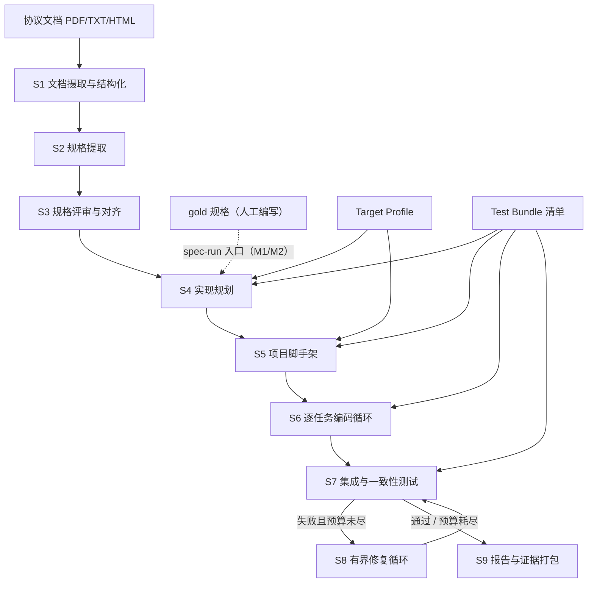
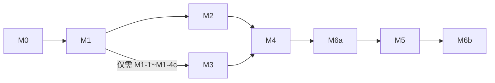

# NePA 系统设计文档

> 文档状态：Active\
> 设计版本：2.0.0\
> 最后更新：2026\-07\-30\
> 说明：本文档只描述系统设计。实现进度与迁移记录在本文档之外维护；本文档自身的修改记录见 12.5。

## 0\. 阅读指南

### 0\.1 本文档的使用方式

本文档是 NePA 的唯一主设计文档（Single Source of Truth）。写作目标是：一名此前不了解本项目的工程师，或一个上下文中只有本文档的编码智能体（LLM），都能据此独立完成对应模块的实现，无需口头补充信息。

本文档只描述**系统应该是什么样**：架构、数据契约、阶段行为、验收标准。它**不记录**实现进度、已完成/未完成状态与历史迁移过程——这些内容随时间腐化，属于独立的进度记录。任何"当前已实现""正在迁移""待某里程碑交付"的表述都不属于本文档。本文档自身的设计变更摘要例外，记在 12.5 修订历史。

按角色的建议阅读路径：

| 你要做的事                      | 必读章节        | 参考章节  |
| ------------------------------- | --------------- | --------- |
| 了解项目全貌                    | 1、2、3、4      | 10        |
| 实现编排器与流水线框架          | 4、8            | 5、6      |
| 实现某个具体阶段（S1～S9）      | 6 中对应小节、5 | 3、4      |
| 编写/维护 gold 规格与功能测试集 | 5、7            | 9         |
| 编写提示词模板                  | 3、8.8          | 6         |
| 设计与运行实验                  | 9、10           | 4\.6、4.7 |

给编码智能体（LLM 实现者）的硬性规则：

1. 本文档与代码冲突时，**必须**以本文档为准；若文档自身矛盾或缺失，**必须**停止实现并向人类报告，**禁止**自行猜测后继续。
2. 文中标注"默认，可推翻"的决策，推翻前**必须**征得项目负责人同意，并同步更新本文档。
3. 实现任何模块前，先阅读其验收标准；"完成"的定义是**验收标准可机器判定地通过**，而非"代码写完"。
4. 每完成一个模块，**必须**运行该模块对应的测试并附上结果，**禁止**以"应该能跑"作为交付说辞。

### 0\.2 规范用语

本文采用 RFC 2119 风格的规范用语：**必须（MUST）**、**禁止（MUST NOT）**、**应当（SHOULD）**、**不建议（SHOULD NOT）**、**可以（MAY）**。未标注规范用语的内容为说明性描述。

### 0\.3 默认技术选型速览

下表汇总全文的默认技术决策，各章给出详细理由。所有条目均为"默认，可推翻"，推翻的前提见 0.1。

| 事项                    | 默认选型                                            | 详见      |
| ----------------------- | --------------------------------------------------- | --------- |
| NePA 实现语言           | Python ≥ 3.11，自研编排，不使用智能体框架           | 8\.1      |
| 依赖与环境管理          | uv；单仓库单包                                      | 8\.1      |
| LLM 接入                | 自研 provider 无关抽象层，支持任意可 API 调用的模型 | 8\.4      |
| 编排形态                | v1 线性流水线 \+ 有界循环；蜂群并行仅预留扩展点     | 4\.2、4.9 |
| 数据工件格式            | JSON（UTF\-8），以 JSON Schema draft 2020\-12 校验  | 5         |
| 运行资产                | 极简 Target Profile / Test Bundle v3                      | 5\.6.5、5\.3 |
| S2 提取粒度             | 一个文档分片一次 SpecExtractor 调用                 | 6\.2      |
| 首个目标协议 / 实现语言 | MQTT 3.1.1 最小子集 / C99                           | 2\.3、7   |
| 默认运行资产组合        | MQTT 最小 Spec / server Target（C99）/ MQTT gold Test Bundle | 4\.2      |
| 生成项目构建方式        | GNU Make，gcc，`-Wall -Wextra -Werror`              | 7\.4      |
| 测试框架                | pytest（gold 功能测试与 NePA 自身单测均用）         | 5\.3、8\.1 |
| 构建/测试沙箱           | Docker（Linux 容器，默认禁网）                      | 8\.5      |
| 生成工作区版本管理      | git（每任务一次提交）                               | 6\.6      |
| 提示词模板语言          | 英文模板正文 \+ 中文维护注释                        | 8\.8      |

## 1\. 文档目的

本文是 NePA（Network Protocol Agent，网络协议生成智能体系统）开发的主设计文档，面向两类读者：项目的人类开发者与研究者，以及参与工程实现的编码智能体。

文档回答四个问题：

1. NePA 要做什么、不做什么——第 2 章；
2. 为什么这样设计，设计思想从何而来——第 3 章；
3. 系统长什么样：架构、数据工件、每个阶段的精确行为、工程实现——第 4～8 章；
4. 怎么知道做得对不对：评估体系与里程碑验收——第 9～10 章。

## 2\. 系统定义

### 2\.1 产品定位

NePA 是一个多流程的智能体系统，用于网络协议代码的自动化生成。它不追求工业级协议代码的高性能和高可靠，仅面向网络协议的前瞻性测试和验证，服务于网络领域科研人员。

当前产品的预估协议范围暂定为应用层协议。

### 2\.2 最终目标

NePA 的长期目标是：支持 PDF、TXT、HTML 等载体中网络协议的 RFC、标准组织文档和厂商技术文档作为输入，通过 NePA 生成对应网络协议的客户端、服务端、代理或协议库。

### 2\.3 短期目标（里程碑总览）

基于任务本身的高度复杂性，将系统任务分为以下里程碑节点。各里程碑的入口条件、任务分解与验收标准（DoD）在第 10 章逐一展开。

**M0. 首个协议及其范围。** 明确先采用 MQTT 3.1.1 作为实验协议，只实现其最基础的功能子集，同时在此基础上维护一个人工的 gold 规格文件和对应的功能测试集。当前固定 MQTT 用 C 语言实现。规格文件采用本文档第 5 章定义的 `specs-requirements.schema.json` v3.0。

**M1. 人工规格到可构建协议实现。** 输入人工编写的 Spec，能够直接生成无需人工修改的可构建完整项目，同时生成过程可重复且稳定。

**M2. 协议一致性验证与受控修复。** 生成的协议代码能够完成选定的功能目标，并且可以自动运行测试和修复，在有限时间和资源情况下修复问题。

**M3. 技术文档到可追溯协议规格。** 至少支持一种格式的文档输入，输出与 M0 格式一致的规格文件，并通过指标保证其正确率和准确率。

**M4. 端到端闭环。** 在 MQTT 的最小功能集上完成完整流程"文档 → Spec IR → 代码 → 构建 → 独立测试 → 有界修复 → 证据报告"。

**M5. 完整 MQTT 协议的实现。** 扩展 MQTT 的 gold spec，使其符合完整的 MQTT 协议文档要求，并且系统仍能生成可行正确的代码。

**M6. 不同类型协议泛化。** 先以 M6a 小范围架构探针验证协议、交付形态与语言边界，再在 M6b 对其他应用层协议完成端到端实验。

里程碑之间的依赖关系：M0 → M1 → M2 → M4 → M6a → M5 → M6b；M3 依赖 M0 与 M1 的公共框架部分（运行框架、LLM 层、Agent 框架、S4），此后可与 M1 收尾/M2 并行推进；M4 依赖 M2 与 M3。

### 2\.4 非目标

以下内容明确不在当前项目范围内，任何实现**禁止**擅自扩大范围：

- 工业级性能与高可用：不做吞吐、并发规模、7×24 稳定性优化；
- 安全加固与合规审计：TLS 等安全特性仅在协议语法层面涉及，不做安全性保证；
- 传输层及以下协议：不实现 TCP/UDP 之下的协议栈，当前聚焦应用层；
- 通用软件项目生成：NePA 只面向"规格可形式化的网络协议"这一垂直领域；
- 图形界面与产品化交互：v1 仅提供 CLI。

## 3\. 设计基石：编码智能体的工作流范式

本章回答"为什么这样设计"。NePA 的流水线不是凭空发明的，而是把两类已被验证的实践固化为无人值守的自动化系统：一是 Claude Code、Codex 等交互式编码智能体处理真实工程任务的工作流；二是 Cursor 团队在大规模智能体蜂群实验（《智能体蜂群与新的模型经济学》，2026）中得到的编排与模型经济学结论。后续所有架构决策都会回指本章的原则编号（P1～P8）。

### 3\.1 交互式编码智能体如何完成"文档 → 协议代码"

把"这是 MQTT 3.1.1 的规格文档，给我一个 C 语言的最小客户端与服务端实现"直接交给今天的 Claude Code 或 Codex，观察其工作过程，可以提炼出一个稳定的七步工作流：

**步骤 1：范围澄清与验收定义。** 先确定做哪些、不做哪些、怎么算做完。交互式智能体靠追问用户获得答案；这一步的产出是一份双方认可的范围与验收清单。

**步骤 2：定向上下文侦察。** 不逐页通读整本文档，而是先建立文档结构索引（目录、章节标题），再按当前范围定向精读相关小节，把关键信息提炼为自己的工作笔记——本质上是一份非正式的中间规格。

**步骤 3：显式计划。** 生成有序的任务清单（todo list），每项小到可以独立完成与验证；交互式智能体通常把计划作为活文档，在执行过程中更新状态并按新证据细化后续工作。

**步骤 4：先搭可验证的骨架。** 第一批动作是建立工程骨架：目录结构、构建系统、能编译通过的空实现、能运行的测试入口。先让"验证回路"通电，再开始堆功能；NePA 将该动作固化为确定性的 S5，而不是交给后续编码任务重复完成。

**步骤 5：小步实现—验证循环。** 每次只做一个小任务：写码 → 编译 → 跑相关测试 → 读报错 → 修复 → 通过后提交（git 检查点）。编译器报错与测试断言失败是驱动下一步行动的主要输入。

**步骤 6：独立验证与自我审查。** 全部任务完成后运行全量测试，并回到规格逐条核对覆盖情况。不以"我写完了"为完成标准，只承认可复现的验证结果。

**步骤 7：交付与证据。** 汇报完成了什么、没完成什么、测试证据、已知问题与所做假设。

支撑这七步的底层机制同样重要：**工具调用**（读写文件、执行命令，智能体的一切动作通过工具产生可见效果）；**上下文管理**（对长文档做摘要与检索，避免上下文被无关内容淹没）；**子智能体**（把大范围搜索、专项分析派给独立上下文的临时智能体，只回传结论）；**检查点**（git 提交与回滚能力）；**预算意识**（时间与轮次有限，卡住时换策略或上报，而非无限重试）。

这里提炼的是 Codex、Claude Code 的**公开工作流与工程建议**，不声称复刻其未公开内部实现。公开实践共同强调：复杂任务先规划；长任务以可恢复、可验证的里程碑推进；独立探索放入隔离上下文；最终答复或交付可以是单一结果，但内部不等于一次模型补全。NePA 因无人值守与科研复现要求，将其进一步约束为"S4 草稿可演化、正式 Plan 发布后不可变、运行状态单独落盘"（5.2、6.4）。

### 3\.2 八条可迁移设计原则

从 3.1 提炼出八条原则。它们是 NePA 全部架构决策的依据，后文以 P1～P8 引用。

| 编号 | 原则                     | 来源实践                           | 在 NePA 中的落地                                             |
| ---- | ------------------------ | ---------------------------------- | ------------------------------------------------------------ |
| P1   | 验证优先，测试即真值     | 智能体不自我宣称成功，只认测试结果 | 功能测试集由人工维护、独立于生成过程（5.3）；所有阶段验收机器可判（第 6 章） |
| P2   | 小步快反馈               | 每次小改动立即编译、测试           | S6 按任务粒度生成代码，每任务一轮构建\+单测循环（6.6）       |
| P3   | 计划是显式工件           | todo 清单驱动执行、随时可查        | 不可变 `plan.json` 保存架构与宏任务，可变 `plan_state.json` 保存进度和证据（5.2） |
| P4   | 上下文按需定向注入       | 不整本读文档，只检索相关片段       | 协议事实只取 Spec IR 切片，目标选择取 Target Profile，交付信息取 Blueprint；原始文档止步于 S2（4.2、4.3、6.6） |
| P5   | 角色分离、新鲜上下文     | 子智能体隔离专项任务               | 每次 Agent 调用无会话历史，输入是工件切片，输出是结构化结果（4.5） |
| P6   | 循环必须有界             | 卡住换策略或上报，不无限重试       | 三重预算 \+ 升级路径 \+ 受控失败（4.7、6.8）                 |
| P7   | 一切落盘、可恢复、可审计 | git 检查点、可回滚                 | `runs/` 工件目录 \+ git 工作区 \+ trace 证据链（4.4、5.5）   |
| P8   | 结构化输出契约           | 工具参数经严格校验                 | 所有 LLM 输出经 JSON Schema 校验，失败一次修复重试（8.4、8.8） |

### 3\.3 蜂群与模型经济学的启示

Cursor 的蜂群实验（数千智能体并行、依据 800 余页手册重新实现 SQLite）给出了五条与 NePA 直接相关的结论：

1. **分层分解优于扁平并行。** 有效架构是"规划器—工作者"的树状分解：规划器由最强模型驱动，负责目标拆解与设计决策；工作者由便宜模型驱动，执行具体编码。关键收益来自**上下文效率**而非并行度本身——规划器不被实现细节淹没，工作者不需要全局视野。
2. **模型分层的经济学非常显著。** 该实验中，全程使用旗舰模型成本约 $10,565，而"强模型规划 \+ 经济模型执行"的混合配置成本约 $1,339，最终质量不降（均 100% 通过测试）。规划器消耗的 token 少但占成本约三分之二，工作者处理大部分 token 却只占约三分之一。含义：真正需要前沿能力的环节（任务分解、设计决策）占比极小，一旦意图被转化为明确指令，廉价模型即可胜任。
3. **评审是高回报投入。** "投入在审查上的算力回报很高，因为审查成本远低于被审查工作。"多个相关性低的评审视角（不同模型、不同信息源）叠加，类似多传感器融合。
4. **共享规格防止"脑裂"。** 大量智能体各自解读意图会产生重复实现与冲突决议；对策是维护一份共享设计文档，代码通过可追溯引用与之关联。这正对应 NePA 的核心枢纽 Spec IR：所有下游协议事实只认规格，不各自解读原始文档；交付形态、语言工具链与验收规则分别来自显式资产（4.2）。
5. **抽象层级的演进终点是规格本身。** 从自动补全（行）→ 早期 LLM（代码块）→ 智能体（文件/功能）→ 蜂群（整份规格说明）。稀缺资源正在从模型能力转向"对意图的准确描述"。NePA 的立项假设与此一致：把"文档 → 代码"拆为"文档 → 规格"与"规格 → 代码"两个半程，以规格为枢纽。

同一实验也给出了反面教训：缺乏协调机制的并行会产生大量"无效忙碌"（旧框架两小时产生 68,000 次提交、7 万余次合并冲突，最终质量反而更低且方差极大）。因此 NePA v1 **不做**大规模并行，只吸收四点：分层分解（S4 全局架构 → 逐工作包展开 → 确定性链接 → S6 执行）、模型分层路由（4.6）、评审关卡（S3、S4 PlanCritic、S7）、规格中心化（第 5 章）。M1 的 S4 工作包展开默认串行，分层首先用于隔离上下文而非提高并发；并行蜂群仍只作为扩展点预留（4.9）。

### 3\.4 NePA 与交互式智能体的关键差异

NePA 是无人值守的流水线，不能照搬交互式工作流，差异与应对如下：

| 维度     | 交互式（Claude Code / Codex） | NePA（无人值守）         | 设计应对                                                     |
| -------- | ----------------------------- | ------------------------ | ------------------------------------------------------------ |
| 歧义处理 | 随时向用户追问                | 运行中无人可问           | 歧义在入口前置消解：Spec IR 必填字段 \+ 保守默认值 \+ 假设记录进报告（5\.1、6\.6.3、6\.9） |
| 完成判定 | 用户主观认可                  | 必须机器可判             | 一切验收标准可执行：测试、校验器、指标阈值（第 6、9 章）     |
| 过程控制 | 用户随时打断纠偏              | 只能靠预算与停止条件兜底 | 三重预算与受控失败（4.7）                                    |
| 复现要求 | 无                            | 科研场景要求可复现       | 全工件落盘、trace 记录请求参数及 provider 能力状态、N 次独立重复统计（5.5、9.2） |
| 流程决策 | 模型自主决定下一步            | 流程由确定性代码掌控     | LLM 只在阶段内做受限决策，编排器是普通 Python 状态机（4.2）  |
| 计划演化 | 可随新发现自由增删 todo        | 正式宏计划必须可复现     | S4 内部草稿可定点修复；发布后的 Plan 不变，S6 只更新 Plan State；结构错误受控失败（5.2、6.6） |

## 4\. 总体架构

### 4\.1 流水线总览

NePA 的主体是一条由 9 个阶段（S1～S9）组成的流水线。阶段之间只通过落盘的数据工件通信（P7），不共享任何内存状态或对话历史（P5）。



流水线有两个入口，对应不同里程碑：

- **doc\-run（完整入口，M3/M4）**：输入协议文档，从 S1 开始跑完整链路。
- **spec\-run（规格入口，M0～M2）**：输入人工编写的 gold 规格，跳过 S1～S3，从 S4 开始。这保证 M1/M2 的研发不被文档提取的难度阻塞。

| 阶段 | 名称             | 服务里程碑 | 一句话职责                                             |
| ---- | ---------------- | ---------- | ------------------------------------------------------ |
| S1   | 文档摄取与结构化 | M3         | 把 PDF/TXT/HTML 变成带章节索引的结构化文本分片         |
| S2   | 规格提取         | M3         | 从文档分片提取 Spec IR（分片提取 → 合并 → 自检）       |
| S3   | 规格评审与对齐   | M3         | 规格的机器校验 \+ LLM 评审；实验模式下与 gold 对齐评分 |
| S4   | 实现规划         | M1         | 多轮编译架构、工作包与任务 DAG，原子发布不可变 Plan v4 |
| S5   | 项目脚手架       | M1         | 独占生成可构建骨架、存根、工件清单与契约映射           |
| S6   | 逐任务编码循环   | M1         | 只读 Plan、更新 Plan State：编码、验证、git 提交        |
| S7   | 集成与一致性测试 | M2         | 在沙箱运行所选 Test Bundle（独立于生成过程）            |
| S8   | 有界修复循环     | M2         | 失败聚类 → 定位 → 修复 → 回归，直到通过或预算耗尽      |
| S9   | 报告与证据打包   | M2/M4      | 汇总覆盖率、测试结果、成本与假设，产出证据报告         |

### 4\.2 四层运行时结构

系统在运行时分四层，职责边界**必须**严格遵守：

| 层   | 名称                | 实现方式               | 职责                                            | 禁止事项                               |
| ---- | ------------------- | ---------------------- | ----------------------------------------------- | -------------------------------------- |
| L1   | Orchestrator 编排器 | 确定性 Python 代码     | 运行生命周期、阶段顺序、预算记账、断点恢复      | 禁止让 LLM 决定流程走向                |
| L2   | Stage 阶段控制器    | 确定性 Python 代码     | 单阶段内部流程：循环、校验、重试、组装上下文    | 禁止跨阶段直接传内存对象（必须经工件） |
| L3   | Agent 智能体        | 一次无状态 LLM 调用    | 在给定上下文内完成单一认知任务，输出结构化结果  | 禁止产生副作用；禁止携带会话历史       |
| L4   | Tool 工具           | 确定性 Python/系统调用 | 一切副作用：读写文件、git、构建、测试、沙箱执行 | 禁止调用 LLM                           |

两条全局规则：

1. **LLM 的决策范围被其输出 Schema 限定**（P8）：一个 Agent 能做的所有"决定"都必须体现在输出 JSON 的字段里，编排器只按字段行事。
2. **一切副作用经过工具层**：Agent 输出的"写文件/跑命令"意图由 Stage 控制器解析后调用工具执行，从而全部可记录、可重放（P7）。

#### 4\.2.1 三类运行输入边界

| 输入 | 唯一职责 |
| ---- | -------- |
| Spec IR | 可直接提取的协议事实：角色、传输、类型、报文与原子需求 |
| Target Profile | 本次实现选择的目标协议角色数组，以及实现语言与版本；除此之外不承载任何信息 |
| Test Bundle | 独立测试、runner、判定 oracle 与参考实现适配器 |

Target Profile 与 Test Bundle 在运行开始时按原始字节哈希冻结。NePA 当前只生成应用层网络协议实现，因此只维护一套系统内置的应用层生成后端，不设置后端选择、后端身份或后端版本字段。该后端根据 Target Profile 的 `language` 使用内置语言规则，并只为该规则明确支持的 `roles[]` 生成交付形态；C99 当前固定使用 POSIX、gcc、GNU Make、内置类型映射、构建变体和编码约束，且当前只支持 `server`。命名规则由协议事实与语言规则机械派生，容量默认值、角色交付规则、三段构建图、文件规则、布局模板和机械生成规则均由系统内置后端与 S4 Delivery Compiler 提供，不进入 Target Profile。

S4 仍以 deliverable→build artifact→link source set 三段结构生成 Delivery Blueprint，并保留文件规则、布局模板与机械生成机制；这些结构是运行工件，不是用户输入。系统模板是随代码维护的普通实现资源，**禁止**为模板或后端设计、记录或校验 id、version、hash。后续阶段禁止按协议名称写行为分支；具体协议标识符只能由 Spec IR 进入命名派生和生成上下文。默认组合为 MQTT 3.1.1 最小 Spec、`roles=["server"]`、C99 与 MQTT gold Test Bundle。

### 4\.3 核心数据工件

| 工件       | 路径（相对运行目录）                     | 产生者                | 主要消费者         | Schema 定义 |
| ---------- | ---------------------------------------- | --------------------- | ------------------ | ----------- |
| 运行元数据 | `run.json`                               | 编排器                | 编排器（恢复）、S9 | **5\.6**    |
| 冻结输入   | `inputs/{target,test_bundle}.json`          | 编排器              | S4～S9             | **4\.2**    |
| 文档包     | `doc/`（segments.json）                  | S1                    | S2                 | **5\.6**    |
| 规格       | `spec/spec.json`                         | S2/S3（或 gold 拷贝） | S4～S9             | **5\.1**    |
| 规格评审   | `spec/spec_review.json`                  | S3                    | S9、人类           | **5\.6**    |
| 合并决议   | `spec/merge_decisions.json`（doc\-run）  | S2                    | S9、人类           | **5\.6**    |
| 对齐评分   | `spec/spec_align.json`（实验模式）       | S3                    | S9、评估           | 9\.1.3      |
| 计划       | `plan/plan.json`                         | S4                    | S5～S9（只读）     | **5\.2**    |
| 计划状态   | `plan/plan_state.json`                   | 编排器（S6 admission） | S6～S9、resume/eval | **5\.2**  |
| S4 检查点  | `plan/_s4/`                              | S4                    | S4 恢复、审计      | **5\.6**    |
| 工件清单   | `plan/artifact_manifest.json`            | S5                    | S6～S9             | **5\.6**    |
| 内部契约映射 | `plan/contract_map.json`               | S5                    | S6～S9             | **5\.6**    |
| 生成工作区 | `workspace/`（git 仓库）                 | S5～S8                | S7、人类           | 7\.2        |
| 测试结果   | `test_results/`                          | S5～S8                | S6～S9             | 5\.4        |
| 修复日志   | `repair/repair_log.json`                 | S8                    | S9                 | 5\.4        |
| 证据报告   | `report/report.json`、`report/report.md` | S9                    | 人类、论文实验     | 5\.4        |
| 调用踪迹   | `trace/`（ndjson \+ 全文子目录）         | 全程                  | 评估、审计         | 5\.5        |

关键约束（P4 的落地）：**原始文档止步于 S2**。S4 之后的任何 Agent 上下文中**禁止**出现原始文档内容；协议事实只允许来自 Spec IR 切片，目标角色与语言只允许来自冻结 Target Profile，交付与工具链信息只允许来自系统内置后端、S4 确定性 Delivery Blueprint 以及 S5 生成的内部契约映射，测试实现始终不可见。这一约束保证：(a) 协议行为可归因于规格质量；(b) 上下文规模可控；(c) "文档 → 规格"与"规格 → 代码"两个半程可独立评估。

### 4\.4 运行目录布局

每次运行（run）在 `runs/` 下创建独立目录，命名 `<UTC时间戳>_<协议>_<入口>`：

```text
runs/20260726T1432Z_mqtt-min_spec-run/
├── run.json                  # 运行元数据：输入、配置快照、阶段状态、预算消耗
├── inputs/                   # 本次运行冻结的 Target Profile 与 Test Bundle 描述
├── doc/                      # S1 产物（doc-run 才有）
│   ├── source.pdf            # 原始文档副本
│   └── segments.json         # 结构化分片索引
├── spec/
│   ├── spec.json             # Spec IR（S2/S3 产物，或 gold 拷贝）
│   ├── spec_review.json      # S3 评审结论
│   ├── merge_decisions.json  # S2 合并冲突决议（doc-run 才有，5.6.4）
│   └── spec_align.json       # 与 gold 的对齐评分（实验模式才有，9.1.3）
├── plan/
│   ├── plan.json             # S4 原子发布的不可变 Plan v4
│   ├── plan_state.json       # S6 入口初始化、执行中原子更新
│   ├── _s4/                  # S4 可恢复内部草稿；不供下游作为事实源
│   ├── artifact_manifest.json # 生成物、入口与构建变体清单
│   └── contract_map.json     # 内部逻辑契约到接口文件/符号的映射
├── workspace/                # git 仓库：生成的 C 项目（布局见 7.2）
├── test_results/
│   ├── index.json            # 已接受 round 的原子索引
│   ├── pending_round.json    # 发布中的单一 round WAL；稳定状态下不存在
│   ├── round_001/            # 每轮测试一个目录：junit.xml + summary.json
│   ├── task_evidence/        # T-###/attempt_NNN.json，不可变 commit 绑定证据
│   └── ...
├── repair/
│   ├── evidence/             # 每个 repair commit 的不可变证据
│   └── repair_log.json       # commit/evidence/round 的原子索引
├── report/
│   ├── report.json
│   └── report.md
├── trace/
│   ├── llm_calls.ndjson      # 每次 LLM 调用一行（5.5）
│   ├── stage_events.ndjson   # 阶段级事件流
│   ├── prompts/              # 提示词全文（5.5）
│   └── outputs/              # 模型输出全文（5.5）
└── cache/                    # prompt→response 缓存（可选，8.4）
```

配置快照**必须**在运行开始时完整写入 `run.json`（含模型绑定、预算、开关），保证任何一次历史运行都能被精确解释与复现（P7）。

### 4\.5 智能体角色表

所有 LLM 调用都以"角色"为单位定义。角色 \= 提示词模板 \+ 输入工件切片规则 \+ 输出 Schema \+ 模型档位绑定。

| 角色                     | 所属阶段 | 默认档位               | 输入（上下文包）                             | 输出（经 Schema 校验）             |
| ------------------------ | -------- | ---------------------- | -------------------------------------------- | ---------------------------------- |
| DocSegmenter 文档分段员  | S1       | T3                     | 原始文本页块                                 | 章节树与分片标注                   |
| SegmentClassifier 分片分类员 | S2   | T3                     | 分片批量（文本）                             | 每分片的视图标签数组               |
| SpecExtractor 规格提取员 | S2       | T1                     | 单个文档分片 \+ Spec IR 片段 Schema          | Spec IR 片段（线格式事实与原子需求） |
| SpecMerger 规格合并员    | S2       | T1                     | 多个片段 \+ 冲突清单                         | 合并决议                           |
| SpecCritic 规格评审员    | S3       | T1（与提取员不同型号） | 完整 spec.json \+ 校验器报告                 | 问题清单与修改建议                 |
| ArchitecturePlanner 架构规划员 | S4  | T1                     | planning index \+ Delivery Constraints                 | 架构、工作包骨架与设计决定 |
| TaskPlanner 任务规划员   | S4       | T1                     | 单工作包 \+ 相关 Spec 切片 \+ 相邻契约/测试元数据       | 局部任务 shard          |
| PlanCritic 计划评审员    | S4       | T1（与生产者不同型号） | 候选 Plan 的紧凑图、覆盖矩阵与 lint 报告                | 结构化问题清单          |
| FlatPlanBaseline 消融规划员 | S4（仅实验） | T1                  | 同一 planning index、约束与 Manifest 元数据             | 无最终 id/hash/state 的完整语义草稿 |
| Coder 编码员             | S6       | T2                     | 单任务说明 \+ 相关 Spec 切片 \+ 相关接口文件 | 完整源文件集                       |
| Diagnoser 诊断员         | S6/S8    | T2，升级 T1            | 失败输出（编译/测试）\+ 相关代码             | 根因假设与修复位置                 |
| Fixer 修复员             | S6/S8    | T2，升级 T1            | 诊断结论 \+ 目标文件                         | 修复后的完整文件                   |
| Reporter 报告员          | S9       | T3                     | 各工件摘要                                   | report.md 正文                     |

注意：S3 的"与 gold 对齐评分"由确定性比对工具完成（9.1），**不是** LLM 角色；LLM 只承担无 gold 可比时的定性评审。

### 4\.6 模型分层与路由

依据 3.3 的经济学结论，模型按能力/价格分三档，角色绑定档位，档位绑定具体型号（全部走配置，8.3）：

| 档位 | 定位     | 承担角色                              | 选型原则                                                     |
| ---- | -------- | ------------------------------------- | ------------------------------------------------------------ |
| T1   | 最强推理 | 提取、合并、评审、架构/任务规划、flat 消融基线、疑难诊断/修复 | 当前可用的旗舰模型；错误在此层的代价最高（错误会被下游放大） |
| T2   | 经济执行 | 编码、常规诊断/修复                   | 代码能力强、成本低的模型；消耗大部分 token                   |
| T3   | 轻量辅助 | 分段、摘要、报告成文                  | 最便宜的可用模型                                             |

路由规则：

1. 角色 → 档位的绑定是静态配置；**禁止**在运行中由 LLM 自选模型。
2. **升级路径**（P6）：Coder/Fixer 在同一任务上连续失败 3 次（T2 预算耗尽）后，第 4 次尝试自动升级到 T1；仍失败则任务标记 `blocked`，进入受控失败流程（4.7）。
3. 评审类角色**应当**绑定与被评审内容生产者不同的型号（3.3 结论 3：低相关视角叠加）。
4. 每次调用的 token 数、成本**必须**记入 trace（5.5），按角色/阶段聚合进报告（P7），为后续成本\-质量消融实验提供数据（9.3）。

### 4\.7 预算与停止条件

无人值守系统必须有硬性的资源边界（P6）。预算分三个维度，任何一个耗尽即触发所在层级的停止动作：

| 层级  | 预算项                        | 默认值                         | 耗尽动作                                        |
| ----- | ----------------------------- | ------------------------------ | ----------------------------------------------- |
| 全局  | 墙钟时间                      | 4 h                            | 中止当前阶段，跳转 S9 产出报告（未完成项标注）  |
| 全局  | 累计成本（USD 或 token 折算） | 20 USD（default.yaml 提供，实验前须按需显式覆盖） | 同上                                            |
| S2    | 单分片提取重试                | ≤ 2 次                         | 该分片标记 `extraction_failed`，进 spec\_review |
| S4    | 架构定点修复 / 全局重规划     | 各 ≤ 1 次                      | S4 受控失败，不发布部分 Plan               |
| S4    | 单工作包 task shard 语义重做  | 每工作包全程累计 ≤ 1 次        | S4 受控失败，保留 `_s4` 检查点              |
| S4    | PlanCritic 语义修复           | 全局累计 ≤ 2 轮                | 重复 issue 签名或预算耗尽即停止                |
| S6    | 单任务修复迭代                | ≤ 3 次（T2）\+ 1 次（T1 升级） | 任务 `blocked`，跳过其下游依赖任务              |
| S7/S8 | 全局修复轮数                  | ≤ 3 轮；一轮只选择一个失败簇、至多一个 commit | 快验拒绝也消耗一轮；预算尽则跳转 S9 |
| S7/S8 | 收敛判据                      | 每个已 commit 的全量回归轮失败测试数必须严格递减 | 不递减即回滚该 commit 并停止修复（防振荡） |

全局墙钟采用**跨 resume 累计的活跃 controller 运行时间**，不是 `created_at` 到当前时刻的绝对差。具体规则：

1. 每次 controller 进程以 monotonic clock 计量本会话；
2. 在阶段边界、外部调用边界和正常退出前，把增量原子累加到 `run.json.budget_used.wall_clock_s`；
3. resume 从该持久值继续新会话，**禁止**重置；
4. 进程未运行、等待人工审阅及两次 resume 之间的离线时间均**不**计入预算；
5. 外部调用**开始前**先检查既有预算；
6. 调用完成后**必须**在同一次预算检查中登记该活跃时间及实际新增成本/token；
7. 缓存重放的 provider 成本/token 增量为 0，但本地活跃时间照常累计。

这里的“每工作包重做”覆盖 Schema 修复成功之后由 shard 自身问题或 Critic 局部 issue 触发的全部语义重展开；Provider 层统一的一次结构化输出 Schema 修复按 8.4 单独计数，不重复消耗该额度。

S4 各项预算的默认值**必须**先由 6.4.8 的隔离测量与完整链实测确定，再作为正式默认值冻结。预算调整**禁止**用来掩盖系统性 prompt/Schema 缺陷；冻结后的生产运行仍按受控失败诚实退出。

**受控出口**是一等公民：预算耗尽、LLM 不能产出合格结构或输入工件缺失属于可预期流程出口。此时系统**必须**：(a) 保存全部现场工件；(b) 路由 S9 生成与已到达阶段相称的完整或部分报告，缺失项显式标为 `unavailable/not_run`；(c) 按 9.1.2 判定 degraded/failed，并用退出码 10/20。模板错误、违反内部不变量、工具实现崩溃等 **NePA 自身 bug** 必须先归类为 `internal_error`、退出码 1；允许 best\-effort 写诊断包，但不得伪装成三值 outcome 报告。**禁止**静默失败或死循环。

用户显式 `--until <stage>` 是唯一不走 S9 的正常半程出口：完成目标阶段后写 `termination_kind=planned_stop`、退出码 0，不写三值 outcome。它不属于预算/错误受控出口，只供里程碑明确定义的半程验收使用：M1 的正常终点是 spec\-run `--until s6`，M3 的前半程评估是 doc\-run `--until s3`；其他目标阶段必须由对应里程碑另行声明。

受控出口决定必须先以 Run v3 `termination_request` 原子持久化，再进入 S9。逐条约束：

1. `kind` 固定为 `controlled_exit`，`stage ∈ {s1..s8}`，`reason` 复用 5.4 的开放机器码结构；
2. `stages[termination_request.stage].status` 必须为 `failed`（阶段内触发）或 `pending`（进入阶段前预算已耗尽）；done/running/skipped 均是工件损坏；
3. S9 是受控出口必经的确定性 producer，其入口及执行后的预算同步一律 `enforce=false`，**不得**因已耗尽预算再次抛错；
4. `controlled_exit` 必须携带 request，且 outcome 只能 degraded/failed；
5. `completed`/`planned_stop` **禁止**携带 request；
6. `internal_error` 可有可无，以保留"S9 原本在处理何种受控出口"的审计证据。

`--until` 不使用 `termination_request`。CLI 合并后的值必须持久化到 `config_snapshot.run.until` 并被 `config_snapshot_sha256` 封存；resume 在目标阶段已 done、planned\_stop 尚未 finalize 的窗口中，必须从该冻结值重推停止，禁止继续进入下一阶段。

### 4\.8 断点恢复与幂等

- `run.json` 维护阶段状态机：`pending / running / done / failed / skipped`；每项可带 `output_refs`，以 `{path, sha256}` 或阶段专用 receipt 锚定输出。每次状态变更用"写临时文件 \+ 原子改名"落盘。
- 阶段完成的判定 \= 输出工件存在、通过对应 Schema/完整性校验，且与 `output_refs` 一致，而非仅有状态标记。
- `nepa resume <run_id>` 从第一个未完成阶段续跑。S4 只复用 Schema 合法且父输入哈希匹配的 `_s4` 架构/工作包检查点；正式 Plan 已发布后重跑 S4 是无害空操作。
- resume 在确认原 controller 进程不再活跃后，先把所有遗留 `running` 阶段原子改为 `failed`，`error="process crashed mid-stage"`，且不得因此新增 `termination_request`；随后普通阶段按 failed→running 重试。若已有 request 且尚无 `termination_kind`，则跳过全部非 S9 阶段：S9 receipt/Schema/工件完整则直接 finalize，否则把 orphaned `s9=running` 依同一规则转 failed 后，以 failed→running 重跑 S9。若 `s9=done` 但 receipt、Report Schema、文件哈希或 request 交叉绑定任一校验失败，则视为终态工件损坏并 finalize 为 `internal_error`，保留 request；`done` 仍是终态，禁止为修复该损坏开放 done→running。
- S4 seal 的同一次 `run.json` 原子更新必须写入正式 Plan 与 Blueprint 的 hash；S5 完成时同样锚定 artifact manifest、internal contract map 与 workspace 首提交；S6 完成时锚定包含证据内容哈希的 Plan State 与 workspace HEAD。后续阶段先核对这些独立锚点，禁止只比较多个工件中可一起被篡改的内嵌字段。
- S6 以任务为恢复粒度，依据 `plan_state.json`、任务验收证据与 workspace git 提交对账，**禁止**从 Plan 推断运行状态。成功路径固定为"验收证据落盘 → 带任务 id trailer 的 git commit → 原子写 `plan_state` 的 done/commit\_sha"；若崩溃发生在 commit 后、state 前，resume 可凭有效提交与证据前向补记，反向出现 state=done 但提交缺失则视为工件损坏并受控失败。resume 先 reconciliation、后 clean gate，不能用“工作区必须先干净”阻断恢复。
- 所有 Stage 控制器**必须**幂等：重复执行已完成阶段是无害的空操作。
- 可选的 LLM 响应缓存（键 \= 提示词哈希 \+ 模型 \+ 参数，8.4）让"重放一次历史运行"接近零成本，用于调试与回归。

### 4\.9 蜂群并行扩展点（预留，v1 不实现）

v1 为线性流水线；以下扩展点在架构上预留接口，未来按需启用。启用任何一项前，**必须**先满足其前提条件：

| 扩展点          | 内容                                                         | 启用前提                                                | 参考        |
| --------------- | ------------------------------------------------------------ | ------------------------------------------------------- | ----------- |
| E1 任务并行     | S6 中无依赖且交付文件集不相交的任务并行派发多个 Coder        | plan.json 的 `deliverable_files` 互斥检查；串行合并提交 | 3\.3 结论 1 |
| E2 N\-best 择优 | 关键任务（S2 提取、S6 核心模块）并行生成 N 个候选，评审员择优 | 有可靠的自动评审标准；预算充足                          | 3\.3 结论 3 |
| E3 修复假设竞争 | S8 对同一失败并行尝试多个修复假设，取先通过者                | 沙箱可并行隔离运行测试                                  | —           |
| E4 多视角评审   | S3/S7 用多个不同模型独立评审后聚合                           | 至少两家 provider 可用                                  | 3\.3 结论 3 |

为此，编排器的任务调度接口**应当**设计为"提交任务集合 → 收集结果集合"，内部是串行还是并行对上层透明（8.2）。

## 5\. 数据工件与 Schema

本章定义流水线中所有结构化工件的数据格式。这些定义是系统的"接口宪法"：**任何实现与本章冲突即为 bug**。正式的 JSON Schema 文件位于 `nepa/schemas/`（M0 任务之一是把本章表格转写为机器可校验的 schema 文件，见 10.1）。

通用约定：

- 编码一律 UTF\-8 JSON；键名 `snake_case`。
- 所有 `id` 类字段：小写字母数字与连字符/下划线，全局唯一性由校验器检查。
- 所有 NePA 生成的工件顶层**必须**带 `schema_version` 字段（语义化版本），消费者按主版本兼容。Target Profile 是用户输入配置，按 5.6.5 的固定双字段 Schema 校验，不携带 `schema_version`。
- 校验分两级：**结构校验**（JSON Schema draft 2020\-12）与**引用完整性校验**（自研 `spec_lint` 工具，见本章各节"校验规则"）。
- `{path, sha256}` 中的 `sha256` 一律对 `path` 所指文件的**原始字节**计算；目录树按 5.3 单独定义的树算法计算。Canonical SHA\-256 只用于内存 JSON 对象：唯一编码为 `json.dumps(value, ensure_ascii=False, sort_keys=True, separators=(",", ":"), allow_nan=False).encode("utf-8")`，不带尾随换行，再对该字节串取 SHA\-256。输入必须递归拒绝非 `str` 的 object key；`int` 原样，`float` 使用 CPython shortest\-repr，NaN/Infinity 拒绝。该算法只承诺本项目的单 Python 实现可复现，不采用 RFC 8785/JCS，也不承诺跨语言字节一致；若未来需要跨语言验证，必须按开放问题和工件主版本迁移处理。
- NePA 自产且需要 canonical 锚定的 JSON 工件（包括解析后的 `inputs/*.json` 与正式 `plan.json`）发布时直接写上述 canonical 字节，使文件原始字节 SHA\-256 与对象 canonical SHA\-256 重合。`run.json` 等可变人读状态可继续缩进并带尾随换行，其 `{path, sha256}` 按落盘原始字节计算，而 `config_snapshot_sha256` 只哈希内存中的 `config_snapshot` 对象。

### 5\.1 Spec IR：specs\-requirements.schema.json

Spec IR（Intermediate Representation）是整个系统的协议事实枢纽（3.3 结论 4/5）：上承文档提取（S2 的输出目标），下游任何协议语义都必须来自 Spec IR；目标角色/语言由 Target Profile 选择，交付与工具链由系统内置规则和 Blueprint 提供，测试判定由 Test Bundle 提供。

设计决策（默认，可推翻）：

1. **JSON 而非形式化 IDL**（ASN.1、P4 等）：LLM 生成与消费 JSON 最稳定，工具链成熟，可直接 Schema 校验；形式化程度靠受限字段值（枚举、结构化约束）逐步逼近。
2. **只保存可直接提取的事实**：Spec IR v3.0 只含协议身份/角色、文档明确的传输绑定、线格式类型、报文与原子需求。提取智能体不得合成状态名、状态机、实现动作、测试步骤或覆盖关系；这些属于 S4 及 Test Bundle 的决策。
3. **同一事实只存一处**：报文和类型通过 `req_ids` 正向引用原子需求；反向的“需求被哪些元素覆盖”由工具扫描 `req_ids` 得到，测试覆盖由 Test Bundle manifest 声明，不回写 Spec IR。
4. **缺失优于猜测**：除顶层最小骨架外，文档或显式 scope 未给出的值一律省略；禁止以协议先验、常见默认值或实现便利补齐。`derived` 只表示文档明确规定的线上值关系，不表示提取智能体自行推导。

这使 Spec IR 成为“文档事实层”，而不是提前编译好的实现模型。S4 ArchitecturePlanner 可以基于这些事实决定状态划分、定时器对象、错误分支和模块结构，但这些决定必须留在 Plan/代码侧，不能反向污染提取结果。

#### 5\.1.1 顶层结构

| 键               | 类型   | 必填 | 说明                                                         |
| ---------------- | ------ | ---- | ------------------------------------------------------------ |
| `schema_version` | string | 是   | 本文档定义的版本为 `"3.0"`                                   |
| `protocol`       | object | 是   | 文档给出的协议 `name`、`version` 与 `roles[]`                |
| `transport`      | object | 否   | 文档明确给出的传输名称、端口、字节序及其 `req_ids`           |
| `types`          | array  | 是   | 命名线格式类型（5.1.2）；无命名类型时为空数组                |
| `messages`       | array  | 是   | 报文/PDU 的线格式事实（5.1.3）                               |
| `requirements`   | array  | 是   | 带直接原文证据的原子陈述（5.1.4）                            |

运行来源、创建时间与输入哈希属于 `run.json`；纳入/排除范围属于独立 scope，实现假设属于 Plan。它们不再复制进 Spec IR。`protocol.roles` 只记录文档命名的协议参与方；Target Profile 的 `roles[]` 从中选择本次实现的目标角色。

#### 5\.1.2 类型系统 types

内建原语：`uint8`、`uint16_be`、`uint32_be`、`bytes`、`bitfield8`。协议特有编码在 `types` 中命名定义，字段通过名字引用——这使 Spec IR 对 MQTT 之外的二进制协议保持通用（M6）。

| 键              | 类型   | 必填    | 说明                                                         |
| --------------- | ------ | ------- | ------------------------------------------------------------ |
| `id` / `name`   | string | 是      | 类型标识与人类可读名                                         |
| `encoding.kind` | enum   | 是      | `varint`、`length_prefixed_string`、`length_prefixed_bytes`、`sequence`、`repeat`、`enum` |
| `encoding.*`    | —      | 按 kind | 原文直接描述的编码参数；`sequence.members[]` 表示有序成员，`repeat.item_type/min_items/max_items` 表示重复项 |
| `constraints`   | array  | 否      | 值域约束（max、charset 等）                                  |
| `req_ids`       | array  | 是      | 支持该类型事实的需求 id                                     |

`sequence` 与 `repeat` 只表达文档中的线序，不表达语言结构体或容器选型。例如 MQTT 的订阅项可写成“`mqtt_utf8_string` 后跟 `uint8`”，订阅列表再写成该项至少重复一次；无需生成 `"item": "A followed by B"` 这类需要下游重新解释的自然语言。

#### 5\.1.3 报文定义 messages

| 键                 | 类型   | 必填 | 说明                                                         |
| ------------------ | ------ | ---- | ------------------------------------------------------------ |
| `id` / `name`      | string | 是   | 如 `connect` / `CONNECT`                                     |
| `senders`          | array  | 是   | 发送方角色 id；必须来自 `protocol.roles`                     |
| `receivers`        | array  | 是   | 接收方角色 id；必须来自 `protocol.roles`                     |
| `wire_layout`      | array  | 是   | 有序段列表，MQTT 为 `[fixed_header, variable_header, payload]` |
| `fields`           | array  | 是   | 字段列表，顺序即线序                                         |
| `req_ids`          | array  | 是   | 本报文关联的需求                                             |

不再单列 `packet_type_code`：类型码、文本命令字或其他判别值都作为普通字段的 `constraint.const` 记录，避免同一线值保存两份，也避免为每类协议发明新的顶层判别字段。

字段（`fields[]`）子结构：

| 键             | 类型   | 必填        | 说明                                                         |
| -------------- | ------ | ----------- | ------------------------------------------------------------ |
| `name`         | string | 是          | 字段名                                                       |
| `loc`          | enum   | 是          | 所在段（`wire_layout` 之一）                                 |
| `type`         | string | 是          | 原语或 `types` 中的命名类型                                  |
| `bits`         | array  | bitfield 时 | 位定义：`name`、`offset`、`width`、可选 `constraint`         |
| `presence`     | object | 否          | 条件存在：`{"when": {"field": "connect_flags.will_flag", "equals": 1}}`；缺省恒存在 |
| `constraint`   | object | 否          | 值约束：`const`、`min`/`max`、`min_len`/`max_len`、`charset`、`enum` |
| `derived`      | object | 否          | 派生字段（如剩余长度 `{"kind": "length_of", "of": ["variable_header", "payload"]}`），编解码器**必须**计算而非当作自由输入 |
| `req_ids`      | array  | 是          | 支持该字段事实的需求 id                                     |

#### 5\.1.4 原子需求 requirements

`requirements[]` 是 Spec IR 唯一的语义事实集合。字段约束、报文交互、时间规则和错误处理都以一条或多条自包含陈述保存，不再同时改写成 `state_machines`、`behaviors`、`timers` 或 `errors`。

| 键           | 类型   | 说明                                                         |
| ------------ | ------ | ------------------------------------------------------------ |
| `id`         | string | `REQ-<主题>-<三位序号>`；由合并器确定性分配或保留 gold id   |
| `text`       | string | 忠实于单条原文的自包含陈述；只可补齐同一局部上下文中明确的主语 |
| `level`      | enum   | `DEFINITION` / `MUST` / `MUST NOT` / `SHOULD` / `MAY`        |
| `values`     | object | 可选；原文明示且需机器消费的命名标量，不得放计算结果或实现默认值 |
| `source_ref` | object | `section` \+ `quote` \+ 可选 `segment_id` / `doc_id`         |

`DEFINITION` 用于报文代码、固定布局、端口等非规范性定义；它不进入 MUST 覆盖率分母。`category` 被移除，因为语法/语义/时间/错误分类是下游用途而非原文事实。`covered_by.elements` 可由规格元素的 `req_ids` 反向计算；`covered_by.tests` 属于 Test Bundle manifest；两者都不得由 SpecExtractor 生成。

#### 5\.1.5 示例片段（MQTT CONNECT 节选）

```json
{
  "schema_version": "3.0",
  "protocol": {
    "name": "MQTT",
    "version": "3.1.1",
    "roles": ["client", "server"]
  },
  "types": [{
    "id": "mqtt_varint",
    "name": "MQTT Variable Byte Integer",
    "encoding": {
      "kind": "varint",
      "max_bytes": 4,
      "data_bits": 7,
      "continuation_bit": 7
    },
    "req_ids": ["REQ-FRAME-001"]
  }],
  "messages": [{
    "id": "connect",
    "name": "CONNECT",
    "senders": ["client"],
    "receivers": ["server"],
    "wire_layout": ["fixed_header", "variable_header", "payload"],
    "fields": [
      {
        "name": "packet_type",
        "loc": "fixed_header",
        "type": "bitfield8",
        "bits": [
          {"name": "type", "offset": 4, "width": 4, "constraint": {"const": 1}},
          {"name": "flags", "offset": 0, "width": 4, "constraint": {"const": 0}}
        ],
        "req_ids": ["REQ-FRAME-002"]
      },
      {
        "name": "remaining_length",
        "loc": "fixed_header",
        "type": "mqtt_varint",
        "derived": {"kind": "length_of", "of": ["variable_header", "payload"]},
        "req_ids": ["REQ-FRAME-001"]
      },
      {
        "name": "protocol_level",
        "loc": "variable_header",
        "type": "uint8",
        "constraint": {"const": 4},
        "req_ids": ["REQ-CONNECT-002"]
      }
    ],
    "req_ids": ["REQ-CONNECT-001", "REQ-CONNECT-002"]
  }],
  "requirements": [{
    "id": "REQ-CONNECT-002",
    "text": "protocol_level 不为 4 时，服务端 MUST 回复 rc=0x01 的 CONNACK 然后断开连接",
    "level": "MUST",
    "source_ref": {
      "section": "3.1.2.2",
      "quote": "The Server MUST respond ... return code 0x01 and then disconnect ..."
    }
  }]
}
```

这里没有 `server_session`、`wait_connect`、`send_then_close` 或测试步骤：原文要求已被完整保留，状态划分、动作序列的内部表示和验证方式由后续智能体分别在 S4 与 Test Bundle 中决定。

#### 5\.1.6 校验规则

`spec_lint`（确定性工具，非 LLM）**必须**检查：

1. 结构合法（JSON Schema）且不存在 v3 未声明字段；
2. 引用完整：字段、`sequence.members`、`repeat.item_type` 等类型引用存在；`senders`/`receivers` 来自 `protocol.roles`；字段 `loc` 来自本报文 `wire_layout`；
3. 证据完整：`transport`、每个 type/message/field 都有非空 `req_ids`，且全部指向带 `source_ref` 的需求；
4. gold 模式下（需额外传入 Test Manifest，见 8.7），每条 `MUST`/`MUST NOT` 需求都至少出现在一个 `gate ∈ {task, s7_only}` 的 Test Manifest v3 用例 `req_ids` 中；`gate=s5` 只算 scaffold/structural 快验，不独立充当规范行为证据；测试关系只从 manifest 读取。未传入 manifest 时本规则**必须**跳过并在报告中显式标注 `skipped`，**禁止**静默视为通过；
5. `derived` 只允许 Schema 已定义的直接关系；当前仅有 `length_of`，新增操作必须先给出文档中的直接样例并走 Schema 修订。

校验输出为结构化报告（错误/警告分级），S3 与 CI 共用。`spec_lint` 不判断状态机完备性、实现可行性或测试可观察性，因为这些判断已经不属于 Spec IR。

### 5\.2 不可变计划 plan.json 与执行状态 plan\_state.json

P3 在 NePA 中由两个职责互斥的工件实现：

- `plan/plan.json` 是 S4 原子发布的**不可变静态合同**。它冻结架构、工作包、宏任务、依赖、文件所有权、需求覆盖与机器验收；S5～S9 只能读取，禁止原地修改。
- `plan/plan_state.json` 是编排器在 S6 admission 的第一步确定性初始化、由 S6 原子更新的**可变执行账本**。它保存任务状态、尝试次数、备注、提交与验收证据，不得反向改变 Plan。

这里的"自包含"是指 Plan 对三项**语义输入**的显式哈希引用闭包封闭，而不是复制 Spec/Target Profile/Test Bundle 内容；系统内置后端是当前 NePA 代码路径的一部分，不作为独立资产引用。测试启停等运行策略仍属于 `run.json.config_snapshot`，其 canonical hash 由 S4 seal receipt 绑定，不扩充 `input_refs`。Plan 发布后到 run 结束，其 canonical SHA\-256 **必须**保持不变；S4 seal 时由 `run.json.stages.s4.output_refs.plan.sha256` 独立锚定，`plan_state.plan_ref.sha256` 必须引用这一封存值而非重新信任当前文件。只要 S5 已完成并准备进入 S6，即使预算使 S6 不执行任何任务，编排器也必须先初始化 Plan State。

#### 5\.2.1 Plan v4 顶层结构

| 键                          | 类型   | 说明                                                         |
| --------------------------- | ------ | ------------------------------------------------------------ |
| `schema_version`            | string | `"4.0"`                                                      |
| `input_refs`                | object | 三项冻结输入的 `{path, sha256}`                              |
| `delivery_blueprint_sha256` | string | 最终 Delivery Blueprint 的 canonical SHA\-256                |
| `architecture`              | object | 全局设计决定、模块与逻辑契约                                 |
| `work_packages`             | array  | 可独立展开和验证的宏观交付单元                               |
| `tasks`                     | array  | S6 按 DAG 执行的冻结任务                                     |
| `coverage`                  | object | Linker 确定性生成的 REQ → 工作包/任务/测试静态索引           |
| `review`                    | object | `{verdict: "pass", unresolved_minor_issues[]}`；正式发布的评审结论 |

`delivery_blueprint_sha256` 位于 Plan 顶层，**不属于** Blueprint 编译器的语义输入；否则会形成"输出哈希参与自身输入"的循环。`review` 只封存最终未解决 minor issue，完整轮次历史仍只在 `_s4/reviews/`。这样 S9 可从正式 Plan 读取已知问题，而无需把 `_s4` 提升为下游事实源。

`input_refs` 固定包含 `spec`、`target_profile` 与 `test_bundle`，每项只保存 `{path, sha256}`。S4 控制器从本次 run 的冻结输入确定性注入并覆盖这些值；任何 Agent 的回显均不作为事实来源。解析后的 Test Bundle 描述同时绑定 `manifest_sha256` 与 `bundle_tree_sha256`（5.3），使 `input_refs.test_bundle` 传递性锁定 S4 看到的清单和 S7 实际执行的测试资产。

`architecture` 至少包含：

| 键              | 说明                                                         |
| --------------- | ------------------------------------------------------------ |
| `decisions[]`   | `{id, topic, statement, context_refs[]}`；只存短设计决定与依据，不存思维链 |
| `assumptions[]` | 保守且可审计的实现假设；不得改写协议事实                     |
| `contracts[]`   | `{id, purpose, owner, interface_files[], ready_gate, provider_task_id?}`；当前仅表示生成实现内部协作 |
| `modules[]`     | `{id, name, purpose, responsibilities[], non_goals[], owns_files[], provides_contracts[], consumes_contracts[]}` |

`modules[].responsibilities[]` 是模块职责的短文本，不是 requirement ownership；机器可判的 REQ responsibility 只存在于 work package/task 两层，避免同一概念出现第三份副本。

Plan v4 当前只定义生成实现内部 contract。`ready_gate ∈ {s5, task}`：S5 即可就绪的 contract 必须有 `owner="s5"` 且不得带 `provider_task_id`；任务实现后才就绪的 contract 必须由一个模块拥有，并带该模块内**恰一个** provider task。`s5` contract 只映射 `s5_frozen` 接口；task\-ready contract 的 `interface_files` 必须属于 owner 模块并由 provider task 唯一拥有。测试如何声明和绑定外部 CLI、服务进程及构建入口不在当前 Plan Schema 中预设，按 10.3 的 M2\-0 裁决后再修订。

模块、工作包与任务的 contract 集合不得各说一套：模块的 provides/consumes 分别等于其工作包对应集合的并集，工作包的集合又分别等于其任务集合的并集。模块依赖由 contract provider/consumer 关系确定性派生，不维护可漂移的重复依赖表。

#### 5\.2.2 工作包与任务

`work_packages[]` 是 ArchitecturePlanner 冻结的里程碑级交付单元，每项至少包含：

| 键                              | 说明                                                         |
| ------------------------------- | ------------------------------------------------------------ |
| `id` / `title` / `goal`         | 稳定语义 id、标题与可观察目标                                |
| `module` / `kind`               | 所属模块与分类；分类不决定顺序                               |
| `context_refs[]`                | 所需 Spec 元素引用                                           |
| `requirement_responsibilities[]` | `{req_id, role}`，`role ∈ {primary, supporting}`             |
| `allowed_files[]`               | 该工作包可分配给下属任务的 `s6_owned` 文件集合               |
| `provides_contracts[]` / `consumes_contracts[]` | 提供与消费的逻辑契约                            |
| `depends_on[]`                  | 前置工作包 id，必须构成 DAG                                  |
| `acceptance`                    | `{outcome}`；工作包完成后应可观察的行为描述                   |

每个工作包只属于一个模块；跨模块行为必须建立独立的 integration 模块/工作包。`allowed_files` 在工作包之间互斥，其并集必须等于模块的 `owns_files`。`depends_on` 必须恰好等于为本包所消费 task\-ready contract 提供实现的**其他工作包**集合；同包 provider/consumer 只形成包内 task 边，绝不产生工作包自依赖。如确有不携带数据的顺序约束，ArchitecturePlanner 也必须把它显式建模为 internal ordering contract，禁止添加无法由 contract 证明的自由排序边。工作包不另存一份易漂移的测试清单；完成状态由其下属任务状态确定性派生。

`tasks[]` 结构：

| 键                              | 说明                                                         |
| ------------------------------- | ------------------------------------------------------------ |
| `id`                            | `T-###`；由 Linker 按稳定拓扑序确定性分配                    |
| `work_package`                  | 唯一所属工作包 id；模块由工作包派生                          |
| `title` / `goal` / `kind`       | 标题、可验证目标与分类；`kind ∈ {codec, state, logic, transport, app, integration}` |
| `instructions`                  | 给 Coder 的执行合同，含边界情况与 non\-goals                 |
| `deliverable_files[]`           | 本任务唯一可创建/修改的 `s6_owned` 文件白名单                |
| `context_refs[]`                | `message` / `type` / `requirement` / `interface_file` 引用   |
| `requirement_responsibilities[]` | `{req_id, role}`，细化所属工作包的责任分配                    |
| `provides_contracts[]` / `consumes_contracts[]` | 任务完成后提供/需要的契约                       |
| `depends_on[]`                  | 前置任务 id，必须构成 DAG                                    |
| `acceptance`                    | `{build_variant_ids[], tests[]}`；构建变体和精确 pytest nodeid |

每条非 `DEFINITION` requirement 在工作包层恰有一个 primary，可有零个或多个 supporting；同一工作包或任务内 `req_id` 唯一，不能同时列 primary/supporting。TaskPlanner 必须把每项工作包责任显式细化到本包任务：primary 工作包内恰有一个 primary task，可另有 supporting task；supporting 工作包内只能有 supporting task。任务不得认领所属工作包完全未获分配的 requirement，且全 Plan 仍只能有一个 primary task。Linker 不通过 `context_refs` 猜责任，而是从责任字段确定性补入对应 requirement ref；full lint 要求每个任务责任的 `req_id` 都在其最终 context slice closure 中，保证 Coder 必然看到自己负责的条款。

`kind` 只用于分类；执行顺序完全由工作包/任务 DAG 与 contract readiness 决定，禁止恢复 `scaffold → codec → ...` 的全局固定总序。Plan 中**不存在** scaffold 任务，脚手架完全属于 S5。每个任务的 `deliverable_files` 必须非空、≤ 4 个且与其他任务互斥；预估单文件 ≤ 400 行。每个任务至少绑定一个有效构建变体，`tests` 可以为空，即允许 build\-only 任务；禁止空 `build_variant_ids`。文件所有权是完整分区：

```text
union(task.deliverable_files in work_package) == work_package.allowed_files
union(work_package.allowed_files in module)   == module.owns_files
```

每个 `s6_owned` 文件因此恰有一个 task owner；这也是 S5 生成 artifact manifest 时唯一合法的 `owner_task_id` 来源。

#### 5\.2.3 覆盖索引

`coverage` 由 Linker 根据经评审的责任分配、最终任务、Spec 与 Test Manifest **确定性生成**，禁止 Planner/PlanCritic 直接填写，也禁止 S9 临时发明另一套映射：

```json
{
  "requirements": [
    {
      "req_id": "REQ-STATE-001",
      "primary_work_package_id": "wp-session-core",
      "primary_task_id": "T-007",
      "supporting_task_ids": [],
      "test_nodeids": ["tests/l2_behavior/test_session.py::test_duplicate_connect"]
    }
  ],
  "tests": [
    {
      "nodeid": "tests/l2_behavior/test_session.py::test_duplicate_connect",
      "gate": "task",
      "enabled": true,
      "task_id": "T-007"
    }
  ]
}
```

Spec 中每条 requirement 恰有一行；`DEFINITION` 行的 primary 工作包/任务字段允许为 `null` 或省略、测试集合允许为空，除此之外均须有唯一 primary owner。每条 MUST/MUST NOT 必须至少关联一个 `gate ∈ {task, s7_only}` 的规范行为测试；`gate=s5` 即使带该 `req_id` 也只算 scaffold/structural 快验，不能单独满足规范证据硬门。`coverage.tests` 始终包含 Manifest 全集；禁用测试仍保留静态 gate/readiness 映射，但不复制到 task acceptance，也不执行。

**`enabled` 的派生规则**（唯一定义，Linker、S5/S6/S7 runner 与 evalx 共用）：`config_snapshot.stages` 是一个"层开关"映射，键为 `l0`～`l3`，值为 bool；缺失键默认 `true`。一条测试 `enabled = config_snapshot.stages.get(test.layer, true)`。该映射是 `enabled` 的**唯一**输入：**禁止**按 nodeid、`gate`、`req_ids` 或任何其他字段追加隐式过滤，也禁止各阶段各写一份判断。若未来需要更细粒度的禁用（如单用例开关），**必须**扩展本规则并按 11.3 走 Schema 修订，不得在实现中旁路。8.3 的 `stages: {l3_interop: false}` 是本规则的一个实例，其规范写法为 `stages: {l3: false}`。

每个测试恰有一个最早 gate：

- `s5`：不带 `task_id`；这是 Manifest 作者显式声明的 scaffold/structural 快验，不代表其 `req_ids` 已完成实现。其如何访问生成物由 M2\-0 决定，M2 前不执行；
- `task`：绑定稳定拓扑序中最早的合法任务。该任务连同其全部祖先的闭包必须包含测试全部 `req_ids` 对应的 primary/supporting implementation task；
- `s7_only`：不带 `task_id`，只在完整集成阶段执行。

若不存在合法的 `task` gate，Linker 必须报错并要求 ArchitecturePlanner/TaskPlanner 创建或修正显式 integration 工作包/任务；Linker 自身不得发明语义。S7 仍全量重跑所有启用测试，最早 gate 只决定增量快验时机。

M2\-0 裁决公开测试边界前，Linker 只计算 coverage 中的静态 gate/task 映射，所有任务的 `acceptance.tests` 必须为空，S6 只执行构建验收。M2\-0 必须同时裁决测试如何从 coverage 反向注入任务 acceptance，并在实现前修订本段；Agent 始终禁止手工复制 nodeid。

#### 5\.2.4 Plan State

`plan_state.json` 顶层至少包含：

```json
{
  "schema_version": "1.0",
  "plan_ref": {"path": "plan/plan.json", "sha256": "<64 hex>"},
  "tasks": [
    {
      "id": "T-001",
      "status": "pending",
      "attempts": 0,
      "notes": "",
      "commit_sha": null,
      "last_error": null,
      "acceptance_evidence": {
        "task_evidence_ref": null
      }
    }
  ]
}
```

所有 evidence ref 使用 `{path, sha256}`，禁止只保存可被替换的裸路径。Plan State 只保存单一 `task_evidence_ref`，不再重复复制其 build/test refs；每个不可变 task evidence 固定写到 `test_results/task_evidence/<task_id>/attempt_NNN.json`，Schema 见 5.4。成功 commit 固定携带 `NePA-Task`、`NePA-Attempt`、`NePA-Evidence-SHA256` trailers；commit tree、trailer 与 evidence 内容必须互相吻合，Plan State 才能引用它。这样 resume 可区分有效的 commit\-before\-state 窗口与旧 attempt 留下的孤儿证据。

状态枚举为 `pending / in_progress / done / blocked / blocked_by_dependency`。初始化时 task id 集合必须与 Plan 完全相等，全部为 `pending/0/""`；不得有缺失或多余 id。`attempts` 是已**开始**的持久化尝试数，resume 不得重置；令 `t2_limit = config_snapshot.budgets.task_fix_attempts`、`total_limit = t2_limit + 1`，合法范围为 `0..total_limit`，前 `t2_limit` 次使用 T2，最后一次使用 T1（默认 3\+1）。`done` 必须同时具有有效 `commit_sha` 与满足 Plan acceptance 的证据引用。

各状态的字段条件表如下；Schema 与 snapshot lint 必须同时锁定，不允许 producer 留下含糊中间态：

| 状态 | `attempts` | `notes` | `commit_sha` / evidence | `last_error` |
| --- | --- | --- | --- | --- |
| `pending` | `0` | 必须为空 | 必须均为 `null` | 必须为 `null` |
| `in_progress` | `1..total_limit` | 可记录内容 | 必须均为 `null` | 必须为 `null`；开始下一次 attempt 时清空上一错误 |
| `done` | `1..total_limit` | 可记录内容 | commit 与 evidence 均必填 | 必须为 `null` |
| `blocked` | 必须等于 `total_limit` | 可记录内容 | 必须均为 `null` | 必填非空错误 |
| `blocked_by_dependency` | `0` | 必须为空 | 必须均为 `null` | 必填非空错误 |

统一状态 API 只允许以下迁移：

- `pending → in_progress`；
- `in_progress → in_progress`（开始下一次 attempt）、`done` 或 `blocked`；
- `pending → blocked_by_dependency`，且必须能证明至少一个依赖已是 `blocked/blocked_by_dependency`；
- resume reconciliation 可在 commit 与证据均有效时把 `in_progress → done` 前向补记；
- `done / blocked / blocked_by_dependency` 在 S6 内均为终态，不允许回退或改写。

迁移事件固定为五种判别类型，调用方不得提交任意 `new` task state：

| event | 合法迁移 | 关键约束 |
| --- | --- | --- |
| `attempt_started` | `pending/in_progress → in_progress` | attempts 严格加一；重试事件携带上一 attempt 错误用于事件审计，新状态清空 `last_error` |
| `attempt_succeeded` | `in_progress → done` | 携带 commit、当前 attempt 的 evidence ref 与 notes |
| `attempts_exhausted` | `in_progress → blocked` | 仅当 attempts 已等于 `total_limit`，携带非空最终错误 |
| `dependency_blocked` | `pending → blocked_by_dependency` | API 从 Plan `depends_on` 与完整当前 State 证明至少一个依赖已阻塞，禁止相信调用方自报 dependency id |
| `reconciled_commit` | `in_progress → done` | 只接受 execution reconciliation 生成且 task/attempt/commit/evidence 完整匹配的类型化 proof |

原子更新 API 在持有 run 互斥锁的前提下从磁盘重新加载完整 State，先跑 snapshot lint，再由 event 确定性推导唯一新 task state，复跑 snapshot lint 后以"临时文件 \+ fsync \+ 原子改名"写回；禁止用调用方陈旧的内存副本覆盖其他 task 已持久化的进展。

#### 5\.2.5 校验与迁移

`plan_lint` 分两级：

1. **basic lint**：依赖 Plan、Spec、Test Manifest 与本次 config snapshot，检查 Schema、三项引用、id/引用完整性、工作包/任务 DAG、工作包→任务责任守恒、internal contract 的 architecture/module/work package/task 一致性、coverage 可重算性、测试存在性和 enabled 派生值；
2. **stage full lint**：额外接收本次 run 的 Delivery Constraints、Delivery Blueprint 与冻结 Target Profile，检查路径类别、文件完整分区、build variant、internal contract provider/consumer 闭包、测试 gate readiness 和上下文/输出预算。S4 的发布门必须使用 full lint；手动 CLI 只有通过 `--run-dir` 重建三项冻结输入与 blueprint 时才可宣称完成 6.4 全量验收。

Plan State 校验拆为三个能力，避免一个只接收 JSON 的函数声称验证 git/文件系统：

1. `plan_state_snapshot_lint(plan, state, s4_seal, config_snapshot)`：检查 Schema、S4 seal/config 哈希、task id 集合、attempt 上限与各状态字段不变量；
2. `validate_state_transition(old, new, event)`：逐次检查 5.2.4 的状态迁移表；
3. `execution_state_lint(plan, state, workspace, evidence_store, stage_receipts)`：检查 task commit/trailer/祖先关系、证据内容哈希、S5 输出锚点与工作区状态。需要完整执行对账时联合运行第 1 与第 3 项。

以下均为硬错误：Plan 含 `status/attempts/notes`；存在 scaffold task；任务写入 `s5_frozen` 文件；未知模块/工作包/contract/build variant；文件所有权、责任或 coverage 不一致；contract 消费者没有 provider ancestor；测试在 REQ 实现未就绪时被绑定；任务缺少有效构建 gate；任务文件数超过 4。

同一 run **禁止**混用不同主版本的 Plan。

### 5\.3 测试集组织

Test Bundle 是独立版本化的测试、runner、oracle 与参考实现适配器集合。当前默认 Test Bundle 即与 gold 规格同库维护的人工 gold 测试集（P1 的载体），目录：

```text
golds/mqtt-3.1.1-min/
├── spec/spec.json            # gold 规格（5.1 格式）
├── tests/
│   ├── conftest.py           # 启动/连接生成的二进制的夹具
│   ├── harness/              # 原始套接字报文构造器、最小 MQTT 参考编解码
│   ├── l0_static/            # 构建产物存在性、`-Werror` 编译通过
│   ├── l1_codec/             # 经 M2 裁决的公开测试边界做编解码往返与畸形输入测试
│   ├── l2_behavior/          # 黑盒行为：起真实进程，走回环 TCP
│   └── l3_interop/           # 与 mosquitto/paho 互操作（M2 后启用）
└── docs/                     # 原始标准文档副本（source_ref 核对用；doc-run 输入用 protocol_docs/ 原件，12.3）
```

强制规则：

1. 测试**禁止**链接或 import 生成代码的内部实现，必须经测试面对的公开边界交互，以保证测试独立于生成过程并防止"应试作弊"；公开边界的字段与绑定机制由 M2\-0 裁决，当前 Schema 不预设 CLI、服务进程或构建入口；
2. 每个测试**必须**按 5.3.1 用 marker 声明其 REQ 与 gate，可选声明构建变体，供覆盖矩阵统计（9.1）与 Linker 的 gate readiness 计算（5.2.3）；
3. 测试自身的正确性在 M0 用参考实现验证：L2 用例经 conftest 的 `--target=reference` 开关运行，适配层负责启动参考 server 并做就绪探测；L1 用例以 harness 内置参考编解码与 paho 构造的报文字节交叉验证；L0（构建产物检查）不适用参考实现。这里的参考实现适配方式不定义生成物的外部测试契约。适用用例的通过率**必须**达到 100% 方可冻结（10.1）；
4. L1/L2 默认在 ASan\+UBSan 构建上运行（7.4）；内存错误即测试失败；
5. harness **必须**对 client\_id、topic、payload 等测试输入做参数随机化（随机种子记录进测试日志，保证可复现）——V\-2/R\-8 引用的防作弊机制。

#### 5\.3.1 测试元数据的声明载体

测试元数据的**唯一**权威载体是测试函数上的 pytest marker。选择 marker 而非 docstring、命名约定或独立映射文件的理由：marker 与被标注的测试函数在同一处、随测试一起版本化，且能由 `pytest --collect-only` 机械读取，不需要解析自然语言。所有 marker **必须**在 Test Bundle 的 `pytest.ini`/`pyproject.toml` 中用 `markers =` 注册，使拼错的 marker 在 `--strict-markers` 下直接报错而非被静默忽略。

| marker | 参数 | 必填 | 对应 manifest 字段 |
| ------ | ---- | ---- | ------------------ |
| `@pytest.mark.req("REQ-...", ...)` | 一个或多个 REQ id | 是 | `req_ids[]` |
| `@pytest.mark.gate("task")` | 恰一个 `s5` / `task` / `s7_only` | 是 | `gate` |
| `@pytest.mark.variants("san", ...)` | 一个或多个 build variant id | 否 | `build_variant_ids[]` |

`layer` **不用** marker 声明，而由测试文件所在目录确定性派生：`tests/l<N>_*/` → `l<N>`。目录是唯一来源，**禁止**用 marker 覆盖，也禁止同一目录下出现不同 layer 的用例。`description` 取测试函数 docstring 的首行（去首尾空白）；docstring 只作人类可读说明进入 manifest，**禁止**参与 gate/REQ 的任何推断——这正是 5.3.2 漂移检查要防的事。

参数化用例（`@pytest.mark.parametrize`）的每个 `nodeid` 各占 manifest 一行，元数据继承函数级 marker；若某个参数组需要不同的 gate 或构建变体，**必须**拆成独立测试函数，不得用 `pytest.param(marks=...)` 制造同函数内的元数据分叉。

最小示例：

```python
@pytest.mark.req("REQ-WIRE-001")
@pytest.mark.gate("task")
@pytest.mark.variants("san")
def test_roundtrip(target_test_boundary):
    """CONNECT round-trips through the public test boundary."""
```

#### 5\.3.2 测试清单工件与收集脚本

**测试清单工件** `golds/<protocol>/tests_manifest.json` 使用如下对象结构：

```json
{
  "schema_version": "3.0",
  "bundle": {
    "id": "mqtt-3-1-1-min-gold",
    "version": "1.0.0",
    "default_build_variant_ids": ["release"]
  },
  "tests": [{
    "nodeid": "tests/l1_codec/test_connect.py::test_roundtrip",
    "layer": "l1",
    "req_ids": ["REQ-WIRE-001"],
    "description": "CONNECT round-trips through the public test boundary.",
    "gate": "task",
    "build_variant_ids": ["san"]
  }]
}
```

顶层 `bundle` 声明资产身份与缺省构建变体；`bundle.id`/`version` **必须**与 `run.json.inputs.test_bundle` 的 `id`/`version` 一致。`tests[]` 逐用例字段：

| 字段 | 类型 | 必填 | 约束 |
| ---- | ---- | ---- | ---- |
| `nodeid` | string | 是 | Test Bundle `tests/` 根的相对 pytest nodeid；全清单唯一 |
| `layer` | enum | 是 | `l0` / `l1` / `l2` / `l3`；由目录派生（5.3.1） |
| `req_ids` | array | 是 | `minItems: 1`、元素唯一；每项必须存在于 Spec IR 的 `requirements[].id` |
| `description` | string | 是 | 非空；docstring 首行 |
| `gate` | enum | 是 | `s5` / `task` / `s7_only` |
| `build_variant_ids` | array | 否 | 元素唯一；只引用系统内置语言规则提供的构建变体 id。省略表示用 `bundle.default_build_variant_ids` |

`gate ∈ {s5, task, s7_only}` 与 `layer ∈ {l0,l1,l2,l3}` 正交：`s5` 表示脚手架完成后即可运行的结构性快验；`task` 表示 Linker 可把测试绑定到满足 REQ 实现闭包的最早任务；`s7_only` 只在完整集成阶段运行。M2\-0 裁决公开测试边界后，必须按 11.3 修订本节及相关 Schema，禁止在实现中先行添加未裁决字段。

清单由收集脚本 `nepa test-manifest <bundle-dir>` 生成：它以 `--collect-only --strict-markers` 收集用例，逐用例读取 5.3.1 的 marker 与目录派生 layer，按 `nodeid` 字典序排序后写入项目 canonical JSON 字节（第 5 章通用约定）。脚本**禁止**从 docstring 或 `layer` 猜测 gate；缺少任一必填 marker 即报错退出，不生成部分清单。同一 bundle 重复运行**必须**逐字节可复现。

`--check` 模式做漂移检查：重新收集并与磁盘上的 `tests_manifest.json` 逐字节比较，不一致即非零退出并打印差异。覆盖 nodeid、REQ、gate、build variant 与 layer 五项——任何一项在测试侧改动而未重新生成清单，都会被这一步拦住。该模式进 CI（M1\-8）。

解析后的 Test Bundle v3 描述必须同时记录：

- `manifest_sha256`：`tests_manifest.json` canonical 内容哈希；
- `bundle_tree_sha256`：覆盖 manifest、tests、runner、oracle 与 adapter 的源资产树哈希。

树哈希按规范化相对路径字典序列举文件，对每个文件计算原始字节 SHA\-256，再对 `path + NUL + file_sha256 + LF` 的串联结果计算 SHA\-256；缓存、测试结果、版本控制元数据和生成到 `inputs/test_bundle.json` 的解析描述本身不在树内，避免自引用。`input_refs.test_bundle.sha256` 哈希解析描述，因而传递性绑定上述两个摘要。S4/S5/S6/S7 入口均复核两者；S4 Agent 与 `plan_lint` 仍只接收清单元数据，控制器可核验树摘要，但不得把测试、runner、oracle 或适配器源码送入规划角色（6.4）。

### 5\.4 测试报告、修复日志与证据报告

**测试轮次摘要 v2** `test_results/round_NNN/summary.json`：`schema_version: "2.0"`、全 run 唯一的 `round_id`、触发者（`s5_scaffold / s6_task / s7_full / s8_cluster / s8_regression`）、可选 `task_id/attempt/repair_id`、`workspace_head/workspace_tree`、`parent_round_id`、构建配置、每用例结果（`pass/fail/error/skipped` \+ 耗时 \+ 失败输出摘录）、按需求聚合的通过矩阵。`s8_cluster` 是 pre\-commit 簇快验，永不作为 terminal round。build\-only 的 S6 任务允许 `cases=[]`，但必须有成功构建记录；Plan 不允许空构建验收。禁用测试不伪装成 runtime `skipped`，而是在 coverage/report 中记为 disabled/not\_run；enabled 测试的动态 skipped 是未验证结果。每份摘要记录 `plan_sha256`、`delivery_blueprint_sha256`、`manifest_sha256` 与 `bundle_tree_sha256`；空用例和受控中止均有明确 Schema 表达，禁止靠字段缺失猜测。

精确条件为：`s6_task` 必须且只能带 `task_id + attempt`；`s8_cluster/s8_regression` 必须且只能带 `repair_id`；其余 trigger 禁止这些 producer context 字段。`parent_round_id` 在首轮为 `null`，否则必须小于当前 `round_id`。`build_results[]` 至少一项且 `variant_id` 唯一，结果为 `pass/fail/error`；pass 强制 warnings/errors 均为 0 且无错误摘录，其他结果必须带非空摘录。`cases[].nodeid` 唯一，pass 禁止摘录，fail/error/skipped 必须带摘录；动态 skipped 仍进入执行计数。

`req_matrix` 禁止调用方填写：producer 从 cases 的 `req_ids` 确定性重算，按 req id 与 nodeid 排序，聚合优先级固定为 `error > fail > skipped > pass`，因此只要任一关联测试未验证或失败就不能得到 pass。Test Summary producer 只构造和校验内存对象；最终 `round_NNN/summary.json` **只能**由 RoundStore 写入临时目录并走下述 WAL/index 协议发布，禁止存在绕过 WAL 的第二条最终路径。同一 pending round 的 canonical 字节完全相同时才允许恢复重放；裸目录存在本身不构成接受事实。

`test_results/index.json` 是已接受轮次的权威索引；`test_results/pending_round.json` 是单写者发布 WAL，稳定状态下必须不存在。WAL 使用 `schema_version: "1.0"`，至少记录 `round_id/stage/trigger/producer_context`（task/attempt/repair 等）、`workspace_head/workspace_tree`、`parent_round_id`、临时/最终目录、`summary_ref/junit_ref?` 及其内容哈希。控制器持有同一把 round 锁时，必须先完成下述 WAL/orphan 对账，再以 `max(index.round_id, pending_round.round_id) + 1` 分配编号，避免未登记目录占用新编号；随后严格执行：

1. 在同文件系统临时目录生成结果，校验 summary/junit 并计算内容哈希；
2. 写入并 `fsync` 精确描述这些字节的 `pending_round.json`，再 `fsync test_results/`；
3. 把临时目录原子改名为 `round_NNN/`，再 `fsync test_results/`；
4. 原子更新 `index.json`，追加 `{round_id, trigger, workspace_head, parent_round_id, summary_ref, junit_ref?}` 并 `fsync`；
5. 删除已完成的 `pending_round.json`，再次 `fsync test_results/`。

resume 在同一锁内按 WAL 对账，规则逐条如下：

1. WAL 指向的临时或最终目录，只有在 stage/producer context、workspace HEAD/tree、parent round 与所有内容哈希**完全**匹配时，才可继续改名或前向登记；
2. index 已含完全相同条目时，只清除 WAL；
3. index 尚未接受该 round 而任一项不符：必须隔离 WAL 与未登记目录、**禁止**接受，并允许后续发布复用该连续编号；
4. index 已有权威条目但其 final 工件损坏：属于已接受证据损坏，保持 fail\-stop 并按 `internal_error` 处理，**不得**通过隔离偷偷改写权威历史；
5. 没有 WAL 的未登记临时/round 目录一律是 orphan，**不能**凭目录名、最大编号或 `stage_events.ndjson` 前向登记；
6. S9 **永不**按"最大目录号"猜终态；
7. terminal round 的封存者按分支确定：无 S8 时由 S7 receipt 封存 accepted terminal round，经过 S8 时由 S8 receipt 封存最终 accepted `s8_regression` round。S9 与 9.1 只认该条件分支的 terminal receipt。

**Task evidence v1** 固定写到 `test_results/task_evidence/<task_id>/attempt_NNN.json`，闭合对象固定包含 `schema_version: "1.0"`、`task_id`、`attempt`、`plan_sha256`、`workspace_tree`、`build_result_refs[]`、`test_summary_refs[]`；所有 refs 都带内容哈希。`build_result_refs` 至少一项；build\-only task 的 `test_summary_refs` 允许为空。producer 必须先校验所有来源 ref 的文件原始字节哈希，再以项目 canonical JSON 字节不可变发布；同路径重复发布只有字节完全相同才是幂等，否则视为工件冲突。文件自身 canonical SHA\-256 同时进入 git trailer 与 Plan State 的 `task_evidence_ref`，形成 5.2.4 的 commit/state 恢复锚点。

Task commit 采用严格两阶段：

1. 对白名单变更 stage，并以 `git write-tree` 封存待提交 tree；
2. 发布绑定该 tree 的 Task Evidence；
3. 仅在 staged tree 与工作树**均未变化**时提交，并写入恰一份 `NePA-Task`、`NePA-Attempt`、`NePA-Evidence-SHA256` trailer。

reconciliation 必须联合验证以下各项后，才可构造 5.2.4 的类型化 proof：commit tree、三项 trailer、evidence 自身 canonical hash、evidence 的 task/attempt/Plan/tree 字段，以及其所有来源 refs。普通调用方**不能**直接构造 proof。

**修复日志 v2** `repair/repair_log.json` 是每次 S8 修复轮的原子索引，一轮恰有一条。公共字段至少包含 `repair_id`、`repair_round`、失败聚类签名与连续未消除次数、`round_start_ref`、`round_start_sha`、`parent_sha`、诊断结论、目标文件/diff 摘要、簇快验 summary ref、状态与消耗；`status ∈ {rejected_quick_test, committed_pending_regression, accepted, rolled_back}`。`rejected_quick_test` 必须没有 `commit_sha/repair_evidence_ref/regression_summary_ref`，并证明 HEAD/工作树已恢复到 `parent_sha`；其余三态必须带 `commit_sha` 与不可变 `repair_evidence_ref`，有全量回归后还必须带 regression summary ref。

`repair/evidence/<repair_id>.json` 仅在簇快验通过、准备 commit 时写入，绑定 repair id、Plan hash、parent/round start、验证后的 workspace tree 和簇快验 summary refs；commit 携带 `NePA-Repair-ID` 与 `NePA-Repair-Evidence-SHA256` trailers，随后日志原子登记为 `committed_pending_regression`。commit\+evidence 已存在而日志缺失时 resume 可前向补记；只有 evidence 而无 commit 时恢复 parent 并隔离 orphan；`committed_pending_regression` 已存在匹配 HEAD 的 accepted regression round 时前向补记结果；HEAD 已回到 `round_start_sha` 而条目尚未标记时前向记为 `rolled_back`；日志声称 committed 但 commit/evidence 不符时判工件损坏。该日志既约束 S7 接受的 repair 后代，也是分析修复收敛性（9.1）的原始数据。

**证据报告 v2** `report/report.json`（`schema_version: "2.0"`，机器）\+ `report.md`（人读）**必须**包含：

1. 工件可用性与结论：`artifact_availability` 逐项记录 `available/invalid/unavailable/not_run` 及原因；流程报告写 `termination_kind ∈ {completed, controlled_exit}`、`outcome ∈ {success, degraded, failed}`、机器可读 `termination_reason` 与一句话摘要；
2. 需求覆盖矩阵：每条 REQ 的规格覆盖、代码任务、测试结果三列状态；
3. 测试终态：`pass/fail/error/skipped` 四项执行计数及失败/错误/动态跳过清单；配置禁用的测试另记 `disabled/not_run`，不得并入上述执行计数；
4. 过程统计：各阶段耗时、各角色/模型 token 与成本、修复轮次与收敛曲线；
5. 假设与已知缺陷清单（3.4 歧义前置消解的出口）；
6. 复现信息：配置快照哈希，以及在对应工件存在时记录不可变 Plan SHA\-256、Delivery Blueprint SHA\-256、git 提交号、模型版本字符串。

S9 的报告 Schema 必须支持受控早退：Plan 未 seal 时，覆盖/代码/测试字段标为 `unavailable/not_run`；Plan 已 seal 但 Plan State 或测试尚未产生时，使用静态 coverage 并把执行状态标为 `not_started/unavailable`。任何依赖缺失工件的数值指标写 `null` 并附机器可读 reason，**不得**以 0 冒充测量结果。`internal_error` 诊断包不属于本三值流程报告。

Report v2 中所有上述条件值统一使用 availability envelope。可用值严格为 `{"status":"available","value":<非 null 值>}` 且禁止 `reason`；不可用值严格为 `{"status":"invalid|unavailable|not_run","value":null,"reason":{"code":"<机器码>","detail":"<说明>"}}`。`reason.code` 匹配 `^[A-Z][A-Z0-9_]*$`，保持开放代码空间以免每增加一种受控原因就修改 Schema；producer 仍必须用稳定常量而非任意自然语言充当 code。该 envelope 用于 `req_coverage`、`test_final`、假设/缺陷及所有依赖条件工件的数值/布尔/列表指标。`artifact_availability` 自身逐工件保存 `{status, evidence?, reason?}`，不再嵌套 `value`：available 禁止 reason，其他三态 reason 必填。

`reason` 是 Run/Report 共用值对象，不允许各模块各自定义近似规则。`termination_request.reason` 是受控退出原因的唯一写入点；Report v2 `termination_reason` 必须直接复制并逐字段等于它，S9 禁止根据当前工件再次推断一个新原因。

报告 Schema 一次定义并支持上述全部分支；受控早退分支与完整终态分支共用同一套字段语义，**禁止**为某一分支临时改写字段含义。

### 5\.5 Trace 与证据链

`trace/llm_calls.ndjson` 每行一条：

```json
{"ts": "2026-07-26T14:35:02Z", "run_id": "...", "stage": "S6", "agent_role": "coder", "tier": "T2",
 "task_id": "T-012", "attempt": 1, "model": "<provider>/<model>",
 "params_requested": {"temperature": 0.1},
 "parameter_support": {"temperature": "unknown"},
 "prompt_sha256": "...", "prompt_path": "trace/prompts/000123.txt",
 "output_path": "trace/outputs/000123.json", "tokens_in": 8123, "tokens_out": 2044,
 "cost_usd": 0.031, "latency_ms": 12873, "validation": "pass"}
```

规则：提示词与输出全文落盘（引用路径），trace 行只存哈希与元数据；`tier` 记录本次调用实际解析档位，供成本按档位归因，升级调用不得回填默认档位；`validation ∈ {pass, repaired, fail}` 记录 Schema 校验结果（P8）；`params_requested` 记录客户端请求值，`parameter_support` 对每个可能被 provider 忽略的参数记录 `reported_applied/reported_ignored/unknown`，未知不得写成已生效；`stage_events.ndjson` 记录阶段启停、预算消耗快照、受控失败事件。S4 调用额外记录 `compiler_phase`、可选 `work_package_id`、直接父工件哈希、`finish_reason` 与是否命中局部/全局修复预算。trace \+ 工件 \+ git 历史共同构成 M4 要求的"证据"。

### 5\.6 其他工件结构

本节补齐流水线其余工件的结构定义；4.3 表"Schema 定义"列指向本节的工件以此为准。

#### 5\.6.1 文档分片 doc/segments.json

| 键               | 类型   | 必填 | 说明                                                         |
| ---------------- | ------ | ---- | ------------------------------------------------------------ |
| `schema_version` | string | 是   | `"1.0"`                                                      |
| `doc`            | object | 是   | 源文档元数据：`doc_id`、`filename`、`sha256`、`format`（pdf/txt/html）、`char_count`（清理后全文字符数） |
| `segments`       | array  | 是   | 分片列表（见下）                                             |
| `coverage_ratio` | number | 是   | 分片总字符 / 清理后全文字符，验收 ≥ 0.95（6.1）              |

分片（`segments[]`）：`segment_id`（如 `seg-0042`）、`section_path`（章节路径，如 `3.1.2/part2`）、`title`、`text`、`token_count`、`has_table`（bool）、`page_range`（\[起, 止\]，PDF 才有）、`warnings[]`（抽取警告）。

#### 5\.6.2 运行元数据 run.json

| 键                | 类型   | 必填 | 说明                                                         |
| ----------------- | ------ | ---- | ------------------------------------------------------------ |
| `schema_version`  | string | 是   | `"3.0"`；含 receipts、配置摘要与条件化终态           |
| `run_id`          | string | 是   | 与运行目录名一致（4.4）                                      |
| `entry`           | enum   | 是   | `spec-run` / `doc-run`                                       |
| `created_at`      | string | 是   | UTC ISO8601                                                  |
| `inputs`          | object | 是   | 嵌套引用；两种 entry 都必须含 `target_profile/test_bundle`，spec\-run 另含且只含 `spec`，doc\-run 另含且只含 `doc/scope` |
| `config_snapshot` | object | 是   | 解析后的完整配置，密钥只留环境变量名（8.3）                  |
| `config_snapshot_sha256` | string | 是 | `config_snapshot` 的 canonical SHA\-256；S4 seal 绑定该值    |
| `stages`          | object | 是   | 每阶段一项：`{status, started_at, ended_at, error, output_refs?}`；`output_refs` 用 `{path, sha256}`/receipt 独立锚定已发布输出（4.8） |
| `budget_used`     | object | 是   | `wall_clock_s` 为跨 resume 累计活跃 controller 秒数；`cost_usd/tokens_in/tokens_out` 为真实 provider 新增消耗，缓存重放不重复计入；均随运行原子更新 |
| `flags`           | object | 否   | `degraded_segmentation` 等运行标志                           |
| `termination_request` | object | 条件 | 受控出口的唯一决定记录：`{kind:"controlled_exit", stage:s1..s8, requested_at, reason:{code,detail}}`；stage 状态必须 failed/pending |
| `termination_kind` | enum  | 终态 | `completed / planned_stop / controlled_exit / internal_error` |
| `outcome`         | enum   | 条件 | 仅 `completed/controlled_exit` 写 9\.1.2 三值；另两类不得伪造 outcome |
| `exit_code`       | int    | 终态 | 8\.7 约定                                                    |

`inputs.spec/doc/scope` 均为 `{path, sha256}`：`path` 是调用方给定的源文件路径，`sha256` 是该源文件原始字节哈希。`inputs.target_profile` 也只保存 `{path, sha256}`，路径固定为本 run 内的 `inputs/target.json`；Target Profile 没有 id、version 或其他资产元数据。`inputs.test_bundle` 为 `{id, version, path, sha256}`，路径固定为 `inputs/test_bundle.json`。`entry=spec-run` 必须有 `spec` 并禁止 `doc/scope`；`entry=doc-run` 必须同时有 `doc/scope` 并禁止 `spec`。这项根层条件由 Run v3 Schema 的 `if/then` 强制执行。

`config_snapshot_sha256` 严格使用第 5 章通用约定中的 canonical JSON 算法对内存 `config_snapshot` 对象计算，不是 `run.json` 文件哈希。S4 seal 绑定该值；load/resume 必须重算并拒绝不一致。

终态条件表：`controlled_exit` 必须有 `termination_request`、outcome 仅 degraded/failed、退出码仅 10/20；`completed/planned_stop` 禁止 request；`internal_error` 可与 request 共存；尚无 `termination_kind` 时 request 可有可无，以表达 crash-before-S9/finalize 的恢复窗口。Report v2 的 `termination_reason` 必须逐字段等于 `termination_request.reason`，S9 只引用该决定，禁止重新推断或改写原因。

#### 5\.6.3 规格评审 spec/spec\_review.json

| 键                           | 类型   | 说明                                                         |
| ---------------------------- | ------ | ------------------------------------------------------------ |
| `schema_version`             | string | `"1.0"`                                                      |
| `issues`                     | array  | `{severity: blocker/major/minor, element（规格元素路径）, description, suggestion}` |
| `extraction_failed_segments` | array  | 提取失败的分片 id 清单（6.2 失败处理）                       |
| `unchecked_scope_exclusions`  | array  | scope 中无法机械判定的排除项清单（6.3）；可为空数组，但字段必须存在 |
| `passed`                     | bool   | 无 blocker 即 true                                           |

#### 5\.6.4 合并决议 spec/merge\_decisions.json（doc\-run 才有）

| 键               | 类型   | 说明                                                         |
| ---------------- | ------ | ------------------------------------------------------------ |
| `schema_version` | string | `"1.0"`                                                      |
| `decisions`      | array  | `{element_path, conflicting_values: [{segment_id, value}], resolution, rationale}`（6.2 步骤 3） |

#### 5\.6.5 Target Profile 与交付生成规则

##### 5\.6.5.1 Target Profile 字段定义

Target Profile 只表达本次要实现的目标协议角色，以及实现语言与版本。它不是版本化资产，不描述交付布局、平台、工具链、构建、命名、容量、模板、契约或测试。文件必须恰好包含以下两个顶层字段，禁止额外字段：

```json
{
  "roles": ["server"],
  "language": {
    "name": "C",
    "version": "C99"
  }
}
```

| 键 | 类型 | 必填 | 说明 |
| --- | ---- | ---- | ---- |
| `roles` | array[string] | 是 | 非空、元素唯一；每项必须存在于 `Spec IR.protocol.roles`，并被所选语言规则支持 |
| `language` | object | 是 | 必须恰含非空字符串 `name` 与 `version` |

当前默认值为 `roles=["server"]`、`language={"name":"C","version":"C99"}`。Target Profile **禁止**出现 `schema_version`、`id`、Profile `version`、平台、工具链、类型映射、构建信息、编码约束、命名、资源上限、交付物、构建产物、链接源集、文件规则、模板、机械生成契约或外部测试契约。校验器拒绝任何额外字段，不做兼容性补齐。

##### 5\.6.5.2 系统内置应用层生成规则

NePA 当前只面向应用层网络协议，生成后端固定，不设计后端选择或后端元数据。Target Profile 的语言字段只选择该固定后端内已有的语言规则。语言规则必须声明其支持的角色集合；只有 Target Profile 的每个角色同时存在于 `Spec IR.protocol.roles` 和该集合中，输入才合法。当前唯一受支持的组合是 `language={"name":"C","version":"C99"}` 与角色 `server`；因此 `roles=["client","server"]` 和任何其他含 `client` 的组合均不受支持。`nepa lint target <path> [--spec <path>]` 必须检查语言与角色支持门（提供 `--spec` 时再检查 Spec 角色子集），S4 PREPARE 必须重复检查；未支持的语言组合以 `TARGET_LANGUAGE_UNSUPPORTED`、未支持的角色以 `TARGET_ROLE_UNSUPPORTED` 受控失败，均不得进入 Delivery Compiler 的未定义路径。

C99 规则由 NePA 代码与随代码维护的模板直接提供，至少包括：

- POSIX 平台约束、gcc 工具链与沙箱所需二进制；
- Spec 类型到 C99 类型的机械映射；
- GNU Make 构建系统、`release`/`san` 构建变体及默认变体；
- C99 编码、内存和风格约束；
- 下面定义的 Spec IR 标识符归一化函数和六条符号命名模式；
- `server` 角色的交付形态和默认容量/资源上限。

这些规则是 NePA 实现的一部分，不是独立运行输入。**禁止**为后端或模板增加 `id`、`version`、`hash` 字段，也禁止把这类元数据写入 Target Profile、`run.json`、Plan 或解析描述。模板通过固定的仓库相对路径由实现代码引用；其变更只随 NePA 源代码的版本控制历史追溯，不在运行工件中增加专用字段。

**C99 命名派生函数**固定如下。输入字符串先去除首尾空白；每个 ASCII 大写字母转为小写；每段连续的不属于 `[A-Za-z0-9]` 的字符替换为一个下划线；删除首尾下划线；若结果以数字开头则前置 `p_`。结果为空时以 `DERIVED_IDENTIFIER_EMPTY` 失败。`protocol.name` 经该函数得到 `symbol_prefix`，`messages[].id` 和 `types[].id` 分别经该函数得到 `message_id` 和 `type_id`。同一命名空间内两个源 id 归一化为同一结果时以 `DERIVED_IDENTIFIER_COLLISION` 失败，禁止追加序号消歧。

C99 Blueprint 的 `naming` 必须逐值写出以下确定结果，不得只写自然语言摘要：

```json
{
  "symbol_prefix": "<normalize(protocol.name)>",
  "identifier_style": "snake_case",
  "patterns": {
    "message_struct": "{prefix}_{message_id}_t",
    "encode_fn": "{prefix}_encode_{message_id}",
    "decode_fn": "{prefix}_decode_{message_id}",
    "type_alias": "{prefix}_{type_id}_t",
    "error_enum": "{prefix}_result_t",
    "packet_type_enum": "{prefix}_packet_type_t"
  }
}
```

`{prefix}`、`{message_id}`、`{type_id}` 分别代入上述三个派生值；代入是纯字符串替换，不再次变形。符号和路径规则只消费这些派生值，禁止按协议名称选择模式。对 MQTT，`protocol.name="MQTT"` 因而机械得到 `symbol_prefix="mqtt"`，不是第 7 章向通用代码注入的特例。

##### 5\.6.5.3 Delivery Constraints 与 Blueprint

Delivery Compiler 根据 Spec IR、Target Profile、系统内置生成规则和静态 Plan 生成 Delivery Constraints 与 Delivery Blueprint。原 Profile 中的交付字段全部迁移为 Blueprint 的确定性输出：

| Blueprint 字段 | 内容 |
| -------------- | ---- |
| `naming` | 5.6.5.2 定义的 `symbol_prefix`、`identifier_style` 与六条固定 `patterns` 的逐值结果 |
| `resource_limits` | 按本节逐键合并规则得到的容量上限 |
| `deliverables[]` | `{id, title, kind, purpose}`；当前 server 角色只产生 server 正式交付物 |
| `build_artifacts[]` | `{id, deliverable_id, link_source_set_id, path, build_variant_ids[]}` |
| `link_source_sets[]` | `{id, file_rule_ids[]}` |
| `file_rules[]` | 文件路径、种类、生产者、可变性、展开方式及用途 |
| `layout_templates[]` | 系统模板的仓库相对路径与输出 rule 集；不含模板 id/version/hash |
| `mechanical_generation_contracts[]` | 机械生成输入域、模板路径与输出 rule 集；不含模板 id/version/hash |

三段构建图仍固定为 deliverable→build artifact→link source set：每个 deliverable 必须被至少一个 build artifact 引用；每个 build artifact 必须引用恰一个 deliverable、唯一输出路径和恰一个 link source set；每个 link source set 以非空 `file_rule_ids` 声明链接源集。各逻辑 id 只在自身 Blueprint 命名空间唯一，跨段必须显式引用，禁止同名或文件名启发式暗接。

`resource_limits` 按键独立合并，禁止整体对象替换。对每个内置角色资源键，先取得该角色规则的正整数默认值，再收集该规则为此键**显式声明了映射**的全部 Spec 数值上界，最终值为默认值与全部候选上界的最小值；没有候选时保留默认值。只允许消费结构化 Spec 数值，禁止从 requirement 文本、名称相似度或 LLM 判断推断映射。多个目标角色的同名资源键同样取最小值；不同键取并集后按键名字典序输出。当前 C99 server 规则定义 `max_connections=16`、`max_event_targets=16`、`max_output_item_bytes=4096`、`max_output_batch_bytes=65536`，且这四个键当前均没有 Spec 字段映射，所以默认组合必然逐值输出这四个默认值。新增或改变键到 Spec 的映射必须先修订本节，不能由实现者自行决定。

一条 `file_rules[]` 至少包含 `{id, kind, producer, mutability, path_pattern, expansion, purpose}`。`kind ∈ {app, source, header, build, documentation}`；`producer ∈ {mechanical_spec, layout_template, s6_task}`；`mutability ∈ {s5_frozen, s6_owned}`；`expansion ∈ {none, per_message}`。需要模板时只增加 `template_path`，禁止 `template_id`、模板版本或模板哈希。`producer=mechanical_spec` 必须为 `s5_frozen`，`producer=s6_task` 必须为 `s6_owned`；构建和文档文件必须为 `s5_frozen`。

`path_pattern` 当前唯一合法占位符是字面量 `{message_id}`，不得出现其他 `{...}`：

- `expansion=none` 时禁止任何占位符，输出路径就是 `path_pattern`；
- `expansion=per_message` 时 `path_pattern` 必须恰含一次 `{message_id}`。Delivery Compiler 选择 `senders[]` 或 `receivers[]` 与 Target Profile `roles[]` 有交集的全部 Spec 报文，按原始 `messages[].id` 的 UTF\-8 字节升序遍历，并以 5.6.5.2 归一化后的 `message_id` 替换占位符，每个报文输出一条文件实例。

当前 server codec rule 固定为 `path_pattern="src/codec/codec_{message_id}.c"`、`expansion="per_message"`，因此 MQTT 必然物化 `src/codec/codec_connect.c`、`src/codec/codec_publish.c` 等每报文文件。所有展开后的路径必须唯一、安全且不能逃出 workspace；占位符不合法、派生 id 冲突、路径重复或目标消息集合为空均在 Delivery Constraints 编译时机械失败。未来增加展开维度或占位符必须先修订 Blueprint Schema 与本节枚举。

当前 C99 server 角色规则的文件槽固定如下。表中的 `<prefix>` 是 Delivery Compiler 构造 rule 前代入的 `naming.symbol_prefix`，不是落入 Blueprint `path_pattern` 的占位符；因此编译后的 `path_pattern` 仍只可能含 `{message_id}`：

| rule id | `kind` | `producer` | `mutability` | 编译前路径规则 | `expansion` |
| ------- | ------ | ---------- | ------------ | ------------ | ----------- |
| `build-file` | `build` | `layout_template` | `s5_frozen` | `Makefile` | `none` |
| `readme` | `documentation` | `layout_template` | `s5_frozen` | `README.md` | `none` |
| `types-header` | `header` | `mechanical_spec` | `s5_frozen` | `include/<prefix>/<prefix>_types.h` | `none` |
| `codec-header` | `header` | `mechanical_spec` | `s5_frozen` | `include/<prefix>/<prefix>_codec.h` | `none` |
| `session-header` | `header` | `layout_template` | `s5_frozen` | `include/<prefix>/<prefix>_session.h` | `none` |
| `net-header` | `header` | `layout_template` | `s5_frozen` | `include/<prefix>/<prefix>_net.h` | `none` |
| `message-codecs` | `source` | `layout_template` | `s6_owned` | `src/codec/codec_{message_id}.c` | `per_message` |
| `session-source` | `source` | `layout_template` | `s6_owned` | `src/session/<prefix>_session.c` | `none` |
| `net-source` | `source` | `layout_template` | `s6_owned` | `src/net/<prefix>_net.c` | `none` |
| `server-entry-source` | `app` | `layout_template` | `s6_owned` | `apps/<prefix>_server_main.c` | `none` |

该表是第 7.2 节 MQTT 路径的通用产生函数；S4/S5 不得从第 7 章示例反向猜路径，也不得增加 client 或 codec CLI 槽位。

每个机械生成契约至少包含 `{input_kinds[], template_path, output_rule_ids[]}`，可带只含字符串常量的 `template_context`。`input_kinds` 只允许从 `{spec_types, spec_messages, derived_naming, language_type_mappings, resource_limits}` 选择；每个 `producer=mechanical_spec` rule 必须被恰一个机械契约输出。机械模板禁止读取测试实现、环境、Plan 运行状态或协议身份分支。

外部 CLI、服务进程和测试所用构建入口不在本节定义，也不进入当前 Blueprint Schema；其声明位置、字段与映射方式由 M2\-0 裁决。

##### 5\.6.5.4 S5 生成的清单与内部映射

`artifact_manifest.json` 至少记录每个文件生成物的逻辑 id、路径、种类、`created_by_stage`、`mutability ∈ {s5_frozen, s6_owned}`、`owner_task_id`（仅 `s6_owned` 必填）、构建变体与 `delivery_blueprint_sha256`；另记录每个 build artifact 的 deliverable、输出路径和已展开链接源集。S5 可以创建可构建的 `.c`/内部头文件存根，再由唯一 S6 task 实现；因此“初始创建者”与“最终修改所有者”必须分开。

`contract_map.json` 当前只映射 Plan 声明的 internal contract 到内部接口文件/符号，供 S6 构造上下文。internal id 在 sealed Plan 中定义，S5 只按 Blueprint 物化，不得在 S5 首次发明或改名。映射条目必须与 Plan 的 `owner/ready_gate/provider_task_id/interface_files` 一致。M2\-0 如决定增加测试外部契约映射，必须先修订本节及工件 Schema。

两份工件都携带 `delivery_blueprint_sha256`，但该字段只证明其生成依据，不能认证工件自身内容。S5 commit point 必须在 `run.json.stages.s5.output_refs` 中分别封存两份工件的 canonical SHA\-256 与 workspace 首提交 SHA；S6/S7 以这些独立锚点复核。

##### 5\.6.5.5 冻结输入描述

`inputs/target.json` 是源 Target Profile 通过固定双字段 Schema 校验后的 canonical 副本，内容仍只能是 `roles` 与 `language`，禁止解析器补入任何元数据。`inputs/test_bundle.json` 是本 run 内冻结的 Test Bundle 解析描述，包含其 `schema_version`、`id/version`、`manifest_sha256`、`bundle_tree_sha256` 及 5.3 定义的字段。不存在 `inputs/language.json`。

#### 5\.6.6 S4 内部检查点

`plan/_s4/` 是可恢复、可审计但**不供下游作为事实源**的内部目录：

```text
plan/_s4/
├── s4_state.json
├── planning_index.json
├── delivery_constraints.json
├── delivery_blueprint.json
├── architecture_candidate.json
├── task_shards/<work_package_id>.json
├── link_report.json
├── candidate_plan.json
└── reviews/round_NNN.json
```

每项带 `schema_version` 与直接父输入 SHA\-256，并经 Schema 校验后才可在 `s4_state.json` 标记 valid。`s4_state` 记录当前 phase、三项 `input_refs`、planning 配置/提示词哈希、架构与各工作包尝试数、critic 修复数、全局重规划数和已见 issue signature。任何父哈希变化使其下游检查点失效；正式 `plan/plan.json` 只在 6.4 全部门禁通过后出现。完整评审历史留在这里供恢复/审计；下游只读取正式 Plan 的 `review`。

## 6\. 流水线阶段详细设计

本章按统一模板描述 S1～S9：档案卡（输入/输出/角色/预算）→ 主流程 → 验收标准（机器可判）→ 失败处理。实现每个阶段前**必须**先通读其小节；预算默认值与 4.7 一致，均可在配置中覆盖。

### 6\.1 S1 文档摄取与结构化

| 项        | 内容                                               |
| --------- | -------------------------------------------------- |
| 目的      | 把 PDF/TXT/HTML 文档变成带章节索引的结构化文本分片 |
| 输入      | 原始文档文件（doc\-run 入口参数）                  |
| 输出      | `doc/source.*`（副本）、`doc/segments.json`        |
| 角色/模型 | 规则代码为主；DocSegmenter（T3）仅在规则失效时兜底 |
| 预算      | 无 LLM 循环；整段超时 10 min                       |

主流程：

1. **文本抽取**：按格式选择工具（PDF 用 PyMuPDF；HTML 用 BeautifulSoup 剥离标签；TXT 直读）。表格平铺为文本并在分片上标注 `has_table: true`；抽取警告一律落盘。
2. **噪声清理**：按规则去除页眉、页脚、页码（跨页重复行检测）。
3. **章节结构识别**：优先用规则（编号模式如 `3.1.2`、目录页比对）构建章节树；规则置信度低时调用 DocSegmenter 对候选标题行做判定。
4. **分片**：以最小编号小节为单位切分；超过 `max_segment_tokens`（默认 2000）的小节按段落再切，分片保留完整章节路径（如 `3.1.2/part2`）。
5. **产物校验**：`segments.json` 结构校验；字符覆盖率（分片总字符 / 清理后全文字符）**必须** ≥ 95%。

验收：schema 通过；覆盖率达标；每分片 token 数不超上限。

失败处理：扫描版 PDF（无文本层）直接以明确错误结束运行（OCR 不在 v1 范围，见 11 章）；章节识别完全失败时退化为"按页分片"，并在 run.json 标记 `degraded_segmentation`（S2 仍可工作，精度受损）。

### 6\.2 S2 规格提取

| 项        | 内容                                                         |
| --------- | ------------------------------------------------------------ |
| 目的      | 从文档分片提取 Spec IR（"文档 → 规格"半程的核心）            |
| 输入      | `doc/segments.json`、Spec IR schema、scope 配置（用户指定的目标范围/角色） |
| 输出      | `spec/spec.json`（Spec IR v3.0）                             |
| 角色/模型 | SegmentClassifier（T3）、SpecExtractor（T1）、SpecMerger（T1） |
| 预算      | 单分片提取重试 ≤ 2；自检修复 ≤ 2 轮                          |

主流程（map–reduce）：

1. **相关性分类**（SegmentClassifier，T3，批量）：给每个分片标注 `wire_fact` / `requirement` / `irrelevant`；同一分片可同时属于前两类。带 `irrelevant` 的分片不进入提取，但清单保留供审计。
2. **Map 提取**（T1）：**提取粒度固定为"一个分片一次调用"**（默认，可推翻）。同时带 `wire_fact` 与 `requirement` 标签的分片仍只调用一次，由同一次调用输出两类元素；视图标签只作为提示词内的**关注点指引**注入（告诉模型本分片含哪类内容），**不**拆成多次调用。理由：线格式事实与其规范约束往往写在同一段原文里，拆开会切断二者的 `req_ids` 关联并使成本翻倍。每个 transport/type/message/field **必须**带 `req_ids`，每条 requirement **必须**带 `source_ref`（`section` \+ `quote` \+ `segment_id`）。提示词明确：“只转写当前分片或显式 scope 支持的事实；没有的信息省略；禁止创建状态名、状态转移、实现动作、测试步骤、category 或覆盖关系；禁止用协议先验补全。”
3. **Reduce 合并**（T1）：SpecMerger 按元素 id 归并片段；同名冲突（如两个分片对同一字段给出不同约束）**禁止**静默择一，必须输出冲突清单与决议理由，落盘 `spec/merge_decisions.json`。
4. **自检循环**：跑 `spec_lint`（5.1.6），错误清单反馈给 SpecExtractor 定点修复，最多 2 轮。
5. **终校验**：`spec_lint` 0 error 才算阶段完成。

验收：`spec_lint` 0 error；requirement 的 `source_ref` 100% 非空；合并冲突全部有决议记录。

失败处理：某分片重试后仍无法提取 → 该分片标记 `extraction_failed` 进入 spec\_review，不阻塞整体；`spec_lint` 修复 2 轮后仍有 error → 阶段失败，受控失败流程（4.7）。

### 6\.3 S3 规格评审与对齐评估

| 项        | 内容                                                         |
| --------- | ------------------------------------------------------------ |
| 目的      | 在规格进入代码生成前拦截缺陷（3.3 结论 3：评审是高回报投入） |
| 输入      | `spec/spec.json`、`spec_lint` 报告、（实验模式）gold 规格    |
| 输出      | `spec/spec_review.json`；（实验模式）`spec/spec_align.json`，摘要入 report |
| 角色/模型 | SpecCritic（T1，**应当**与 SpecExtractor 不同型号——4.6 规则 3；单 provider 场景以不同型号替代并记录偏离）；对齐评估为确定性工具 |
| 预算      | 回 S2 定点修复 ≤ 1 轮                                        |

两种工作模式：

- **评审模式**（生产路径）：SpecCritic 只审“提取是否忠实”：报文/字段是否有直接证据；`level` 是否与原文规范动词一致；结构化值能否在引用片段中找到；同一事实是否重复或冲突；是否出现原文没有的状态、实现或测试设计。请求/响应是否需要配对、怎样划分状态、如何实现和怎样测试均留给后续阶段。输出 `spec_review.json`：`issues: [{severity: blocker|major|minor, element, description, suggestion}]`。存在 blocker → 打包问题清单回 S2 定点修复一轮 → 重新校验；仍有 blocker 则受控失败。
- **对齐评估模式**（实验路径，gold 可用时叠加）：确定性工具 `spec_align` 计算提取规格与 gold 的元素级 precision/recall（匹配规则见 9.1），结果只做度量与报告，不阻塞流程。

**scope 越界检查（确定性，非 LLM）**：8.3 要求 S3 检查产物没有越出 scope，但 Spec IR v3.0 刻意不含 scope 字段（5.1.1），因此判据**必须**由 S3 控制器在 Spec IR 与 scope 配置之间机械计算，规则如下，全部违规按 `major` 记入 `spec_review.issues`（不是 blocker——越界通常是提取过宽而非规格损坏）：

1. **报文越界**：某个 `messages[].name` 归一化后（9.1.3 的归一化规则）匹配 scope 某条 `features_excluded[].feature` 声明的报文名；
2. **需求越界**：某条 requirement 的 `source_ref.section` 落在 scope `features_excluded[]` 显式列出的排除章节内（`features_excluded[]` 因此**可选**带 `sections[]` 字段）；
3. **协议身份不符**：`protocol.name`/`protocol.version` 与 scope 的 `protocol`/`version` 归一化后不等——此项按 `blocker`，因为它意味着提取对象错误。

规则 1/2 依赖 scope 把排除项写成可匹配的报文名或章节号；scope 中只有自然语言描述的排除项**不参与**机械判定，且 `spec_review.json` **必须**把这些未参与判定的排除项列入 `unchecked_scope_exclusions[]`，以免"未报越界"被误读为"已验证无越界"。scope 不再含目标角色；S3 保留文档明确命名的全部协议参与方，S4 再用 Target Profile `roles[]` 选择实现目标。

验收：无 blocker issue；spec\_review.json 落盘，且 scope 越界检查已执行（`unchecked_scope_exclusions[]` 字段存在，可为空数组）。

### 6\.4 S4 实现规划

| 项        | 内容                                                         |
| --------- | ------------------------------------------------------------ |
| 目的      | 以多轮 Plan Compiler 把 Spec IR 编译为可执行、可验证的不可变 Plan v4 |
| 输入      | 三项冻结输入：`spec/spec.json`、Target Profile、Test Bundle 元数据与 `tests_manifest.json` |
| 输出      | 正式 `plan/plan.json`；内部可恢复工件 `plan/_s4/`             |
| 角色/模型 | ArchitecturePlanner、TaskPlanner、PlanCritic；flat 实验另用 FlatPlanBaseline（均 T1；Critic 原则上不同型号） |
| 预算      | bring\-up 候选：架构修复 ≤ 1；每工作包 shard 重做 ≤ 1；critic 语义修复累计 ≤ 2；全局重规划 ≤ 1；架构修复值在 M1\-4a 冻结，其余由完整链 D1.3 复核 |

S4 的不变量是：**最终工件一次性、原子发布，不等于由一次模型响应生成。** 每次 L3 Agent 调用仍只完成一个认知任务；id、哈希、排序、依赖链接与覆盖索引等机械字段全部由 L2 控制器生成。生产默认统一走 `layered` 策略，即使 MQTT 最小规格能塞进一次调用也不走小规格捷径。

`flat` 只用于 A9 显式消融：专用 `FlatPlanBaseline` 一次输出 architecture/work package/task 的完整**语义草稿**，但仍禁止输出最终 `T-###`、input hash、blueprint hash、coverage、review 或运行状态；随后必须经过与 layered 完全相同的 deterministic Linker、full lint、PlanCritic 与 seal。flat 不是生产角色，也绝不能在 layered 失败后自动 fallback。

两种策略必须先规范化为同一 `PlanDraftIR`：`architecture + work_packages + tasks_by_work_package`，使用相同的局部 id 命名空间、责任/contract 条件字段和 Schema。layered 由 architecture candidate 与各 shard 组装；flat 草稿由控制器按 work package 确定性拆入同一结构。Linker 只接受 `PlanDraftIR`，不得为 flat 维护第二套链接语义。

#### 6\.4.1 S4/S5 共享的 Delivery Compiler

S4 与 S5 **必须**复用同一套无副作用纯函数，而不是各自推导布局：

```text
compile_delivery_constraints(
    spec, target_profile
) -> DeliveryConstraints

compile_delivery_blueprint(
    constraints, architecture, work_packages, tasks
) -> DeliveryBlueprint
```

第一步以系统内置应用层生成规则解析语言、角色、命名、资源上限、构建变体、文件槽位、三段构建图与机械生成规则；第二步在任务链接后把静态规划决定解析为精确文件、创建者、唯一修改 owner、已展开 build artifact/link source set 与 internal contract 映射期望。Blueprint 的 semantic projection 明确定义为 `constraints + architecture + work_packages + tasks`；它不含 Plan 顶层的 `delivery_blueprint_sha256`、`coverage`、`review` 或任何运行状态。两函数与 full lint 共用同一个 canonical serializer，均禁止读取时间、随机数、网络、workspace 或环境探测，禁止按协议名称写行为分支；相同 canonical 输入必须逐字节得到相同 canonical 输出。

S4\-G1 与 stage full lint 必须共同强制 5.6.5 的闭合门：Target Profile 只有两个字段，语言组合受支持，且每个角色既属于 Spec 又被所选语言规则支持；命名派生无空值或碰撞，`naming` 六条模式逐值匹配；资源上限逐键重算一致；`file_rules` 的展开枚举、占位符、消息选择与路径集合合法；三段引用全部存在且集合闭合；每个 app 槽唯一进入一个 artifact；artifact 输出路径唯一；链接源只来自 app/source rule；每个 mechanical rule 与机械契约一一归属；模板路径属于内置模板根且输入域受白名单约束。任何缺失、重复、悬空引用或跨命名空间同名推断都以机械错误拒绝，不得交给 LLM 猜测修复。

系统内置角色布局规则声明的内部接口槽位只是 Delivery Constraint，不会绕过 S4 直接成为 Plan contract。ArchitecturePlanner 必须为每个必需槽位声明匹配的 internal contract、owner/provider 和 interface file，Linker/full lint 检查一一对应；模板不得附带协议状态转移或行为规则。这样默认实例可以物化必要内部 ABI，同时通用 Plan Compiler 仍不包含协议名硬编码。

S4 只预演并保存 blueprint，不写 workspace；其最终哈希进入 `plan.delivery_blueprint_sha256`。S5 从正式 Plan 与同一 Spec/Target Profile 重新计算，任何副作用前必须逐项一致。`s5_frozen` 包括构建文件和机械派生类型；`s6_owned` 可由 S5 创建可构建存根，但只能由 Plan 指定的唯一任务最终修改，内部接口头可以属于此类。构建目标名、入口源和共享源完全来自 Blueprint 中已展开的三段构建图，机械文件完全来自独立机械契约；S5 禁止从文件后缀或文件名反推任何一项。

#### 6\.4.2 内部状态机

```text
PREPARE
  → DELIVERY_CONSTRAINTS
  → SELECT_STRATEGY
      ├─ layered → ARCHITECT
      │             → ARCH_VALIDATE
      │             → EXPAND_WORK_PACKAGES
      │             → SHARD_VALIDATE
      └─ flat    → FLAT_DRAFT
                    → FLAT_VALIDATE
  → LINK_AND_RESOLVE_BLUEPRINT
  → PLAN_LINT_AND_SIMULATE
  → PLAN_CRITIC
      ├─ layered/local  → REEXPAND_WORK_PACKAGE
      ├─ layered/global → REPLAN_ARCHITECTURE
      ├─ flat/revise    → REPLAN_FLAT_DRAFT
      └─ pass           → SEAL_AND_PUBLISH
```

M1 按稳定 work package id **串行**展开；控制器接口可以未来并发，但当前不得借 S4 改造绕过 4.9 的 v1 并行禁令。阶段内任何候选都只写入 `_s4`，下游不得读取。

#### 6\.4.3 PREPARE 与 planning index

控制器依次：

1. 重验 Run v3/config snapshot hash、三项冻结输入的 Schema/文件哈希，以及 Test Bundle 的 `manifest_sha256/bundle_tree_sha256`，运行 `spec_lint`；
2. 建立 type/message/requirement 引用图、REQ→test 索引与系统内置 build variant 索引；
3. 编译 Delivery Constraints；
4. 生成 `planning_index.json`：去除架构阶段不需要的 `source_ref.quote`，但保留全部元素 id、requirement 的 id/level/text、类型/报文结构依赖、Target Profile 的角色/语言和测试的 req/gate/build\-variant 元数据；
5. 做输入/输出 token preflight，给每次调用预留模型输出与安全余量。

两级任务展开只解决详细 Plan 的输出规模，不自动解决全局架构输入规模。若压缩后的 planning index 仍超过配置与模型上下文上限，S4 以 `PLAN_CONTEXT_TOO_LARGE` 受控失败，禁止静默裁掉规范性需求；跨 planning unit 的架构归并仍由 O\-16 跟踪。

#### 6\.4.4 ARCHITECT 与工作包展开

ArchitecturePlanner 只输出：

- 模块职责、non\-goals 与保守假设；
- internal contract 的 owner、ready gate、提供者与消费者；
- 短设计决定及其 `context_refs`；
- requirement 到工作包的显式 primary/supporting responsibility 分配；
- 工作包目标、允许文件范围、contract 与工作包依赖骨架。

它**禁止**输出最终 `T-###`、任务 instructions、input hash、coverage、运行状态、S5 文件内容或全量 coder prompt。控制器执行 `ARCH_VALIDATE`：模块/internal contract id 唯一、ready gate/owner 条件成立、task\-ready contract 预留单一 provider、工作包 contract 集合和依赖一致、工作包 DAG 无环、文件槽位符合 Delivery Constraints、每条非 DEFINITION requirement 恰有一个 primary 工作包；此外必须在工作包层对每个 `gate=task` 测试做 5.2.3 的 readiness 可行性投影：全部 `req_ids` 的 primary/supporting 工作包必须同时位于至少一个工作包的祖先闭包（含自身）中。该门只证明存在可细化的工作包级汇合点，最终 task 级最早 gate 仍由 Linker 唯一计算；失败使用 `ARCH_TEST_READINESS_UNCLOSED`，禁止拖到全部 shard 展开后才发现。其余 ARCH\_VALIDATE 子门编号保持不变，本门归入责任/coverage 子门 `arch_10`。失败只允许一次定点架构修复。

随后每个工作包用一个全新、无历史的 TaskPlanner 调用展开。输入仅含：冻结架构中与该包相关的决定和 non\-goals、该包完整 Spec 切片及责任分配、直接相邻 contract 摘要、允许文件、相关测试元数据及预算。输出用局部语义 id，声明任务目标、instructions、文件、context refs、requirement responsibilities、contract、局部依赖、边界情况和验收意图；不得生成全局 id、hash 或状态。每项工作包责任必须落到至少一个本地任务，primary 责任恰落到一个本地 primary task，任务不得认领包外责任。每个 shard 先独立 Schema/范围/预算校验；该工作包在整个 S4 中因局部语义问题（含 Critic 回路）最多重做一次，结构化输出的一次 Schema 修复按 8.4 另计。

#### 6\.4.5 确定性链接、模拟与 lint

Linker 完全由确定性代码完成：

1. 接收规范化 `PlanDraftIR`，核对 module→work package→task 的 contract/责任/文件集合等式；
2. 为每个 task\-ready contract 解析唯一 provider task；禁止 provider task 把自己列为该 contract 的消费者。对每个其他消费任务（同包或跨包）都增加指向 provider task 的依赖；`work_package.depends_on` 只收集 provider 位于**其他工作包**的集合；
3. 保留 shard 内显式局部依赖，拒绝不能由局部依赖或 contract 证明的跨包边；检查工作包/task DAG 均无环；
4. 用 Kahn 算法稳定拓扑排序：ready queue 固定按 `(work_package.id, local_task_id)` 字典序取最小项，再依序分配 `T-###`，禁止依赖 LLM 数组顺序；
5. 把所有局部引用改写为最终 id，确定并注入精确 build variants，同时为每项工作包/任务责任确定性补入直接 requirement `context_refs`；
6. 从责任字段、最终 DAG、Manifest 与 config snapshot 生成唯一 `coverage`；对每个 `gate=task` 测试选择稳定拓扑序中第一个满足全部 REQ primary/supporting task 闭包的候选；
7. 验证所有任务的 `acceptance.tests` 为空；coverage 仍保留测试的静态 task 映射，待 M2\-0 裁决后再定义反向注入规则；
8. 以这份**注入完成的最终** architecture/work packages/tasks 编译 Delivery Blueprint，确定 `s5_frozen/s6_owned`、创建者与唯一 task owner，再计算其 hash；
9. 注入三项 `input_refs` 与顶层 Blueprint hash，生成 `link_report.json` 和 canonical candidate Plan。coverage 不依赖 task acceptance，Blueprint 却读取注入后的 tasks，因此不存在 acceptance↔coverage 或 S4↔S5 哈希循环。

若测试的 REQ 实现闭包不能在任何候选任务处全部就绪，或文件/责任/internal contract 集合无法闭合，Linker 必须报错并路由到相应工作包/架构修复；不得自行发明语义任务、猜测 requirement owner 或把测试提前绑定。确需汇合多个分支时，应由 Planner 明确创建 integration 工作包/任务。

发布前的 full `plan_lint` 与 dry\-run 模拟至少包含以下硬门：

| Gate | 条件 |
| ---- | ---- |
| `S4-G0 INPUTS` | 三输入 Schema/hash、manifest/tree hash 一致；Spec lint 0 error |
| `S4-G1 CONSTRAINTS` | Target Profile 双字段合法；路径安全、internal contract/build variant id 唯一且测试引用存在 |
| `S4-G2 ARCH` | 模块/internal contract/工作包引用合法；集合等式与 ready gate 成立；工作包 DAG 无环；需求责任完整；每个 task 测试存在全部 REQ primary/supporting 工作包的共同下游闭包 |
| `S4-G3 SHARDS` | 每工作包恰一合法 shard；责任细化完整；任务 ≤ 4 文件且不写 `s5_frozen` |
| `S4-G4 LINK` | task DAG 无环且稳定排序可重放；文件完整分区；contract consumer 有 provider ancestor |
| `S4-G5 COVERAGE` | coverage 可重算且完全一致；测试的 REQ gate readiness 成立；每任务至少有有效 build gate |
| `S4-G6 BUDGET` | 所有规划/执行上下文与预估输出均在配置上限内，无截断 finish reason |

basic lint 通过但缺少 Blueprint/Target Profile 的结果只表示"形状与基本引用合法"，**不得**当作 S4 验收通过。

#### 6\.4.6 PlanCritic 与定点修复

PlanCritic 使用新鲜上下文，只看架构/contract/task 紧凑图、REQ→任务→测试矩阵和 lint/link 报告；必要时逐工作包审 instructions。它只输出：

```json
{
  "verdict": "revise",
  "issues": [{
    "id": "PI-001",
    "severity": "blocker",
    "scope": "architecture",
    "target_id": "session",
    "code": "MISSING_ERROR_PATH",
    "description": "...",
    "required_change": "...",
    "context_refs": []
  }]
}
```

Critic verdict 由控制器复核：存在任一 blocker/major 时必须为 `revise`；无 blocker/major 时才可为 `pass`，minor 可与 `pass` 共存。Critic **禁止**返回整份替代 Plan。机械问题由控制器修正后重新链接；task/work package 局部问题只使对应 shard 失效；全局问题回到 ArchitecturePlanner，最多一次，并按父哈希使受影响 shards 失效。每次修复后都必须重新执行完整 Link → lint → critic；相同 issue signature 再次出现即判定不收敛，不继续振荡。发布要求 lint 0 error 且 critic blocker/major 均为 0；完整 issue 历史保存在 `_s4/reviews/`，最终未解决 minor 由控制器规范化写入 `plan.review.unresolved_minor_issues`。

上述局部/全局路由只适用于 layered。flat 消融全程不得调用 ArchitecturePlanner/TaskPlanner；任一语义 revise 都使完整 flat draft 失效，并重新调用 FlatPlanBaseline。每次 full redraft 同时消耗一次 `plan_critic_repairs` 与一次 `plan_global_replans`，因此默认最多重做 1 次，不使用 architecture/shard repair 配额。两臂都报告真实调用数、token、成本与 wall clock，而不是强行配平成本；这样 flat 不会在失败后悄然变成分层方案，A9 也有可复核的预算口径。

基础设施 429/5xx/网络重试沿用 8.4，不计语义轮次；每次结构化输出仍只有一次 Schema 修复。模型输出截断、Schema 二次失败或任一关键工作包预算耗尽均使 S4 failed；保存现场但不发布部分 Plan。

#### 6\.4.7 Seal、发布与恢复

1. 在 `_s4` 生成包含最终 `review` 的 canonical candidate，重跑 Schema、full lint、coverage 重算与 critic 门；
2. 以临时文件写入、`fsync` 文件和目录、原子改名发布 `plan/plan.json`；
3. 重新读取正式文件并核对其 SHA\-256、三项 input refs 与顶层 blueprint hash；
4. 最后一次原子更新 `run.json`：把 `stages.s4.status` 标为 `done`，同时写入 `output_refs.plan={path:"plan/plan.json", sha256}`、`output_refs.delivery_blueprint_sha256` 与 `output_refs.config_snapshot_sha256`。该 seal receipt 是独立于 Plan 的完整性锚点，也是下游可消费 Plan 的逻辑 commit point。

进程在发布前退出时，resume 只复用父哈希匹配的 `_s4` 工件；出现正式 Plan 但 S4 尚非 done 时，必须与已校验的 canonical candidate 逐字节一致后才能补写 seal receipt，否则重新发布候选，S5 不得提前消费。S4 done 后再次执行先核对 receipt，再作为只读 no\-op，绝不能改写已发布 Plan。Plan State 不属于 S4 输出，在 S6 admission 按 5.2.4 初始化。

关于测试可见性的防作弊边界（P1）：所有 S4 规划/评审角色只可看到 Test Manifest v3 元数据（nodeid、description、REQ、gate、build variants），任何 LLM 角色**禁止**看到测试、runner、oracle 与适配器实现。

验收：`S4-G0`～`S4-G6` 全部通过，PlanCritic 无 blocker/major，正式 Plan 重读校验通过且 S4 状态为 done。

#### 6\.4.8 S4 架构预算校准协议

S4 是全链最大的经验不确定点：ArchitecturePlanner 必须一次同时满足 contract 集合等式、ready/provider 条件、需求唯一 primary、文件槽位、工作包 DAG 与测试 readiness 闭包，其联合首次通过率无法由单门直觉推断。因此 S4 的架构修复预算与提示词形态**禁止**凭估计设定，**必须**先由本节的隔离测量协议得出。

该协议用一条廉价、与生产同形的窄切片隔离验证 ArchitecturePlanner：只运行候选 ArchitecturePlanner prompt、ArchitectureDraft Schema 和生产 `ARCH_VALIDATE`，在 gold spec 上重复测量联合硬门的首次通过率与"修复一次"的收益。它只标定架构环节，**不**证明完整 S4 的可发布率，其产物也**禁止**被任何下游阶段消费。

**范围与边界**：

1. 输入使用冻结 gold Spec、Target Profile、Test Manifest 元数据，以及与正式 S4 相同的 `planning_index.json` 和 Delivery Constraints；Test Bundle 实现、runner、oracle 仍不可见；
2. 调用链只含 ArchitecturePlanner T1 调用、结构化输出校验和生产实现的 `ARCH_VALIDATE`；**禁止**调用 TaskPlanner、Linker、PlanCritic、flat baseline、Plan seal 及 S5/S6；
3. **必须**复用生产候选的 prompt、Schema、canonical serializer 与每个 `S4-G2` 子门代码，**禁止**另写宽松的"实验校验器"；任何生产校验逻辑变化都使旧批次不可与新批次合并；
4. 产物写入 gitignored 的 `runs/_calibration/s4-architecture/<batch_id>/`，**禁止**进入 `run.json`、S4 receipt、正式 report 或 `nepa eval runs`。目录至少包含 `batch.json`、`trials/trial_NNN/{request_ref,response_ref,validation.json}` 与聚合的 `calibration_report.json`。

**运行协议**：

1. 每个基线批次固定三输入哈希、planning index、Delivery Constraints、prompt/Schema/validator 哈希、provider/model/config；关闭跨 trial LLM 缓存，以 N \= 20 次全新、无会话历史的独立调用作为默认样本；
2. 每次记录请求的采样参数、provider 对各参数的 `reported_applied/reported_ignored/unknown` 能力状态、完整模型版本、token、成本、延迟和 `finish_reason`；不得因请求了 temperature 0 就宣称确定性；
3. 原始响应先做 Schema 校验。允许沿用 8.4 的一次结构化输出修复，但必须把修复前后分开计数；首次得到的 Schema 合法候选立即运行完整 `ARCH_VALIDATE`；
4. 首个语义候选失败时，可以按当前候选预算再做一次只携带精确失败清单的定点架构修复，用于测量“修复一次”的提升；该调用不得继承隐藏对话历史，也不得把失败 trial 丢弃后补抽；
5. 429/5xx/网络重试沿用 8.4 并绑定在原 trial 下单独记录；语义失败不得补抽替换。若重试耗尽导致 trial 没有模型响应，该批标为 infrastructure\-invalid，排障后整批重跑；
6. 基线后若改动 prompt、Schema、validator、模型或其配置，必须新建 N \= 20 批次，禁止把不同配置混成一个通过率。

`calibration_report.json` 至少报告：

- `schema_first_pass_rate`、`schema_after_format_repair_rate`；
- `arch_raw_first_pass_rate`：原始响应同时 Schema 合法且通过全部 `ARCH_VALIDATE` 子门的比例；
- `arch_semantic_first_pass_rate`：首次 Schema 合法候选在任何语义修复前通过全部子门的比例；
- `arch_pass_with_one_repair_rate`；
- 各子门单独通过率与失败共现矩阵：唯一性/引用、internal contract owner/ready/provider、contract 集合等式与依赖、工作包 DAG、文件槽位、每条非 DEFINITION requirement 恰一个 primary、task 测试的工作包级 REQ readiness 共同闭包、上下文/输出预算与截断；
- 每 trial 与聚合的调用数、token、成本、延迟、`finish_reason`、结构修复和语义修复消耗。

所有 headline rate 的分母固定为该批全部 N 个 trial：Schema 二次失败或未产出语义候选按失败计入，禁止只在“成功解析的样本”上计算通过率；逐子门条件统计可以另列，但必须同时给出无条件 k/N。

校准完成的条件是：批次完整、`calibration_report.json` 可从逐 trial 记录重算，且项目负责人依据该报告明确记录所选 prompt/Schema/validator 哈希与 `plan_architecture_repairs` 默认值。本节**禁止**预设一个脱离实测的通过率阈值。由于本协议不运行 PlanCritic，它**不能**充当 `plan_global_replans` 的证据——该预算只能记为进入完整链联调的暂定上限，最终由完整 S4～S9 连续运行复核。

##### 6\.4.8.1 测量结果的预置处置分支

本节**必须**在测量之前声明处置方案，测量后**禁止**根据结果另行发明补救手段——否则就是用事后合理化替代纪律。判据取 `arch_pass_with_one_repair_rate`（记为 `p1`，即一次定点修复后通过全部 `ARCH_VALIDATE` 子门的比例），因为 D1.3 要求同配置连续 3 次运行成立，而单 run 的 S4 架构环节最多用一次定点修复。

| 分支 | 条件 | 处置 |
| ---- | ---- | ---- |
| B1 采纳 | `p1 ≥ 0.90` | 冻结当前 prompt/Schema/validator 与 `plan_architecture_repairs = 1`，直接进入 M1\-4c |
| B2 加额度 | `0.75 ≤ p1 < 0.90`，且失败**分散**在三个以上子门 | 把 `plan_architecture_repairs` 提到 2 并重建 N \= 20 批次；仍不达 B1 则转 B3 |
| B3 拆调用 | `p1 < 0.75`，或失败**集中**于同一子门集合 | 执行下述 ARCHITECT 分步方案，重建批次后按同表重新判定 |
| B4 上报 | B3 后 `p1` 仍 < 0.75 | 停止实现并向项目负责人报告；候选动作是简化 5.2.1 的架构约束（例如放宽"每条非 DEFINITION requirement 恰一个 primary 工作包"为"至少一个"）。这属于推翻已裁决设计，**必须**走 11.3 流程，**禁止**实现者自行决定 |

**ARCHITECT 分步方案（B3）**：把单次 ArchitecturePlanner 调用拆为固定三步串行调用，每步只承担一个子门集合，步间由确定性代码传递已冻结的上一步结果，且每步都有独立的 Schema 与校验子集：

1. **模块与契约**：输出模块职责、non\-goals、假设，以及 internal contract 的 owner、ready gate、provider/consumer。校验 `arch_01`～`arch_05`（唯一性/引用、owner/ready/provider）。
2. **工作包与文件**：在已冻结的模块/契约上输出工作包目标、`allowed_files`、contract 集合与 `depends_on`。校验 contract 集合等式、工作包 DAG 与文件槽位。
3. **需求责任**：在已冻结的工作包上输出 `requirement_responsibilities`。校验"每条非 DEFINITION requirement 恰一个 primary 工作包"与 `arch_10` 的测试 readiness 闭包投影。

分步后每步各有一次定点修复额度，`plan_architecture_repairs` 的语义随之改为**每步**上限；该改动**必须**同步更新 4.7 预算表与 8.3 配置注释。分步不改变 S4 的任何输出契约：`ArchitectureDraft` 的最终形状、`ARCH_VALIDATE` 的子门集合与 Linker 的输入都保持不变，因此 6.4.2 的状态机只在 `ARCHITECT` 内部展开为三个子状态，`_s4/architecture_candidate.json` 仍是唯一对下游可见的架构工件。分步也**禁止**削弱任何子门——它改的是"一次满足几个约束"，不是"满足几个约束"。

B2/B3 触发时，旧批次按 6.4.8 末段规则保留为历史证据但立即失去冻结资格；D1.0 的负责人签字对象是最终采纳分支的批次。

完整链的联合稳定性**必须**由完整 S4～S6 连续运行测量，**禁止**用本协议的隔离结果替代。若完整链联调暴露出本协议未覆盖、但已由 5.2/6.4 定义的发布前硬门，**必须**先把该门前置到生产 `ARCH_VALIDATE` 并同步 ArchitecturePlanner 的硬约束，再按同一协议重建完整批次；旧批次保留为历史证据但立即失去冻结资格。重新冻结的决策**必须**先于后续正式成功样本，**禁止**把调参前的失败运行与调参后的成功配置当作同分布样本。

### 6\.5 S5 项目脚手架

| 项        | 内容                                                         |
| --------- | ------------------------------------------------------------ |
| 目的      | 用确定性模板生成可构建的空项目，让验证回路先通电（3.1 步骤 4） |
| 输入      | 不可变 `plan.json`、`spec.json`、冻结 Target Profile 与 Test Bundle 描述 |
| 输出      | `workspace/` git 仓库首提交、`artifact_manifest.json`、`contract_map.json` |
| 角色/模型 | 无 LLM，纯模板 \+ 确定性代码生成                             |
| 预算      | 无循环                                                       |

主流程：

1. 先做无副作用的 basic/input/seal gate：核对 `run.json.stages.s4.output_refs`、正式 Plan SHA\-256、config snapshot hash、三项 `input_refs`、Test Bundle 双摘要及 Plan 中不存在 scaffold task。
2. 用 6.4.1 的相同纯函数重算 Delivery Constraints/Blueprint；其 canonical hash 必须与 `plan.delivery_blueprint_sha256` 和 S4 seal receipt 一致，否则以 `DELIVERY_BLUEPRINT_DRIFT` 受控失败，不进入 LLM 修复。
3. 把重算出的 constraints/blueprint 传给 stage full `plan_lint`；只有 full lint 0 error 后才允许第一个 workspace 副作用。
4. S5 作为 scaffold **唯一生产阶段**，按 blueprint 物化所有目录、构建文件、`s5_frozen` 机械文件和 `s6_owned` 可构建存根。构建文件只消费 Blueprint 已展开的 build artifact/link source set，机械文件只消费对应机械契约白名单中的输入域；协议事实只从 Spec IR 读取，禁止重新决定 Plan 的架构、owner、contract 或以文件名推断链接关系。
5. 确定性生成带 blueprint hash 的 `artifact_manifest.json` 与 `contract_map.json`：前者区分 `created_by_stage` 与 `owner_task_id`，并逐项记录 deliverable→artifact→expanded link sources；后者只物化 Plan 的 internal contract。
6. 默认组合通过系统内置布局与机械模板复现第 7.2/7.3 裁决的 server 文件、接口及返回 `MQTT_ERR_NOT_IMPLEMENTED` 的 `.c` 空实现；通用 S5 代码不得按 MQTT 名称分支。公开类型与 codec ABI 来自机械生成规则，server session/net 内部 ABI 来自角色布局规则；S5 必须逐值核对内置资源上限、Blueprint internal contract 及 `s5_frozen`/`s6_owned` 分类。
7. `git init`、首提交；在沙箱执行系统内置语言规则的默认构建。M2\-0 裁决公开测试边界前，S5 不执行 `gate=s5` Test Bundle 用例。
8. 重读并校验全部输出，最后原子把 S5 标为 done，同时在 `run.json.stages.s5.output_refs` 封存 artifact manifest、contract map 的 `{path, sha256}` 及 workspace 首提交 SHA。

S5 的副作用先写入本 run、同文件系统内的 stage staging 路径，再逐项原子发布；`stages.s5=done + output_refs` 仍是唯一逻辑 commit point。若进程在此前退出，resume 重跑步骤 1～3 后按持久事实 reconciliation：

- 没有合法首提交，或未提交 workspace 与重算 Blueprint 不符：只隔离/清理本 run 内由 S5 创建的未封存输出，重新从 staging 物化；不得触碰 run 外路径；
- 首提交存在且其 tree 与 Blueprint 相符：复用现有提交；缺失的 manifest/map 逐项确定性重算并原子发布，已存在但内容不符的未封存副本先隔离再发布 canonical 版本；随后补跑缺失验收并前向补写 receipt，禁止再次 `git init` 或制造第二个首提交；
- S5 已 done 却任一 output ref、首提交或 clean 状态不符：判工件损坏，不自动覆盖。

验收：Blueprint 与 S4 seal 一致；manifest、internal contract map 各自与 S5 output receipt 一致；系统内置默认构建零警告零错误；workspace HEAD 恰为 receipt 中的首提交且 clean。

失败处理分层：冻结输入、Plan 或 Blueprint 漂移是受控 `failed`（退出码 20）；模板无法生成文档所规定的合法脚手架、违反内部不变量或确定性工具崩溃属于 NePA `internal_error`（退出码 1），只写 best\-effort 诊断包，不进入修复循环，也不记为三值 outcome。

### 6\.6 S6 逐任务编码循环

| 项        | 内容                                                         |
| --------- | ------------------------------------------------------------ |
| 目的      | 按任务图逐个生成实现：这是交互式智能体"小步实现—验证循环"（3.1 步骤 5）的自动化版本 |
| 输入      | 不可变 `plan.json`、`spec.json`、`artifact_manifest.json`、`contract_map.json`、Target Profile、Test Bundle、`workspace/`；已有时含 `plan_state.json` |
| 输出      | 实现完成的 workspace（每任务一 git 提交）、任务验收证据、原子更新的 `plan_state.json` |
| 角色/模型 | Coder（T2）、Diagnoser（T2→T1）、Fixer（T2→T1）              |
| 预算      | 单任务修复迭代 ≤ 3（T2）\+ 1（T1 升级）；运行中禁止新增宏任务 |

S6 admission 分 fresh 与 resume 两条确定性路径，但分支由**持久化事实**决定，而不是由用户执行 `run` 还是 `resume` 决定。二者首先只读核对 S4 Plan seal 与 S5 output receipt，拒绝使用未封存的 Plan/manifest/map/workspace 基线：

- **fresh admission**：仅当 `plan_state.json` 不存在、HEAD 恰为 S5 首提交且 workspace clean 时成立；立即按 5.2.4 用 **S4 seal 中的 Plan hash** 初始化。状态初始化发生在检查全局剩余预算、决定是否执行第一个 task **之前**；因此即使预算为零而直接转 S9，也有全 pending 的合法 Plan State。state 缺失但 HEAD 已越过 S5 基线属于工件损坏，禁止猜测。
- **resume admission**：只要 Plan State 已存在就走此路径。先运行 snapshot lint，再对 Plan State、HEAD、commit trailers、证据和工作树做 reconciliation，而不是先要求 clean。`in_progress` 且没有与当前 task/attempt/evidence/tree 全部匹配的有效 commit 时，恢复该 attempt 的基线快照并清除无有效 commit trailer 引用的孤儿证据；存在完全匹配的合法 task commit 而 state 仍 `in_progress` 时前向补记 `done`；`done` 却缺 commit/证据、trailer 或内容 hash 不符时判工件损坏。reconciliation 完成后才执行 clean gate。

随后两条路径共同运行 `execution_state_lint`：核对 Plan v4/三项 refs、config snapshot hash、S4 seal、Blueprint、S5 各 output ref、Test Bundle `manifest_sha256/bundle_tree_sha256`、git ancestry 与工作区清洁状态。错位属于输入工件错误，不进入代码修复循环。S6 在每次 resume、每个任务 commit 前后与阶段出口复核封存 Plan/config hash；任何变化均以 `PLAN_MUTATED_AFTER_SEAL` 受控失败。

#### 6\.6.1 单任务循环

```text
for task in 拓扑序(plan.tasks):
    state = plan_state.tasks[task.id]
    若 state.status ∈ {done, blocked, blocked_by_dependency}
        → continue
    若依赖 state 存在 blocked/blocked_by_dependency
        → 原子标记 state=blocked_by_dependency，跳过
    ctx = build_context(task)                    # 见 6.6.2
    t2_limit = config.budgets.task_fix_attempts
    total_limit = t2_limit + 1                    # 默认 3 + 1
    while state.attempts < total_limit:
        tier = T2 if state.attempts < t2_limit else T1
        原子迁移 state→in_progress，attempts += 1   # 先持久化，崩溃也已消耗本次
        out = Coder(ctx, tier)                   # 输出：完整文件集 JSON
        校验 out.files 路径 ⊆ task.deliverable_files，违规则拒绝、把原因计入 ctx 并 continue
        校验目标均为该 task 唯一拥有的 s6_owned 文件；写入文件
        build = 沙箱运行 task.acceptance.build_variant_ids
        若 build 失败：ctx += Diagnoser(编译错误摘录)；continue
        校验 task.acceptance.tests 为空（M2-0 前置边界）
        若 build 通过：
            生成绑定 task/attempt/Plan/git tree/result refs 的验收证据并计算 sha256
            git commit "T-###: 标题"（含 Task/Attempt/Evidence trailers）
            原子标记 state=done，写 commit_sha/evidence/notes
            break
        否则：ctx += Diagnoser(经清洗的失败证据句柄)
    若仍非 done：原子标记 state=blocked，记录 notes/last_error
```

阶段级规则：

- blocked 任务只阻塞其下游依赖链，无关分支继续执行（尽量多交付）；
- 每次文件写入前建立可恢复快照，attempt 失败必须恢复到该任务最近一次已验证提交；中间态不提交；
- success 的跨介质顺序固定为"绑定 git tree 的证据落盘 → 带 evidence hash trailer 的 git commit → state done"。resume 只允许把三者完全吻合、但 state 仍 in\_progress 的窗口前向补记为 done；state=done 但提交或证据缺失视为损坏。attempts 以 Plan State 已持久化值为准，resume 不重获 3\+1 预算；
- Coder 可以为当前任务形成临时 micro\-plan，但它只存在于本次结构化输出/trace，禁止改变工作包、任务、依赖、文件白名单、acceptance 或新增任务；
- 若执行发现问题来自正式宏计划而非代码，立即恢复工作树并以 `PLAN_INVALID_AT_EXECUTION` 结束 S6；M1 不允许模型静默改 Plan。未来重规划必须设计显式 Plan revision、影响失效与回滚协议后另行启用。
- 所有可执行任务达到终态后，运行最终 `execution_state_lint`，并在把 S6 标为 done 的同一次 `run.json` 原子更新中封存 Plan State 的 `{path, sha256}` 与 workspace HEAD；Plan State 已传递性绑定各验收证据内容，S7 的首次入口以此 receipt 为基线。

#### 6\.6.2 上下文包组装规则

Coder 的上下文按固定顺序组装，总量受 `coder_context_max_tokens`（默认 24k）约束，超限按低优先级先裁：

| 序   | 内容                                                         | 来源      | 裁剪优先级           |
| ---- | ------------------------------------------------------------ | --------- | -------------------- |
| 1    | 任务卡与所属工作包：goal、instructions、non\-goals、acceptance、文件白名单 | plan.json | 永不裁 |
| 2    | 相关架构决定与 contract provider/consumer 摘要                | plan.json | 永不裁               |
| 3    | Spec 切片：`context_refs` 解析出的 JSON 片段（含关联 REQ 全文） | spec.json | 永不裁               |
| 4    | 接口契约：相关 internal contract map 条目与内部接口全文        | contract map / workspace | 永不裁       |
| 5    | 系统内置语言编码规范摘要（默认组合对应 7.3）                  | Delivery Constraints | 低              |
| 6    | 待修改文件的当前内容                                         | workspace | 中                   |
| 7    | 当前任务状态与最近一次失败反馈/诊断结论                       | plan state / 本循环 | 高（只保留最近一次） |

**禁止**进入 Coder 上下文的内容：原始文档文本（P4）、Test Bundle 的测试/runner/oracle/适配器实现（P1）、与本任务无关的 spec 章节、其他任务的对话历史（P5）。

#### 6\.6.3 输出契约

Coder 输出 JSON：`{"micro_plan": ["..."], "files": [{"path": "...", "content": "完整文件内容"}], "notes": "假设与待办说明"}`。`files` 可以是 `task.deliverable_files` 的非空子集；白名单是本任务可修改上界，不要求从未创建或本次无需修改的路径必须出现。提交边界只暂存实际变更集，仍必须先证明该集合完全落在白名单内。`micro_plan` 只描述本次 task 内部步骤并进入 trace，不是 Plan amendment。**必须**输出完整文件而非 diff——补丁应用的脆弱性是弱模型的高频失败模式，完整文件牺牲少量 token 换取确定性。`notes` 写入对应 Plan State 项，由 S9 汇入报告；任何试图修改宏计划的说明触发 `PLAN_INVALID_AT_EXECUTION`，不得只当普通 notes 忽略。

### 6\.7 S7 集成与一致性测试

本节的执行框架在 M2 实现，但 Test Bundle 如何声明并绑定生成物的外部 CLI、服务进程和构建入口，必须先由 M2\-0 裁决并同步修订 5.2、5.3、5.6、6.5～6.7 与第 7 章。裁决前不得自行添加外部契约字段。

| 项        | 内容                                                         |
| --------- | ------------------------------------------------------------ |
| 目的      | 用 Test Bundle 独立裁决生成实现的协议一致性（P1 的执行点）   |
| 输入      | 不可变 Plan、Plan State、`workspace/`、`artifact_manifest.json`、`contract_map.json`、Test Bundle |
| 输出      | `test_results/round_NNN/`（junit.xml \+ summary.json）       |
| 角色/模型 | 无 LLM（纯执行）                                             |
| 预算      | 单用例超时 30 s；整轮 15 min                                 |

主流程：

1. 先做工件完整性 gate：Plan SHA\-256 与 S4 seal/Plan State 一致，config snapshot hash 与 S4 seal 一致；Test Bundle `manifest_sha256/bundle_tree_sha256` 与冻结描述一致；Blueprint 与 Plan 一致；artifact manifest、internal contract map 及 workspace 首提交与 S5 output receipt 一致；Plan State 与首次 S7 的 workspace HEAD 匹配 S6 receipt，且其 evidence refs 的内容哈希有效。由 S8 回调时，当前 HEAD 必须是 S6 基线加已登记 repair commit 的合法后代。工作区必须干净；工件错误不得伪装成测试失败。
2. Test Bundle runner 按系统内置语言规则的构建变体构建；默认组合仍执行 `make` 与 `make SAN=1`。测试公开入口的绑定严格使用 M2\-0 已批准的机制。
3. Test Bundle 按自身层级、oracle 与参考适配器执行**全部启用测试**，不按 task acceptance 或最早 gate 裁剪；默认 MQTT Bundle 仍依序运行 L0 → L1 → L2 → L3。`gate` 只控制 S5/S6 的最早增量快验点。
4. 由调用者决定 Test Summary v2 的 trigger：正常进入 S7 时为 `s7_full`，S8 发起的全量回归为 `s8_regression`；摘要包含逐用例结果、按 REQ 聚合矩阵及 Plan/Blueprint/Test Bundle 双摘要。
5. 按 5.4 把 round 原子登记到 `test_results/index.json`。正常 S7 在 `stages.s7.output_refs` 封存该 accepted round；若不进入 S8，它同时是 terminal round。进入 S8 后，最终 terminal round 改由 S8 receipt 指定，S9 不按目录编号猜测。

S7 只向 S6/S8 暴露用例 id、REQ、状态及经清洗的失败证据句柄；测试输入、期望值和 oracle 源码不得进入任何 LLM 上下文。

出口路由：全绿 → S9；有失败且修复预算未尽 → S8；预算已尽 → S9（degraded）。

### 6\.8 S8 有界修复循环

| 项        | 内容                                                         |
| --------- | ------------------------------------------------------------ |
| 目的      | 在硬预算内自动修复一致性失败（M2 的"受控修复"）              |
| 输入      | 最近一轮 `test_results/` 的失败证据句柄、`workspace/`、`spec.json`、不可变 Plan、Plan State、M2 批准的测试公开边界 |
| 输出      | 修复提交 \+ `repair/repair_log.json` \+ 新一轮 S7            |
| 角色/模型 | Diagnoser（T2→T1）、Fixer（T2→T1）                           |
| 预算      | 全局 ≤ 3 轮；一轮 \= 一个确定性选定簇 \+ 一次快验 \+ 至多一个 commit/全量回归 |

主流程（每轮）：

1. **冻结轮起点并聚类**：以当前 terminal receipt 指向的 accepted full round 及其 `workspace_head` 为 `round_start`，按失败测试的 REQ 标注 \+ 规整后的失败输出签名哈希重新聚类。每轮只选一个簇：先按簇内失败用例数降序，再按 cluster signature 字典序取首项；禁止依赖 pytest 返回顺序。
2. **定位**：仅对选中簇，从权威静态索引 `REQ → plan.coverage.primary/supporting task → deliverable_files` 确定嫌疑集合，辅以符号 grep；把嫌疑文件与失败证据交给 Diagnoser，输出根因假设与目标文件（≤ 3 个）。禁止重新用另一套 context\-ref 启发式发明覆盖关系。
3. **修复与簇快验**：Fixer 输出目标文件的完整新内容（白名单 \= 诊断给出的 `s6_owned` 文件，`s5_frozen` 永不可改）；只跑选中簇的失败测试，并通过 5.4 的 round WAL 登记 trigger=`s8_cluster` 的非终态 summary。
4. **快验拒绝路径**：任一选中用例 `fail/error/skipped` 时，不写 repair evidence、不创建 commit、不调用全量 S7；恢复 `parent_sha` 并核对 clean tree，原子追加 `status=rejected_quick_test` 的 Repair Log 条目。该轮计入全局 3 轮预算和该 cluster 的连续未消除次数；若仍有预算，从未改变的 accepted full round 重新聚类进入下一轮。
5. **证据→提交→登记**：仅当簇快验全部 pass，才按 5.4 写绑定 parent、workspace tree 与簇快验 summary 的 immutable repair evidence，创建带 evidence trailer 的单一 commit `fix(round-N): <cluster-signature>`，再把本轮日志原子登记为 `committed_pending_regression`；禁止在 commit 登记前回调 S7。
6. **全量回归**：在 clean、已登记 repair commit 上调用 S7 runner，通过 round WAL 生成 trigger=`s8_regression` 的 accepted full round，再把 regression summary ref 与结果原子回写 Repair Log。
7. **收敛与继续**：若新 full round 的失败总数未严格小于 `round_start`，回滚到 `round_start_sha`，把本轮标记为 `rolled_back`，立即停止修复并进入 S9（degraded），terminal receipt 指回与该 SHA 完全匹配的上一 accepted full round。若严格递减，把本轮标记为 `accepted` 并令 terminal receipt 指向新 full round；全绿则进入 S9，否则在剩余预算内从这个新 full round 重新聚类。
8. **升级**：cluster signature 在连续两轮后仍未消除（包括 `rejected_quick_test`，以及回归后该 signature 仍存在）时，第 3 轮用 T1 做诊断\+修复各一次；cluster 被消除或 signature 改变即重置该簇计数。

git 纪律：每轮至多一个 repair commit，且只有快验全绿才允许提交；未提交的快验失败必须把 dirty tree 恢复到轮起点。每轮/阶段出口先按 round WAL 与 repair evidence↔commit↔log 规则 reconciliation；最终把 `stages.s8.output_refs.terminal_round` 指向 index 中 workspace HEAD 与实际终态 HEAD 一致的 accepted full round，并封存 summary/junit hash。未登记 round、无 WAL 的 round 目录或 repair orphan 均不进入 S9。

S8 可以读取 Plan State 判断相关任务是否曾完成，但禁止修改 Plan、工作包/任务拓扑或把修复提交冒充新的 S6 任务；运行时发现结构性计划缺陷仍按 `PLAN_INVALID_AT_EXECUTION` 记录并受控结束。

### 6\.9 S9 报告与证据打包

| 项        | 内容                                                    |
| --------- | ------------------------------------------------------- |
| 目的      | 产出人可读、可复现、可入论文的证据报告（M4 闭环的终点） |
| 输入      | 当前已产生的全部工件；受控早退允许缺少后续阶段工件      |
| 输出      | `report/report.json`、`report/report.md`                |
| 角色/模型 | 汇总为确定性代码；Reporter（T3）仅做 report.md 成文     |
| 预算      | 无循环                                                  |

主流程：

1. 先建立 `artifact_availability`：逐项检查存在性、Schema 与阶段 receipt，不因某个关键工件缺失而立即解引用其下游。
2. 按可用性选择确定性汇总分支：
   - Plan 不存在、未 seal 或 seal 非法：从 run/spec（若有）/`_s4`/trace 生成 `failed` 部分报告；coverage、代码与测试标为 `unavailable/not_run`，依赖这些工件的指标为 `null + reason`；
   - Plan 已 seal，但 Plan State 或测试结果尚未产生：重算静态 `plan.coverage`，执行/测试标为 `not_started/unavailable`，禁止把未运行解释为失败或 0；
   - 工件链完整：将 Spec requirement、Plan、Plan State、Test Manifest 与终态 test\_results 联结为完整需求覆盖矩阵。
3. 记录三类冻结输入及摘要；仅在对应工件存在时记录 Plan/Blueprint/manifest/map/git hash。从 trace 聚合各阶段/角色/模型 token 与成本及 S4 子阶段/critic 修复；有 repair\_log 才生成收敛曲线。已知问题从 `plan.review.unresolved_minor_issues`、`architecture.assumptions` 与 Plan State notes 读取。`_s4` 在任何 run 都可作为 planning 调用/修复次数等**过程审计指标**来源，Plan 未 seal 时还可辅助失败诊断；它永远不能提供架构、责任、coverage 等正式语义事实。
4. 对每个可用工件做条件化交叉自检：Plan 必须匹配 S4 seal；S5 工件必须匹配 output receipt；覆盖矩阵中的已有测试结果必须与 junit 原始数据一致。源工件/receipt 不一致按流程 `failed` 记录；若输入工件均合法而汇总器自身产生不可重复或错误结果，才是 `internal_error`。两者都禁止美化。
5. 先检查 NePA 自身不变量/工具错误，再对其余运行按 9.1.2 分类流程 outcome；前者改走 `internal_error` 诊断包而不是三值报告。
6. Reporter 将结构化 report.json 渲染为结构固定的 report.md（要素结构见 5.4；Reporter 的提示词模板按 8.8 规范维护），只做成文不做判断。
7. 按 5.4 检查与当前 `artifact_availability` 相称的必填字段后结束运行。

验收：完整或受控早退的 report.json 通过同一条件化 Schema 校验，所有可执行的交叉自检通过；缺失输入对应值为 `null/unavailable/not_run` 且带原因。NePA `internal_error` 只要求 best\-effort 诊断包，不冒充本验收。

## 7\. 生成代码的目标形态（MQTT 3.1.1 / C）

本章是默认 MQTT server/C99 组合的实例约束，不是通用阶段中的协议判断条件。Target Profile 只选择 `server` 与 C99；其余布局、构建、类型映射和内部接口来自系统内置应用层生成规则与 S4 Blueprint。测试如何访问生成物由 M2\-0 决定，本章当前不冻结外部测试契约。

### 7\.1 M0 功能子集

以下 M0 功能子集为冻结范围，写入独立的 `configs/scope-mqtt-min.yaml`；gold Spec 只保存该范围内由文档支持的协议事实。变更**必须**走 11.3 的文档修订流程。

目标角色：只生成 **server**。协议事实中的 client 角色仍可保留在 Spec IR，但不构成本次目标交付物。

| 类别      | 纳入 M0                                                      | 排除（留待 M5）                                         |
| --------- | ------------------------------------------------------------ | ------------------------------------------------------- |
| 报文      | CONNECT / CONNACK / PUBLISH(QoS0) / SUBSCRIBE / SUBACK / UNSUBSCRIBE / UNSUBACK / PINGREQ / PINGRESP / DISCONNECT | PUBACK / PUBREC / PUBREL / PUBCOMP（QoS1/2 全家族）     |
| 连接语义  | clean\_session\=1（无会话持久化）；keep\_alive 超时（keep\_alive 非零时，server 在 1.5×keep\_alive 内未收到任何报文后断开；keep\_alive\=0 表示关闭保活，server 不因不活动断开） | clean\_session\=0、会话恢复、Will 消息、用户名/密码认证 |
| 发布/订阅 | 字面量主题精确匹配；单连接多订阅；QoS0 转发                  | 通配符 `+`/`#`、retain、$SYS 主题                       |
| 错误处理  | 畸形报文/非法首字节 → 断开连接；非法 protocol\_level → CONNACK rc\=1 后断开；重复 CONNECT → 断开 | —                                                       |
| 传输      | 明文 TCP，IPv4，单线程                                       | TLS、WebSocket、IPv6                                    |

### 7\.2 生成项目标准布局

```text
workspace/
├── Makefile
├── README.md                 # 脚手架生成：构建与运行方法
├── include/mqtt/
│   ├── mqtt_types.h          # 机械派生：报文枚举、错误码、报文结构体（S5，非 LLM）
│   ├── mqtt_codec.h          # 编解码接口声明（机械派生）
│   ├── mqtt_session.h        # server session/core 内部 ABI
│   └── mqtt_net.h            # conn_id 定向 batch 应用边界
├── src/
│   ├── codec/                # 每报文一个文件：codec_connect.c、codec_publish.c …
│   ├── session/              # per-connection 状态与共享 server 订阅/转发 core
│   └── net/                  # socket 封装、select 事件循环
└── apps/
    └── mqtt_server_main.c    # server 可执行入口
```

注意：测试不在 workspace 内——gold 测试集在 NePA 仓库侧（5.3）。其访问 server 的公开边界由 M2\-0 裁决。

### 7\.3 代码规范约束

以下是默认 MQTT server/C99 组合的约束，不是逐字写入通用 Coder 基础模板的常量。约束来源必须分层：

- 通用 Coder prompt 只保存与协议无关的执行、白名单、验证和输出规则，模板源码中禁止出现任何 `mqtt_*` 标识符；
- C99/POSIX 语言、工具链、类型降级、内存和风格约束来自系统内置 C99 规则；
- 协议类型/报文标识符来自 Spec IR；文件/接口命名规则、deliverable→build artifact→link source set 构建图和脚手架槽位由 Delivery Compiler 机械产生；
- `mqtt_types.h`/`mqtt_codec.h` 来自内置机械生成规则，只能消费声明的 Spec、派生命名、类型映射与资源上限输入域；session/net 内部 ABI 来自 server 角色布局规则；
- Coder 每次只通过任务上下文中的 Spec 切片、internal `contract_map`、接口文件与 Delivery Constraints 看到本次运行的具体名称。切换协议时不得修改通用 prompt 或增加协议名判断分支。

实现必须由 prompt/blueprint/template lint 验证这一来源边界；以下编号规则由控制器按来源选择后注入，并由编译选项与评审机制执行：

1. **语言与依赖**：C99 \+ POSIX socket；**禁止**第三方库；单线程 `select()` 事件循环，**禁止** pthread（可测性与可生成性优先）。

2. **内存策略：定长缓冲区优先**。报文结构体内的变长字段用定长数组 \+ 长度字段（上限取自 spec 约束，无约束则用 `mqtt_types.h` 中的配置常量）；codec 路径**禁止** `malloc`。指针生命周期管理是弱模型高频错误源，定长缓冲用少量内存换确定性。

3. **类型映射（spec → C，机械规则，S5 模板与 Coder 共同遵守）**：

   | spec 类型                           | C 表示                                                       |
   | ----------------------------------- | ------------------------------------------------------------ |
   | `uint8` / `uint16_be` / `uint32_be` | `uint8_t` / `uint16_t` / `uint32_t`（结构体内主机序，字节序转换只在 codec） |
   | `mqtt_utf8_string`                  | `struct { uint16_t len; uint8_t data[MQTT_MAX_STRING]; }`    |
   | `bytes`                             | 同上（上限取 spec 约束）                                     |
   | `bitfield8` 的位                    | 结构体内 `uint8_t` 独立字段（不用位域语法，移位在 codec）    |
   | `mqtt_varint`（及 encoding.kind\=varint 的命名类型） | `uint32_t`（结构体内为解码后数值，varint 编解码只在 codec 层） |
   | 报文 `<msg>`                        | 5.6.5.2 的 `message_struct` 模式；本实例为 `mqtt_<msg>_t`    |

   带 `derived` 的字段（如 remaining\_length）在结构体中是输出字段：encode 由 codec 按 derived 规则重算并忽略调用者赋值，decode 填入实际解码值。

4. **接口命名（机械规则）**：名称必须分别由 5.6.5.2 的 `encode_fn`、`decode_fn`、`message_struct` 与 `error_enum` 模式代入派生值；MQTT 实例展开为 `int mqtt_encode_<msg>(const mqtt_<msg>_t *in, uint8_t *buf, size_t cap, size_t *out_len);` 与 `int mqtt_decode_<msg>(const uint8_t *buf, size_t len, mqtt_<msg>_t *out);`。返回码统一用派生错误枚举 `mqtt_result_t` 的枚举常量（`MQTT_OK` / `MQTT_ERR_MALFORMED` / `MQTT_ERR_BUFFER_TOO_SMALL` / `MQTT_ERR_NOT_IMPLEMENTED` …）。第 7 章只展示展开结果，不定义第二套命名函数。

5. **可测性**：codec 必须是纯函数（无 IO、无全局状态）；session 层状态只通过参数传入的上下文结构体持有。

6. **健壮性**：所有外部输入视为敌意：decode 必须先检长度再读；**禁止**未经检查的数组索引；生产路径**禁止** `assert`。

7. **可追溯性**：每个函数头注释**必须**列出它实现的需求：`/* Implements: REQ-CONNECT-002, REQ-CONNECT-004 */`——供覆盖矩阵从代码侧 grep 验证（服务 M3 可追溯目标）。

8. **风格**：4 空格缩进；函数 ≤ 80 行；文件 ≤ 400 行（与 5.2 任务粒度呼应）。

9. **session/net server 内部 ABI**：
   - server 使用跨连接共享 opaque `mqtt_server_t`，由 caller\-provided storage 初始化；
   - `mqtt_conn_id_t` 为非零 `uint32_t`，0 永远非法；server 提供 connect/bytes/disconnect/tick 四事件入口，bytes 入口携带来源 `conn_id`；
   - 输出为原子 `mqtt_out_batch_t`，每项包含目标 `conn_id`、bytes/len 与 close；net 层仅按目标写 socket/关闭连接，不维护订阅或协议状态；
   - 上限冻结为 16 个连接、每事件最多 16 个目标、每项 4096 bytes、每 batch 65536 bytes；所有 server 入口要求空 batch，容量失败不暴露部分输出；
   - 连接容量耗尽返回 `MQTT_ERR_CAPACITY`；输入或输出资源超限返回 `MQTT_ERR_RESOURCE_LIMIT` 并关闭来源连接。具体声明以本次 Blueprint 物化的 `include/mqtt/mqtt_session.h` 与 `include/mqtt/mqtt_net.h` 为准，并由 C99 `-Werror` 内部接口测试逐值核对。

### 7\.4 构建基线与待裁决测试边界

系统内置 C99 规则使用 `make`（release：`-std=c99 -Wall -Wextra -Werror -O0 -g`）与 `make SAN=1`（另加 `-fsanitize=address,undefined`）；内部目标为 `all` / `clean`，产物落在 `build/`。零警告是硬性要求（`-Werror`）。这些值是生成后端和 M1 可构建验收的一部分，不等同于 Test Bundle 已获授权的外部构建入口。

以下内容全部留待 M2\-0 决定：Test Bundle 如何表达构建入口、如何启动和停止 server、如何发现就绪状态、L1 是否需要独立 codec 测试适配器，以及这些公开边界如何映射到 Blueprint/生成物。M2\-0 必须先更新本文档与相关 Schema，再允许实现 S7；不得沿用历史 CLI 约定或由实现者自行补齐。

## 8\. NePA 工程实现

### 8\.1 技术栈

- Python ≥ 3.11，uv 管理依赖与虚拟环境；单仓库单包。
- 依赖最小化（默认集）：`pydantic` v2（配置与工件模型）、`jsonschema`（工件校验）、`jinja2`（脚手架与提示词模板）、`pyyaml`、`httpx`（provider HTTP）、`typer`（CLI）、`rich`（控制台输出）、`pymupdf` \+ `beautifulsoup4`（S1）、`pytest`。git 与 docker 经 `subprocess` 调用官方 CLI，不引入封装库。
- 代码质量：全量类型标注，`ruff` \+ `mypy`（宽松模式）；NePA 自身单测覆盖编排器、speclib、llm 抽象层。
- 运行环境：Linux 或 WSL2（开发机为 Windows 时）；需要 Docker。

### 8\.2 仓库目录结构

```text
nepa/
├── pyproject.toml
├── nepa/
│   ├── cli.py                 # typer 入口（8.7）
│   ├── config.py              # pydantic 配置模型与加载
│   ├── run_store.py           # runs/ 目录、run/state/receipt/round WAL/index 原子读写
│   ├── orchestrator.py        # 阶段状态机、预算记账、resume（4.2/4.7/4.8）
│   ├── stages/                # s1_ingest.py … s9_report.py（每阶段一文件）
│   ├── agents/
│   │   ├── base.py            # Agent 调用器：模板渲染→LLM→校验→修复重试
│   │   ├── roles.py           # 角色注册表：角色→模板/输出 schema/档位
│   │   └── prompts/           # <role>.md；S4 拆 architecture/task/critic（8.8）
│   ├── llm/
│   │   ├── client.py          # 统一接口（8.4）
│   │   ├── providers/         # openai_compat.py、anthropic.py …
│   │   ├── cache.py           # 响应缓存
│   │   └── telemetry.py       # trace 写入与成本核算
│   ├── tools/
│   │   ├── sandbox.py         # docker 执行封装（8.5）
│   │   ├── build.py / test_runner.py / git_ops.py / fs_ops.py
│   │   └── scaffold/templates/  # S5 模板（Makefile、头文件 jinja 模板等）
│   ├── schemas/               # Run/Plan/State/Test/Report/receipt/evidence Schema（第 5 章）
│   ├── speclib/               # spec/plan lint、slice、planning index、blueprint、link/state 校验
│   └── evalx/                 # metrics.py、aggregate.py（第 9 章）
├── golds/
│   └── mqtt-3.1.1-min/        # gold 规格 + 测试（5.3）
├── protocol_docs/
│   └── mqtt-v3.1.1-os.pdf     # 规范源文档（doc-run 输入，12.3）
├── configs/
│   ├── default.yaml
│   └── scope-mqtt-min.yaml    # doc-run 的范围声明
├── docker/sandbox.Dockerfile
├── runs/                      # 运行产物（gitignore）
└── tests/                     # NePA 自身单测
```

### 8\.3 配置系统

全部行为由分层配置控制：默认值 ← 配置文件 ← CLI 参数。API 密钥只走环境变量（`NEPA_<PROVIDER>_API_KEY`），**禁止**写进配置文件与 run.json。`configs/default.yaml` 示例：

```yaml
providers:
  anthropic: {kind: anthropic, base_url: https://api.anthropic.com}
  deepseek:  {kind: openai_compat, base_url: https://api.deepseek.com}
  qwen:      {kind: openai_compat, base_url: https://dashscope.aliyuncs.com/compatible-mode/v1}

tiers:            # 档位→具体型号（型号字符串仅为占位示例）
  T1: {provider: anthropic, model: <flagship-model>, temperature: 0.0, max_tokens: 16000}
  T2: {provider: deepseek,  model: <coder-model>,   temperature: 0.1, max_tokens: 16000}
  T3: {provider: qwen,      model: <light-model>,   temperature: 0.0, max_tokens: 4000}

roles:            # 角色→档位，可按角色覆盖型号；评审角色应当换 provider（4.6）
  doc_segmenter:      {tier: T3}
  segment_classifier: {tier: T3}
  spec_extractor: {tier: T1}
  spec_merger:    {tier: T1}
  spec_critic:    {tier: T1, provider: deepseek, model: <another-flagship>}
  architecture_planner: {tier: T1}
  task_planner:         {tier: T1}
  plan_critic:          {tier: T1, provider: deepseek, model: <another-flagship>}
  flat_plan_baseline:   {tier: T1}  # 仅 planning.strategy=flat 的 A9 实验
  coder:          {tier: T2}
  diagnoser:      {tier: T2, escalate_to: T1}
  fixer:          {tier: T2, escalate_to: T1}
  reporter:       {tier: T3}

budgets:
  wall_clock_hours: 4
  max_cost_usd: 20
  plan_architecture_repairs: 1
  plan_task_shard_repairs: 1
  plan_critic_repairs: 2
  plan_global_replans: 1
  coder_context_max_tokens: 24000
  task_fix_attempts: 3
  repair_rounds: 3
planning:
  strategy: layered       # flat 仅允许显式消融，禁止自动 fallback
  max_task_files: 4
  context_safety_margin_ratio: 0.15
run:
  until: null             # CLI 可覆盖为 s3/s6；进入 config_snapshot
stages:                   # 测试层开关；缺失键默认 true。这是 enabled 的唯一输入（5.2.3）
  l0: true
  l1: true
  l2: true
  l3: false               # M2 前关闭互操作层
assets:
  target_profile: profiles/targets/mqtt-server-c99.json
  test_bundle: mqtt-3-1-1-min-gold
sandbox:
  image: nepa-sandbox:latest
  cpu: 2
  mem_gb: 4
```

运行开始时把解析后的完整配置（含密钥占位符，不含密钥值）快照进 `run.json`。其中 temperature 等采样值是客户端**请求配置**，不是 provider 已应用的承诺；实际能力状态按 8.4/5.5 逐调用记录。S4 各项预算的正式默认值按 4.7 与 6.4.8 由实测冻结，示例中的数值不构成已验证默认值。

**scope 配置**（`configs/scope-<protocol>.yaml`，doc\-run 必需）：字段为 `protocol`、`version`、`features_included[]`、`features_excluded[]: {feature, reason, message_names?[], sections?[]}`、`assumptions[]`。S2 以它过滤提取范围（6.2），但不把 scope 复制进 Spec IR；S3 按 6.3 的三条机械规则检查产物没有越出 scope，范围身份与哈希由 `run.json` 保留。目标实现角色只由 Target Profile 表达，不在 scope 中重复。`features_excluded[]` 的可选 `message_names[]`/`sections[]` 是让排除项参与机械判定的唯一途径；只写自然语言 `feature` 的排除项会被列入 `unchecked_scope_exclusions[]`。

### 8\.4 LLM Provider 抽象层

统一接口（简化签名）：

```python
class LLMRequest(BaseModel):
    role: str                  # 角色名，用于 trace 与路由
    system: str
    user: str
    json_schema: dict | None   # 非空则要求结构化输出
    temperature: float
    max_tokens: int

class LLMResponse(BaseModel):
    text: str
    parsed: dict | None        # 校验通过的 JSON（若要求）
    tokens_in: int; tokens_out: int; cost_usd: float
    model: str; cached: bool
    parameter_support: dict[str, Literal[
        "reported_applied", "reported_ignored", "unknown"
    ]]
    provider_metadata: dict

class Provider(Protocol):
    def complete(self, req: LLMRequest) -> LLMResponse: ...
```

实现要点：

1. **两个内置 provider 覆盖所有 API 型号**：`openai_compat`（任何 OpenAI 兼容端点：OpenAI、DeepSeek、Qwen、Kimi、vLLM 自部署等，只换 `base_url`）与 `anthropic`（原生）。新 provider 只需实现 `complete`。
2. **结构化输出统一策略**（P8）：优先用 provider 原生的 JSON/schema 模式；不支持则退化为"schema 内嵌提示词 \+ 抽取首个 JSON \+ `jsonschema` 校验"。校验失败自动发一次修复调用（把错误清单馈给模型），仍失败则向上报错——行为对所有 provider 一致。
3. **重试与限流**：网络/5xx/限流错误指数退避重试 ≤ 3 次；重试不计入阶段预算（区分"模型失败"与"基础设施失败"）。
4. **参数能力记账与 probe 证据标准**：adapter 不得静默丢弃请求参数。若 provider 响应或 provider 专属 capability 端点明确报告某参数已应用或被忽略，分别记录 `reported_applied/reported_ignored`；若 API 不能证明其实际行为则记录 `unknown`。Capability probe 使用关闭缓存的最小非结构化请求，逐项记录请求值、请求是否被接受、返回模型、token/成本/延迟、错误与能力状态；请求被接受只证明 API 在语法层接受该参数，证据种类记为 `request_accepted_only`，**禁止**据此升级为 `reported_applied`。输出差异或多次采样的统计推断也不得升级能力状态；请求失败时相关参数仍为 `unknown`。只有上述 provider 显式报告才使用 `provider_report` 证据并写两个 `reported_*` 状态。测试期 `deepseek-reasoner` 若无此类显式证据，其 temperature 在 probe 后仍诚实保持 `unknown`；temperature 0 不能单独作为确定性或可复现性承诺。
5. **缓存**：键 \= sha256(provider\+model\+请求参数\+完整提示词)；命中时 `cached: true`、成本计 0；用于重放调试（4.8）与消融实验省钱。
6. **计费**：价格表在配置中按型号维护（每百万 token 输入/输出单价）；telemetry 模块负责折算并写 trace（5.5）。

### 8\.5 工具层与沙箱

沙箱镜像 `docker/sandbox.Dockerfile`：`gcc`、`make`、`python3` \+ `pytest`、`mosquitto` \+ `mosquitto-clients` \+ `paho-mqtt`（仅供测试夹具自验与 L3）。执行接口：

```python
sandbox.exec(cmd: list[str], cwd: str, timeout_s: int,
             net: Literal["none", "loopback", "internal"] = "none") -> ExecResult
# ExecResult: {code, stdout, stderr, duration_ms, timed_out}
```

规则：默认 `--network=none`；L2 用容器内回环；L3 用 docker 内部网络连 mosquitto 容器；CPU/内存限额来自配置；超时强杀并回收子进程；workspace 以卷挂载；每次 `exec` 记入 `stage_events.ndjson`。生成代码是不可信代码，**禁止**在宿主机直接执行。

### 8\.6 日志与可观测性

- 控制台：rich 进度视图（当前阶段；S4 phase/工作包 x/y；S6 任务 x/y；累计成本）；`-v` 输出逐调用摘要。
- 持久：trace 两个 ndjson（5.5）为唯一事件事实源；`nepa status <run_id>` 从 `run.json`、`plan/_s4/s4_state.json` 与 `plan_state.json` 重建进度，不依赖内存状态。
- 每次运行结束打印成本分解表（角色 × 模型 × 阶段）——这张表就是 3.3 经济学实验的数据来源。

### 8\.7 CLI 设计

```text
nepa run --spec golds/mqtt-3.1.1-min/spec/spec.json [--config configs/default.yaml]   # spec-run
nepa run --spec ... --until s6             # M1 正常验收终点：planned_stop，不运行 S7/S9
nepa run --doc protocol_docs/mqtt-v3.1.1-os.pdf --scope configs/scope-mqtt-min.yaml   # doc-run
nepa run --doc ... --until s3            # 半程运行：跑到指定阶段后停（M3 验收用）
nepa resume <run_id>                     # 断点续跑（4.8）
nepa status <run_id>                     # 进度、预算消耗、当前阶段
nepa lint spec <path>                    # Spec 结构与引用校验（5.1.6 规则 1~3、5）
nepa lint spec <path> --gold --manifest <path>   # 追加 5.1.6 规则 4 的 gold MUST 覆盖检查
nepa lint target <path> [--spec <path>]          # 5.6.5 双字段 Schema 与角色/语言门
nepa test-manifest <bundle-dir>          # 从 marker 生成 tests_manifest.json（5.3.2）
nepa test-manifest <bundle-dir> --check  # 漂移检查；进 CI
nepa lint plan <path> --spec <path> --manifest <path> --run-meta <run.json>   # Plan basic lint
nepa lint plan <path> --run-dir <run_id-or-path>          # 重算 blueprint 的 stage full lint
nepa lint plan-state <state> --plan <plan> --run-meta <run.json>  # snapshot lint
nepa lint plan-state <state> --plan <plan> --run-dir <run_id-or-path> # execution state lint
nepa preflight scale --run-dir <m5-preflight-run>  # M5-0 规模门；生成 preflight/scale_gate.json
nepa eval spec --extracted <path> --gold <path>       # 提取对齐评分（9.1）
nepa eval runs --glob 'runs/2026*'       # 多次运行聚合统计（9.2）
nepa report <run_id> [--open]            # 重新生成/查看报告
```

退出码：`0` 完整成功或显式 `planned_stop`（由 `termination_kind` 区分）；`10` 受控降级（degraded）；`20` 受控失败；`1` NePA 自身错误。脚本化实验依赖此约定。

### 8\.8 提示词工程规范

模板组织：`nepa/agents/prompts/<role>.md`，jinja2 占位符；模板正文英文（代码任务上英文指令对多数模型更稳定），维护注释中文；模板文件的 sha256 记入每条 trace（提示词版本可追溯）。

每个模板固定五段结构：

1. 角色与目标（一段话）；
2. 输入区：用 `<spec_slice>` `<task>` `<build_errors>` 等显式定界符分节，每节开头一句"这一节是什么、怎么用"；
3. 输出契约：内嵌输出 JSON Schema \+ 一个最小合法输出示例；
4. 规则清单：编号 checklist，关键约束在开头与结尾各出现一次；
5. 反例（可选）：一两个"禁止这样做"的最小示例。

**弱模型适配十条**（所有模板遵守；目标是让 T2/T3 模型也能稳定工作）：

1. 一次调用只做一件事，不在单次调用里串多个决策；
2. 所需信息全部显式在上下文：**禁止**依赖模型的协议先验知识；规则只写“信任注入的 Spec/Target Profile/Blueprint/internal contract，不信任关于目标协议的记忆”，不得把某个协议名称写死在通用模板中；
3. 输出只有一个 JSON 对象，无前言后语、无 markdown 围栏（解析器仍做容错剥壳）；
4. schema 字段名自解释，每字段附一句描述；
5. 用枚举与白名单压缩决策空间（如 `action` 只允许受限词表）；
6. 指令用编号 checklist，避免长段描述性散文；
7. 提供最小反例标明高频错误；
8. 请求的采样参数保持保守：提取/评审 temperature 0，编码 ≤ 0.2；只有 provider 报告支持并应用时才把它视为控制变量，`reported_ignored/unknown` 必须落 trace，不能据此承诺确定性；
9. 输入分节定界符明确，避免模型把错误日志当成指令；
10. 给模型留 `notes`/`assumptions` 字段承接说明性内容，防止它把话写进代码字段。

Coder 协议中立硬门：`nepa/agents/prompts/coder.md` 的模板源码必须通过静态扫描，匹配 `(?i)\bmqtt_[A-Za-z0-9_]*` 的标识符数量必须为 0；用一个非 MQTT 的最小 fixture 渲染后，任何 MQTT 名称/路径/接口残留也必须为 0。MQTT 运行中最终渲染的 prompt 可以在**输入数据区**出现具体标识符，但这些字节必须可追溯到冻结 Spec、Target Profile、Plan、Blueprint、internal contract map 或接口文件，不能来自模板常量。Diagnoser/Fixer 等通用代码角色沿用同一协议中立门。

S4 额外规则：生产 `layered` 角色禁止任何单个 prompt 同时要求模型完成全局架构、所有工作包任务展开、最终编号/coverage 和运行状态。ArchitecturePlanner、TaskPlanner、PlanCritic 使用独立模板与新鲜上下文；Critic 只能返回 issue list，不能重写整份 Plan。A9 唯一例外是专用 `FlatPlanBaseline`：它可一次生成完整语义草稿，但仍禁止最终 id/hash/coverage/review/state，且只在显式 `planning.strategy=flat` 时注册，绝不是生产 fallback。

## 9\. 评估体系

本章回答"怎么知道做得对不对、有多好、花了多少钱"。评估体系服务三个用途：

1. **里程碑验收**：第 10 章各里程碑的 DoD 直接引用本章的指标与阈值；
2. **回归监控**：NePA 自身迭代时，以固定实验配置重跑，检测能力回退；
3. **研究产出**：为论文提供可复现的量化结果，特别是 3.3 经济学结论在本系统上的验证（9.3 消融实验）。

两条硬性规则：

1. 所有指标**必须**由 `nepa/evalx/` 从落盘工件（spec、不可变 plan、plan\_state、test\_results、repair\_log、trace、report）确定性计算，**禁止**手工统计；同一批工件重复计算**必须**得到相同结果。
2. 进入报告或论文的任何数字**必须**可追溯到具体 run\_id 与工件文件路径（P7）。

通用缺失值规则：指标所需工件不存在、非法或分母不可定义时，值必须为 `null`，并伴随机器可读 `reason`；不得把“尚未运行/无法计算”编码为 0。真正测得的 0 仍保留为 0。

### 9\.1 指标定义

#### 9\.1.1 指标总览

| 组             | 指标             | 键名（report/evalx 输出）  | 一句话定义                                     | 数据来源              | 详见    |
| -------------- | ---------------- | -------------------------- | ---------------------------------------------- | --------------------- | ------- |
| 全程           | 运行结局         | `outcome`                  | success / degraded / failed 三值结局           | run.json、report      | 9\.1.2  |
| 全程（批级）   | 自身错误计数     | `internal_error_count`     | 批内 `termination_kind=internal_error` 的运行数 | run.json              | 9\.1.2  |
| 全程（批级）   | 半程停止计数     | `planned_stop_count`       | 批内 `termination_kind=planned_stop` 的运行数   | run.json              | 9\.1.2  |
| 文档→规格      | 元素对齐分       | `spec_align.*`             | 提取规格相对 gold 的元素级 precision/recall    | spec\_align 工具      | 9\.1.3  |
| 文档→规格      | 需求对齐分       | `spec_align.requirements`  | 需求条目级 precision/recall（MUST 单列）       | spec\_align 工具      | 9\.1.3  |
| 文档→规格      | 溯源有效率       | `source_ref_validity`      | source\_ref.quote 能在原文中定位的比例         | spec \+ doc/segments  | 9\.1.3  |
| 规格→代码      | 构建通过         | `build_ok`                 | release 与 SAN 两种构建零警告零错误            | S7 记录               | 9\.1.4  |
| 规格→代码      | 任务完成率       | `task_completion_rate`     | done 任务数 / 计划任务总数                     | plan \+ plan\_state   | 9\.1.4  |
| 规格→代码      | 一次通过率       | `first_pass_rate`          | 首次尝试即验收通过的任务占比                   | plan\_state           | 9\.1.4  |
| 规格→代码      | 分层测试通过率   | `test_pass_rate.l0..l3`    | 终态测试轮各层通过比例                         | test\_results 终轮    | 9\.1.4  |
| 规格→代码      | 需求通过率       | `req_pass_rate`（含 MUST） | 关联测试全部通过的 REQ 占比                    | 覆盖矩阵              | 9\.1.4  |
| 规格→代码      | 修复收敛         | `repair.*`                 | 每修复轮的快验/回归状态、失败数序列、是否收敛与效率 | repair\_log \+ 各轮 | 9\.1.4 |
| 过程与成本     | 总成本 / 分解    | `cost.*`                   | 总 USD 与阶段 × 角色 × 模型分解                | trace                 | 9\.1.5  |
| 过程与成本     | 单位通过成本     | `cost_per_req_passed`      | 总成本 / 通过的 MUST 需求数                    | trace \+ 覆盖矩阵     | 9\.1.5  |
| 过程与成本     | 升级率           | `escalation_rate`          | 触发 T1 升级的任务 / 修复簇占比                | trace、plan\_state    | 9\.1.5  |
| 过程与成本     | 输出修复率       | `validation_repair_rate`   | LLM 调用中 Schema 校验非一次通过的占比         | trace（validation）   | 9\.1.5  |
| 过程与成本     | 规划编译质量     | `planning.*`               | S4 调用/成本、首次 lint、critic 问题与修复轮次 | trace \+ `_s4`        | 9\.1.5  |

#### 9\.1.2 运行结局 outcome 的判定

判定三值 `outcome` **之前**，先看 `termination_kind`。`planned_stop` 是成功完成指定半程、退出码 0，不计算 outcome，也不进入完整 run 成功率；`nepa eval spec` 可直接消费其 S1～S3 工件。模板/工具违反设计不变量、未捕获异常或报告生成器自检失败时，终止类型为 `internal_error`、退出码 1，只产 best\-effort 诊断包，**不进入**下面的 outcome 集合。

`internal_error_count` 与 `planned_stop_count` 是**批级**计数指标（不是单 run 字段）：`nepa eval runs` 对 glob 命中的每个运行目录读取 `run.json.termination_kind`，分别统计取值为 `internal_error` 与 `planned_stop` 的运行数。缺少 `termination_kind` 的运行（进程崩溃未 finalize）单独计入 `unfinalized_count`，**禁止**并入上述任一计数或当作成功。D1.10、D2.1、D4.1 引用的即这两个计数。

**planned_stop 运行的指标口径**：这类运行没有 report、没有终态测试轮，因此 `nepa eval runs` 对它只计算数据源不含 `test_results` 终态轮与 `report.json` 的指标。具体可算：`task_completion_rate`、`blocked_rate`、`incomplete_rate`、`first_pass_rate`（源为 plan \+ plan\_state）、全部 `cost.*`/`tokens.*`/`escalation_rate`/`validation_repair_rate`/`planning.*`（源为 trace）以及 `wall_clock_s`。不可算的 `build_ok`、`test_pass_rate`、`req_pass_rate`、`repair.*`、`cost_per_req_passed` 一律为 `null` 并附 `reason.code = "PLANNED_STOP_NO_TERMINAL_ROUND"`。5.4 的 availability envelope 只约束 `report.json`；planned\_stop 运行不产出 report，其缺失值由 `nepa eval runs` 的聚合输出承载，格式沿用同一 `{value: null, reason}` 形状。

其余流程运行的 `outcome` 是全系统顶层结果字段（5.4、8.7 引用），按序判定、命中即止：

1. **failed**：关键工件链断裂或静态合同失效——按已到达阶段应存在的 `spec/spec.json`、`plan/plan.json`、`workspace/` 缺失/Schema 非法；S4 无法 seal；Plan 发布后 hash 改变；S6 admission 后 Plan State 缺失或错绑；blueprint/manifest/contract map 漂移；或触发 `PLAN_INVALID_AT_EXECUTION`（退出码 20）；
2. **degraded**：流程抵达 S9 并产出与工件可用性相称、Schema 合法的报告，静态合同仍有效，但存在以下任一情形：终态测试轮有失败/错误/动态 skipped 用例；Plan State 存在 `blocked`、`blocked_by_dependency`、`pending` 或 `in_progress`；存在 `extraction_failed` 分片；任一全局预算触发提前跳转（退出码 10）；
3. **success**：以上皆无——所有应跑阶段 done，Plan State 中全部任务 done；每条 MUST/MUST NOT 至少有一个 enabled 的 `gate ∈ {task, s7_only}` 规范行为测试，终态轮中**所有 enabled 测试均为 pass**；Plan hash 保持不变（退出码 0）。预期不执行的用例必须在冻结 config 中 disabled，运行时 skip 或只有禁用测试覆盖的规范需求都不能获得 success。

#### 9\.1.3 规格对齐评分 spec\_align（6.3 引用的匹配规则）

`spec_align`（`nepa/speclib/align.py`）是确定性工具，输入提取规格与 gold 规格，输出 `spec/spec_align.json`。**禁止**使用 LLM 参与判分（复现性优先；由此损失的语义匹配能力见开放问题 O\-3）。

**归一化**：所有名字类字符串比较前转小写、去空白与连字符/下划线；文本相似度一律用字符 3\-gram Jaccard 系数（确定性、无分词依赖）。

**匹配规则（按序执行，前置匹配结果作为后续锚点）**：

1. **messages**：按归一化 `name` 匹配；消息判别值作为普通字段参与第 3 步属性比较。
2. **types**：按归一化 `name` 匹配，并要求 `encoding.kind` 相同。
3. **fields**：仅在已匹配的 message 内，按归一化 `name` 匹配。
4. **requirements**：候选键 \=（`source_ref.section`，`level`）；同键多候选时取与 gold 条目 `text` 相似度最高者（贪心、从高到低、每条至多匹配一次），相似度 < 0.4 视为不匹配。

**输出指标**（每类元素分别计算，另给宏平均）：

- `precision = |matched| / |extracted|`，`recall = |matched| / |gold|`；
- `requirements` 类单列 MUST/MUST NOT 子集的 `req_recall_must`、`req_precision_must`；
- **属性一致率** `attr_accuracy`：对已匹配的 field，逐属性比较 `type`、`loc`、`presence`、`constraint`、`derived`，相等属性数 / 总属性数；
- 完整的 matched / missing（gold 独有）/ spurious（提取独有）清单随分数落盘，供人工抽查。

**溯源有效率** `source_ref_validity`：对提取规格的每条 requirement，将 `source_ref.quote` 做空白归一化后在 `doc/segments.json` 的对应分片（有 `segment_id` 时直取，否则按 `section` 匹配分片）文本中做子串查找；可定位条数 / 总条数。该指标不依赖 gold，是对"宁缺勿造"规则（6.2）的直接量化，也是幻觉检测的第一道闸门。

#### 9\.1.4 代码生成指标

以不可变 Plan、Plan State、终态测试轮 summary 与 repair\_log 为唯一数据源：

- `build_ok`：终态轮通过系统内置语言规则要求的全部构建变体；默认组合仍为 `make` 与 `make SAN=1`（7.4；数据源为 S7 round summary）。
- `task_completion_rate = |status=done| / |plan.tasks|`；`blocked_rate = |blocked 或 blocked_by_dependency| / |plan.tasks|`；`incomplete_rate = |pending 或 in_progress| / |plan.tasks|`。三者之和为 1，禁止把因预算未执行的任务误报为 blocked。
- `first_pass_rate = |attempts=1 且 done| / |done|`——衡量"计划质量 × 提示词质量 × T2 能力"的综合一次成功率，是 A5/A8/A9 消融的主要因变量。
- `test_pass_rate`：终态轮按 L0～L3 分层的 `passed / total`；整体口径不含被配置关闭的层（如 M2 前的 L3）。
- `req_pass_rate`：先重算并核对 `plan.coverage`，再以 Test Manifest 的 `req_ids` 和终态结果联结；只把 **enabled 且** `gate ∈ {task, s7_only}` 的规范行为测试纳入 REQ 通过判定，`gate=s5` 结果另作 structural/scaffold 证据展示。一条 REQ 在其 enabled 规范行为测试非空且终态轮全部通过时记为通过。分别报告全部规范性 REQ 与 MUST/MUST NOT 子集（`req_pass_rate_must`，**里程碑验收的首要指标**）；`DEFINITION` 不进入该分母。Manifest 根本无规范行为测试的 MUST/MUST NOT 计入 `uncovered_req_count`；只有禁用测试的计入 `unverified_disabled_req_count`；两者都按未通过处理。
- 修复收敛：`repair.failures_by_round` \=（进入 S8 前的初始失败数, 每个修复轮后的失败数, …）；`rejected_quick_test` 或回滚轮没有新 full regression，必须重复上一 accepted full round 的失败数而非伪造新测量。另报 `quick_reject_count/accepted_round_count/rolled_back_count`、`repair.converged = 末项 == 0`、`repair.rounds_used` 与 `repair.efficiency = 消除的失败数 / 修复消耗（USD）`。收敛曲线入报告（5.4）。

#### 9\.1.5 过程与成本指标

全部由 telemetry 从 `trace/llm_calls.ndjson` 聚合（5.5）：

- `cost.total_usd`、`cost.by_stage`、`cost.by_role`、`cost.by_tier`、`tokens.in/out` 同维度分解；墙钟 `wall_clock_s` 按阶段分解（stage\_events）。
- `cost_per_req_passed = cost.total_usd / 通过的 MUST 需求数`——跨配置比较经济性的口径（3.3 结论 2 的验证指标）。
- `escalation_rate`：S6 任务与 S8 修复簇中触发 T1 升级的占比。
- `validation_repair_rate`：`validation ∈ {repaired, fail}` 的调用占比，按角色分解——弱模型稳定性的直接观测（P8）；单角色持续 > 10% 是提示词或选型需要修订的触发信号（R\-3）。
- `planning.calls/cost_usd` 按 architecture/task/critic/repair 分解；`planning.lint_first_pass` 表示首次 Link 后 full lint 是否 0 error；`planning.repair_rounds`、`planning.global_replans` 与 `planning.critic_issues.{blocker,major,minor}` 从 trace 和 `_s4` 确定性汇总。
- 6.4.8 的架构校准批次另在 `calibration_report.json` 报告 `schema_first_pass_rate`、`schema_after_format_repair_rate`、`arch_raw_first_pass_rate`、`arch_semantic_first_pass_rate`、`arch_pass_with_one_repair_rate` 以及各 `ARCH_VALIDATE` 子门通过率/失败共现、token/成本/延迟。该目录不属于正式 Run 指标，**禁止**与 `planning.*` 或 `nepa eval runs` 的端到端统计混合。

### 9\.2 实验设计与统计规范

**实验单元**：一个实验（experiment）\= 一个命名 id \+ 一份冻结的配置快照 \+ N 次独立重复运行。探索性调试运行**禁止**混入实验统计。默认 N \= 5（默认，可推翻；成本敏感场景 MAY 降为 3，须在报告注明）。

任何一次 `termination_kind=internal_error` 都使该配置的整组正式实验/里程碑批次无效；修复 NePA 后必须整组重跑，禁止删掉错误 run 后只补一个“好结果”。`planned_stop` 只进入预先声明的半程评估，不进入完整 run 的 N。

**复现控制**（3.4 复现要求的落地）：

1. 模型版本固定：记录 provider 返回的完整模型版本字符串；同一实验期间版本变化则该实验作废重跑；
2. 沙箱镜像按 digest 固定并记入配置快照；
3. **重复运行之间禁止共享 LLM 缓存**（每 run 独立 cache 目录）——重复实验测量的是模型方差，跨 run 命中缓存会假性归零方差；单 run 内部缓存与 resume 重放不受此限；
4. 请求的采样参数遵守 8.8（提取/评审 0，编码 ≤ 0.2），并同时冻结每项参数的 provider 能力状态；只有 `reported_applied` 才能作为实际控制变量，`reported_ignored/unknown` 仅是记录值而非确定性保证。请求值或能力状态变化均视为独立配置；模型随机性的主要估计仍来自关闭跨 run 缓存后的 N 次独立重复。

**统计口径**：

- 连续指标报 median \+ IQR \+ \[min, max\]；二元结局报 k/N（如 "success 4/5"）；小 N 下**禁止**报 p 值或"显著"措辞，结论限定为区间比较（如"N=5 全部优于"）；
- 对比实验双方**必须**同 N、同 gold 资产版本、同镜像 digest，一次只改一个变量；
- **禁止** cherry\-pick：主结果必须是全部 N 次的聚合；best\-of\-N **可以**另列，但必须明确标注口径。

**工具**：`nepa eval runs --glob 'runs/<experiment>*'`（8.7）输出实验聚合表（json \+ markdown），逐行引用 run\_id；论文表格**必须**由该输出生成，不得手抄。

### 9\.3 消融与专项实验目录

以下实验在对应里程碑达成后按优先级执行。因变量除注明外均含 `req_pass_rate_must` 与 `cost.total_usd` 两个主指标。

| id  | 名称（★ \= 核心实验）  | 假设                                             | 自变量                                        | 前置  |
| --- | ---------------------- | ------------------------------------------------ | --------------------------------------------- | ----- |
| A1  | ★ 模型分层经济学       | 分层配置质量 ≈ 全 T1，成本显著更低（3.3 结论 2） | 档位绑定：全 T1 / 默认分层 / 全 T2            | M2    |
| A2  | 规格评审关卡价值       | S3 拦截缺陷可降低下游修复成本（3.3 结论 3）      | S3 开 / 关（doc\-run）                        | M4    |
| A3  | 修复预算边际收益       | 修复轮次收益递减，存在成本拐点                   | `repair_rounds ∈ {0, 1, 3, 5}`                | M2    |
| A4  | ★ 规格来源归因         | 端到端质量损失主要来自提取半程                   | spec 来源：gold / extracted（同协议同配置）   | M4    |
| A5  | Coder 上下文预算（因变量：first\_pass\_rate 与 cost，不含 req\_pass\_rate\_must） | 上下文过小损害一次通过率，过大浪费成本           | `coder_context_max_tokens ∈ {12k, 24k, 48k}`  | M1    |
| A6  | 升级路径价值           | T1 升级以小成本换 blocked 率显著下降             | 升级开 / 关                                   | M2    |
| A7  | ★ 先验依赖探针         | 生成代码遵循 spec 而非模型记忆中的 MQTT          | 变异 spec（见下）                             | M2    |
| A8  | 编码温度敏感性（因变量：first\_pass\_rate 及其方差、cost） | 在 provider 确认应用 temperature 时，低温度下运行间方差可接受 | Coder temperature ∈ {0, 0.1, 0.3}；仅对 `reported_applied` provider 有效，否则记为不适用并更换可控 provider | M1    |
| A9  | 分层规划价值           | layered 提高 S4 可发布率与下游一次通过率，代价是可控规划成本 | `planning.strategy ∈ {flat, layered}`；两臂使用同一 Plan v4 lint/critic 门 | M1 |

**A9 的效度边界（V\-7）**：默认 MQTT 组合的 session/net 内部 ABI 由系统内置 server 布局规则约束（7.3 规则 9），两臂的架构自由度都被显著压缩。因此 A9 的结论**必须**限定为“在交付形态与内部 ABI 已由内置规则约束的条件下，分层与扁平规划的差异”，**禁止**表述为“分层规划在一般架构设计任务上的价值”。要给出无布局锁定的对照，需在 M6a 的探针协议上重跑 A9。

**A7 先验依赖探针**（效度威胁 V\-1 的量化检验）分为两条隔离路径：(a) 真实协议路径继续用冻结 gold Test Bundle 与参考实现验证真实 MQTT；(b) 合成变异路径对 `protocol.name`、`protocol_level`、报文判别字段的 `constraint.const`、超时系数等施加人工变异，并使用独立编写的 mutation manifest/oracle 裁决。合成 oracle **禁止**读取变异后 Spec，也**禁止**使用只实现真实 MQTT 的参考实现；每个变异点必须有“符合变异规则可通过”的正见证和“沿用真实 MQTT 规则会失败”的负见证。指标仍为**变异遵循率** \= 被正确实现的变异点数 / 变异点总数。

### 9\.4 效度威胁与对策

| id   | 威胁               | 说明                                                       | 对策                                                         | 残余风险                     |
| ---- | ------------------ | ---------------------------------------------------------- | ------------------------------------------------------------ | ---------------------------- |
| V\-1 | 模型先验污染       | 模型记忆中的 MQTT 知识冒充提取/生成能力                    | "宁缺勿造"提示词规则（6.2）\+ `source_ref_validity` \+ A7 探针 \+ M6 低知名度协议 | 先验与 spec 一致时无法区分   |
| V\-2 | 应试拟合           | 生成代码针对具体测试输入特判                               | 测试实现对所有 LLM 角色不可见（6.4、6.6.2）；harness 对端口、client\_id、topic、payload 做参数随机化；A7 变异 | M2 公开测试边界暴露的信息面  |
| V\-3 | gold 测试自身错误  | 测试错则一切指标失真（P1 的根基）                          | 冻结前对参考实现 100% 通过 \+ 20 次连续全绿的 flaky 审计（10.1） | 参考实现自身的偏离           |
| V\-4 | 环境与版本漂移     | 模型静默升级、镜像变化导致不可比                           | 模型版本字符串与镜像 digest 记录并强制同实验一致（9.2）      | provider 不透明的同名改版    |
| V\-5 | 评估器自身 bug     | evalx 算错数                                               | evalx 单测（含手工核算的黄金用例）\+ 报告交叉自检（6.9）     | —                            |
| V\-6 | 系统过拟合单协议   | 架构与提示词隐性绑定 MQTT                                  | Spec IR 协议无关设计（5.1.2）；M6a 架构探针；泛化改造清单（D6a.3/D6b.3） | v1 阶段无法完全消除          |
| V\-7 | 规划自由度被模板压缩 | 7.3 规则 9 把 session/net 内部 ABI 约束到具体数值与事件形态，默认组合下 server 的模块划分、句柄形态与批量输出已由人预先决定，ArchitecturePlanner 的实际自由度接近零。因此 D1.8 验证的是“在架构已锁定的问题上跑 layered”，A9 两臂也都在这个受限空间内比较 | 约束只由系统内置 server 布局规则进入 Delivery Constraints，不进入 Target Profile；ArchitecturePlanner 仍须为每个接口槽位显式声明匹配 internal contract（6.4.1）；M6a 架构探针用自由度更高的第二协议复核 | A9 的效应量无法外推到架构自由度真实的场景；需 M6a/M6b 才能给出无模板锁定的对照 |

## 10\. 里程碑执行计划

### 10\.0 总则

本章把 2.3 的里程碑展开为可执行计划。每个里程碑给出四件事：**入口条件**（何时可以开始）、**工作分解**（编号 M\<k\>\-\<n\>，粒度到"一个实现者可独立完成并验证"）、**验收标准 DoD**（编号 D\<k\>.\<n\>）、**主要交付物**。

规则：

1. DoD 条目要么**机器可判**（给出可执行的判定命令/脚本），要么明确标注"负责人签字"——不存在第三种（0.1 规则 3 的落地）；里程碑完成 \= 其 DoD 全部满足。
2. 含数字阈值的 DoD 均为"默认，可推翻"；放宽阈值须负责人批准并按 11.3 更新本文档。
3. 执行状态（进行中/完成）**不在本文档维护**——本文档只定义"做什么、怎么算完"，进度跟踪放 issue 系统或独立的进度文件，避免设计文档频繁腐化。
4. 工作项描述指向本文档对应章节，实现者**必须**先读该章节再动工（0.1）。

依赖关系（与 2.3 一致）：



### 10\.1 M0：gold 资产与校验工具

**入口条件**：0.3 速览表的默认决策无未决异议。

**内部顺序约束**：M0 先冻结 scope、Target Profile 与 gold Spec，再生成 Test Manifest。Test Manifest 的构建变体只能引用第 7 章系统内置 C99 规则公开的 id；外部测试契约不属于 M0，禁止为提前联调而私自增加字段。

**工作分解**：

| id    | 工作项                                                       | 产出                                        | 依赖         | 详见          |
| ----- | ------------------------------------------------------------ | ------------------------------------------- | ------------ | ------------- |
| M0\-1 | Schema 转写：把第 5 章的工件结构定义（5.1、5.2、5.4、5.6）转为 JSON Schema（spec、segments、run、spec\_review、merge\_decisions、summary、repair\_log、report、tests\_manifest、target\_profile） | `nepa/schemas/*.json` \+ 每个 schema 一份最小合法示例 | —            | 5、5\.6.5     |
| M0\-2 | 范围冻结：7.1 基线经负责人确认后写入独立 scope 配置          | 冻结记录（日期 \+ 确认人）                  | —            | 7\.1          |
| M0\-3 | gold 规格编写：覆盖 7.1 全部纳入项的 `golds/mqtt-3.1.1-min/spec/spec.json`；每条 REQ 的 `source_ref` 指向 OASIS 标准章节与原文关键句 | gold spec                                   | M0\-1/2      | 5\.1          |
| M0\-3a | **默认 Target Profile**：按 5.6.5 编写只含 `roles=["server"]` 与 C99 `language` 对象的文件，不含任何其他字段；历史双角色 Target 不再作为运行资产发布 | `profiles/targets/mqtt-server-c99.json`       | M0\-1/2/3    | 4\.2、5\.6.5、7 |
| M0\-4 | 校验工具：`spec_lint`（5.1.6）、Target Profile 双字段及语言/角色支持校验、`nepa lint` CLI 入口及单测（每类检查至少一正一反用例；必须含仅保留双字段的 `roles=["client","server"]` 输入被 `TARGET_ROLE_UNSUPPORTED` 拒绝）。`plan_lint` 与 Blueprint 闭合门属 M1\-4b，不在 M0 范围 | `nepa/speclib/lint.py` \+ `nepa lint` 命令 \+ 测试 | M0\-1        | 5\.1.6、5\.6.5 |
| M0\-5 | gold Test Bundle：harness \+ L0/L1/L2 用例，全部按 5.3.1 注册并标注 req/gate/variants marker；`nepa test-manifest` 收集脚本及其 `--check` 漂移模式；`build_variant_ids` 只引用第 7 章内置 C99 变体；真实协议验证所需常量从 gold spec 读取，并实现 5.3 规则 5 的参数随机化；A7 合成变异另用独立 oracle | `golds/mqtt-3.1.1-min/tests/` \+ `tests_manifest.json` \+ 收集脚本 | M0\-2/3/3a   | 5\.3、9\.3    |
| M0\-6 | 参考实现验证：gold 测试集对 mosquitto \+ paho 跑通，并做 flaky 审计 | 验证记录（20 轮日志）                       | M0\-5        | 5\.3、9\.4    |
| M0\-7 | 沙箱镜像：`docker/sandbox.Dockerfile` 构建并记录 digest；必须提供内置 C99 规则要求的 gcc、make 与 sanitizer runtime | 镜像 \+ digest                              | M0\-3a       | 8\.5、5\.6.5 |

**DoD**：

| id    | 标准                                                         | 判定方式                                        |
| ----- | ------------------------------------------------------------ | ----------------------------------------------- |
| D0.1  | gold 规格通过校验：0 error                                   | `nepa lint spec golds/mqtt-3.1.1-min/spec/spec.json` |
| D0.2  | gold 测试对参考实现 100% 通过（L2 经 reference 适配层、L1 经 paho 交叉验证——5.3 规则 3），连续 20 轮无一次波动 | 沙箱内脚本化执行，日志存档                      |
| D0.3  | 每条 MUST/MUST NOT 需求都被 Test Bundle manifest 中 `gate ∈ {task, s7_only}` 用例的 `req_ids` 覆盖（5.1.6 规则 4） | `nepa lint spec <spec> --gold --manifest golds/mqtt-3.1.1-min/tests_manifest.json` |
| D0.3a | Target Profile 恰含 `roles` 与 `language`，默认值为 server/C99，角色既属于 gold Spec 又被 C99 规则支持；含 client 的双角色 Target 必须以 `TARGET_ROLE_UNSUPPORTED` 失败；Test Manifest 构建变体均属于内置 C99 规则 | `nepa lint target <path> --spec <gold-spec>` 正反用例 \+ manifest lint |
| D0.4  | 全部 schema 文件与其示例互相校验通过                         | 本地校验脚本（M1\-8 起入 CI）                   |
| D0.5  | M0 功能子集冻结                                              | 负责人签字                                      |
| D0.6  | 默认输入组合冻结：Target Profile 原始字节哈希记录在案，确认其不含后端、模板或交付字段 | 负责人签字 \+ 双字段检查脚本                    |

### 10\.2 M1：人工规格 → 可构建项目

**入口条件**：M0 DoD 全部通过。

**关键路径风险与门禁**：M1 的关键路径中段是 S4 架构环节，其联合首次通过率是全项目最大的经验未知量（R\-12）。因此 M1 内部设一个**硬门**：M1\-4a 的校准批次与 6.4.8.1 的分支裁决**必须**先完成并签字，才允许开工 M1\-4c；M1\-4b 的确定性实现与 M1\-5～M1\-8 不依赖该结论，**可以**并行推进。这样即使校准结果落到 B3/B4，受影响的只有 M1\-4c 一项，而不是整个 M1 停摆。

**工作分解**：

| id    | 工作项                                                       | 详见               |
| ----- | ------------------------------------------------------------ | ------------------ |
| M1\-1 | 运行框架：Run v3、config、run\_store（原子写）、orchestrator（阶段状态机、预算、resume），以及 S4～S6 预算/流程错误受控早退所需的最小 S9 core/Report v2 部分报告 | 4\.7、4\.8、5\.4、5\.6.2、8\.2、8\.3 |
| M1\-2 | LLM 层：两个 provider、结构化输出统一策略、重试限流、缓存、采样参数 capability probe/能力状态记账、telemetry/trace | 8\.4、5\.5         |
| M1\-3 | Agent 框架：调用器；ArchitecturePlanner / TaskPlanner / PlanCritic、A9 专用 FlatPlanBaseline 与编码/修复角色的注册、Schema 和协议中立提示词 | 4\.5、8\.8 |
| M1\-4a | 规划输入与架构校准：三输入冻结、Test Bundle 双摘要、Test Manifest 的 S4 元数据、planning index、Delivery Constraints、ArchitectureDraft Schema/prompt、生产 `ARCH_VALIDATE`；按 6.4.8 完成校准批次，并按 6.4.8.1 由负责人裁决分支、冻结 prompt/Schema/validator、架构修复默认值及全局重规划暂定上限 | 4\.2、4\.7、5\.3、5\.6.5、6\.4.1、6\.4.3、6\.4.4、6\.4.8、8\.4、8\.8 |
| M1\-4b | 确定性编译资产：系统内置应用层/C99 生成规则、命名六模式、逐键资源合并、`none/per_message` 文件展开、角色支持门、Plan/Plan State Schema、Delivery Constraints/Blueprint、PlanDraftIR、确定性 Linker，以及 `plan_lint` 的 basic/full 两级与 snapshot/transition/execution 状态校验 | 5\.2、5\.6.5、6\.4.1、6\.4.5 |
| M1\-4c | 完整 S4 控制器：layered task shards、A9 flat baseline、PlanCritic、预算化定点修复、检查点/resume、原子 seal 与正式发布；**必须**在 M1\-4a 签字后开工，消费其冻结决策（含 6.4.8.1 采纳的 ARCHITECT 调用形态）并复用 M1\-4b 的确定性实现 | 4\.8、6\.4.2、6\.4.4～6\.4.8 |
| M1\-5 | S5 实现：内置可表达 server 扇出的 session/net 布局与机械模板；重算 Blueprint、独占脚手架、机械派生、双轴工件所有权、内部契约映射、默认构建、首提交与 output receipt | 5\.6、6\.5、7\.2、7\.3 |
| M1\-6 | S6 实现：Plan State admission 初始化/迁移 API、单任务 micro\-plan/编码循环、白名单、task evidence/commit trailers、commit/state reconciliation、S6 receipt 与升级路径 | 5\.2、5\.4、6\.6 |
| M1\-7 | CLI：`run --spec [--until s6]` / `resume` / `status` / `lint`；`--until s6` 写 `planned_stop` 且不进入 S7/S9 | 4\.7、5\.6.2、8\.7 |
| M1\-8 | NePA 自身单测与 CI（ruff \+ mypy \+ pytest \+ schema 示例校验 \+ gold lint \+ target lint \+ `test-manifest --check` 漂移门 \+ 通用 prompt 协议中立 lint） | 8\.1、8\.8、10\.8 |

**DoD**（D1.0 的判定对象是 6.4.8 的隔离架构校准批次；D1.1～D1.11 的判定对象均为 gold 规格上的正式 spec\-run）：

| id    | 标准                                                         | 判定方式                                     |
| ----- | ------------------------------------------------------------ | -------------------------------------------- |
| D1.0  | 架构校准批次在冻结 gold 输入上完成 N\=20 独立 trial、关闭跨 trial 缓存；`calibration_report.json` 可从逐 trial 记录重算 Schema/架构联合与逐门首次通过率、一次修复提升、失败共现、成本/延迟/截断和参数能力状态；负责人已按 6.4.8.1 记录采纳分支（B1/B2/B3）并签字冻结 prompt/Schema/validator 哈希、架构修复默认值及全局重规划暂定上限，且 M1\-4c 的开工与正式成功联调均晚于该决策。落到 B4 时 M1 暂停并上报，不得绕过。若完整链联调按 6.4.8 触发重新校准，旧签字立即失效 | 校准报告重算脚本 \+ 负责人签字 |
| D1.1  | `nepa run --spec ... --until s6` 正常结束；run.json 中 S4～S6 均 done、`termination_kind=planned_stop`、`exit_code=0` 且无 outcome/report；Plan 与 Plan State 合法并与 S4～S6 receipts 绑定；workspace 通过全部构建变体（默认 `make` 与 `make SAN=1`） | 运行 \+ snapshot/execution lint \+ 构建脚本 |
| D1.2  | `task_completion_rate = 100%`，Plan State 无 blocked/incomplete（默认，可推翻） | plan \+ plan\_state                          |
| D1.3  | 可重复性：同配置连续 3 次运行，D1.1 与 D1.2 均成立。这是 S4～S6 全联合链稳定性与 M1\-4a 所选预算的正式复核，**禁止**由 6.4.8 的隔离校准替代 | 脚本化执行并核对 run.json、Plan、Plan State（M2\-6 后改用 `nepa eval runs`） |
| D1.4  | 断点恢复：在 S4 架构后/工作包展开中/critic 后，S5 物化中/首提交后/receipt 前，以及 S6 attempt 中/commit-state 间/S6 receipt 前注入 kill，`nepa resume` 均可完成且满足 D1.1 | 故障注入脚本 |
| D1.5  | 零人工修改：workspace 的 git 历史全部为 NePA 生成的提交      | `git log` 审计脚本                           |
| D1.6  | trace 完整：每次 LLM 调用有 trace 行、请求参数及 `reported_applied/reported_ignored/unknown` 能力状态、S4 phase/work package 标识，且 prompt/output 全文存在 | trace 审计脚本 |
| D1.7  | 默认生成物按 5.6.5.2 的 `mqtt` 前缀与六条模式、5.6.5.3 的 `per_message` 展开及四项资源默认值，精确复现第 7 章裁决的 server 布局、内部 ABI 与构建基线；S5 重算 Blueprint 与 S4 seal 相同，artifact/internal contract map 自身 hash 与 S5 receipt 相同 | 命名/逐报文路径/资源值/布局回归测试 \+ 工件校验 |
| D1.8  | 默认配置实际走 layered；Plan 无 scaffold/运行字段，PlanCritic 无未解决 blocker/major，S4 发布后 Plan hash 不变 | trace \+ full lint \+ hash 审计 |
| D1.9  | Run、部分 Report 分支、Plan/Plan State、Test Manifest/Test Summary、round index/pending WAL 各 Schema 通过示例互校、gold lint 与正反单测 | M1\-8 CI 门 |
| D1.10 | 在 S4/S6 分别注入全局预算耗尽与 LLM 结构化输出二次校验失败，并在 S5 注入冻结输入/Blueprint 漂移；这些预期流程错误均路由 S9，产出 Schema 合法的部分 report、正确 `termination_kind/outcome/exit_code`，且 `internal_error_count=0`。S5 模板/确定性工具错误另按 `internal_error` 测试，不混入本门 | 故障注入 \+ report 自检 |
| D1.11 | 通用 Coder/Diagnoser/Fixer 模板源码的 `mqtt_*` 标识符计数为 0；用非 MQTT fixture 渲染后 MQTT 名称/路径/接口残留为 0；默认 MQTT 运行中的每个具体符号与 codec 路径均可由 Spec 标识符、5.6.5.2 六模式和 5.6.5.3 展开规则逐步重算 | prompt 静态扫描 \+ 双 fixture 渲染 \+ 命名来源审计 |

### 10\.3 M2：一致性验证与受控修复

**入口条件**：M1 DoD 全部通过。M2\-0 是其余 M2 工作项的硬前置；在负责人批准并同步修订本文档前，M2\-1～M2\-7 不得开工。

**工作分解**：

| id    | 工作项                                                       | 详见         |
| ----- | ------------------------------------------------------------ | ------------ |
| M2\-0 | 裁决 Test Bundle 的公开测试边界：外部 CLI、server 服务进程、测试所用构建入口的字段归属、Schema、就绪/退出语义及其与 Blueprint/生成物的映射；批准后先更新本文档、Schema 和修订记录 | 5\.2、5\.3、5\.6、6\.5～6\.7、7\.4 |
| M2\-1 | S7 实现：双构建、L0～L2 分层执行、junit \+ Test Summary \+ REQ 通过矩阵、accepted terminal round receipt | 6\.7、5\.4 |
| M2\-2 | 失败聚类与嫌疑文件定位启发式                                 | 6\.8         |
| M2\-3 | S8 单簇轮次：确定性选簇 → 诊断 → 修复 → 快验；快验通过后至多一 commit/全量回归，并含收敛回滚与 T1 升级 | 6\.8 |
| M2\-4 | Repair Log（含 rejected quick-test）、immutable repair evidence、commit/log reconciliation 与 S8 receipt | 5\.4、6\.8 |
| M2\-5 | S9 完整分支：在 M1 最小 partial core 上增加终态测试/覆盖/成本汇总、条件化交叉自检与 Reporter 成文 | 6\.9、5\.4 |
| M2\-6 | evalx 基础：9.1.4/9.1.5 指标计算与 `eval runs` 聚合          | 9\.1、9\.2   |
| M2\-7 | A7 合成变异 Test Bundle：独立 mutation manifest/oracle 与正负见证 | 9\.3         |

**DoD**：

| id    | 标准                                                         | 判定方式                       |
| ----- | ------------------------------------------------------------ | ------------------------------ |
| D2.0  | M2\-0 的公开测试边界方案经负责人批准，本文档、Schema、Test Bundle/Blueprint 映射规则与迁移说明同步完成，且 Target Profile 仍严格只有两个字段 | 裁决记录 \+ 文档/Schema diff |
| D2.1  | spec\-run N \= 5 中 ≥ 4 次 `outcome = success`，且 `internal_error_count = 0`（9.1.2/9.2；默认，可推翻） | `nepa eval runs` |
| D2.2  | 故障注入修复演示：向全绿 workspace 分别注入 3 类预设缺陷（codec 字节序错误、状态机缺转移、长度检查缺失），S7\+S8 在预算内修复至全绿 ≥ 2/3 | 注入脚本 \+ 运行记录           |
| D2.3  | 受控失败演示：构造不可收敛场景，验证按 4.7/6.8 规则回滚、以 degraded（退出码 10）结束、无死循环 | 脚本化测试                     |
| D2.4  | 报告完整：report.json 过 schema、六要素齐备（5.4）、交叉自检通过 | S9 自检 \+ CI                  |
| D2.5  | 修复可归因：workspace 每个 `fix(...)` 提交与 repair evidence/log 一一对应，回滚项有 `rolled_back` 状态，terminal round receipt 的 HEAD 与实际 HEAD 相同 | 审计脚本 |
| D2.6  | A7 每个变异点的正见证通过、负见证失败，且审计确认 oracle 未读取变异 Spec、未调用真实 MQTT 参考实现 | A7 隔离测试 \+ 依赖审计        |
| D2.7  | 在 pending WAL→round dir→index→WAL clear、repair evidence→commit→log、regression→S8 terminal receipt 窗口分别注入 kill；resume 后只前向接受与 WAL/hash/HEAD 全匹配的 round，orphan 不被当终态，HEAD/terminal receipt 对齐且仍满足 D2.5 | 故障注入 \+ receipt 审计 |

### 10\.4 M3：文档 → 可追溯规格

**入口条件**：M0 DoD 通过，且 M1\-1～M1\-4c（运行框架、LLM 层、Agent 框架、分层 S4 与 full lint）的 DoD 通过——S1～S3 复用同一套框架，D3.5 依赖 S4；其余部分可与 M1 收尾及 M2 并行。

**工作分解**：

| id    | 工作项                                                       | 详见       |
| ----- | ------------------------------------------------------------ | ---------- |
| M3\-1 | S1 实现：抽取、清噪、章节树、分片、覆盖率闸门与退化路径      | 6\.1       |
| M3\-2 | 相关性分类（SegmentClassifier，T3 批量）                     | 6\.2       |
| M3\-3 | SpecExtractor：**按分片**（一分片一次调用，视图标签只作关注点指引）map 提取，"宁缺勿造"规则 | 6\.2、8\.8 |
| M3\-4 | SpecMerger：归并、冲突清单与决议落盘                         | 6\.2       |
| M3\-5 | 自检循环（spec\_lint 反馈定点修复）                          | 6\.2       |
| M3\-6 | S3 实现：SpecCritic 检查单评审 \+ `spec_align` 对齐工具（9.1.3） | 6\.3       |
| M3\-7 | doc\-run CLI 集成：`run --doc --scope [--until]` 与 `planned_stop` | 8\.7、5\.6.2 |
| M3\-8 | `nepa eval spec` CLI                                         | 8\.7       |

**DoD**（判定对象：`protocol_docs/mqtt-v3.1.1-os.pdf` \+ `scope-mqtt-min` 的 doc\-run 前半程（`--until s3`，8.7），N \= 3 取 median；阈值均为默认可推翻）：

| id    | 标准                                                        | 判定方式          |
| ----- | ----------------------------------------------------------- | ----------------- |
| D3.1  | 每次运行 spec\_lint 0 error                                 | S2 出口           |
| D3.2  | `req_recall_must ≥ 0.90` 且 `req_precision_must ≥ 0.85`     | `nepa eval spec`  |
| D3.3  | messages recall \= 1.0（M0 范围 10 种报文一个不缺），fields recall ≥ 0.95 | `nepa eval spec`  |
| D3.4  | `source_ref_validity ≥ 0.95`                                | `nepa eval spec`  |
| D3.5  | 可用性冒烟：提取规格直接送 S4，得到 full lint 0 error、PlanCritic 无 blocker/major 的 sealed Plan | 运行 S4（依赖 M1\-4c） |
| D3.6  | 评审有效性负面测试：人为损坏规格（如删除 CONNACK）后 S3 报出 blocker | 脚本化测试        |

### 10\.5 M4：端到端闭环

**入口条件**：M2 与 M3 DoD 全部通过。

**工作分解**：M4\-1 doc\-run 全链路联调；M4\-2 报告扩展（对齐评分、半程归因段落）；M4\-3 执行 A4 归因实验（9.3）。

**DoD**：

| id    | 标准                                                         | 判定方式                     |
| ----- | ------------------------------------------------------------ | ---------------------------- |
| D4.1  | doc\-run（PDF 输入，全程无人工干预）N \= 3 中 ≥ 2 次 `outcome = success`，且 `internal_error_count = 0`（默认，可推翻） | `nepa eval runs` |
| D4.2  | 报告含六要素 \+ 对齐评分 \+ 假设清单                         | report schema \+ 自检        |
| D4.3  | 证据链抽查：从报告任取 5 条 REQ，其状态可回溯到 junit 记录与代码提交 | 负责人签字                   |
| D4.4  | spec\-run vs doc\-run 对比表产出（A4）                       | `nepa eval runs`             |

### 10\.6 M5：完整 MQTT 3.1.1

**M5\-prep 入口条件**：M6a DoD 通过。M5\-prep 只允许准备和冻结完整范围输入、实现/运行规模门及其必要的分区能力；在规模门通过前，禁止把完整范围 pipeline run 计作正式 M5 实验。

**范围扩展**（建议分两批，批次划分可由负责人调整）：

- **M5a**：QoS 1（PUBACK、报文重发、packet id 管理）、retain、通配符 `+`/`#`；
- **M5b**：QoS 2（PUBREC/PUBREL/PUBCOMP 四步握手）、Will 消息、用户名/密码、clean\_session \= 0 与会话恢复（存储形态见 O\-2）。

**工作分解**：

| id | 工作项 | 出口 |
| --- | --- | --- |
| M5\-0a | M5\-prep 输入：按 M5a/M5b 扩展并冻结 gold Spec、scope 与 Test Bundle；先做 Spec IR 表达力评审，缺口按 O\-2/O\-5 走 Schema 修订；参考实现验证沿用 D0.2 | 完整预备输入重新满足 D0.1～D0.3 |
| M5\-0b | M5\-prep 规模资格：实现 `nepa preflight scale` 与 `scale_gate` Schema；对冻结输入的 ArchitecturePlanner planning index、S2 Reduce、S3 评审及工作包切片做 token 压力测试 | `preflight/scale_gate.json` |
| M5\-0c | 若任一 gate 失败，先实现 planning unit→architecture merge、SpecMerger 分批合并与 S3 分区评审，并以确定性控制器做归并/覆盖校验；重复 M5\-0b | scale gate 全绿 |
| M5\-1 | 正式执行 M5a/M5b spec/doc pipeline runs 与评估；**禁止**在 M5 临时切换规划策略 | D5.2 运行证据 |

`scale_gate.json` 使用 `schema_version: "1.0"`，绑定完整预备 Spec/scope/Test Bundle、config snapshot、模型版本与 tokenizer；对 `s4_architecture/s2_reduce/s3_review` 的每个实际 planning unit 记录 `input_tokens`、`reserved_output_tokens`、`context_limit`、`margin_ratio`、是否截断及 `passed`。默认要求 `input + reserved output ≤ 0.85 × context_limit`（15% safety margin）且代表性预演无截断。该命令及其 Schema 属于 M5\-0b，**禁止**反向计入 M1 的 CLI 范围。

**正式 M5 pipeline 入口条件**：M5\-0a 的输入已冻结，且 M5\-0b/M5\-0c 产出的 `scale_gate.json` 全绿。此条件消除“必须先有完整输入才能验 gate、又必须先过 gate 才能准备输入”的循环依赖。

**DoD**：D5.1 扩展后 gold 资产重新满足 D0.1～D0.3；D5.2 完整范围 spec\-run N \= 3 中 ≥ 2 次 success（默认，可推翻）；D5.3 所有 Spec IR schema 变更走 10.8 的修订流程；D5.4 `nepa preflight scale --run-dir <m5-preflight-run>` 生成通过 Schema 的 `preflight/scale_gate.json`，满足上述 85% 安全余量、无截断和输入哈希绑定，且正式 M5 runs 使用完全相同的冻结输入/config/model 组合。

### 10\.7 M6：跨协议泛化

#### M6a：M5 前架构探针

**入口条件**：M4 DoD 通过。选取具结构差异的第二协议最小切片，只实现足以贯穿 S4～S7 的一个公开入口与对应测试，不追求完整协议。

**工作分解**：建立最小 Spec、只含角色/语言的 Target Profile 与对应 Test Bundle → 运行 S4～S7 → 审计 Delivery Compiler、系统内置应用层生成规则、通用模板与阶段控制器。通用代码**禁止**新增按协议名称/身份字符串的分支；第二协议差异必须落在 Spec、Target Profile 角色选择、S4 Plan 或 Test Bundle 中，不得加入兼容性例外。

**DoD**：D6a.1 探针切片通过 S4～S7；D6a.2 默认 MQTT 组合的 D1.7 与 S7 回归保持全绿；D6a.3 架构审计中协议身份分支、通用 prompt 的 `mqtt_*` 标识符与通用层兼容性例外均为 0，第二协议的全部符号和逐报文路径可由同一归一化函数、六模式与展开规则重算，并产出协议无关/协议专属改动清单。

#### M6b：完整第二协议

**入口条件**：M5 DoD 通过。

**第二协议选型标准**（决策记录为 O\-1）：(a) 应用层；(b) 规范公开、章节化、含 MUST 级规范语言；(c) 有可用的开源参考实现充当 D0.2 对照；(d) 与 MQTT 至少一项结构性差异（UDP 承载 / 文本编码 / 不同状态机形态），否则不构成泛化证据；(e) 模型先验知名度低者优先（V\-1）。候选：CoAP（RFC 7252，UDP \+ 二进制，差异度好）、Modbus/TCP（结构简单，可快速验证）；文本协议（如 SMTP 子集）对 Spec IR 表达力挑战最大，见 O\-5。

**工作分解**：在 M6a 边界内扩展新协议 gold 规格、极简 Target Profile 与 Test Bundle；若发现 Spec IR 表达力缺口，按 Schema 修订流程处理，不得以 core 协议分支绕过；随后执行 spec\-run 与 doc\-run 实验。

**DoD**：D6b.1 新协议 spec\-run N \= 3 中 ≥ 2 次 success；D6b.2 新协议 doc\-run 提取指标达到 D3.2～D3.4 同级阈值；D6b.3 更新 M6a 的泛化改造清单并再次满足 D6a.3。

### 10\.8 横切纪律（贯穿所有里程碑）

1. **文档同步**：实现与本文档冲突时先改文档再改码（0.1 规则 1/2）；
2. **CI 常绿**：ruff、mypy、pytest、schema 示例校验、gold lint、target lint、`nepa test-manifest --check` 每提交必跑；
3. **实验登记**：所有正式实验按 9.2 规范执行并存档配置快照，实验结果只认 `nepa eval` 输出；
4. **实现简报**：开工任一跨三节以上的工作项（当前为 M1\-4a～M1\-6）前，**必须**先从本文档派生一份该模块的实现简报，只含四项内容：输入工件与其 Schema 引用、输出工件与其验收命令、需要实现的函数/类签名清单、该模块引用的全部章节号。简报是本文档的**派生物**而非补充：与本文档冲突时以本文档为准，**禁止**在简报中新增设计决定。这是 P4（上下文按需定向注入）对本文档自身的应用——实现 S6 需同时持有 5.2、5.4、6.6、4.7、4.8 五处交叉引用，直接全文注入会重演 P4 要避免的问题。

## 11\. 风险与开放问题

### 11\.1 风险登记表

等级 \= 可能性 × 影响的定性组合（高/中/低）。"触发信号"是运行数据中可被监控的量化前兆，命中即应重估该风险。

| id    | 风险                                                         | 影响域        | 等级 | 缓解措施                                                     | 触发信号                                                   |
| ----- | ------------------------------------------------------------ | ------------- | ---- | ------------------------------------------------------------ | ---------------------------------------------------------- |
| R\-1  | **模型先验污染**：模型背过 MQTT，提取/生成看似正确实为背诵，M3/M6 结论失去效度 | 研究效度      | 高   | "宁缺勿造"规则（6.2）、`source_ref_validity`（9.1.3）、A7 变异探针（9.3）、M6 选低知名度协议 | A7 变异遵循率 < 90%                                        |
| R\-2  | **Spec IR 表达力不足**：二进制复合项或文本协议线语法无法用当前直接事实结构表达 | M5/M6         | 中   | Spec IR 提供 `sequence/repeat`；需求保留原子原文；只有出现可直接引用的反例才扩展 Schema | wire fact 被迫退化为自然语言，或同类缺口在两个协议出现     |
| R\-3  | **弱模型输出不稳**：T2/T3 结构化输出失败率高，预算被格式修复吃掉 | 成本/成功率   | 中   | P8 统一校验\+修复重试（8.4）、完整文件输出契约（6.6.3）、白名单拒绝（6.6.1）、升级路径（4.6） | `validation_repair_rate` 单角色 > 10%（9.1.5）             |
| R\-4  | **gold 测试自身缺陷**：测试错误或 flaky，则 P1 根基失效，修复循环被假失败驱动 | 全局          | 高   | 参考实现 100% 闸门 \+ 20 轮 flaky 审计（D0.2）、L2 超时留余量 | S8 中同一测试对参考实现也失败                              |
| R\-5  | **PDF 抽取质量**：MQTT 标准大量表格与多栏排版，平铺后线序/位序信息丢失 | M3            | 高   | `has_table` 标注（6.1）、字符覆盖率闸门 ≥ 95%、S3 评审拦截、D3.3 报文零漏检 | 含表格分片的元素 recall 显著低于纯文本分片                 |
| R\-6  | **环境与模型漂移**：provider 静默改版、镜像变化导致实验不可比、不可复现 | 研究效度      | 中   | 模型版本字符串与镜像 digest 强制记录并同实验一致（9.2）      | `eval runs` 中同配置方差突增                               |
| R\-7  | **成本失控**：S4 调用数随工作包增长，或修复/提取重试消耗超预期 | 预算          | 中   | S4 分层子预算、三重预算硬顶与受控失败（4.7）、缓存（8.4）、按角色/phase 成本记账（5.5） | 单 run 成本超过配置上限的 80%，或 S4 调用数偏离工作包数线性上界 |
| R\-8  | **应试作弊**：Fixer/Coder 针对失败输出中泄露的测试参数硬编码特判 | 研究效度      | 中   | 测试实现不进任何 LLM 上下文（6.4、6.6.2）、harness 参数随机化（9.4 V\-2）、A7 变异 | 代码评审发现魔法常量与测试参数吻合                         |
| R\-9  | **L2 进程测试脆弱**：单线程 select server 的就绪/退出时序在沙箱中不稳定 | M2            | 中   | M2\-0 明确就绪/退出语义；随机端口、就绪探测、超时强杀与 flaky 审计 | 同一 L2 用例在参考实现上偶发失败                           |
| R\-10 | **覆盖映射失真**：REQ↔测试、测试 gate、公开测试边界↔生成物任一错漏，覆盖矩阵给出虚假安全感 | 评估 | 中 | manifest 声明 req/gate；Linker 生成并重算 coverage；M2\-0 后为公开边界增加机械闭合校验；代码 `Implements:` 注释交叉 grep（7.3）、D4.3 抽查 | 抽查映射不符，或 full lint 发现 readiness/公开边界缺口 |
| R\-11 | **分层规划漂移**：架构、工作包 shard、S5 blueprint 或 Plan State 彼此错位 | M1/M5 | 高 | 父工件 hash、确定性 Linker、独立 PlanCritic、S4/S5 output receipts、Plan State snapshot/execution lint 与 reconciliation | 相同 issue 重现；S5 blueprint/seal 不同；Plan/State 或 commit/evidence 对账失败 |
| R\-12 | **S4 联合门一次通过率过低**：ArchitecturePlanner 同时满足 contract 等式、ready/provider、需求唯一 primary、文件槽位与 DAG 等约束的概率可能远低于单门直觉 | M1 | 高 | 冻结 prompt/validator 与架构修复预算前，先按 6.4.8 的校准协议测得逐门/联合首次通过率与失败共现；预算由实测值而非直觉设定 | `arch_semantic_first_pass_rate` 低且失败集中于相同子门，或一次修复带来的提升不足以支撑稳定联调 |

### 11\.2 开放问题

开放问题是**已识别但尚未裁决**的决策点。规则：实现者遇到开放问题**必须**按"建议默认方向"行事或停下询问，**禁止**自行裁决后不留记录（0.1 规则 1）；裁决后本节条目移入正文对应章节，本表同时删除该条。

| id   | 问题                                                         | 背景与影响                                                   | 建议默认方向                                                 | 决策时机       |
| ---- | ------------------------------------------------------------ | ------------------------------------------------------------ | ------------------------------------------------------------ | -------------- |
| O\-1 | M6 第二协议选哪个？                                          | 决定泛化论证强度与改造工作量（10.7 选型标准）                | CoAP（满足差异度标准 d：UDP \+ 二进制；RFC 7252 规范质量高） | M6a 启动前     |
| O\-2 | clean\_session \= 0 会话持久化的存储形态（M5b）              | 文档只规定持久化语义，文件/数据库/内存快照是实现决策          | Spec IR 只保留原子持久化要求；由 S4 为目标实现选择存储形态    | M5a 完成后     |
| O\-3 | spec\_align 纯确定性匹配的上限                               | 原子需求语义等价但措辞不同会被判为不匹配，低估 recall；引入 LLM 判分则伤复现性 | 保持确定性；报告同时给出"不匹配清单"供人工复核，人工复核结论单独成列不并入自动分 | M3 中期        |
| O\-4 | 蜂群并行扩展点（4.9）何时启用                                | E1～E4 均有前提条件；过早并行重演 3.3 的"无效忙碌"教训       | v1 全程不启用；M4 后若 S6 墙钟成为瓶颈，先评估 E1            | M4 后          |
| O\-5 | 文本/混合协议的线语法是否需要扩展 Spec IR                    | 当前只引入已有直接证据支持的 `sequence/repeat`；预先纳入完整 PDU/grammar 模型会显著增加提取复杂度 | 保持当前最小结构；M6 选择文本协议后只凭实际不可表达样例做最小扩展 | O\-1 裁决后    |
| O\-7 | 扫描版 PDF / OCR 支持                                        | v1 明确排除（6.1）；部分厂商文档只有扫描件                   | 保持排除；需求真实出现时评估外部 OCR 服务接入 S1             | M6 后按需      |
| O\-8 | T2 模型 `max_tokens` 上限与多文件任务的冲突                  | 单任务 ≤ 4 文件 × ≤ 400 行 C 代码，极端情况下接近 16k token 输出上限，可能截断 | TaskPlanner/full lint 先做输出预算；若 trace 仍出现截断（finish\_reason 异常），S6 评估按文件分次调用 Coder | M1 联调时      |
| O\-9 | 多文档协议族输入（RFC 主文档 \+ 勘误 \+ 扩展）               | 长期目标（2.2）以 RFC 为第一类输入，RFC 族几乎总由多文档构成；S1/CLI/溯源当前是单文档假设。5.1.4 已预留可选 `doc_id` | doc\-run 支持文档清单入参、segments 携带 doc\_id、SpecMerger 承接跨文档冲突决议（6.2 机制可直接复用） | M6b 选型（O\-1）裁决时 |
| O\-10 | 内嵌图形（状态图/时序图）信息摄取                            | 厂商文档的状态机与时序常以图给出；S1 只取文本层，该类视图提取会系统性缺失（与 O\-7 扫描件是不同问题） | 保持排除；向厂商文档泛化前评估多模态模型接入 S1                | M6 后按需      |
| O\-11 | RFC 纯文本预格式块（ASCII 报文图、ABNF 文法）的识别与保护    | O\-1 默认候选 CoAP 即纯文本 RFC；按段落再切会切碎 ASCII 图与文法块，直接压低提取 recall；O\-5 只覆盖 IR 表达侧，摄取侧无对策 | S1 增加预格式块检测（缩进/等宽特征），整块保留并标注 `has_preformatted`（类比 has\_table） | M6b 启动前（D6b.2 的前提） |
| O\-12 | 代理形态与多连接会话模型                                     | 角色交付形态由系统内置应用层生成规则与 S4 Plan 决定；跨连接转发若为协议事实，应先以带证据的原子需求保存，不能让提取器猜连接拓扑 | 只有规范直接定义连接对且原子需求不足以下游消费时，才评审最小连接关系字段 | M6 后（与 O\-5 同批） |
| O\-14 | TLS/安全层的演进路径                                         | 2.4 排除 TLS，但 transport 模型无安全层槽位、7.3 禁第三方库使 TLS 事实上不可实现；强依赖 TLS 的现代协议将无法承接 | transport 增加可选 `security` 槽位（minor 演进）；生成侧例外允许链接系统 TLS 库（需推翻 7.3 的裁决） | M6 后按需      |
| O\-15 | **无 gold 测试集协议的验证闭环（长期目标关键路线）**         | Spec IR 有带证据的原子需求和线格式事实，但刻意不含测试步骤；厂商私有协议仍缺独立 oracle | 另设测试设计 Agent 从 Spec IR 生成候选 Test Bundle，再由独立路径审批；不得把测试决策塞回 Spec IR | M4 后立项评估  |
| O\-16 | 大规格下的全局输入分区与 S2/S3 分批归并                      | 架构→工作包展开只解决 S4 的详细输出规模；ArchitecturePlanner 的 planning index、S2 Reduce 与 S3 整本评审在完整 MQTT5/HTTP 量级仍可能超过上下文，而静默裁剪会漏规范性需求 | 先以 token preflight 在超限时受控失败（4\.7）；进入完整协议规模前由 scale gate 判定：可容纳则直接运行，否则先交付确定性分区与归并方案（10\.6） | 完整协议规模的 pipeline 前 |
| O\-17 | Test Bundle 如何声明并绑定公开测试边界                       | Target Profile 不再承载 external contracts；CLI、server 进程、构建入口的字段归属与映射尚未裁决，直接影响 S5～S7 Schema 和 runner | 在 M2\-0 比较“Test Bundle 自描述”与“独立测试接口工件”后由负责人裁决；裁决前禁止实现外部契约字段 | M2\-1 开工前 |

### 11\.3 决策与变更流程

1. **推翻默认决策**：提出者写明"推翻哪条、为什么、替代方案"→ 项目负责人裁决 → 更新本文档正文与 0.3 速览表 → 在 12.5 追加一行 → 同步实现。裁决前实现**必须**按默认执行。本文档正文只保存裁决后的现行设计；裁决理由与逐字差异留在版本控制历史中。
2. **Schema 演进**：新增可选字段走 minor 版本；改语义/删字段/改必填走 major 版本并**必须**提供迁移说明；消费者按主版本兼容（第 5 章约定）。
3. **冻结物**：5.3 的测试独立性规则与 4.2 的层间禁令属于冻结物，变更一律视为破坏性变更，需负责人批准。公开测试契约须待 M2\-0 首次裁决后才成为冻结物。

## 12\. 附录

### 12\.1 术语表

| 术语                  | 定义                                                         | 主要出处   |
| --------------------- | ------------------------------------------------------------ | ---------- |
| Spec IR               | 规格中间表示：以 `specs-requirements.schema.json` 保存可直接提取的协议事实与原子需求 | 5\.1       |
| Target Profile         | 只含目标协议角色数组与实现语言/版本的用户输入文件            | 4\.2、5\.6.5 |
| 系统内置应用层生成规则 | NePA 固定后端中的平台、工具链、类型映射、构建、编码、命名、角色交付和模板规则；不是独立运行资产 | 5\.6.5、6\.4.1 |
| Test Bundle           | 独立测试、runner、oracle 与参考实现适配器的版本化集合         | 4\.2、5\.3 |
| Test gate             | 测试最早可执行阶段；当前按 REQ 实现闭包确定 readiness         | 5\.3、6\.4 |
| Plan Compiler         | S4 的多轮编译流程：架构、工作包展开、确定性链接、lint、critic 与原子发布 | 6\.4 |
| Delivery Constraints / Blueprint | Spec、Target Profile 与内置生成规则决定的交付约束，以及结合静态 Plan 后解析出的精确文件/owner/internal contract 蓝图 | 6\.4.1 |
| Immutable Plan / Plan State | 发布后不可变的架构/任务合同，与按 Plan 哈希绑定的可变执行账本 | 5\.2 |
| Artifact Manifest / Contract Map | S5 解析出的生成物创建者/修改 owner 清单，以及内部逻辑契约到接口的映射 | 5\.6、6\.5 |
| gold 规格 / gold 测试 | 人工编写维护的标准答案资产：规格文件与功能测试集，独立于生成过程 | 5\.3、10\.1 |
| spec\-run / doc\-run  | 流水线两个入口：从人工规格起跑（S4 起）/ 从协议文档起跑（S1 起） | 4\.1       |
| run / 运行            | 一次完整的流水线执行，对应 `runs/` 下一个独立目录与唯一 run\_id | 4\.4       |
| 工件（artifact）      | 阶段间唯一的通信载体；NePA 生成的 JSON 工件均带 `schema_version` | 4\.3、5    |
| 阶段（S1～S9）        | 流水线的九个处理环节，由确定性 Stage 控制器驱动              | 4\.1、6    |
| 角色（Agent role）    | 一类 LLM 调用的定义：提示词模板 \+ 输入切片规则 \+ 输出 Schema \+ 档位 | 4\.5       |
| 档位（T1/T2/T3）      | 模型能力/价格分层：最强推理 / 经济执行 / 轻量辅助            | 4\.6       |
| 升级路径              | 失败重试时把角色从 T2 提升到 T1 的固定规则                   | 4\.6       |
| 受控出口（降级/失败） | 预算耗尽或工件链断裂时的正常结束：保存现场、按 9.1.2 判定 degraded（退出码 10）或 failed（退出码 20） | 4\.7、9\.1.2 |
| 三重预算              | 墙钟、成本、循环次数三维资源上限                             | 4\.7       |
| REQ / 需求条目        | 带原文证据的原子条款，追溯链"文档→规格→任务→代码/测试"的贯穿单位 | 5\.1.4     |
| 覆盖矩阵              | 由 `plan.coverage` 静态索引与 Plan State/终态测试联结出的 REQ × {任务, 状态, 测试结果} | 5\.2、9\.1.4 |
| 收敛判据              | S8 中已 commit 的 full regression 必须使失败数严格递减；快验拒绝不提交但消耗一轮 | 4\.7、6\.8 |
| 上下文包              | 按固定优先级为一次 Agent 调用组装的输入切片集合              | 6\.6.2     |
| 机械派生              | 不经 LLM、由确定性模板从 spec 直接生成的产物（如接口头文件） | 6\.5、7\.3 |
| 公开测试边界          | Test Bundle 访问生成物的接口；字段与绑定机制待 M2\-0 裁决    | 7\.4、10\.3 |
| spec\_lint / plan\_lint | 规格/计划的确定性校验器；Plan 分 basic/full 两级，状态另有 snapshot/transition/execution 校验 | 5\.1.6、5\.2 |
| spec\_align           | 提取规格与 gold 的确定性对齐评分工具                         | 9\.1.3     |
| outcome               | 流程运行的三值结局 success / degraded / failed；NePA internal\_error 独立于该集合 | 9\.1.2 |
| A7 探针               | 变异 gold 规格检测模型先验依赖的效度实验                     | 9\.3       |
| 蜂群（swarm）         | 大规模并行智能体编排形态；v1 仅预留扩展点                    | 3\.3、4\.9 |
| P1～P8                | 八条设计原则（验证优先、小步快反馈、计划工件化…）            | 3\.2       |
| M0～M6                | 七个里程碑                                                   | 2\.3、10   |
| DoD                   | Definition of Done，机器可判或签字确认的验收标准             | 10\.0      |

### 12\.2 参考资料

| 资料                                                         | 用途                                       | 位置/链接                                                    |
| ------------------------------------------------------------ | ------------------------------------------ | ------------------------------------------------------------ |
| MQTT Version 3.1.1（OASIS Standard, 2014-10-29）             | 首个目标协议的规范源文档；gold 规格 `source_ref` 的指向对象 | 本仓库 `protocol_docs/mqtt-v3.1.1-os.pdf`；<http://docs.oasis-open.org/mqtt/mqtt/v3.1.1/os/mqtt-v3.1.1-os.html> |
| 《智能体蜂群与新的模型经济学》（Cursor Blog, 2026）          | 3\.3 设计基石：分层分解、模型经济学、评审、规格中心化 | <https://cursor.com/cn/blog/agent-swarm-model-economics>     |
| OpenAI Codex：ExecPlans、Best practices、Subagents           | 3\.1/6.4：living plan、可验证里程碑、隔离上下文与独立评审 | <https://developers.openai.com/cookbook/articles/codex_exec_plans>、<https://learn.chatgpt.com/guides/best-practices>、<https://developers.openai.com/codex/subagents> |
| Claude Code：Plan mode、Subagents；Anthropic long\-running harness | 3\.1/6.4：只读规划、独立上下文，以及 one\-shot 长任务失败后的增量工作账本 | <https://code.claude.com/docs/en/permission-modes>、<https://code.claude.com/docs/en/sub-agents>、<https://www.anthropic.com/engineering/effective-harnesses-for-long-running-agents> |
| RFC 2119 / RFC 8174                                          | 本文档规范用语约定（0.2）                  | <https://www.rfc-editor.org/rfc/rfc2119>                     |
| JSON Schema draft 2020\-12                                   | 全部工件的结构校验标准（第 5 章）          | <https://json-schema.org/specification>                      |
| Eclipse Mosquitto / Eclipse Paho                             | gold 测试的参考实现对照（D0.2）与 L3 互操作对象 | <https://mosquitto.org>、<https://eclipse.dev/paho>          |
| RFC 7252（CoAP）                                             | M6 候选协议（O\-1 建议默认）               | <https://www.rfc-editor.org/rfc/rfc7252>                     |

### 12\.3 仓库资产与本文档的对应关系

本节说明仓库中各类**非代码资产**由本文档哪一节定义。NePA 自身的代码目录结构见 8.2；实现进度不在本文档记录。

| 文件/目录                                  | 性质                                       | 设计出处                        |
| ------------------------------------------ | ------------------------------------------ | ------------------------------- |
| `protocol_docs/mqtt-v3.1.1-os.pdf`         | 规范源文档：doc\-run 输入与 gold `source_ref` 的指向对象 | 12\.2、5\.1.4    |
| `nepa/schemas/*.json`                      | 全部工件的 JSON Schema 及其最小合法示例     | 第 5 章                         |
| `nepa/agents/prompts/*.md`                 | 各 Agent 角色的提示词模板                   | 4\.5、8\.8                      |
| `profiles/targets/`                        | 只含角色数组与语言/版本的 Target Profile 输入文件 | 4\.2、5\.6.5 |
| `nepa/tools/scaffold/templates/`           | 系统内置应用层生成规则使用的布局与机械模板；无独立 id/version/hash | 5\.6.5、6\.5、7 |
| `golds/mqtt-3.1.1-min/spec/spec.json`      | Spec IR gold 规格                          | 5\.1、7\.1                      |
| `golds/mqtt-3.1.1-min/tests/`              | gold harness 与 L0～L3 测试                | 5\.3                            |
| `golds/mqtt-3.1.1-min/tests_manifest.json` | gold 测试清单：nodeid、REQ、gate、build variants | 5\.3 |
| `configs/scope-mqtt-min.yaml`              | doc\-run 的范围声明                        | 8\.3、7\.1                      |
| `docker/sandbox.Dockerfile`                | 构建/测试沙箱镜像                          | 8\.5                            |
| `runs/`                                    | 运行产物（gitignore）                      | 4\.4                            |
| `project_docs/system_design.md`             | 本文档：唯一权威设计来源                    | 0\.1                            |
| `AGENTS.md`                                | 工作区上下文边界与安全范围声明               | 8\.5                            |

### 12\.4 缩写

| 缩写 | 全称与含义                                                   |
| ---- | ------------------------------------------------------------ |
| IR   | Intermediate Representation，中间表示（5\.1）                |
| ABI  | Application Binary Interface，此处指生成物内部固定的函数签名与类型契约（7\.3） |
| WAL  | Write\-Ahead Log，测试 round 的先写日志后建索引协议（5\.4）  |
| PDU  | Protocol Data Unit，协议数据单元（5\.1.5）                   |
| SAN  | Sanitizer 构建变体（ASan/UBSan），对应 `make SAN=1`（7\.4）  |

### 12\.5 修订历史

本节记录**本文档自身**的修改，不记录实现进度。记录规则：

1. 改动本文档的设计内容时，**必须**在本表追加一行，并同步更新页首"设计版本"与"最后更新"。
2. 需要记录的是：新增/删除章节，改变默认技术选型，修改数据契约、阶段行为、契约冻结物或验收标准，以及裁决开放问题。纯排版、措辞与错别字修正无需记录。
3. 版本号按语义化版本递增：破坏已有实现的契约变更递增 major；新增设计或向后兼容的调整递增 minor；澄清与补充递增 patch。与工件 `schema_version`（第 5 章）相互独立。
4. 本表只写"改了什么"的摘要；变更理由与裁决过程按 11.3 处理，逐字差异查版本控制历史。

| 设计版本 | 日期 | 修改摘要 | 修改人 |
| -------- | ---- | -------- | ------ |
| 0\.6.0 | 2026\-07\-30 | 基线：本表启用前的全文设计（第 0～12 章）记为初始版本，逐字内容查版本控制历史 | 负责人 |
| 0\.7.0 | 2026\-07\-30 | 开工前一致性修订：5\.6.5 补 Target Profile v2 / Language Profile 字段级 Schema；M0 增设 Profile 资产工作项与 D0.x 以解除 Test Manifest 对 Profile 命名空间的环形依赖；`nepa lint spec` 增加 manifest/gold 参数并新增 `nepa lint profiles`；6\.4.8 预置架构预算校准的补救分支并提为 M1 前置门，`plan_lint` 由 M0\-4 移入 M1\-4b；裁定 S2 按分片提取；补 per\-test `enabled` 派生规则、`internal_error_count`/`planned_stop_count` 定义与 planned\_stop 指标口径、S3 机械 scope 越界判据；新增效度威胁 V\-7 与 A9 边界声明；10\.8 增加实现简报纪律 | 负责人 |
| 0\.7.1 | 2026\-07\-30 | 5\.3 拆为 5.3.1/5.3.2 并裁定测试元数据载体：req/gate/contracts/variants 四个已注册 pytest marker 为唯一权威来源，`layer` 由目录派生，`description` 取 docstring 首行且禁止参与推断；补 manifest 顶层 `bundle` 与逐字段约束表、参数化用例规则；新增 `nepa test-manifest [--check]` 收集与漂移命令并入 CI 门 | 负责人 |
| 1\.0.0 | 2026\-07\-30 | 破坏性简化运行规格：删除 Language Profile，将 Target Profile 缩减为 `roles[]` 与 `language{name,version}` 两类信息，默认仅 server/C99；平台、工具链、类型映射、构建、编码约束、命名、角色交付、资源上限及交付/文件/模板/机械生成结构迁入系统内置应用层生成规则与 Delivery Blueprint；禁止后端/模板 id、version、hash；删除既有外部契约字段并将公开测试边界设为 M2\-0 裁决项；Run 升至 v3、Plan 升至 v4、Test Bundle 升至 v3，并同步三输入闭包、M0/M1 验收和 server-only 默认布局 | 负责人 |
| 1\.1.0 | 2026\-07\-30 | 补全 Delivery Compiler 的确定性规则：定义 C99 标识符归一化与六条命名模式；限定 `file_rules[].expansion` 为 `none/per_message`，定义 `{message_id}` 展开并冻结 server 文件槽；资源上限改为逐键取最小上界且冻结当前四项 server 默认值无 Spec 映射；语言规则显式声明支持角色，当前 client/双角色 Target 在 lint 与 S4 PREPARE 受控失败；同步 M0/M1/M6 验收 | 负责人 |
| 2\.0.0 | 2026\-07\-30 | 将 MQTT 目标角色术语与 gold Spec 统一为 `server`：同步 Target Profile 默认值与支持门、交付物、角色布局、生成入口路径、内部类型名、测试边界、配置示例及里程碑验收；不再使用旧角色词 | 负责人 |
