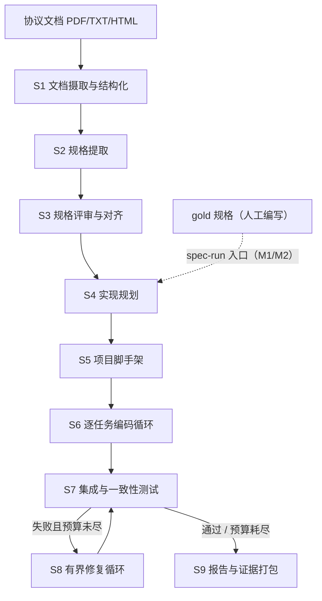
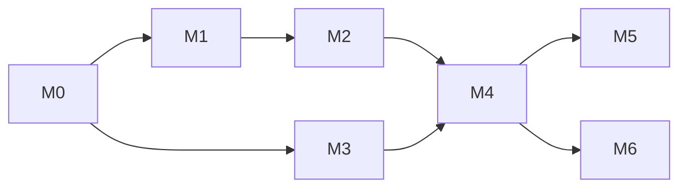

# NePA 系统设计文档

> 文档状态：Active\
> 设计版本：0.3.0\
> 最后更新：2026\-07\-26\
> 修订说明：v0.3.0 补全第 9～12 章（评估体系、里程碑执行计划、风险与开放问题、附录）并完成全文一致性校验，全文首次达到完整可实施状态。修订历史见 12.4。

## 0\. 阅读指南

### 0\.1 本文档的使用方式

本文档是 NePA 的唯一主设计文档（Single Source of Truth）。写作目标是：一名此前不了解本项目的工程师，或一个上下文中只有本文档的编码智能体（LLM），都能据此独立完成对应模块的实现，无需口头补充信息。

按角色的建议阅读路径：

| 你要做的事                      | 必读章节        | 参考章节  |
| ------------------------------- | --------------- | --------- |
| 了解项目全貌                    | 1、2、3、4      | 10        |
| 实现编排器与流水线框架          | 4、8            | 5、6      |
| 实现某个具体阶段（S1～S9）      | 6 中对应小节、5 | 3、4      |
| 编写/维护 gold 规格与功能测试集 | 5、7            | 9         |
| 编写提示词模板                  | 3、8.8          | 6         |
| 设计与运行实验                  | 9、10           | 4\.6、4.7 |

给编码智能体（LLM 实现者）的硬性规则：

1. 本文档与代码冲突时，**必须**以本文档为准；若文档自身矛盾或缺失，**必须**停止实现并向人类报告，**禁止**自行猜测后继续。
2. 文中标注"默认，可推翻"的决策，推翻前**必须**征得项目负责人同意，并同步更新本文档。
3. 实现任何模块前，先阅读其验收标准；"完成"的定义是**验收标准可机器判定地通过**，而非"代码写完"。
4. 每完成一个模块，**必须**运行该模块对应的测试并附上结果，**禁止**以"应该能跑"作为交付说辞。

### 0\.2 规范用语

本文采用 RFC 2119 风格的规范用语：**必须（MUST）**、**禁止（MUST NOT）**、**应当（SHOULD）**、**不建议（SHOULD NOT）**、**可以（MAY）**。未标注规范用语的内容为说明性描述。

### 0\.3 默认技术选型速览

下表汇总全文的默认技术决策，各章给出详细理由。所有条目均为"默认，可推翻"，推翻的前提见 0.1。

| 事项                    | 默认选型                                            | 详见      |
| ----------------------- | --------------------------------------------------- | --------- |
| NePA 实现语言           | Python ≥ 3.11，自研编排，不使用智能体框架           | 8\.1      |
| 依赖与环境管理          | uv；单仓库单包                                      | 8\.1      |
| LLM 接入                | 自研 provider 无关抽象层，支持任意可 API 调用的模型 | 8\.4      |
| 编排形态                | v1 线性流水线 \+ 有界循环；蜂群并行仅预留扩展点     | 4\.2、4.9 |
| 数据工件格式            | JSON（UTF\-8），以 JSON Schema draft 2020\-12 校验  | 5         |
| 首个目标协议 / 实现语言 | MQTT 3.1.1 最小子集 / C99                           | 2\.3、7   |
| 生成项目构建方式        | GNU Make，gcc，`-Wall -Wextra -Werror`              | 7\.4      |
| 测试框架                | pytest（gold 功能测试与 NePA 自身单测均用）         | 5\.3、7.2 |
| 构建/测试沙箱           | Docker（Linux 容器，默认禁网）                      | 8\.5      |
| 生成工作区版本管理      | git（每任务一次提交）                               | 6\.6      |
| 提示词模板语言          | 英文模板正文 \+ 中文维护注释                        | 8\.8      |

## 1\. 文档目的

本文是 NePA（Network Protocol Agent，网络协议生成智能体系统）开发的主设计文档，面向两类读者：项目的人类开发者与研究者，以及参与工程实现的编码智能体。

文档回答四个问题：

1. NePA 要做什么、不做什么——第 2 章；
2. 为什么这样设计，设计思想从何而来——第 3 章；
3. 系统长什么样：架构、数据工件、每个阶段的精确行为、工程实现——第 4～8 章；
4. 怎么知道做得对不对：评估体系与里程碑验收——第 9～10 章。

## 2\. 系统定义

### 2\.1 产品定位

NePA 是一个多流程的智能体系统，用于网络协议代码的自动化生成。它不追求工业级协议代码的高性能和高可靠，仅面向网络协议的前瞻性测试和验证，服务于网络领域科研人员。

当前产品的预估协议范围暂定为应用层协议。

### 2\.2 最终目标

NePA 的长期目标是：支持 PDF、TXT、HTML 等载体中网络协议的 RFC、标准组织文档和厂商技术文档作为输入，通过 NePA 生成对应网络协议的客户端、服务端、Broker、代理或协议库。

### 2\.3 短期目标（里程碑总览）

基于任务本身的高度复杂性，将系统任务分为以下里程碑节点。各里程碑的入口条件、任务分解与验收标准（DoD）在第 10 章逐一展开。

**M0. 首个协议及其范围。** 明确先采用 MQTT 3.1.1 作为实验协议，只实现其最基础的功能子集，同时在此基础上维护一个人工的 gold 规格文件和对应的功能测试集。当前固定 MQTT 用 C 语言实现。规格文件采用本文档第 5 章定义的 `specs-requirements.schema.json`（v2.0，以本文档为规范来源；替代早期草案版本）。

**M1. 人工规格到可构建协议实现。** 输入人工编写的 Spec，能够直接生成无需人工修改的可构建完整项目，同时生成过程可重复且稳定。

**M2. 协议一致性验证与受控修复。** 生成的协议代码能够完成选定的功能目标，并且可以自动运行测试和修复，在有限时间和资源情况下修复问题。

**M3. 技术文档到可追溯协议规格。** 至少支持一种格式的文档输入，输出与 M0 格式一致的规格文件，并通过指标保证其正确率和准确率。

**M4. 端到端闭环。** 在 MQTT 的最小功能集上完成完整流程"文档 → Spec IR → 代码 → 构建 → 独立测试 → 有界修复 → 证据报告"。

**M5. 完整 MQTT 协议的实现。** 扩展 MQTT 的 gold spec，使其符合完整的 MQTT 协议文档要求，并且系统仍能生成可行正确的代码。

**M6. 不同类型协议泛化。** 能够在其他应用层协议上完成相同的端到端实验。

里程碑之间的依赖关系：M0 → M1 → M2 → M4；M3 可与 M1/M2 并行推进，M4 依赖 M2 与 M3；M5、M6 在 M4 之后展开。

### 2\.4 非目标

以下内容明确不在当前项目范围内，任何实现**禁止**擅自扩大范围：

- 工业级性能与高可用：不做吞吐、并发规模、7×24 稳定性优化；
- 安全加固与合规审计：TLS 等安全特性仅在协议语法层面涉及，不做安全性保证；
- 传输层及以下协议：不实现 TCP/UDP 之下的协议栈，当前聚焦应用层；
- 通用软件项目生成：NePA 只面向"规格可形式化的网络协议"这一垂直领域；
- 图形界面与产品化交互：v1 仅提供 CLI。

## 3\. 设计基石：编码智能体的工作流范式

本章回答"为什么这样设计"。NePA 的流水线不是凭空发明的，而是把两类已被验证的实践固化为无人值守的自动化系统：一是 Claude Code、Codex 等交互式编码智能体处理真实工程任务的工作流；二是 Cursor 团队在大规模智能体蜂群实验（《智能体蜂群与新的模型经济学》，2026）中得到的编排与模型经济学结论。后续所有架构决策都会回指本章的原则编号（P1～P8）。

### 3\.1 交互式编码智能体如何完成"文档 → 协议代码"

把"这是 MQTT 3.1.1 的规格文档，给我一个 C 语言的最小客户端与 Broker 实现"直接交给今天的 Claude Code 或 Codex，观察其工作过程，可以提炼出一个稳定的七步工作流：

**步骤 1：范围澄清与验收定义。** 先确定做哪些、不做哪些、怎么算做完。交互式智能体靠追问用户获得答案；这一步的产出是一份双方认可的范围与验收清单。

**步骤 2：定向上下文侦察。** 不逐页通读整本文档，而是先建立文档结构索引（目录、章节标题），再按当前范围定向精读相关小节，把关键信息提炼为自己的工作笔记——本质上是一份非正式的中间规格。

**步骤 3：显式计划。** 生成有序的任务清单（todo list），每项小到可以独立完成与验证；计划是活文档，执行过程中持续更新状态、追加新发现的任务。

**步骤 4：先搭可验证的骨架。** 第一批任务永远是工程骨架：目录结构、构建系统、能编译通过的空实现、能运行的测试入口。先让"验证回路"通电，再开始堆功能。

**步骤 5：小步实现—验证循环。** 每次只做一个小任务：写码 → 编译 → 跑相关测试 → 读报错 → 修复 → 通过后提交（git 检查点）。编译器报错与测试断言失败是驱动下一步行动的主要输入。

**步骤 6：独立验证与自我审查。** 全部任务完成后运行全量测试，并回到规格逐条核对覆盖情况。不以"我写完了"为完成标准，只承认可复现的验证结果。

**步骤 7：交付与证据。** 汇报完成了什么、没完成什么、测试证据、已知问题与所做假设。

支撑这七步的底层机制同样重要：**工具调用**（读写文件、执行命令，智能体的一切动作通过工具产生可见效果）；**上下文管理**（对长文档做摘要与检索，避免上下文被无关内容淹没）；**子智能体**（把大范围搜索、专项分析派给独立上下文的临时智能体，只回传结论）；**检查点**（git 提交与回滚能力）；**预算意识**（时间与轮次有限，卡住时换策略或上报，而非无限重试）。

### 3\.2 八条可迁移设计原则

从 3.1 提炼出八条原则。它们是 NePA 全部架构决策的依据，后文以 P1～P8 引用。

| 编号 | 原则                     | 来源实践                           | 在 NePA 中的落地                                             |
| ---- | ------------------------ | ---------------------------------- | ------------------------------------------------------------ |
| P1   | 验证优先，测试即真值     | 智能体不自我宣称成功，只认测试结果 | 功能测试集由人工维护、独立于生成过程（5.3）；所有阶段验收机器可判（第 6 章） |
| P2   | 小步快反馈               | 每次小改动立即编译、测试           | S6 按任务粒度生成代码，每任务一轮构建\+单测循环（6.6）       |
| P3   | 计划是显式工件           | todo 清单驱动执行、随时可查        | `plan.json` 任务图：依赖、验收、状态落盘，可续跑（5.2）      |
| P4   | 上下文按需定向注入       | 不整本读文档，只检索相关片段       | 下游阶段只消费 Spec IR 切片，原始文档止步于 S2（4.3、6.6）   |
| P5   | 角色分离、新鲜上下文     | 子智能体隔离专项任务               | 每次 Agent 调用无会话历史，输入是工件切片，输出是结构化结果（4.5） |
| P6   | 循环必须有界             | 卡住换策略或上报，不无限重试       | 三重预算 \+ 升级路径 \+ 受控失败（4.7、6.8）                 |
| P7   | 一切落盘、可恢复、可审计 | git 检查点、可回滚                 | `runs/` 工件目录 \+ git 工作区 \+ trace 证据链（4.4、5.5）   |
| P8   | 结构化输出契约           | 工具参数经严格校验                 | 所有 LLM 输出经 JSON Schema 校验，失败一次修复重试（8.8）    |

### 3\.3 蜂群与模型经济学的启示

Cursor 的蜂群实验（数千智能体并行、依据 800 余页手册重新实现 SQLite）给出了五条与 NePA 直接相关的结论：

1. **分层分解优于扁平并行。** 有效架构是"规划器—工作者"的树状分解：规划器由最强模型驱动，负责目标拆解与设计决策；工作者由便宜模型驱动，执行具体编码。关键收益来自**上下文效率**而非并行度本身——规划器不被实现细节淹没，工作者不需要全局视野。
2. **模型分层的经济学非常显著。** 该实验中，全程使用旗舰模型成本约 $10,565，而"强模型规划 \+ 经济模型执行"的混合配置成本约 $1,339，最终质量不降（均 100% 通过测试）。规划器消耗的 token 少但占成本约三分之二，工作者处理大部分 token 却只占约三分之一。含义：真正需要前沿能力的环节（任务分解、设计决策）占比极小，一旦意图被转化为明确指令，廉价模型即可胜任。
3. **评审是高回报投入。** "投入在审查上的算力回报很高，因为审查成本远低于被审查工作。"多个相关性低的评审视角（不同模型、不同信息源）叠加，类似多传感器融合。
4. **共享规格防止"脑裂"。** 大量智能体各自解读意图会产生重复实现与冲突决议；对策是维护一份共享设计文档，代码通过可追溯引用与之关联。这正对应 NePA 的核心枢纽 Spec IR：所有下游工作只认规格，不各自解读原始文档。
5. **抽象层级的演进终点是规格本身。** 从自动补全（行）→ 早期 LLM（代码块）→ 智能体（文件/功能）→ 蜂群（整份规格说明）。稀缺资源正在从模型能力转向"对意图的准确描述"。NePA 的立项假设与此一致：把"文档 → 代码"拆为"文档 → 规格"与"规格 → 代码"两个半程，以规格为枢纽。

同一实验也给出了反面教训：缺乏协调机制的并行会产生大量"无效忙碌"（旧框架两小时产生 68,000 次提交、7 万余次合并冲突，最终质量反而更低且方差极大）。因此 NePA v1 **不做**大规模并行，只吸收四点：分层分解（S4 规划 → S6 执行）、模型分层路由（4.6）、评审关卡（S3、S7）、规格中心化（第 5 章）；并行蜂群作为扩展点预留（4.9）。

### 3\.4 NePA 与交互式智能体的关键差异

NePA 是无人值守的流水线，不能照搬交互式工作流，差异与应对如下：

| 维度     | 交互式（Claude Code / Codex） | NePA（无人值守）         | 设计应对                                                     |
| -------- | ----------------------------- | ------------------------ | ------------------------------------------------------------ |
| 歧义处理 | 随时向用户追问                | 运行中无人可问           | 歧义在入口前置消解：Spec IR 必填字段 \+ 保守默认值 \+ 假设记录进报告（6.4、6.9） |
| 完成判定 | 用户主观认可                  | 必须机器可判             | 一切验收标准可执行：测试、校验器、指标阈值（第 6、9 章）     |
| 过程控制 | 用户随时打断纠偏              | 只能靠预算与停止条件兜底 | 三重预算与受控失败（4.7）                                    |
| 复现要求 | 无                            | 科研场景要求可复现       | 全工件落盘、trace 记录、低温度采样、N 次重复统计（5.5、9.2） |
| 流程决策 | 模型自主决定下一步            | 流程由确定性代码掌控     | LLM 只在阶段内做受限决策，编排器是普通 Python 状态机（4.2）  |

## 4\. 总体架构

### 4\.1 流水线总览

NePA 的主体是一条由 9 个阶段（S1～S9）组成的流水线。阶段之间只通过落盘的数据工件通信（P7），不共享任何内存状态或对话历史（P5）。



流水线有两个入口，对应不同里程碑：

- **doc\-run（完整入口，M3/M4）**：输入协议文档，从 S1 开始跑完整链路。
- **spec\-run（规格入口，M0～M2）**：输入人工编写的 gold 规格，跳过 S1～S3，从 S4 开始。这保证 M1/M2 的研发不被文档提取的难度阻塞。

| 阶段 | 名称             | 服务里程碑 | 一句话职责                                             |
| ---- | ---------------- | ---------- | ------------------------------------------------------ |
| S1   | 文档摄取与结构化 | M3         | 把 PDF/TXT/HTML 变成带章节索引的结构化文本分片         |
| S2   | 规格提取         | M3         | 从文档分片提取 Spec IR（分片提取 → 合并 → 自检）       |
| S3   | 规格评审与对齐   | M3         | 规格的机器校验 \+ LLM 评审；实验模式下与 gold 对齐评分 |
| S4   | 实现规划         | M1         | 把 Spec IR 编译为模块划分与任务图 plan.json            |
| S5   | 项目脚手架       | M1         | 用确定性模板生成可构建的空项目骨架                     |
| S6   | 逐任务编码循环   | M1         | 按任务图逐个生成代码：构建、单测、有界修复、git 提交   |
| S7   | 集成与一致性测试 | M2         | 在沙箱运行人工 gold 功能测试集（独立于生成过程）       |
| S8   | 有界修复循环     | M2         | 失败聚类 → 定位 → 修复 → 回归，直到通过或预算耗尽      |
| S9   | 报告与证据打包   | M2/M4      | 汇总覆盖率、测试结果、成本与假设，产出证据报告         |

### 4\.2 四层运行时结构

系统在运行时分四层，职责边界**必须**严格遵守：

| 层   | 名称                | 实现方式               | 职责                                            | 禁止事项                               |
| ---- | ------------------- | ---------------------- | ----------------------------------------------- | -------------------------------------- |
| L1   | Orchestrator 编排器 | 确定性 Python 代码     | 运行生命周期、阶段顺序、预算记账、断点恢复      | 禁止让 LLM 决定流程走向                |
| L2   | Stage 阶段控制器    | 确定性 Python 代码     | 单阶段内部流程：循环、校验、重试、组装上下文    | 禁止跨阶段直接传内存对象（必须经工件） |
| L3   | Agent 智能体        | 一次无状态 LLM 调用    | 在给定上下文内完成单一认知任务，输出结构化结果  | 禁止产生副作用；禁止携带会话历史       |
| L4   | Tool 工具           | 确定性 Python/系统调用 | 一切副作用：读写文件、git、构建、测试、沙箱执行 | 禁止调用 LLM                           |

两条全局规则：

1. **LLM 的决策范围被其输出 Schema 限定**（P8）：一个 Agent 能做的所有"决定"都必须体现在输出 JSON 的字段里，编排器只按字段行事。
2. **一切副作用经过工具层**：Agent 输出的"写文件/跑命令"意图由 Stage 控制器解析后调用工具执行，从而全部可记录、可重放（P7）。

### 4\.3 核心数据工件

| 工件       | 路径（相对运行目录）                     | 产生者                | 主要消费者         | Schema 定义 |
| ---------- | ---------------------------------------- | --------------------- | ------------------ | ----------- |
| 运行元数据 | `run.json`                               | 编排器                | 编排器（恢复）、S9 | 8\.3        |
| 文档包     | `doc/`                                   | S1                    | S2                 | 5\.1 附属   |
| 规格       | `spec/spec.json`                         | S2/S3（或 gold 拷贝） | S4、S6、S7、S9     | **5\.1**    |
| 规格评审   | `spec/spec_review.json`                  | S3                    | S9、人类           | 5\.1 附属   |
| 计划       | `plan/plan.json`                         | S4                    | S5、S6、S9         | **5\.2**    |
| 生成工作区 | `workspace/`（git 仓库）                 | S5～S8                | S7、人类           | 7\.2        |
| 测试结果   | `test_results/`                          | S6、S7                | S8、S9             | 5\.4        |
| 修复日志   | `repair/repair_log.json`                 | S6、S8                | S9                 | 5\.4        |
| 证据报告   | `report/report.json`、`report/report.md` | S9                    | 人类、论文实验     | 5\.4        |
| 调用踪迹   | `trace/*.ndjson`                         | 全程                  | 评估、审计         | 5\.5        |

关键约束（P4 的落地）：**原始文档止步于 S2**。S4 之后的任何 Agent 上下文中**禁止**出现原始文档内容，只允许出现 Spec IR 的切片。这一约束保证：(a) 下游行为可完全归因于规格质量；(b) 上下文规模可控；(c) "文档 → 规格"与"规格 → 代码"两个半程可独立评估。

### 4\.4 运行目录布局

每次运行（run）在 `runs/` 下创建独立目录，命名 `<UTC时间戳>_<协议>_<入口>`：

```text
runs/20260726T1432Z_mqtt-min_spec-run/
├── run.json                  # 运行元数据：输入、配置快照、阶段状态、预算消耗
├── doc/                      # S1 产物（doc-run 才有）
│   ├── source.pdf            # 原始文档副本
│   └── segments.json         # 结构化分片索引
├── spec/
│   ├── spec.json             # Spec IR（S2/S3 产物，或 gold 拷贝）
│   └── spec_review.json      # S3 评审结论
├── plan/
│   └── plan.json             # 模块划分与任务图
├── workspace/                # git 仓库：生成的 C 项目（布局见 7.2）
├── test_results/
│   ├── round_001/            # 每轮测试一个目录：junit.xml + summary.json
│   └── ...
├── repair/
│   └── repair_log.json
├── report/
│   ├── report.json
│   └── report.md
├── trace/
│   ├── llm_calls.ndjson      # 每次 LLM 调用一行（5.5）
│   └── stage_events.ndjson   # 阶段级事件流
└── cache/                    # prompt→response 缓存（可选，8.4）
```

配置快照**必须**在运行开始时完整写入 `run.json`（含模型绑定、预算、开关），保证任何一次历史运行都能被精确解释与复现（P7）。

### 4\.5 智能体角色表

所有 LLM 调用都以"角色"为单位定义。角色 \= 提示词模板 \+ 输入工件切片规则 \+ 输出 Schema \+ 模型档位绑定。

| 角色                     | 所属阶段 | 默认档位               | 输入（上下文包）                             | 输出（经 Schema 校验）             |
| ------------------------ | -------- | ---------------------- | -------------------------------------------- | ---------------------------------- |
| DocSegmenter 文档分段员  | S1       | T3                     | 原始文本页块                                 | 章节树与分片标注                   |
| SpecExtractor 规格提取员 | S2       | T1                     | 单个文档分片 \+ Spec IR 片段 Schema          | Spec IR 片段（消息/状态机/行为等） |
| SpecMerger 规格合并员    | S2       | T1                     | 多个片段 \+ 冲突清单                         | 合并决议                           |
| SpecCritic 规格评审员    | S3       | T1（与提取员不同型号） | 完整 spec.json \+ 校验器报告                 | 问题清单与修改建议                 |
| Planner 规划员           | S4       | T1                     | 完整 spec.json \+ 目标形态约束（第 7 章）    | plan.json                          |
| Coder 编码员             | S6       | T2                     | 单任务说明 \+ 相关 Spec 切片 \+ 相关接口文件 | 完整源文件集                       |
| Diagnoser 诊断员         | S6/S8    | T2，升级 T1            | 失败输出（编译/测试）\+ 相关代码             | 根因假设与修复位置                 |
| Fixer 修复员             | S6/S8    | T2，升级 T1            | 诊断结论 \+ 目标文件                         | 修复后的完整文件                   |
| Reporter 报告员          | S9       | T3                     | 各工件摘要                                   | report.md 正文                     |

注意：S3 的"与 gold 对齐评分"由确定性比对工具完成（9.1），**不是** LLM 角色；LLM 只承担无 gold 可比时的定性评审。

### 4\.6 模型分层与路由

依据 3.3 的经济学结论，模型按能力/价格分三档，角色绑定档位，档位绑定具体型号（全部走配置，8.3）：

| 档位 | 定位     | 承担角色                              | 选型原则                                                     |
| ---- | -------- | ------------------------------------- | ------------------------------------------------------------ |
| T1   | 最强推理 | 提取、合并、评审、规划、疑难诊断/修复 | 当前可用的旗舰模型；错误在此层的代价最高（错误会被下游放大） |
| T2   | 经济执行 | 编码、常规诊断/修复                   | 代码能力强、成本低的模型；消耗大部分 token                   |
| T3   | 轻量辅助 | 分段、摘要、报告成文                  | 最便宜的可用模型                                             |

路由规则：

1. 角色 → 档位的绑定是静态配置；**禁止**在运行中由 LLM 自选模型。
2. **升级路径**（P6）：Coder/Fixer 在同一任务上连续失败 2 次后，第 3 次尝试自动升级到 T1；仍失败则任务标记 `blocked`，进入受控失败流程（4.7）。
3. 评审类角色**应当**绑定与被评审内容生产者不同的型号（3.3 结论 3：低相关视角叠加）。
4. 每次调用的 token 数、成本**必须**记入 trace（5.5），按角色/阶段聚合进报告（P7），为后续成本\-质量消融实验提供数据（9.3）。

### 4\.7 预算与停止条件

无人值守系统必须有硬性的资源边界（P6）。预算分三个维度，任何一个耗尽即触发所在层级的停止动作：

| 层级  | 预算项                        | 默认值                         | 耗尽动作                                        |
| ----- | ----------------------------- | ------------------------------ | ----------------------------------------------- |
| 全局  | 墙钟时间                      | 4 h                            | 中止当前阶段，跳转 S9 出"部分报告"              |
| 全局  | 累计成本（USD 或 token 折算） | 配置必填，无默认               | 同上                                            |
| S2    | 单分片提取重试                | ≤ 2 次                         | 该分片标记 `extraction_failed`，进 spec\_review |
| S6    | 单任务修复迭代                | ≤ 3 次（T2）\+ 1 次（T1 升级） | 任务 `blocked`，跳过其下游依赖任务              |
| S6    | 任务总数上限                  | plan 任务数 × 1.5              | 停止接受新增任务                                |
| S7/S8 | 全局修复轮数                  | ≤ 3 轮                         | 停止修复，跳转 S9                               |
| S7/S8 | 收敛判据                      | 每轮失败测试数必须严格递减     | 不递减立即停止修复（防振荡）                    |

**受控失败**是一等公民：预算耗尽不是异常，而是一种正常出口。此时系统**必须**：(a) 保存全部现场工件；(b) 在 report.json 中标记 `outcome: degraded` 并列出未完成项与 blocked 原因；(c) 退出码区分"成功/降级/错误"。**禁止**静默失败或死循环。

### 4\.8 断点恢复与幂等

- `run.json` 维护阶段状态机：`pending / running / done / failed / skipped`，每次状态变更用"写临时文件 \+ 原子改名"落盘。
- 阶段完成的判定 \= 其输出工件存在**且通过对应 Schema 校验**，而非仅有状态标记。
- `nepa resume <run_id>` 从第一个未完成阶段续跑；S6 内部以任务为恢复粒度（plan.json 中的任务状态 \+ workspace 的 git 提交一一对应）。
- 所有 Stage 控制器**必须**幂等：重复执行已完成阶段是无害的空操作。
- 可选的 LLM 响应缓存（键 \= 提示词哈希 \+ 模型 \+ 参数，8.4）让"重放一次历史运行"接近零成本，用于调试与回归。

### 4\.9 蜂群并行扩展点（预留，v1 不实现）

v1 为线性流水线；以下扩展点在架构上预留接口，未来按需启用。启用任何一项前，**必须**先满足其前提条件：

| 扩展点          | 内容                                                         | 启用前提                                                | 参考        |
| --------------- | ------------------------------------------------------------ | ------------------------------------------------------- | ----------- |
| E1 任务并行     | S6 中无依赖且交付文件集不相交的任务并行派发多个 Coder        | plan.json 的 `deliverable_files` 互斥检查；串行合并提交 | 3\.3 结论 1 |
| E2 N\-best 择优 | 关键任务（S2 提取、S6 核心模块）并行生成 N 个候选，评审员择优 | 有可靠的自动评审标准；预算充足                          | 3\.3 结论 3 |
| E3 修复假设竞争 | S8 对同一失败并行尝试多个修复假设，取先通过者                | 沙箱可并行隔离运行测试                                  | —           |
| E4 多视角评审   | S3/S7 用多个不同模型独立评审后聚合                           | 至少两家 provider 可用                                  | 3\.3 结论 3 |

为此，编排器的任务调度接口**应当**设计为"提交任务集合 → 收集结果集合"，内部是串行还是并行对上层透明（8.2）。

## 5\. 数据工件与 Schema

本章定义流水线中所有结构化工件的数据格式。这些定义是系统的"接口宪法"：**任何实现与本章冲突即为 bug**。正式的 JSON Schema 文件位于 `nepa/schemas/`（M0 任务之一是把本章表格转写为机器可校验的 schema 文件，见 10.1）。

通用约定：

- 编码一律 UTF\-8 JSON；键名 `snake_case`。
- 所有 `id` 类字段：小写字母数字与连字符/下划线，全局唯一性由校验器检查。
- 所有工件顶层**必须**带 `schema_version` 字段（语义化版本），消费者按主版本兼容。
- 校验分两级：**结构校验**（JSON Schema draft 2020\-12）与**引用完整性校验**（自研 `spec_lint` 工具，见本章各节"校验规则"）。

### 5\.1 Spec IR：specs\-requirements.schema.json

Spec IR（Intermediate Representation）是整个系统的枢纽工件（3.3 结论 4/5）：上承文档提取（S2 的输出目标），下启代码生成（S4～S7 的唯一事实来源）。

设计决策（默认，可推翻）：

1. **JSON 而非形式化 IDL**（ASN.1、P4 等）：LLM 生成与消费 JSON 最稳定，工具链成熟，可直接 Schema 校验；形式化程度靠受限字段值（枚举、结构化约束）逐步逼近。
2. **五视图结构**：报文语法（messages/types）、行为语义（state\_machines/behaviors）、时间（timers）、错误处理（errors）、需求索引（requirements）。前四者描述"协议是什么"，需求索引提供"每条规范性要求来自哪里、被谁覆盖"的可追溯性。
3. **需求条目是追溯的原子单位**：文档 → REQ → 规格元素 → 计划任务 → 代码文件 → 测试用例，整条链靠 `req_ids` 贯穿（服务 M3 的"可追溯"目标）。

#### 5\.1.1 顶层结构

| 键               | 类型   | 必填 | 说明                                                  |
| ---------------- | ------ | ---- | ----------------------------------------------------- |
| `schema_version` | string | 是   | 本文档定义的版本为 `"2.0"`                            |
| `meta`           | object | 是   | 规格元数据：协议名、版本、来源（人工/提取）、创建时间 |
| `scope`          | object | 是   | 实现范围：角色、纳入/排除的特性、全局假设             |
| `transport`      | object | 是   | 传输层假定：层（tcp/udp）、默认端口、字节序           |
| `types`          | array  | 是   | 命名编码类型定义（协议无关的类型系统，见 5.1.2）      |
| `messages`       | array  | 是   | 报文（PDU）定义（5.1.3）                              |
| `state_machines` | array  | 是   | 按角色的状态机（5.1.4）                               |
| `behaviors`      | array  | 是   | 无法归入字段/转移的规范性行为条款（5.1.5）            |
| `timers`         | array  | 否   | 定时器：来源、超时动作                                |
| `errors`         | array  | 否   | 错误条件与要求的处理动作                              |
| `constants`      | array  | 否   | 命名常量                                              |
| `requirements`   | array  | 是   | 需求索引（5.1.6）                                     |

`meta.source.kind ∈ {manual, extracted}` 区分 gold 规格与提取产物；`scope.features_excluded[].reason` 强制记录排除理由（消歧义，见 3.4）。

#### 5\.1.2 类型系统 types

内建原语：`uint8`、`uint16_be`、`uint32_be`、`bytes`、`bitfield8`。协议特有编码在 `types` 中命名定义，字段通过名字引用——这使 Spec IR 对 MQTT 之外的二进制协议保持通用（M6）。

| 键              | 类型   | 必填    | 说明                                                         |
| --------------- | ------ | ------- | ------------------------------------------------------------ |
| `id` / `name`   | string | 是      | 类型标识与人类可读名                                         |
| `encoding.kind` | enum   | 是      | `varint`、`length_prefixed_string`、`length_prefixed_bytes`、`fixed`、`enum` |
| `encoding.*`    | —      | 按 kind | 每种 kind 的参数，如 varint 的 `max_bytes`、分组位宽；字符串的 `length_type`、`charset` |
| `constraints`   | array  | 否      | 值域约束（max、charset 等）                                  |
| `req_ids`       | array  | 否      | 关联需求                                                     |

MQTT 3.1.1 需要的两个命名类型：`mqtt_varint`（剩余长度：7 bit 分组小端序继续位编码，最多 4 字节，最大 268 435 455）与 `mqtt_utf8_string`（`uint16_be` 长度前缀 \+ UTF\-8 字节）。

#### 5\.1.3 报文定义 messages

| 键                 | 类型   | 必填 | 说明                                                         |
| ------------------ | ------ | ---- | ------------------------------------------------------------ |
| `id` / `name`      | string | 是   | 如 `connect` / `CONNECT`                                     |
| `packet_type_code` | int    | 是   | 线上类型码（MQTT 固定头高 4 位）                             |
| `direction`        | enum   | 是   | `client_to_server` / `server_to_client` / `both`             |
| `wire_layout`      | array  | 是   | 有序段列表，MQTT 为 `[fixed_header, variable_header, payload]` |
| `fields`           | array  | 是   | 字段列表，顺序即线序                                         |
| `req_ids`          | array  | 是   | 本报文关联的需求                                             |

字段（`fields[]`）子结构：

| 键             | 类型   | 必填        | 说明                                                         |
| -------------- | ------ | ----------- | ------------------------------------------------------------ |
| `name`         | string | 是          | 字段名                                                       |
| `loc`          | enum   | 是          | 所在段（`wire_layout` 之一）                                 |
| `type`         | string | 是          | 原语或 `types` 中的命名类型                                  |
| `bits`         | array  | bitfield 时 | 位定义：`name`、`offset`、`width`、可选 `constraint`         |
| `presence`     | object | 否          | 条件存在：`{"when": {"field": "connect_flags.will_flag", "equals": 1}}`；缺省恒存在 |
| `constraint`   | object | 否          | 值约束：`const`、`min`/`max`、`min_len`/`max_len`、`charset`、`enum` |
| `derived`      | object | 否          | 派生字段（如剩余长度 `{"kind": "length_of", "of": ["variable_header", "payload"]}`），编解码器**必须**计算而非当作自由输入 |
| `on_violation` | object | 否          | 约束被违反时要求的动作：`close_connection`、`connack_then_close`（携带 rc）等 |
| `req_ids`      | array  | 否          | 关联需求                                                     |

#### 5\.1.4 状态机 state\_machines

每个角色（client/broker）一台状态机：`states[]`、`initial`、`transitions[]`。转移结构：

| 键            | 类型   | 说明                                                         |
| ------------- | ------ | ------------------------------------------------------------ |
| `from` / `to` | string | 状态名                                                       |
| `event`       | string | 受限词表：`recv:<MSG>`、`send:<MSG>`、`timer:<id>`、`api:<call>`、`transport:<connected\|closed>` |
| `guard`       | string | 条件表达式，语法限定为 `字段 比较符 常量` 的与组合，如 `connect.protocol_level != 4`；仅作文档与测试依据，不要求可执行 |
| `actions`     | array  | 有序动作，受限词表：`send:<MSG>(参数)`、`close`、`start_timer:<id>`、`stop_timer:<id>`、`deliver:<内部事件>` |
| `req_ids`     | array  | 关联需求                                                     |

#### 5\.1.5 行为条款 behaviors

凡不能自然表达为字段约束或状态转移的规范性要求（如"同一连接收到第二个 CONNECT 必须断开"、"主题匹配规则"），写成行为条款：

| 键                 | 类型   | 说明                                                         |
| ------------------ | ------ | ------------------------------------------------------------ |
| `id`               | string | `BEH-<角色>-<序号>`                                          |
| `role`             | enum   | `client` / `broker` / `both`                                 |
| `trigger`          | string | 触发情形（自然语言，允许）                                   |
| `requirement`      | string | 要求的行为（自然语言，规范化措辞）                           |
| `level`            | enum   | `MUST` / `SHOULD` / `MAY`                                    |
| `observable_check` | string | **必填**：如何从外部观察验证——这是把模糊语义压成可测试条款的强制机制 |
| `req_ids`          | array  | 关联需求                                                     |

#### 5\.1.6 需求索引 requirements

| 键                    | 类型   | 说明                                                         |
| --------------------- | ------ | ------------------------------------------------------------ |
| `id`                  | string | `REQ-<主题>-<三位序号>`，如 `REQ-CONNECT-002`                |
| `text`                | string | 规范化的需求陈述（中文，保留关键英文术语）                   |
| `level`               | enum   | `MUST` / `MUST NOT` / `SHOULD` / `MAY`                       |
| `category`            | enum   | `syntax` / `semantics` / `timing` / `error_handling`         |
| `source_ref`          | object | 文档定位：`section`（章节号）\+ `quote`（原文关键句）；gold 规格同样必填（指向公开标准文档） |
| `covered_by.elements` | array  | 覆盖此需求的规格元素路径                                     |
| `covered_by.tests`    | array  | 覆盖此需求的测试用例标识（pytest nodeid 前缀）               |

#### 5\.1.7 示例片段（MQTT CONNECT 节选）

```json
{
  "messages": [{
    "id": "connect",
    "name": "CONNECT",
    "packet_type_code": 1,
    "direction": "client_to_server",
    "wire_layout": ["fixed_header", "variable_header", "payload"],
    "fields": [
      {"name": "packet_type", "loc": "fixed_header", "type": "bitfield8",
       "bits": [
         {"name": "type", "offset": 4, "width": 4, "constraint": {"const": 1}},
         {"name": "flags", "offset": 0, "width": 4, "constraint": {"const": 0},
          "on_violation": {"action": "close_connection"}}
       ],
       "req_ids": ["REQ-FRAME-002"]},
      {"name": "remaining_length", "loc": "fixed_header", "type": "mqtt_varint",
       "derived": {"kind": "length_of", "of": ["variable_header", "payload"]},
       "req_ids": ["REQ-FRAME-001"]},
      {"name": "protocol_name", "loc": "variable_header", "type": "mqtt_utf8_string",
       "constraint": {"const": "MQTT"},
       "on_violation": {"action": "close_connection"},
       "req_ids": ["REQ-CONNECT-001"]},
      {"name": "protocol_level", "loc": "variable_header", "type": "uint8",
       "constraint": {"const": 4},
       "on_violation": {"action": "connack_then_close", "connack_rc": 1},
       "req_ids": ["REQ-CONNECT-002"]},
      {"name": "keep_alive", "loc": "variable_header", "type": "uint16_be",
       "req_ids": ["REQ-CONNECT-004"]},
      {"name": "client_id", "loc": "payload", "type": "mqtt_utf8_string",
       "constraint": {"min_len": 1, "max_len": 23, "charset": "0-9a-zA-Z"},
       "on_violation": {"action": "connack_then_close", "connack_rc": 2},
       "req_ids": ["REQ-CONNECT-005"]}
    ],
    "req_ids": ["REQ-CONNECT-001", "REQ-CONNECT-002"]
  }],
  "state_machines": [{
    "id": "broker_session", "role": "broker",
    "states": ["wait_connect", "connected", "closed"],
    "initial": "wait_connect",
    "transitions": [
      {"from": "wait_connect", "event": "recv:CONNECT",
       "guard": "connect.protocol_level != 4",
       "actions": ["send:CONNACK(rc=1)", "close"], "to": "closed",
       "req_ids": ["REQ-CONNECT-002"]},
      {"from": "connected", "event": "recv:CONNECT",
       "actions": ["close"], "to": "closed",
       "req_ids": ["REQ-STATE-001"]}
    ]
  }],
  "behaviors": [{
    "id": "BEH-BROKER-001", "role": "broker",
    "trigger": "收到 PUBLISH（QoS 0），存在主题完全匹配的订阅者",
    "requirement": "MUST 将消息转发给每个匹配订阅者各一次",
    "level": "MUST",
    "observable_check": "客户端 A 订阅 t/1，客户端 B 向 t/1 发布一条 QoS0 消息，A 在 2 秒内收到且仅收到一条",
    "req_ids": ["REQ-PUB-001"]
  }],
  "requirements": [{
    "id": "REQ-CONNECT-002",
    "text": "protocol_level 不为 4 时，服务端 MUST 回复 rc=0x01 的 CONNACK 然后断开连接",
    "level": "MUST", "category": "semantics",
    "source_ref": {"section": "3.1.2.2", "quote": "The Server MUST respond ... unacceptable protocol level ..."},
    "covered_by": {
      "elements": ["messages/connect/fields/protocol_level", "state_machines/broker_session"],
      "tests": ["l2_behavior/test_connect.py::test_bad_protocol_level"]
    }
  }]
}
```

#### 5\.1.8 校验规则

`spec_lint`（确定性工具，非 LLM）**必须**检查：

1. 结构合法（JSON Schema）；
2. 引用完整：所有 `type`、`req_ids`、状态名、`event`/`actions` 中的报文名均已定义；
3. 覆盖完整：每条 `MUST`/`MUST NOT` 需求至少被一个规格元素覆盖（`covered_by.elements` 非空）；每条需求的 `covered_by.tests` 在 gold 测试集中存在（spec\-run 模式）；
4. 词表合规：`event`、`actions`、`guard` 只使用 5.1.4 的受限词表与语法；
5. 无孤儿元素：每个 message/behavior/transition 至少关联一条需求。

校验输出为结构化报告（错误/警告分级），S3 与 CI 共用。

### 5\.2 计划工件 plan.json

plan.json 是 S4 的输出，是 P3（计划工件化）的直接体现。结构：

| 键               | 类型   | 说明                                              |
| ---------------- | ------ | ------------------------------------------------- |
| `schema_version` | string | `"1.0"`                                           |
| `spec_ref`       | object | 所依据规格的路径 \+ 内容哈希（防错位）            |
| `modules`        | array  | 模块划分：`id`、`name`、`purpose`、`owns_files[]` |
| `tasks`          | array  | 任务列表（见下）                                  |

任务（`tasks[]`）结构：

| 键                   | 类型         | 说明                                                         |
| -------------------- | ------------ | ------------------------------------------------------------ |
| `id`                 | string       | `T-###`，三位序号即建议执行序                                |
| `title` / `goal`     | string       | 标题与目标（一句话，可验证）                                 |
| `kind`               | enum         | `scaffold` / `codec` / `state` / `logic` / `transport` / `app` / `integration` |
| `module`             | string       | 所属模块 id                                                  |
| `instructions`       | string       | 给 Coder 的具体指令（自然语言，含边界情况提示）              |
| `deliverable_files`  | array        | 本任务允许创建/修改的文件白名单（并行扩展 E1 的互斥依据）    |
| `context_refs`       | array        | 上下文切片引用：`{"kind": "message\|type\|state_machine\|behavior\|interface_file", "id": ...}` |
| `depends_on`         | array        | 前置任务 id                                                  |
| `acceptance`         | object       | `{"build": true, "tests": [pytest nodeid 或 ctest 目标]}`——机器可判 |
| `status`             | enum         | `pending` / `in_progress` / `done` / `blocked`               |
| `attempts` / `notes` | int / string | 尝试次数与备注（S6 维护）                                    |

约束：任务粒度**应当**满足"单任务的 deliverable\_files ≤ 4 个文件、预估单文件 ≤ 400 行"（P2；粒度过大是弱模型失败的首要原因）；`depends_on` 构成 DAG，`spec_lint` 的姊妹工具 `plan_lint` 检查无环、文件白名单互斥性、acceptance 测试存在性。

### 5\.3 测试集组织

gold 测试集与 gold 规格同库维护（人工编写，P1 的载体），目录：

```text
golds/mqtt-3.1.1-min/
├── spec/spec.json            # gold 规格（5.1 格式）
├── tests/
│   ├── conftest.py           # 启动/连接生成的二进制的夹具
│   ├── harness/              # 原始套接字报文构造器、最小 MQTT 参考编解码
│   ├── l0_static/            # 构建产物存在性、`-Werror` 编译通过
│   ├── l1_codec/             # 经 codec CLI 契约（7.3）做编解码往返与畸形输入测试
│   ├── l2_behavior/          # 黑盒行为：起真实进程，走回环 TCP
│   └── l3_interop/           # 与 mosquitto/paho 互操作（M2 后启用）
└── docs/                     # 原始标准文档副本（M3 的 doc-run 输入）
```

强制规则：

1. 测试**禁止**链接或 import 生成代码的内部实现，只允许通过第 7 章定义的外部契约（CLI、TCP）交互——保证测试独立于生成过程，防止"应试作弊"；
2. 每个测试**必须**用 `@pytest.mark.req("REQ-...")` 标注其验证的需求，供覆盖矩阵统计（9.1）；
3. 测试自身的正确性在 M0 用参考实现（mosquitto broker \+ paho 客户端）验证：gold 测试对参考实现的通过率**必须**达到 100% 方可冻结（10.1）；
4. L1/L2 默认在 ASan\+UBSan 构建上运行（7.4）；内存错误即测试失败。

### 5\.4 测试报告、修复日志与证据报告

**测试轮次摘要** `test_results/round_NNN/summary.json`：轮次号、触发者（S6 任务 / S7 全量 / S8 回归）、构建配置、每用例结果（pass/fail/error \+ 耗时 \+ 失败输出摘录）、按需求聚合的通过矩阵。

**修复日志** `repair/repair_log.json`：每条修复记录 \= 轮次、失败聚类签名（失败测试集合的哈希）、诊断结论（根因假设、涉及文件）、修复动作（文件、diff 摘要）、验证结果、消耗（模型、token、耗时）。修复日志是分析"修复收敛性"（9.1 指标）的原始数据。

**证据报告** `report/report.json`（机器）\+ `report.md`（人读）**必须**包含：

1. 结论：`outcome ∈ {success, degraded, failed}` 与一句话摘要；
2. 需求覆盖矩阵：每条 REQ 的规格覆盖、代码任务、测试结果三列状态；
3. 测试终态：通过/失败/跳过计数及失败清单；
4. 过程统计：各阶段耗时、各角色/模型 token 与成本、修复轮次与收敛曲线；
5. 假设与已知缺陷清单（3.4 歧义前置消解的出口）；
6. 复现信息：配置快照哈希、git 提交号、模型版本字符串。

### 5\.5 Trace 与证据链

`trace/llm_calls.ndjson` 每行一条：

```json
{"ts": "2026-07-26T14:35:02Z", "run_id": "...", "stage": "S6", "agent_role": "coder",
 "task_id": "T-012", "attempt": 1, "model": "<provider>/<model>", "params": {"temperature": 0.1},
 "prompt_sha256": "...", "prompt_path": "trace/prompts/000123.txt",
 "output_path": "trace/outputs/000123.json", "tokens_in": 8123, "tokens_out": 2044,
 "cost_usd": 0.031, "latency_ms": 12873, "validation": "pass"}
```

规则：提示词与输出全文落盘（引用路径），trace 行只存哈希与元数据；`validation ∈ {pass, repaired, fail}` 记录 Schema 校验结果（P8）；`stage_events.ndjson` 记录阶段启停、预算消耗快照、受控失败事件。trace \+ 工件 \+ git 历史共同构成 M4 要求的"证据"。

## 6\. 流水线阶段详细设计

本章按统一模板描述 S1～S9：档案卡（输入/输出/角色/预算）→ 主流程 → 验收标准（机器可判）→ 失败处理。实现每个阶段前**必须**先通读其小节；预算默认值与 4.7 一致，均可在配置中覆盖。

### 6\.1 S1 文档摄取与结构化

| 项        | 内容                                               |
| --------- | -------------------------------------------------- |
| 目的      | 把 PDF/TXT/HTML 文档变成带章节索引的结构化文本分片 |
| 输入      | 原始文档文件（doc\-run 入口参数）                  |
| 输出      | `doc/source.*`（副本）、`doc/segments.json`        |
| 角色/模型 | 规则代码为主；DocSegmenter（T3）仅在规则失效时兜底 |
| 预算      | 无 LLM 循环；整段超时 10 min                       |

主流程：

1. **文本抽取**：按格式选择工具（PDF 用 PyMuPDF；HTML 用 BeautifulSoup 剥离标签；TXT 直读）。表格平铺为文本并在分片上标注 `has_table: true`；抽取警告一律落盘。
2. **噪声清理**：按规则去除页眉、页脚、页码（跨页重复行检测）。
3. **章节结构识别**：优先用规则（编号模式如 `3.1.2`、目录页比对）构建章节树；规则置信度低时调用 DocSegmenter 对候选标题行做判定。
4. **分片**：以最小编号小节为单位切分；超过 `max_segment_tokens`（默认 2000）的小节按段落再切，分片保留完整章节路径（如 `3.1.2/part2`）。
5. **产物校验**：`segments.json` 结构校验；字符覆盖率（分片总字符 / 清理后全文字符）**必须** ≥ 95%。

验收：schema 通过；覆盖率达标；每分片 token 数不超上限。

失败处理：扫描版 PDF（无文本层）直接以明确错误结束运行（OCR 不在 v1 范围，见 11 章）；章节识别完全失败时退化为"按页分片"，并在 run.json 标记 `degraded_segmentation`（S2 仍可工作，精度受损）。

### 6\.2 S2 规格提取

| 项        | 内容                                                         |
| --------- | ------------------------------------------------------------ |
| 目的      | 从文档分片提取 Spec IR（"文档 → 规格"半程的核心）            |
| 输入      | `doc/segments.json`、Spec IR schema、scope 配置（用户指定的目标范围/角色） |
| 输出      | `spec/spec.json`（`meta.source.kind = extracted`）           |
| 角色/模型 | 分类（T3）、SpecExtractor（T1）、SpecMerger（T1）            |
| 预算      | 单分片提取重试 ≤ 2；自检修复 ≤ 2 轮                          |

主流程（map–reduce）：

1. **相关性分类**（T3，批量）：给每个分片标注视图标签：`message_syntax` / `state` / `behavior` / `timing` / `error` / `irrelevant`。带 `irrelevant` 的分片不进入提取，但清单保留供审计。
2. **Map 提取**（T1）：按分片 × 视图调用 SpecExtractor，输出该视图的 Spec IR 片段。硬性规则：每个提取出的元素**必须**携带 `req_ids`，每条 requirement **必须**带 `source_ref`（分片 id \+ 原文关键句引用）；提示词明确"宁缺勿造：文中没有的信息输出 null，禁止用先验知识补全"（对抗模型先验幻觉——模型可能"背过"MQTT，M6 泛化时这是主要风险源）。
3. **Reduce 合并**（T1）：SpecMerger 按元素 id 归并片段；同名冲突（如两个分片对同一字段给出不同约束）**禁止**静默择一，必须输出冲突清单与决议理由，落盘 `spec/merge_decisions.json`。
4. **自检循环**：跑 `spec_lint`（5.1.8），错误清单反馈给 SpecExtractor 定点修复，最多 2 轮。
5. **终校验**：`spec_lint` 0 error 才算阶段完成。

验收：`spec_lint` 0 error；requirement 的 `source_ref` 100% 非空；合并冲突全部有决议记录。

失败处理：某分片重试后仍无法提取 → 该分片标记 `extraction_failed` 进入 spec\_review，不阻塞整体；`spec_lint` 修复 2 轮后仍有 error → 阶段失败，受控失败流程（4.7）。

### 6\.3 S3 规格评审与对齐评估

| 项        | 内容                                                         |
| --------- | ------------------------------------------------------------ |
| 目的      | 在规格进入代码生成前拦截缺陷（3.3 结论 3：评审是高回报投入） |
| 输入      | `spec/spec.json`、`spec_lint` 报告、（实验模式）gold 规格    |
| 输出      | `spec/spec_review.json`；（实验模式）对齐评分入 report       |
| 角色/模型 | SpecCritic（T1，**必须**与 SpecExtractor 不同型号）；对齐评估为确定性工具 |
| 预算      | 回 S2 定点修复 ≤ 1 轮                                        |

两种工作模式：

- **评审模式**（生产路径）：SpecCritic 按固定检查单逐项审查：请求/响应报文是否成对齐全；状态机是否每个状态可达、每个报文事件有对应转移或显式忽略；每条 behavior 的 `observable_check` 是否真的可从外部观察；requirement 的 `level` 是否与 `source_ref.quote` 中的规范动词一致；数值约束是否与常量表自洽。输出 `spec_review.json`：`issues: [{severity: blocker|major|minor, element, description, suggestion}]`。存在 blocker → 打包问题清单回 S2 定点修复一轮 → 重新校验；仍有 blocker 则受控失败。
- **对齐评估模式**（实验路径，gold 可用时叠加）：确定性工具 `spec_align` 计算提取规格与 gold 的元素级 precision/recall（匹配规则见 9.1），结果只做度量与报告，不阻塞流程。

验收：无 blocker issue；spec\_review.json 落盘。

### 6\.4 S4 实现规划

| 项        | 内容                                                         |
| --------- | ------------------------------------------------------------ |
| 目的      | 把 Spec IR 编译为模块划分与任务图（3.3 结论 1：规划是最值得花强模型的地方） |
| 输入      | `spec/spec.json`、第 7 章目标形态约束（作为固定上下文注入）、gold 测试清单元数据 |
| 输出      | `plan/plan.json`                                             |
| 角色/模型 | Planner（T1）                                                |
| 预算      | plan\_lint 修复 ≤ 2 轮                                       |

主流程：

1. Planner 一次性产出模块划分与全量任务图。提示词强制约束：任务粒度符合 5.2（≤ 4 文件、单文件 ≤ 400 行）；分层顺序 `scaffold → codec → state → logic → transport → app → integration`；每个任务的 `acceptance` 必须指向构建与 gold 测试清单中的具体测试；每个 MUST 级 requirement 必须能通过 `context_refs` 追溯到至少一个任务。
2. `plan_lint` 校验：DAG 无环；`deliverable_files` 互斥（同一文件只归一个任务，接口头文件除外——归属脚手架）；acceptance 引用的测试在 gold 清单中存在；粒度约束；REQ 覆盖完整。
3. 违规清单反馈 Planner 修复，≤ 2 轮。

关于测试可见性的防作弊边界（P1）：Planner **可以**看到 gold 测试清单的元数据（测试名、一句话描述、REQ 标注），用于映射 acceptance；任何 LLM 角色**禁止**看到 gold 测试的实现代码与 harness 报文构造细节。

验收：`plan_lint` 0 error。

### 6\.5 S5 项目脚手架

| 项        | 内容                                                         |
| --------- | ------------------------------------------------------------ |
| 目的      | 用确定性模板生成可构建的空项目，让验证回路先通电（3.1 步骤 4） |
| 输入      | `plan.json`（模块与文件清单）、`spec.json`（机械派生物）     |
| 输出      | `workspace/` git 仓库首提交，`make` 全绿                     |
| 角色/模型 | 无 LLM，纯模板 \+ 确定性代码生成                             |
| 预算      | 无循环                                                       |

主流程：

1. 按第 7.2 布局生成目录、Makefile、`.gitignore`、README 存根。
2. **机械派生头文件**：从 spec 确定性生成 `include/mqtt/mqtt_types.h`（报文类型枚举、返回码常量、按 7.3 命名规则生成的报文结构体声明）与 `include/mqtt/mqtt_codec.h` 等接口声明。这些由代码模板机械映射（spec 字段类型 → C 类型表见 7.3），**不经过 LLM**——接口由系统固定，Coder 只填实现，是弱模型友好性的关键设计。
3. 所有 `.c` 实现文件生成为返回 `MQTT_ERR_NOT_IMPLEMENTED` 的空实现。
4. `git init`、首提交；在沙箱执行 `make` 与 L0 测试。

验收：`make` 零警告零错误通过；L0 通过；git 首提交存在。

失败处理：脚手架失败属于 NePA 自身 bug（模板问题），运行直接失败并要求修 NePA，不进入修复循环。

### 6\.6 S6 逐任务编码循环

| 项        | 内容                                                         |
| --------- | ------------------------------------------------------------ |
| 目的      | 按任务图逐个生成实现：这是交互式智能体"小步实现—验证循环"（3.1 步骤 5）的自动化版本 |
| 输入      | `plan.json`、`spec.json`、`workspace/`                       |
| 输出      | 实现完成的 workspace（每任务一 git 提交）、更新后的 plan 任务状态 |
| 角色/模型 | Coder（T2）、Diagnoser（T2→T1）、Fixer（T2→T1）              |
| 预算      | 单任务修复迭代 ≤ 3（T2）\+ 1（T1 升级）；任务总数上限 \= 计划数 × 1.5 |

#### 6\.6.1 单任务循环

```text
for task in 拓扑序(plan.tasks):
    若 task 的依赖存在 blocked → task 标记 blocked_by_dependency，跳过
    ctx = build_context(task)                    # 见 6.6.2
    for attempt in 1..预算:
        out = Coder(ctx)                         # 输出：完整文件集 JSON
        校验 out.files 路径 ⊆ task.deliverable_files，违规则拒绝并把原因计入 ctx，消耗一次 attempt
        写入文件；build = 沙箱 make
        若 build 失败：ctx += Diagnoser(编译错误摘录)；continue
        tests = 沙箱运行 task.acceptance.tests    # 仅本任务验收测试
        若 tests 全过：git commit "T-###: 标题"；task=done；break
        否则：ctx += Diagnoser(失败测试输出)
    耗尽：升级 T1 再试 1 次；仍失败 → task=blocked，记录 notes
```

阶段级规则：blocked 任务只阻塞其下游依赖链，无关分支继续执行（尽量多交付）；每次文件写入前先 `git stash` 式快照，attempt 失败的中间态**不**提交，只有验收通过才产生提交，保证 git 历史 \= 已验证状态序列（P7）。

#### 6\.6.2 上下文包组装规则

Coder 的上下文按固定顺序组装，总量受 `coder_context_max_tokens`（默认 24k）约束，超限按低优先级先裁：

| 序   | 内容                                                         | 来源      | 裁剪优先级           |
| ---- | ------------------------------------------------------------ | --------- | -------------------- |
| 1    | 任务卡：goal、instructions、acceptance 测试名、文件白名单    | plan.json | 永不裁               |
| 2    | Spec 切片：`context_refs` 解析出的 JSON 片段（含关联 REQ 全文） | spec.json | 永不裁               |
| 3    | 接口契约：相关头文件全文                                     | workspace | 永不裁               |
| 4    | 编码规范摘要（7.3 的机器可读版）                             | 静态资源  | 低                   |
| 5    | 待修改文件的当前内容（修改型任务）                           | workspace | 中                   |
| 6    | 失败反馈：上一 attempt 的构建/测试错误 \+ 诊断结论           | 本循环    | 高（只保留最近一次） |

**禁止**进入 Coder 上下文的内容：原始文档文本（P4）、gold 测试实现代码（P1）、与本任务无关的 spec 章节、其他任务的对话历史（P5）。

#### 6\.6.3 输出契约

Coder 输出 JSON：`{"files": [{"path": "...", "content": "完整文件内容"}], "notes": "假设与待办说明"}`。**必须**输出完整文件而非 diff——补丁应用的脆弱性是弱模型的高频失败模式，完整文件牺牲少量 token 换取确定性。`notes` 中的假设由 S9 汇入报告。

### 6\.7 S7 集成与一致性测试

| 项        | 内容                                                         |
| --------- | ------------------------------------------------------------ |
| 目的      | 用人工 gold 功能测试集独立裁决生成实现的协议一致性（P1 的执行点） |
| 输入      | `workspace/`、gold 测试集                                    |
| 输出      | `test_results/round_NNN/`（junit.xml \+ summary.json）       |
| 角色/模型 | 无 LLM（纯执行）                                             |
| 预算      | 单用例超时 30 s；整轮 15 min                                 |

主流程：

1. 沙箱内两种构建：`make`（release）与 `make SAN=1`（ASan\+UBSan）。
2. 依序运行 L0 → L1（codec CLI 契约）→ L2（起真实进程走回环 TCP；broker 用随机端口，就绪探测为端口可连，超时强杀并收集 stderr）→ L3（互操作，配置开关，默认 M2 后启用）。
3. 生成 round summary：逐用例结果 \+ 按 REQ 聚合的通过矩阵（5.4）。

出口路由：全绿 → S9；有失败且修复预算未尽 → S8；预算已尽 → S9（degraded）。

### 6\.8 S8 有界修复循环

| 项        | 内容                                                         |
| --------- | ------------------------------------------------------------ |
| 目的      | 在硬预算内自动修复一致性失败（M2 的"受控修复"）              |
| 输入      | 最近一轮 `test_results/`、`workspace/`、`spec.json`、`plan.json` |
| 输出      | 修复提交 \+ `repair/repair_log.json` \+ 新一轮 S7            |
| 角色/模型 | Diagnoser（T2→T1）、Fixer（T2→T1）                           |
| 预算      | 全局 ≤ 3 轮；每轮失败数必须严格递减，否则回滚本轮并终止      |

主流程（每轮）：

1. **失败聚类**：按失败测试的 REQ 标注 \+ 失败输出签名（断言信息规整后哈希）分簇，避免同因多测逐个修。
2. **定位**：对每簇，用确定性启发式收集嫌疑文件——REQ → `covered_by.elements` → plan 任务 → `deliverable_files`，辅以符号 grep；把嫌疑文件与失败证据交给 Diagnoser，输出根因假设与目标文件（≤ 3 个）。
3. **修复**：Fixer 输出目标文件的完整新内容（白名单 \= 诊断给出的文件）；先跑该簇失败测试做快验，通过后跑全量回归（回到 S7 流程）。
4. **记账**：每簇一条 repair\_log 记录（5.4）。
5. **收敛检查**：本轮结束时失败总数未严格递减 → `git reset` 回本轮起点，终止修复（防振荡与"越修越坏"），进入 S9（degraded）。
6. **升级**：同一簇连续 2 轮修复无效 → 第 3 轮用 T1 做诊断\+修复各一次。

git 纪律：每个通过快验的簇修复一次提交（`fix(round-N): 簇签名`）；回滚以轮为单位。

### 6\.9 S9 报告与证据打包

| 项        | 内容                                                    |
| --------- | ------------------------------------------------------- |
| 目的      | 产出人可读、可复现、可入论文的证据报告（M4 闭环的终点） |
| 输入      | 全部工件                                                |
| 输出      | `report/report.json`、`report/report.md`                |
| 角色/模型 | 汇总为确定性代码；Reporter（T3）仅做 report.md 成文     |
| 预算      | 无循环                                                  |

主流程：

1. 确定性汇总：从 spec.requirements × plan × 最终 test\_results 生成需求覆盖矩阵；从 trace 聚合各阶段/角色/模型的 token 与成本；从 repair\_log 生成修复收敛曲线；收集 S6 各任务 notes 中的假设。
2. 交叉自检：覆盖矩阵中的测试结果**必须**与 junit 原始数据一致，不一致即报告生成错误（禁止美化）。
3. Reporter 将 report.json 渲染为结构固定的 report.md（模板见 8.8），只做成文不做判断。
4. 按 5.4 检查报告完整性（六要素齐备）后结束运行。

验收：report.json 通过 schema 校验且交叉自检通过。

## 7\. 生成代码的目标形态（MQTT 3.1.1 / C）

本章固定"生成出来的东西长什么样"。这些约定同时约束三方：gold 测试集的编写者（依赖外部契约）、S5 脚手架模板（生成骨架）、S4/S6 的提示词（作为目标形态约束注入）。三方共依赖同一章，才能互相吻合。

### 7\.1 M0 功能子集

以下为 M0 功能子集的**建议基线**，冻结前需项目负责人确认（列入 10.1 的 DoD）；确认后写入 gold 规格的 `scope` 字段，此后变更走文档修订流程。

目标角色：同时生成 **client 库 \+ 命令行客户端** 与 **broker**。

| 类别      | 纳入 M0                                                      | 排除（留待 M5）                                         |
| --------- | ------------------------------------------------------------ | ------------------------------------------------------- |
| 报文      | CONNECT / CONNACK / PUBLISH(QoS0) / SUBSCRIBE / SUBACK / UNSUBSCRIBE / UNSUBACK / PINGREQ / PINGRESP / DISCONNECT | PUBACK / PUBREC / PUBREL / PUBCOMP（QoS1/2 全家族）     |
| 连接语义  | clean\_session\=1（无会话持久化）；keep\_alive 超时（broker 在 1.5×keep\_alive 无报文后断开） | clean\_session\=0、会话恢复、Will 消息、用户名/密码认证 |
| 发布/订阅 | 字面量主题精确匹配；单连接多订阅；QoS0 转发                  | 通配符 `+`/`#`、retain、$SYS 主题                       |
| 错误处理  | 畸形报文/非法首字节 → 断开连接；非法 protocol\_level → CONNACK rc\=1 后断开；重复 CONNECT → 断开 | —                                                       |
| 传输      | 明文 TCP，IPv4，单线程                                       | TLS、WebSocket、IPv6                                    |

### 7\.2 生成项目标准布局

```text
workspace/
├── Makefile
├── README.md                 # 脚手架生成：构建与运行方法
├── include/mqtt/
│   ├── mqtt_types.h          # 机械派生：报文枚举、错误码、报文结构体（S5，非 LLM）
│   ├── mqtt_codec.h          # 编解码接口声明（机械派生）
│   ├── mqtt_session.h        # 状态机与会话接口
│   └── mqtt_net.h            # 套接字封装接口
├── src/
│   ├── codec/                # 每报文一个文件：codec_connect.c、codec_publish.c …
│   ├── session/              # 状态机、broker 订阅表、转发逻辑
│   ├── net/                  # socket 封装、select 事件循环
│   └── util/                 # 定长缓冲区、日志
└── apps/
    ├── mqtt_broker_main.c    # broker 可执行
    ├── mqtt_client_cli.c     # 客户端命令行（pub/sub 子命令）
    └── mqtt_codec_cli.c      # 测试适配器（L1 契约，7.4）
```

注意：测试不在 workspace 内——gold 测试集在 NePA 仓库侧（5.3），只通过外部契约触碰生成物。

### 7\.3 代码规范约束

以下规则写进 Coder 提示词，并由编译选项与评审机制执行：

1. **语言与依赖**：C99 \+ POSIX socket；**禁止**第三方库；单线程 `select()` 事件循环，**禁止** pthread（可测性与可生成性优先）。

2. **内存策略：定长缓冲区优先**。报文结构体内的变长字段用定长数组 \+ 长度字段（上限取自 spec 约束，无约束则用 `mqtt_types.h` 中的配置常量）；codec 路径**禁止** `malloc`。指针生命周期管理是弱模型高频错误源，定长缓冲用少量内存换确定性。

3. **类型映射（spec → C，机械规则，S5 模板与 Coder 共同遵守）**：

   | spec 类型                           | C 表示                                                       |
   | ----------------------------------- | ------------------------------------------------------------ |
   | `uint8` / `uint16_be` / `uint32_be` | `uint8_t` / `uint16_t` / `uint32_t`（结构体内主机序，字节序转换只在 codec） |
   | `mqtt_utf8_string`                  | `struct { uint16_t len; uint8_t data[MQTT_MAX_STRING]; }`    |
   | `bytes`                             | 同上（上限取 spec 约束）                                     |
   | `bitfield8` 的位                    | 结构体内 `uint8_t` 独立字段（不用位域语法，移位在 codec）    |
   | 报文 `<msg>`                        | `mqtt_<msg>_t`                                               |

4. **接口命名（机械规则）**：`int mqtt_encode_<msg>(const mqtt_<msg>_t *in, uint8_t *buf, size_t cap, size_t *out_len);` 与 `int mqtt_decode_<msg>(const uint8_t *buf, size_t len, mqtt_<msg>_t *out);`。返回码统一用 `mqtt_types.h` 的错误枚举（`MQTT_OK` / `MQTT_ERR_MALFORMED` / `MQTT_ERR_BUFFER_TOO_SMALL` / `MQTT_ERR_NOT_IMPLEMENTED` …）。

5. **可测性**：codec 必须是纯函数（无 IO、无全局状态）；session 层状态只通过参数传入的上下文结构体持有。

6. **健壮性**：所有外部输入视为敌意：decode 必须先检长度再读；**禁止**未经检查的数组索引；生产路径**禁止** `assert`。

7. **可追溯性**：每个函数头注释**必须**列出它实现的需求：`/* Implements: REQ-CONNECT-002, REQ-CONNECT-004 */`——供覆盖矩阵从代码侧 grep 验证（服务 M3 可追溯目标）。

8. **风格**：4 空格缩进；函数 ≤ 80 行；文件 ≤ 400 行（与 5.2 任务粒度呼应）。

### 7\.4 构建、运行与外部契约

**构建契约**：`make`（release：`-std=c99 -Wall -Wextra -Werror -O0 -g`）与 `make SAN=1`（另加 `-fsanitize=address,undefined`）；目标 `all` / `clean`；产物落在 `build/`。零警告是硬性要求（`-Werror`）。

**codec CLI 契约（L1 测试接口，冻结）**：

```text
build/mqtt_codec_cli decode <hex字符串>
  stdout: {"ok": true, "packet_type": "CONNECT", "fields": { ...spec字段名: 值... }}
      或 {"ok": false, "error": "MALFORMED"}
  退出码: 0=解码成功, 1=解码失败, 2=用法错误

build/mqtt_codec_cli encode <JSON字符串>   # 同一 JSON 形状
  stdout: 十六进制字符串（小写，无分隔）
```

JSON 字段名**必须**与 spec 字段名一致（机械对应，不另取名）；二进制字段值用十六进制字符串。

**进程契约（L2 测试接口，冻结）**：

- `build/mqtt_broker --port <N>`：前台运行，监听成功后向 stderr 输出一行 `READY port=<N>`；日志只走 stderr；收到 SIGTERM 干净退出。
- `build/mqtt_client_cli pub --host <H> --port <P> --topic <T> --message <M>`：发布后退出，成功退出码 0。
- `build/mqtt_client_cli sub --host <H> --port <P> --topic <T> --count <K> --timeout <S>`：每收到一条消息向 stdout 输出一行 `<topic>\t<payload>`；收满 K 条退出 0，超时退出 3。

gold 测试集只依赖以上契约；契约变更属于破坏性变更，需走文档修订。

## 8\. NePA 工程实现

### 8\.1 技术栈

- Python ≥ 3.11，uv 管理依赖与虚拟环境；单仓库单包。
- 依赖最小化（默认集）：`pydantic` v2（配置与工件模型）、`jsonschema`（工件校验）、`jinja2`（脚手架与提示词模板）、`pyyaml`、`httpx`（provider HTTP）、`typer`（CLI）、`rich`（控制台输出）、`pymupdf` \+ `beautifulsoup4`（S1）、`pytest`。git 与 docker 经 `subprocess` 调用官方 CLI，不引入封装库。
- 代码质量：全量类型标注，`ruff` \+ `mypy`（宽松模式）；NePA 自身单测覆盖编排器、speclib、llm 抽象层。
- 运行环境：Linux 或 WSL2（开发机为 Windows 时）；需要 Docker。

### 8\.2 仓库目录结构

```text
nepa/
├── pyproject.toml
├── nepa/
│   ├── cli.py                 # typer 入口（8.7）
│   ├── config.py              # pydantic 配置模型与加载
│   ├── run_store.py           # runs/ 目录、run.json 读写（原子改名）
│   ├── orchestrator.py        # 阶段状态机、预算记账、resume（4.2/4.7/4.8）
│   ├── stages/                # s1_ingest.py … s9_report.py（每阶段一文件）
│   ├── agents/
│   │   ├── base.py            # Agent 调用器：模板渲染→LLM→校验→修复重试
│   │   ├── roles.py           # 角色注册表：角色→模板/输出 schema/档位
│   │   └── prompts/           # <role>.md 提示词模板（8.8）
│   ├── llm/
│   │   ├── client.py          # 统一接口（8.4）
│   │   ├── providers/         # openai_compat.py、anthropic.py …
│   │   ├── cache.py           # 响应缓存
│   │   └── telemetry.py       # trace 写入与成本核算
│   ├── tools/
│   │   ├── sandbox.py         # docker 执行封装（8.5）
│   │   ├── build.py / test_runner.py / git_ops.py / fs_ops.py
│   │   └── scaffold/templates/  # S5 模板（Makefile、头文件 jinja 模板等）
│   ├── schemas/               # spec/plan/report/segments/review 的 JSON Schema
│   ├── speclib/               # lint.py、align.py、slice.py（切片器：context_refs→JSON片段）
│   └── evalx/                 # metrics.py、aggregate.py（第 9 章）
├── golds/
│   └── mqtt-3.1.1-min/        # gold 规格 + 测试（5.3）
├── configs/
│   ├── default.yaml
│   └── scope-mqtt-min.yaml    # doc-run 的范围声明
├── docker/sandbox.Dockerfile
├── runs/                      # 运行产物（gitignore）
└── tests/                     # NePA 自身单测
```

### 8\.3 配置系统

全部行为由分层配置控制：默认值 ← 配置文件 ← CLI 参数。API 密钥只走环境变量（`NEPA_<PROVIDER>_API_KEY`），**禁止**写进配置文件与 run.json。`configs/default.yaml` 示例：

```yaml
providers:
  anthropic: {kind: anthropic, base_url: https://api.anthropic.com}
  deepseek:  {kind: openai_compat, base_url: https://api.deepseek.com}
  qwen:      {kind: openai_compat, base_url: https://dashscope.aliyuncs.com/compatible-mode/v1}

tiers:            # 档位→具体型号（型号字符串仅为占位示例）
  T1: {provider: anthropic, model: <flagship-model>, temperature: 0.0, max_tokens: 16000}
  T2: {provider: deepseek,  model: <coder-model>,   temperature: 0.1, max_tokens: 16000}
  T3: {provider: qwen,      model: <light-model>,   temperature: 0.0, max_tokens: 4000}

roles:            # 角色→档位，可按角色覆盖型号；评审角色应当换 provider（4.6）
  spec_extractor: {tier: T1}
  spec_critic:    {tier: T1, provider: deepseek, model: <another-flagship>}
  planner:        {tier: T1}
  coder:          {tier: T2}
  diagnoser:      {tier: T2, escalate_to: T1}
  fixer:          {tier: T2, escalate_to: T1}
  reporter:       {tier: T3}

budgets:
  wall_clock_hours: 4
  max_cost_usd: 20
  coder_context_max_tokens: 24000
  task_fix_attempts: 3
  repair_rounds: 3
stages:
  l3_interop: false
sandbox:
  image: nepa-sandbox:latest
  cpu: 2
  mem_gb: 4
```

运行开始时把解析后的完整配置（含密钥占位符，不含密钥值）快照进 `run.json`。

### 8\.4 LLM Provider 抽象层

统一接口（简化签名）：

```python
class LLMRequest(BaseModel):
    role: str                  # 角色名，用于 trace 与路由
    system: str
    user: str
    json_schema: dict | None   # 非空则要求结构化输出
    temperature: float
    max_tokens: int

class LLMResponse(BaseModel):
    text: str
    parsed: dict | None        # 校验通过的 JSON（若要求）
    tokens_in: int; tokens_out: int; cost_usd: float
    model: str; cached: bool

class Provider(Protocol):
    def complete(self, req: LLMRequest) -> LLMResponse: ...
```

实现要点：

1. **两个内置 provider 覆盖所有 API 型号**：`openai_compat`（任何 OpenAI 兼容端点：OpenAI、DeepSeek、Qwen、Kimi、vLLM 自部署等，只换 `base_url`）与 `anthropic`（原生）。新 provider 只需实现 `complete`。
2. **结构化输出统一策略**（P8）：优先用 provider 原生的 JSON/schema 模式；不支持则退化为"schema 内嵌提示词 \+ 抽取首个 JSON \+ `jsonschema` 校验"。校验失败自动发一次修复调用（把错误清单馈给模型），仍失败则向上报错——行为对所有 provider 一致。
3. **重试与限流**：网络/5xx/限流错误指数退避重试 ≤ 3 次；重试不计入阶段预算（区分"模型失败"与"基础设施失败"）。
4. **缓存**：键 \= sha256(provider\+model\+参数\+完整提示词)；命中时 `cached: true`、成本计 0；用于重放调试（4.8）与消融实验省钱。
5. **计费**：价格表在配置中按型号维护（每百万 token 输入/输出单价）；telemetry 模块负责折算并写 trace（5.5）。

### 8\.5 工具层与沙箱

沙箱镜像 `docker/sandbox.Dockerfile`：`gcc`、`make`、`python3` \+ `pytest`、`mosquitto` \+ `mosquitto-clients` \+ `paho-mqtt`（仅供测试夹具自验与 L3）。执行接口：

```python
sandbox.exec(cmd: list[str], cwd: str, timeout_s: int,
             net: Literal["none", "loopback", "internal"] = "none") -> ExecResult
# ExecResult: {code, stdout, stderr, duration_ms, timed_out}
```

规则：默认 `--network=none`；L2 用容器内回环；L3 用 docker 内部网络连 mosquitto 容器；CPU/内存限额来自配置；超时强杀并回收子进程；workspace 以卷挂载；每次 `exec` 记入 `stage_events.ndjson`。生成代码是不可信代码，**禁止**在宿主机直接执行。

### 8\.6 日志与可观测性

- 控制台：rich 进度视图（当前阶段、任务 x/y、累计成本）；`-v` 输出逐调用摘要。
- 持久：trace 两个 ndjson（5.5）为唯一事实源；`nepa status <run_id>` 从工件重建进度视图，不依赖内存状态。
- 每次运行结束打印成本分解表（角色 × 模型 × 阶段）——这张表就是 3.3 经济学实验的数据来源。

### 8\.7 CLI 设计

```text
nepa run --spec golds/mqtt-3.1.1-min/spec/spec.json [--config configs/default.yaml]   # spec-run
nepa run --doc docs/mqtt-v3.1.1.pdf --scope configs/scope-mqtt-min.yaml               # doc-run
nepa resume <run_id>                     # 断点续跑（4.8）
nepa status <run_id>                     # 进度、预算消耗、当前阶段
nepa lint spec <path> | plan <path>      # 手动跑校验器
nepa eval spec --extracted <path> --gold <path>       # 提取对齐评分（9.1）
nepa eval runs --glob 'runs/2026*'       # 多次运行聚合统计（9.2）
nepa report <run_id> [--open]            # 重新生成/查看报告
```

退出码：`0` 成功；`10` 受控降级（degraded）；`20` 受控失败；`1` NePA 自身错误。脚本化实验依赖此约定。

### 8\.8 提示词工程规范

模板组织：`nepa/agents/prompts/<role>.md`，jinja2 占位符；模板正文英文（代码任务上英文指令对多数模型更稳定），维护注释中文；模板文件的 sha256 记入每条 trace（提示词版本可追溯）。

每个模板固定五段结构：

1. 角色与目标（一段话）；
2. 输入区：用 `<spec_slice>` `<task>` `<build_errors>` 等显式定界符分节，每节开头一句"这一节是什么、怎么用"；
3. 输出契约：内嵌输出 JSON Schema \+ 一个最小合法输出示例；
4. 规则清单：编号 checklist，关键约束在开头与结尾各出现一次；
5. 反例（可选）：一两个"禁止这样做"的最小示例。

**弱模型适配十条**（所有模板遵守；目标是让 T2/T3 模型也能稳定工作）：

1. 一次调用只做一件事，不在单次调用里串多个决策；
2. 所需信息全部显式在上下文：**禁止**依赖模型的协议先验知识（"只信 spec 切片，不信你记得的 MQTT"需写进规则）；
3. 输出只有一个 JSON 对象，无前言后语、无 markdown 围栏（解析器仍做容错剥壳）；
4. schema 字段名自解释，每字段附一句描述；
5. 用枚举与白名单压缩决策空间（如 `action` 只允许受限词表）；
6. 指令用编号 checklist，避免长段描述性散文；
7. 提供最小反例标明高频错误；
8. 采样参数保守：提取/评审 temperature 0，编码 ≤ 0.2；
9. 输入分节定界符明确，避免模型把错误日志当成指令；
10. 给模型留 `notes`/`assumptions` 字段承接说明性内容，防止它把话写进代码字段。

## 9\. 评估体系

本章回答"怎么知道做得对不对、有多好、花了多少钱"。评估体系服务三个用途：

1. **里程碑验收**：第 10 章各里程碑的 DoD 直接引用本章的指标与阈值；
2. **回归监控**：NePA 自身迭代时，以固定实验配置重跑，检测能力回退；
3. **研究产出**：为论文提供可复现的量化结果，特别是 3.3 经济学结论在本系统上的验证（9.3 消融实验）。

两条硬性规则：

1. 所有指标**必须**由 `nepa/evalx/` 从落盘工件（spec、plan、test\_results、repair\_log、trace、report）确定性计算，**禁止**手工统计；同一批工件重复计算**必须**得到相同结果。
2. 进入报告或论文的任何数字**必须**可追溯到具体 run\_id 与工件文件路径（P7）。

### 9\.1 指标定义

#### 9\.1.1 指标总览

| 组             | 指标             | 键名（report/evalx 输出）  | 一句话定义                                     | 数据来源              | 详见    |
| -------------- | ---------------- | -------------------------- | ---------------------------------------------- | --------------------- | ------- |
| 全程           | 运行结局         | `outcome`                  | success / degraded / failed 三值结局           | run.json、report      | 9\.1.2  |
| 文档→规格      | 元素对齐分       | `spec_align.*`             | 提取规格相对 gold 的元素级 precision/recall    | spec\_align 工具      | 9\.1.3  |
| 文档→规格      | 需求对齐分       | `spec_align.requirements`  | 需求条目级 precision/recall（MUST 单列）       | spec\_align 工具      | 9\.1.3  |
| 文档→规格      | 溯源有效率       | `source_ref_validity`      | source\_ref.quote 能在原文中定位的比例         | spec \+ doc/segments  | 9\.1.3  |
| 规格→代码      | 构建通过         | `build_ok`                 | release 与 SAN 两种构建零警告零错误            | S7 记录               | 9\.1.4  |
| 规格→代码      | 任务完成率       | `task_completion_rate`     | done 任务数 / 计划任务总数                     | plan.json             | 9\.1.4  |
| 规格→代码      | 一次通过率       | `first_pass_rate`          | 首次尝试即验收通过的任务占比                   | plan.json（attempts） | 9\.1.4  |
| 规格→代码      | 分层测试通过率   | `test_pass_rate.l0..l3`    | 终态测试轮各层通过比例                         | test\_results 终轮    | 9\.1.4  |
| 规格→代码      | 需求通过率       | `req_pass_rate`（含 MUST） | 关联测试全部通过的 REQ 占比                    | 覆盖矩阵              | 9\.1.4  |
| 规格→代码      | 修复收敛         | `repair.*`                 | 每轮失败数序列、是否收敛、修复效率             | repair\_log \+ 各轮   | 9\.1.4  |
| 过程与成本     | 总成本 / 分解    | `cost.*`                   | 总 USD 与阶段 × 角色 × 模型分解                | trace                 | 9\.1.5  |
| 过程与成本     | 单位通过成本     | `cost_per_req_passed`      | 总成本 / 通过的 MUST 需求数                    | trace \+ 覆盖矩阵     | 9\.1.5  |
| 过程与成本     | 升级率           | `escalation_rate`          | 触发 T1 升级的任务 / 修复簇占比                | trace、plan           | 9\.1.5  |
| 过程与成本     | 输出修复率       | `validation_repair_rate`   | LLM 调用中 Schema 校验非一次通过的占比         | trace（validation）   | 9\.1.5  |

#### 9\.1.2 运行结局 outcome 的判定

`outcome` 是全系统的顶层结果字段（5.4、8.7 引用），判定规则**必须**如下（按序判定，命中即止）：

1. **failed**：关键工件链断裂——`spec/spec.json`、`plan/plan.json`、`workspace/` 任一缺失或未通过 Schema 校验，导致其下游阶段未能执行（对应受控失败，退出码 20）；
2. **degraded**：流程抵达 S9 并产出完整报告，但存在以下任一情形：终态测试轮有失败/错误用例；存在 `blocked` 任务；存在 `extraction_failed` 分片；任一全局预算触发提前跳转（退出码 10）；
3. **success**：以上皆无——所有应跑阶段 done，终态测试轮 0 失败 0 错误，无 blocked 任务（退出码 0）。

NePA 自身抛出的未捕获异常不属于以上任何结局，是需要修 NePA 的 bug（退出码 1）。

#### 9\.1.3 规格对齐评分 spec\_align（6.3 引用的匹配规则）

`spec_align`（`nepa/speclib/align.py`）是确定性工具，输入提取规格与 gold 规格，输出 `spec/spec_align.json`。**禁止**使用 LLM 参与判分（复现性优先；由此损失的语义匹配能力见开放问题 O\-3）。

**归一化**：所有名字类字符串比较前转小写、去空白与连字符/下划线；文本相似度一律用字符 3\-gram Jaccard 系数（确定性、无分词依赖）。

**匹配规则（按序执行，前置匹配结果作为后续锚点）**：

1. **messages**：按 `packet_type_code` 精确匹配；无该字段的协议按归一化 `name` 匹配。
2. **types / constants**：按归一化 `name` 匹配；types 额外要求 `encoding.kind` 相同。
3. **fields**：仅在已匹配的 message 内，按归一化 `name` 匹配。
4. **requirements**：候选键 \=（`source_ref.section`，`level`）；同键多候选时取与 gold 条目 `text` 相似度最高者（贪心、从高到低、每条至多匹配一次），相似度 < 0.4 视为不匹配。
5. **state\_machines**：按 `role` 配对状态机；状态对应关系先按归一化状态名精确匹配，剩余状态按"出边事件集合的 Jaccard 相似度"贪心配对（并列时按字典序，保证确定性）。转移匹配 \= 映射后的 `from`、`to` 一致且 `event` 相等；`actions` 序列另计一致率。
6. **behaviors / timers / errors**：经第 4 步建立的需求对应关系间接匹配——两条元素的 `req_ids` 映射后有交集且 `level`（如有）一致即匹配。

**输出指标**（每类元素分别计算，另给宏平均）：

- `precision = |matched| / |extracted|`，`recall = |matched| / |gold|`；
- `requirements` 类单列 MUST/MUST NOT 子集的 `req_recall_must`、`req_precision_must`；
- **属性一致率** `attr_accuracy`：对已匹配的 field，逐属性比较 `type`、`loc`、`presence`、`constraint`、`derived`、`on_violation`，相等属性数 / 总属性数；
- 完整的 matched / missing（gold 独有）/ spurious（提取独有）清单随分数落盘，供人工抽查。

**溯源有效率** `source_ref_validity`：对提取规格的每条 requirement，将 `source_ref.quote` 做空白归一化后在 `doc/segments.json` 对应分片文本中做子串查找；可定位条数 / 总条数。该指标不依赖 gold，是对"宁缺勿造"规则（6.2）的直接量化，也是幻觉检测的第一道闸门。

#### 9\.1.4 代码生成指标

以 plan.json 终态、终态测试轮 summary 与 repair\_log 为唯一数据源：

- `task_completion_rate = |status=done| / |tasks|`；`blocked_rate` 为补集口径（含 `blocked_by_dependency`）。
- `first_pass_rate = |attempts=1 且 done| / |done|`——衡量"计划质量 × 提示词质量 × T2 能力"的综合一次成功率，是 A5/A8 消融的主要因变量。
- `test_pass_rate`：终态轮按 L0～L3 分层的 `passed / total`；整体口径不含被配置关闭的层（如 M2 前的 L3）。
- `req_pass_rate`：一条 REQ 记为通过，当且仅当其 `covered_by.tests` 非空且引用的测试在终态轮全部 pass。分别报告全部 REQ 与 MUST/MUST NOT 子集（`req_pass_rate_must`，**里程碑验收的首要指标**）。`covered_by.tests` 为空的 REQ 计为不通过并单列 `uncovered_req_count`（gold 规格该值必为 0，由 spec\_lint 保证）。
- 修复收敛：`repair.failures_by_round` \=（进入 S8 前的初始失败数, 第 1 轮后失败数, …）；`repair.converged = 末项 == 0`；`repair.rounds_used`；`repair.efficiency` \= 消除的失败数 / 修复消耗（USD）。收敛曲线入报告（5.4）。

#### 9\.1.5 过程与成本指标

全部由 telemetry 从 `trace/llm_calls.ndjson` 聚合（5.5）：

- `cost.total_usd`、`cost.by_stage`、`cost.by_role`、`cost.by_tier`、`tokens.in/out` 同维度分解；墙钟 `wall_clock_s` 按阶段分解（stage\_events）。
- `cost_per_req_passed = cost.total_usd / 通过的 MUST 需求数`——跨配置比较经济性的口径（3.3 结论 2 的验证指标）。
- `escalation_rate`：S6 任务与 S8 修复簇中触发 T1 升级的占比。
- `validation_repair_rate`：`validation ∈ {repaired, fail}` 的调用占比，按角色分解——弱模型稳定性的直接观测（P8）；单角色持续 > 10% 是提示词或选型需要修订的触发信号（R\-3）。

### 9\.2 实验设计与统计规范

**实验单元**：一个实验（experiment）\= 一个命名 id \+ 一份冻结的配置快照 \+ N 次独立重复运行。探索性调试运行**禁止**混入实验统计。默认 N \= 5（默认，可推翻；成本敏感场景 MAY 降为 3，须在报告注明）。

**复现控制**（3.4 复现要求的落地）：

1. 模型版本固定：记录 provider 返回的完整模型版本字符串；同一实验期间版本变化则该实验作废重跑；
2. 沙箱镜像按 digest 固定并记入配置快照；
3. **重复运行之间禁止共享 LLM 缓存**（每 run 独立 cache 目录）——重复实验测量的是模型方差，跨 run 命中缓存会假性归零方差；单 run 内部缓存与 resume 重放不受此限；
4. 采样参数遵守 8.8（提取/评审 0，编码 ≤ 0.2），实验中变动采样参数视为独立配置。

**统计口径**：

- 连续指标报 median \+ IQR \+ \[min, max\]；二元结局报 k/N（如 "success 4/5"）；小 N 下**禁止**报 p 值或"显著"措辞，结论限定为区间比较（如"N=5 全部优于"）；
- 对比实验双方**必须**同 N、同 gold 资产版本、同镜像 digest，一次只改一个变量；
- **禁止** cherry\-pick：主结果必须是全部 N 次的聚合；best\-of\-N **可以**另列，但必须明确标注口径。

**工具**：`nepa eval runs --glob 'runs/<experiment>*'`（8.7）输出实验聚合表（json \+ markdown），逐行引用 run\_id；论文表格**必须**由该输出生成，不得手抄。

### 9\.3 消融与专项实验目录

以下实验在对应里程碑达成后按优先级执行。因变量除注明外均含 `req_pass_rate_must` 与 `cost.total_usd` 两个主指标。

| id  | 名称（★ \= 核心实验）  | 假设                                             | 自变量                                        | 前置  |
| --- | ---------------------- | ------------------------------------------------ | --------------------------------------------- | ----- |
| A1  | ★ 模型分层经济学       | 分层配置质量 ≈ 全 T1，成本显著更低（3.3 结论 2） | 档位绑定：全 T1 / 默认分层 / 全 T2            | M2    |
| A2  | 规格评审关卡价值       | S3 拦截缺陷可降低下游修复成本（3.3 结论 3）      | S3 开 / 关（doc\-run）                        | M4    |
| A3  | 修复预算边际收益       | 修复轮次收益递减，存在成本拐点                   | `repair_rounds ∈ {0, 1, 3, 5}`                | M2    |
| A4  | ★ 规格来源归因         | 端到端质量损失主要来自提取半程                   | spec 来源：gold / extracted（同协议同配置）   | M4    |
| A5  | Coder 上下文预算       | 上下文过小损害一次通过率，过大浪费成本           | `coder_context_max_tokens ∈ {12k, 24k, 48k}`  | M1    |
| A6  | 升级路径价值           | T1 升级以小成本换 blocked 率显著下降             | 升级开 / 关                                   | M2    |
| A7  | ★ 先验依赖探针         | 生成代码遵循 spec 而非模型记忆中的 MQTT          | 变异 spec（见下）                             | M2    |
| A8  | 编码温度敏感性         | 低温度下运行间方差可接受                         | Coder temperature ∈ {0, 0.1, 0.3}             | M1    |

**A7 先验依赖探针**（效度威胁 V\-1 的量化检验）：对 gold 规格施加一组人工变异——如 `protocol_name` 常量 "MQTT" → "MQTX"、`protocol_level` 4 → 9、部分 `packet_type_code` 重排、`keep_alive` 超时系数 1.5 → 2.0——并让测试 harness 从变异后 spec 读取这些常量（harness 参数化是 M0 测试集的设计要求，见 10.1）。若生成代码遵循变异 spec 则测试通过；若照搬模型先验的真实 MQTT 则测试失败。指标：**变异遵循率** \= 被正确实现的变异点数 / 变异点总数。该实验对 M3/M6 的效度论证是必要的（模型几乎必然"背过"MQTT）。

### 9\.4 效度威胁与对策

| id   | 威胁               | 说明                                                       | 对策                                                         | 残余风险                     |
| ---- | ------------------ | ---------------------------------------------------------- | ------------------------------------------------------------ | ---------------------------- |
| V\-1 | 模型先验污染       | 模型记忆中的 MQTT 知识冒充提取/生成能力                    | "宁缺勿造"提示词规则（6.2）\+ `source_ref_validity` \+ A7 探针 \+ M6 低知名度协议 | 先验与 spec 一致时无法区分   |
| V\-2 | 应试拟合           | 生成代码针对具体测试输入特判                               | 测试实现对所有 LLM 角色不可见（6.4、6.6.2）；harness 对端口、client\_id、topic、payload 做参数随机化；A7 变异 | 契约本身（7.4）暴露的信息面  |
| V\-3 | gold 测试自身错误  | 测试错则一切指标失真（P1 的根基）                          | 冻结前对参考实现 100% 通过 \+ 20 次连续全绿的 flaky 审计（10.1） | 参考实现自身的偏离           |
| V\-4 | 环境与版本漂移     | 模型静默升级、镜像变化导致不可比                           | 模型版本字符串与镜像 digest 记录并强制同实验一致（9.2）      | provider 不透明的同名改版    |
| V\-5 | 评估器自身 bug     | evalx 算错数                                               | evalx 单测（含手工核算的黄金用例）\+ 报告交叉自检（6.9）     | —                            |
| V\-6 | 系统过拟合单协议   | 架构与提示词隐性绑定 MQTT                                  | Spec IR 协议无关设计（5.1.2）；M6 泛化实验；泛化改造清单（D6.3） | v1 阶段无法完全消除          |

## 10\. 里程碑执行计划

### 10\.0 总则

本章把 2.3 的里程碑展开为可执行计划。每个里程碑给出四件事：**入口条件**（何时可以开始）、**工作分解**（编号 M\<k\>\-\<n\>，粒度到"一个实现者可独立完成并验证"）、**验收标准 DoD**（编号 D\<k\>.\<n\>）、**主要交付物**。

规则：

1. DoD 条目要么**机器可判**（给出可执行的判定命令/脚本），要么明确标注"负责人签字"——不存在第三种（0.1 规则 3 的落地）；里程碑完成 \= 其 DoD 全部满足。
2. 含数字阈值的 DoD 均为"默认，可推翻"；放宽阈值须负责人批准并记录于 12.4。
3. 执行状态（进行中/完成）**不在本文档维护**——本文档只定义"做什么、怎么算完"，进度跟踪放 issue 系统或独立的进度文件，避免设计文档频繁腐化。
4. 工作项描述指向本文档对应章节，实现者**必须**先读该章节再动工（0.1）。

依赖关系（与 2.3 一致）：



### 10\.1 M0：gold 资产与校验工具

**入口条件**：本文档 ≥ v0.3.0，0.3 速览表的默认决策无未决异议。

**工作分解**：

| id    | 工作项                                                       | 产出                                        | 依赖         | 详见          |
| ----- | ------------------------------------------------------------ | ------------------------------------------- | ------------ | ------------- |
| M0\-1 | Schema 转写：把第 5 章表格转为 JSON Schema（spec v2.0、plan、segments、spec\_review、summary、repair\_log、report、run） | `nepa/schemas/*.json` \+ 每个 schema 一份最小合法示例 | —            | 5             |
| M0\-2 | 旧草案处置：为现存三文件草案（`schemas/`、`gold_specs/` 的 wire\-format / requirements / profile）编写字段迁移映射表，人工重写为 v2.0 单文件规格；草案移入 `legacy/` 归档，**禁止**直接删除 | 迁移映射表（入 12.3）、归档目录             | M0\-1        | 12\.3、O\-5   |
| M0\-3 | 范围冻结：7.1 建议基线经负责人确认后写入 gold 规格 `scope`，7.1 标注"已冻结" | 冻结记录（日期 \+ 确认人）                  | —            | 7\.1          |
| M0\-4 | gold 规格编写：覆盖 7.1 全部纳入项的 `golds/mqtt-3.1.1-min/spec/spec.json`；每条 REQ 的 `source_ref` 指向 OASIS 标准章节与原文关键句 | gold spec                                   | M0\-1/2/3    | 5\.1          |
| M0\-5 | 校验工具：`spec_lint`（5.1.8 五类检查）、`plan_lint`（5.2）及其单测（每类检查至少一正一反用例） | `nepa/speclib/lint.py` \+ 测试              | M0\-1        | 5\.1.8、5\.2  |
| M0\-6 | gold 测试集：harness \+ L0/L1/L2 用例，全部 `@pytest.mark.req` 标注；**harness 的协议常量（端口、protocol\_name、type code 等）必须从 gold spec 读取而非硬编码**——这是 A7 探针的前提 | `golds/mqtt-3.1.1-min/tests/`               | M0\-3/4      | 5\.3、9\.3    |
| M0\-7 | 参考实现验证：gold 测试集对 mosquitto \+ paho 跑通，并做 flaky 审计 | 验证记录（20 轮日志）                       | M0\-6        | 5\.3、9\.4    |
| M0\-8 | 沙箱镜像：`docker/sandbox.Dockerfile` 构建并记录 digest      | 镜像 \+ digest                              | —            | 8\.5          |

**DoD**：

| id    | 标准                                                         | 判定方式                                        |
| ----- | ------------------------------------------------------------ | ----------------------------------------------- |
| D0.1  | gold 规格通过校验：0 error                                   | `nepa lint spec golds/mqtt-3.1.1-min/spec/spec.json` |
| D0.2  | gold 测试对参考实现 100% 通过，且连续 20 轮无一次波动        | 沙箱内脚本化执行，日志存档                      |
| D0.3  | 每条 MUST/MUST NOT 需求的 `covered_by.tests` 非空且测试存在  | spec\_lint 检查 3                               |
| D0.4  | 全部 schema 文件与其示例互相校验通过                         | CI 任务（jsonschema）                           |
| D0.5  | M0 功能子集冻结                                              | 负责人签字（7.1 更新记录）                      |
| D0.6  | 旧草案归档完毕、迁移映射表入 12.3                            | 负责人签字                                      |

### 10\.2 M1：人工规格 → 可构建项目

**入口条件**：M0 DoD 全部通过。

**工作分解**：

| id    | 工作项                                                       | 详见               |
| ----- | ------------------------------------------------------------ | ------------------ |
| M1\-1 | 运行框架：config、run\_store（原子写）、orchestrator（阶段状态机、预算记账、resume） | 4\.7、4\.8、8\.2、8\.3 |
| M1\-2 | LLM 层：两个 provider、结构化输出统一策略、重试限流、缓存、telemetry/trace | 8\.4、5\.5         |
| M1\-3 | Agent 框架：调用器（模板渲染 → 调用 → 校验 → 修复重试）、角色注册表、提示词模板骨架 | 4\.5、8\.8         |
| M1\-4 | S4 实现：Planner \+ plan\_lint 闭环                          | 6\.4               |
| M1\-5 | S5 实现：脚手架模板、spec → 头文件机械派生、空实现、首提交   | 6\.5、7\.2、7\.3   |
| M1\-6 | S6 实现：单任务循环、上下文包组装、白名单校验、升级路径、git 纪律 | 6\.6               |
| M1\-7 | CLI：`run --spec` / `resume` / `status` / `lint`             | 8\.7               |
| M1\-8 | NePA 自身单测与 CI（ruff \+ mypy \+ pytest \+ schema 示例校验 \+ gold lint） | 8\.1、10\.8        |

**DoD**（判定对象均为 gold 规格上的 spec\-run）：

| id    | 标准                                                         | 判定方式                                     |
| ----- | ------------------------------------------------------------ | -------------------------------------------- |
| D1.1  | 运行退出码 ∈ {0, 10}，workspace 在沙箱内 `make` 与 `make SAN=1` 零警告零错误 | 运行 \+ 构建脚本                             |
| D1.2  | `task_completion_rate = 100%`（无 blocked 任务；默认，可推翻） | plan.json 终态                               |
| D1.3  | 可重复性：同配置连续 3 次运行，D1.1 与 D1.2 均成立           | `nepa eval runs`                             |
| D1.4  | 断点恢复：任一阶段中途 kill 后 `nepa resume` 能完成运行，终态满足 D1.1 | 人工注入中断的脚本化测试                     |
| D1.5  | 零人工修改：workspace 的 git 历史全部为 NePA 生成的提交      | `git log` 审计脚本                           |
| D1.6  | trace 完整：每次 LLM 调用有 trace 行且 prompt/output 全文文件存在 | trace 审计脚本                               |

### 10\.3 M2：一致性验证与受控修复

**入口条件**：M1 DoD 全部通过。

**工作分解**：

| id    | 工作项                                                       | 详见         |
| ----- | ------------------------------------------------------------ | ------------ |
| M2\-1 | S7 实现：双构建、L0～L2 分层执行、junit \+ summary \+ REQ 通过矩阵 | 6\.7、5\.4   |
| M2\-2 | 失败聚类与嫌疑文件定位启发式                                 | 6\.8         |
| M2\-3 | S8 循环：诊断 → 修复 → 快验 → 回归、收敛检查与回滚、T1 升级  | 6\.8         |
| M2\-4 | repair\_log 记账                                             | 5\.4         |
| M2\-5 | S9 实现：确定性汇总、覆盖矩阵、交叉自检、Reporter 成文       | 6\.9、5\.4   |
| M2\-6 | evalx 基础：9.1.4/9.1.5 指标计算与 `eval runs` 聚合          | 9\.1、9\.2   |

**DoD**：

| id    | 标准                                                         | 判定方式                       |
| ----- | ------------------------------------------------------------ | ------------------------------ |
| D2.1  | spec\-run N \= 5 中 ≥ 4 次 `outcome = success`（9.1.2 定义；默认，可推翻） | `nepa eval runs`               |
| D2.2  | 故障注入修复演示：向全绿 workspace 分别注入 3 类预设缺陷（codec 字节序错误、状态机缺转移、长度检查缺失），S7\+S8 在预算内修复至全绿 ≥ 2/3 | 注入脚本 \+ 运行记录           |
| D2.3  | 受控失败演示：构造不可收敛场景，验证按 4.7/6.8 规则回滚、以 degraded（退出码 10）结束、无死循环 | 脚本化测试                     |
| D2.4  | 报告完整：report.json 过 schema、六要素齐备（5.4）、交叉自检通过 | S9 自检 \+ CI                  |
| D2.5  | 修复可归因：workspace 每个 `fix(...)` 提交能对应一条 repair\_log 记录 | 审计脚本                       |

### 10\.4 M3：文档 → 可追溯规格

**入口条件**：M0 DoD 通过（可与 M1/M2 并行推进）。

**工作分解**：

| id    | 工作项                                                       | 详见       |
| ----- | ------------------------------------------------------------ | ---------- |
| M3\-1 | S1 实现：抽取、清噪、章节树、分片、覆盖率闸门与退化路径      | 6\.1       |
| M3\-2 | 相关性分类（T3 批量）                                        | 6\.2       |
| M3\-3 | SpecExtractor：分片 × 视图 map 提取，"宁缺勿造"规则          | 6\.2、8\.8 |
| M3\-4 | SpecMerger：归并、冲突清单与决议落盘                         | 6\.2       |
| M3\-5 | 自检循环（spec\_lint 反馈定点修复）                          | 6\.2       |
| M3\-6 | S3 实现：SpecCritic 检查单评审 \+ `spec_align` 对齐工具（9.1.3） | 6\.3       |
| M3\-7 | `nepa eval spec` CLI                                         | 8\.7       |

**DoD**（判定对象：`protocol_docs/mqtt-v3.1.1-os.pdf` \+ `scope-mqtt-min` 的 doc\-run 前半程，N \= 3 取 median；阈值均为默认可推翻）：

| id    | 标准                                                        | 判定方式          |
| ----- | ----------------------------------------------------------- | ----------------- |
| D3.1  | 每次运行 spec\_lint 0 error                                 | S2 出口           |
| D3.2  | `req_recall_must ≥ 0.90` 且 `req_precision ≥ 0.85`          | `nepa eval spec`  |
| D3.3  | messages recall \= 1.0（M0 范围 10 种报文一个不缺），fields recall ≥ 0.95 | `nepa eval spec`  |
| D3.4  | `source_ref_validity ≥ 0.95`                                | `nepa eval spec`  |
| D3.5  | 可用性冒烟：提取规格直接送 S4，得到 plan\_lint 0 error 的计划 | 运行 S4           |
| D3.6  | 评审有效性负面测试：人为损坏规格（如删除 CONNACK）后 S3 报出 blocker | 脚本化测试        |

### 10\.5 M4：端到端闭环

**入口条件**：M2 与 M3 DoD 全部通过。

**工作分解**：M4\-1 doc\-run 全链路联调；M4\-2 报告扩展（对齐评分、半程归因段落）；M4\-3 执行 A4 归因实验（9.3）。

**DoD**：

| id    | 标准                                                         | 判定方式                     |
| ----- | ------------------------------------------------------------ | ---------------------------- |
| D4.1  | doc\-run（PDF 输入，全程无人工干预）N \= 3 中 ≥ 2 次 `outcome = success`（默认，可推翻） | `nepa eval runs`             |
| D4.2  | 报告含六要素 \+ 对齐评分 \+ 假设清单                         | report schema \+ 自检        |
| D4.3  | 证据链抽查：从报告任取 5 条 REQ，其状态可回溯到 junit 记录与代码提交 | 负责人签字                   |
| D4.4  | spec\-run vs doc\-run 对比表产出（A4）                       | `nepa eval runs`             |

### 10\.6 M5：完整 MQTT 3.1.1

**入口条件**：M4 DoD 通过。

**范围扩展**（建议分两批，批次划分可由负责人调整）：

- **M5a**：QoS 1（PUBACK、报文重发、packet id 管理）、retain、通配符 `+`/`#`；
- **M5b**：QoS 2（PUBREC/PUBREL/PUBCOMP 四步握手）、Will 消息、用户名/密码、clean\_session \= 0 与会话恢复（存储形态见 O\-2）。

**工作分解**：gold 规格扩展（先做 Spec IR 表达力评审，缺口走 schema minor 演进，关联 O\-2/O\-6）→ 测试集扩展（含参考实现重验证，同 D0.2 标准）→ 重跑流水线并按需扩展 S4/S6 提示词。

**DoD**：D5.1 扩展后 gold 资产重新满足 D0.1～D0.3；D5.2 完整范围 spec\-run N \= 3 中 ≥ 2 次 success（默认，可推翻）；D5.3 所有 Spec IR schema 变更走修订流程并记录于 12.4。

### 10\.7 M6：跨协议泛化

**入口条件**：M4 DoD 通过（**建议** M5 后启动，以免两线同时改 Spec IR）。

**第二协议选型标准**（决策记录为 O\-1）：(a) 应用层；(b) 规范公开、章节化、含 MUST 级规范语言；(c) 有可用的开源参考实现充当 D0.2 对照；(d) 与 MQTT 至少一项结构性差异（UDP 承载 / 文本编码 / 不同状态机形态），否则不构成泛化证据；(e) 模型先验知名度低者优先（V\-1）。候选：CoAP（RFC 7252，UDP \+ 二进制，差异度好）、Modbus/TCP（结构简单，可快速验证）；文本协议（如 SMTP 子集）对 Spec IR 表达力挑战最大，见 O\-5。

**工作分解**：新协议 gold 三件套（spec/tests/docs）→ Spec IR 与脚手架泛化改造（`transport` 扩展、`types` 编码种类扩展、第 7 章协议专属约定的参数化）→ spec\-run 与 doc\-run 实验。

**DoD**：D6.1 新协议 spec\-run N \= 3 中 ≥ 2 次 success；D6.2 新协议 doc\-run 提取指标达到 D3.2～D3.4 同级阈值；D6.3 产出**泛化改造清单**——为支持新协议而修改的 NePA 模块清单及协议无关/协议专属定性（论文素材，V\-6 的证据）。

### 10\.8 横切纪律（贯穿所有里程碑）

1. **文档同步**：实现与本文档冲突时先改文档再改码（0.1 规则 1/2），每次修订登记 12.4；
2. **CI 常绿**：ruff、mypy、pytest、schema 示例校验、gold lint 每提交必跑；
3. **实验登记**：所有正式实验按 9.2 规范执行并存档配置快照，实验结果只认 `nepa eval` 输出。

## 11\. 风险与开放问题

### 11\.1 风险登记表

等级 \= 可能性 × 影响的定性组合（高/中/低）。"触发信号"是运行数据中可被监控的量化前兆，命中即应重估该风险。

| id    | 风险                                                         | 影响域        | 等级 | 缓解措施                                                     | 触发信号                                                   |
| ----- | ------------------------------------------------------------ | ------------- | ---- | ------------------------------------------------------------ | ---------------------------------------------------------- |
| R\-1  | **模型先验污染**：模型背过 MQTT，提取/生成看似正确实为背诵，M3/M6 结论失去效度 | 研究效度      | 高   | "宁缺勿造"规则（6.2）、`source_ref_validity`（9.1.3）、A7 变异探针（9.3）、M6 选低知名度协议 | A7 变异遵循率 < 90%                                        |
| R\-2  | **Spec IR 表达力不足**：QoS1/2 重传时序、会话持久化、文本协议语法难以结构化表达 | M5/M6         | 中   | behaviors 兜底字段（5.1.5）\+ schema 语义化版本演进（5 章约定）\+ M5 前置表达力评审（10.6） | M5 规格编写中 behaviors 占比异常升高                       |
| R\-3  | **弱模型输出不稳**：T2/T3 结构化输出失败率高，预算被格式修复吃掉 | 成本/成功率   | 中   | P8 统一校验\+修复重试（8.4）、完整文件输出契约（6.6.3）、白名单拒绝（6.6.1）、升级路径（4.6） | `validation_repair_rate` 单角色 > 10%（9.1.5）             |
| R\-4  | **gold 测试自身缺陷**：测试错误或 flaky，则 P1 根基失效，修复循环被假失败驱动 | 全局          | 高   | 参考实现 100% 闸门 \+ 20 轮 flaky 审计（D0.2）、L2 超时留余量 | S8 中同一测试对参考实现也失败                              |
| R\-5  | **PDF 抽取质量**：MQTT 标准大量表格与多栏排版，平铺后线序/位序信息丢失 | M3            | 高   | `has_table` 标注（6.1）、字符覆盖率闸门 ≥ 95%、S3 评审拦截、D3.3 报文零漏检 | 含表格分片的元素 recall 显著低于纯文本分片                 |
| R\-6  | **环境与模型漂移**：provider 静默改版、镜像变化导致实验不可比、不可复现 | 研究效度      | 中   | 模型版本字符串与镜像 digest 强制记录并同实验一致（9.2）      | `eval runs` 中同配置方差突增                               |
| R\-7  | **成本失控**：修复循环或提取重试消耗超预期                   | 预算          | 中   | 三重预算硬顶与受控失败（4.7）、缓存（8.4）、成本实时记账（5.5） | 单 run 成本超过配置上限的 80%                              |
| R\-8  | **应试作弊**：Fixer/Coder 针对失败输出中泄露的测试参数硬编码特判 | 研究效度      | 中   | 测试实现不进任何 LLM 上下文（6.4、6.6.2）、harness 参数随机化（9.4 V\-2）、A7 变异 | 代码评审发现魔法常量与测试参数吻合                         |
| R\-9  | **L2 进程测试脆弱**：单线程 select broker 的就绪/退出时序在沙箱中不稳定 | M2            | 中   | READY 行与 SIGTERM 契约（7.4）、随机端口、就绪探测\+超时强杀（6.7）、flaky 审计 | 同一 L2 用例在参考实现上偶发失败                           |
| R\-10 | **覆盖映射失真**：REQ ↔ 测试、REQ ↔ 规格元素的人工映射错漏，覆盖矩阵给出虚假安全感 | 评估          | 中   | spec\_lint 覆盖检查（5.1.8）、代码侧 `Implements:` 注释交叉 grep（7.3）、D4.3 抽查签字 | 抽查发现映射与测试实际断言不符                             |

### 11\.2 开放问题

开放问题是**已识别但尚未裁决**的决策点。规则：实现者遇到开放问题**必须**按"建议默认方向"行事或停下询问，**禁止**自行裁决后不留记录（0.1 规则 1）；裁决后本节条目移入正文并登记 12.4。

| id   | 问题                                                         | 背景与影响                                                   | 建议默认方向                                                 | 决策时机       |
| ---- | ------------------------------------------------------------ | ------------------------------------------------------------ | ------------------------------------------------------------ | -------------- |
| O\-1 | M6 第二协议选哪个？                                          | 决定泛化论证强度与改造工作量（10.7 选型标准）                | CoAP（满足差异度标准 d：UDP \+ 二进制；RFC 7252 规范质量高） | M4 完成后      |
| O\-2 | clean\_session \= 0 会话持久化的存储形态（M5b）              | 影响 Spec IR 如何表达持久化语义与 workspace 结构（内存快照 / 文件） | 单文件 JSON 快照，重启加载；Spec IR 用 behaviors 表达持久化要求 | M5a 完成后     |
| O\-3 | spec\_align 纯确定性匹配的上限                               | behaviors/state 语义等价但措辞不同会被判为不匹配，低估 recall；引入 LLM 判分则伤复现性 | 保持确定性；报告同时给出"不匹配清单"供人工复核，人工复核结论单独成列不并入自动分 | M3 中期        |
| O\-4 | 蜂群并行扩展点（4.9）何时启用                                | E1～E4 均有前提条件；过早并行重演 3.3 的"无效忙碌"教训       | v1 全程不启用；M4 后若 S6 墙钟成为瓶颈，先评估 E1            | M4 后          |
| O\-5 | 旧三文件草案（wire\-format 1.1 / requirements / profile）的通用 PDU 模型是否反哺 Spec IR | 草案模型比 v2.0 更通用（多 PDU、文本/混合编码、transport\_bindings、语法定界），对文本协议表达力更强；v2.0 更简洁、对 LLM 更友好 | M0～M5 用 v2.0 不动；M6 若选文本协议，则设计 v3.0 时吸收草案的 framing/多 PDU 抽象，迁移映射表（M0\-2）是那时的输入 | O\-1 裁决时    |
| O\-6 | `guard` 表达式是否需要可执行化                               | 当前 guard 仅作文档与测试依据（5.1.4）；M5 QoS 流程的转移条件更复杂，纯文档化 guard 可能让 Coder 误读 | 维持文档化；若 M5 中 guard 相关缺陷占比高，再定义受限可执行语法（minor 版本演进） | M5a 复盘时     |
| O\-7 | 扫描版 PDF / OCR 支持                                        | v1 明确排除（6.1）；部分厂商文档只有扫描件                   | 保持排除；需求真实出现时评估外部 OCR 服务接入 S1             | M6 后按需      |
| O\-8 | T2 模型 `max_tokens` 上限与多文件任务的冲突                  | 单任务 ≤ 4 文件 × ≤ 400 行 C 代码，极端情况下接近 16k token 输出上限，可能截断 | 保守方案：Planner 粒度约束已缓解；若 trace 出现截断（finish\_reason 异常），S6 改为按文件分次调用 Coder | M1 联调时      |

### 11\.3 决策与变更流程

1. **推翻默认决策**：提出者写明"推翻哪条、为什么、替代方案"→ 项目负责人裁决 → 更新本文档正文与 0.3 速览表 → 登记 12.4 → 同步实现。裁决前实现**必须**按默认执行。
2. **Schema 演进**：新增可选字段走 minor 版本；改语义/删字段/改必填走 major 版本并**必须**提供迁移说明；消费者按主版本兼容（第 5 章约定）。
3. **契约冻结物**：7.4 的 CLI/进程契约、5.3 的测试独立性规则、4.2 的层间禁令属于冻结物，变更一律视为破坏性变更，需负责人批准。

## 12\. 附录

### 12\.1 术语表

| 术语                  | 定义                                                         | 主要出处   |
| --------------------- | ------------------------------------------------------------ | ---------- |
| Spec IR               | 规格中间表示：以 `specs-requirements.schema.json` v2.0 描述协议的五视图 JSON 工件，全系统枢纽 | 5\.1       |
| gold 规格 / gold 测试 | 人工编写维护的标准答案资产：规格文件与功能测试集，独立于生成过程 | 5\.3、10\.1 |
| spec\-run / doc\-run  | 流水线两个入口：从人工规格起跑（S4 起）/ 从协议文档起跑（S1 起） | 4\.1       |
| run / 运行            | 一次完整的流水线执行，对应 `runs/` 下一个独立目录与唯一 run\_id | 4\.4       |
| 工件（artifact）      | 阶段间唯一的通信载体：落盘的 JSON/文件，均带 `schema_version` | 4\.3、5    |
| 阶段（S1～S9）        | 流水线的九个处理环节，由确定性 Stage 控制器驱动              | 4\.1、6    |
| 角色（Agent role）    | 一类 LLM 调用的定义：提示词模板 \+ 输入切片规则 \+ 输出 Schema \+ 档位 | 4\.5       |
| 档位（T1/T2/T3）      | 模型能力/价格分层：最强推理 / 经济执行 / 轻量辅助            | 4\.6       |
| 升级路径              | 失败重试时把角色从 T2 提升到 T1 的固定规则                   | 4\.6       |
| 受控失败              | 预算耗尽或不可修复时的正常出口：保存现场、标记 degraded、区分退出码 | 4\.7       |
| 三重预算              | 墙钟、成本、循环次数三维资源上限                             | 4\.7       |
| REQ / 需求条目        | 需求索引中的原子条款，追溯链"文档→规格→任务→代码→测试"的贯穿单位 | 5\.1.6     |
| 覆盖矩阵              | REQ × {规格覆盖, 任务, 测试结果} 的状态矩阵，报告核心        | 5\.4、9\.1.4 |
| 收敛判据              | S7/S8 每轮失败测试数必须严格递减的停止规则                   | 4\.7、6\.8 |
| 上下文包              | 按固定优先级为一次 Agent 调用组装的输入切片集合              | 6\.6.2     |
| 机械派生              | 不经 LLM、由确定性模板从 spec 直接生成的产物（如接口头文件） | 6\.5、7\.3 |
| 外部契约              | 生成物暴露给测试的唯一接口：构建目标、codec CLI、进程 CLI    | 7\.4       |
| spec\_lint / plan\_lint | 规格/计划的确定性校验器（结构 \+ 引用完整性 \+ 覆盖）      | 5\.1.8、5\.2 |
| spec\_align           | 提取规格与 gold 的确定性对齐评分工具                         | 9\.1.3     |
| outcome               | 运行三值结局 success / degraded / failed                     | 9\.1.2     |
| A7 探针               | 变异 gold 规格检测模型先验依赖的效度实验                     | 9\.3       |
| 蜂群（swarm）         | 大规模并行智能体编排形态；v1 仅预留扩展点                    | 3\.3、4\.9 |
| P1～P8                | 八条设计原则（验证优先、小步快反馈、计划工件化…）            | 3\.2       |
| M0～M6                | 七个里程碑                                                   | 2\.3、10   |
| DoD                   | Definition of Done，机器可判或签字确认的验收标准             | 10\.0      |

### 12\.2 参考资料

| 资料                                                         | 用途                                       | 位置/链接                                                    |
| ------------------------------------------------------------ | ------------------------------------------ | ------------------------------------------------------------ |
| MQTT Version 3.1.1（OASIS Standard, 2014-10-29）             | 首个目标协议的规范源文档；gold 规格 `source_ref` 的指向对象 | 本仓库 `protocol_docs/mqtt-v3.1.1-os.pdf`；<http://docs.oasis-open.org/mqtt/mqtt/v3.1.1/os/mqtt-v3.1.1-os.html> |
| 《智能体蜂群与新的模型经济学》（Cursor Blog, 2026）          | 3\.3 设计基石：分层分解、模型经济学、评审、规格中心化 | <https://cursor.com/cn/blog/agent-swarm-model-economics>     |
| Claude Code / Codex 等交互式编码智能体的公开工作流实践       | 3\.1 七步工作流的提炼来源                  | 各产品公开文档                                               |
| RFC 2119 / RFC 8174                                          | 本文档规范用语约定（0.2）                  | <https://www.rfc-editor.org/rfc/rfc2119>                     |
| JSON Schema draft 2020\-12                                   | 全部工件的结构校验标准（第 5 章）          | <https://json-schema.org/specification>                      |
| Eclipse Mosquitto / Eclipse Paho                             | gold 测试的参考实现对照（D0.2）与 L3 互操作对象 | <https://mosquitto.org>、<https://eclipse.dev/paho>          |
| RFC 7252（CoAP）                                             | M6 候选协议（O\-1 建议默认）               | <https://www.rfc-editor.org/rfc/rfc7252>                     |

### 12\.3 仓库现状与本文档的对应关系

截至 v0.3.0，NePA 仓库已有文件与本文档的关系如下（M0\-2 完成后本表更新）：

| 现有文件                                        | 性质                                     | 处置（依据 10.1）                                            |
| ----------------------------------------------- | ---------------------------------------- | ------------------------------------------------------------ |
| `protocol_docs/mqtt-v3.1.1-os.pdf`              | 规范源文档                               | 保留；doc\-run 输入与 gold `source_ref` 指向对象             |
| `schemas/specs-requirements.schema.json`        | **早期草案** schema（与 5.1 的 v2.0 不同构） | M0\-2：编写迁移映射表后归档 `legacy/`；通用 PDU 模型思想按 O\-5 择机反哺 v3.0 |
| `schemas/wire-format.schema.json`               | 早期草案：线缆格式模型 1.1               | 同上                                                         |
| `schemas/generation-profile.schema.json`        | 早期草案：生成范围契约                   | 同上；其"范围契约"职责已并入 v2.0 的 `scope` 字段与 `configs/scope-*.yaml` |
| `gold_specs/mqtt-3.1.1-wire-format.json`        | 草案格式的线缆格式实例                   | M0\-2/M0\-4：内容作为编写 v2.0 gold 规格的重要输入，文件归档 |
| `gold_specs/mqtt-3.1.1-min-requirements.json`   | 草案格式的需求条目实例                   | 同上（REQ 文本与 source 追溯信息可大量复用）                 |
| `gold_specs/mqtt-3.1.1-min-profile.json`        | 草案格式的范围声明实例                   | 同上（并入 v2.0 `scope`）                                    |
| `gold_specs/README.md`                          | 草案模型的字段说明                       | 随草案归档；其通用抽象是 O\-5 的设计输入                     |
| `project_docs/system_design.md`                 | 本文档                                   | 唯一主设计文档，持续维护                                     |
| `AGENTS.md`                                     | 工作区上下文边界与安全范围声明           | 保留；对所有在本仓库工作的智能体生效                         |

注意：草案与 v2.0 的核心差异——草案将"线缆格式 / 行为需求 / 生成范围"分为三个文件并采用更通用的 PDU 抽象；v2.0 合并为单文件五视图，牺牲部分通用性换取 LLM 生成/消费的稳定性与 Schema 简洁性（5.1 设计决策 1/2）。两者不是竞争关系而是演进关系（O\-5）。

### 12\.4 修订历史

| 版本   | 日期       | 修订说明                                                     |
| ------ | ---------- | ------------------------------------------------------------ |
| 0.1.0  | 2026-07-24 | 建立文档骨架：章节结构、文档目的、系统定义初稿               |
| 0.1.1  | 2026-07-24 | 骨架修订：里程碑划分调整，规格文件职责边界说明               |
| 0.2.0  | 2026-07-26 | 扩展为完整设计文档：新增第 0、3～8 章（设计基石、总体架构、数据工件与 Schema、阶段详细设计、目标形态、工程实现），细化第 1～2 章 |
| 0.3.0  | 2026-07-26 | 补全第 9～12 章（评估体系、里程碑执行计划、风险与开放问题、附录）；全文一致性校验与勘误 |
